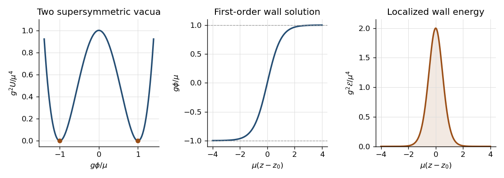

<h1 id="10/solution">Solution</h1>

↑ **Parent:** [10](../10.md)

A canonical [Wess–Zumino model](../../../../../wess-zumino-model.md) with a cubic [superpotential](../../../../../superpotential.md) already supplies a microscopic membrane-like object. Choose positive real $\mu,g$ and

$$
W(\Phi)=\frac{\mu^2}{g}\Phi-\frac g3\Phi^3,
\qquad U(\phi)=\left|\frac{\mu^2}{g}-g\phi^2\right|^2.
$$

There are two isolated [supersymmetric vacua](../../../../../supersymmetric-vacuum.md), $\phi_\pm=\pm\mu/g$. A planar [domain wall](../../../../../domain-wall.md) has a static scalar profile depending on the transverse coordinate $z=X^3$, with one vacuum at either end. Its energy per unit area is

$$
T=\int dz\,(|\phi'|^2+|W'|^2)
=\int dz\,|\phi'-e^{i\alpha}\overline{W'}|^2
+2\operatorname{Re}\bigl(e^{-i\alpha}\Delta W\bigr).
$$

Choosing $\alpha=\arg\Delta W$ gives $T\geq2|\Delta W|$. The real increasing solution saturates the bound:

$$
\phi'=\frac{\mu^2}{g}-g\phi^2,
\qquad
\boxed{\phi(z)=\frac\mu g\tanh(\mu(z-z_0)),\qquad
T=\frac{8\mu^3}{3g^2}.}
$$

The tension follows either from integrating $2(\phi')^2$ or from $W(\mu/g)-W(-\mu/g)=4\mu^3/(3g^2)$. This is a [supersymmetric domain wall](../../../../../supersymmetric-domain-wall.md), and the first-order equation also implies the second-order scalar equation. Its thickness is of order $1/\mu$.

**[Figure 1](#10/image-derived-wess-zumino-double-well-potential-domain-wall-profile-and-localized-energy-density). Derived Wess-Zumino double-well potential, domain-wall profile and localized energy density**.

The wall breaks transverse translations: changing $z_0$ gives a normalizable scalar zero mode proportional to $\phi'(z)$. It also preserves only half the four real [supercharges](../../../../../supersymmetry-generator.md). In the chiral-fermion transformation, $F=-\overline{W'}=-\phi'$ and the derivative term combine into a rank-half condition on the constant [supersymmetry](../../../../../supersymmetry-split.md) parameter, for example $\epsilon=i\sigma^3\bar\epsilon$ in a compatible Weyl convention. The orthogonal two real parameters are broken and generate localized [fermion](../../../../../fermion.md) zero modes. One such profile satisfies $(\partial_z+2g\phi)f=0$, giving $f\propto\operatorname{sech}^2(\mu(z-z_0))$. The scalar and a three-dimensional Majorana [fermion](../../../../../fermion.md) therefore form the low-energy wall multiplet. The [domain-wall charge in N=1 supersymmetry](../../../../../domain-wall-charge-in-n-1-supersymmetry.md) is a boundary/tensor charge contributing to the extended algebra; the preserved combinations saturate $T=2|\Delta W|$. This avoids falsely applying the unextended particle-algebra argument of Question 3 to a wall with nonzero tension.

Promote the translation collective coordinate to a slowly varying [worldvolume](../../../../../worldvolume.md) field $Y(\xi^0,\xi^1,\xi^2)$. At wavelengths long compared with the wall thickness, its leading relativistic geometric [action](../../../../../action.md) is the [Dirac membrane action](../../../../../dirac-membrane-action.md)

$$
\boxed{S_{\mathrm{mem}}=-T\int d^3\xi\sqrt{-\det h_{ij}},
\qquad h_{ij}=\partial_iX^m\partial_jX^n\eta_{mn}.}
$$

It is invariant under [worldvolume](../../../../../worldvolume.md) reparametrizations and the target [Poincaré group](../../../../../poincare-group.md). In static gauge $X^i=\xi^i$, $X^3=Y$, the [matrix determinant lemma](../../../../../matrix-determinant-lemma.md) gives

$$
S_{\mathrm{mem}}=-T\int d^3\xi\sqrt{1+\partial_iY\partial^iY}
=-T\int d^3\xi\left(1+\tfrac12\partial_iY\partial^iY+\cdots\right).
$$

Directly substituting the leading collective-coordinate profile into the scalar kinetic term gives the same coefficient, since $\int dz\,(\phi')^2=T/2$. Target Lorentz symmetry fixes the leading first-derivative nonlinear completion to the invariant area; finite-thickness physics can add higher-curvature terms. The area [action](../../../../../action.md) is therefore a long-wavelength [effective field theory](../../../../../effective-field-theory.md), not an exact replacement for the microscopic wall at arbitrary momenta. Its embedding equation is $\partial_i(\sqrt{-h}\,h^{ij}\partial_jX^m)=0$.

For the [four-dimensional supermembrane](../../../../../four-dimensional-supermembrane.md), extend the embedding to $(X^m(\xi),\theta^\alpha(\xi))$ with a four-real-component [Majorana spinor](../../../../../majorana-spinor.md). Pull back the invariant coframe of Question 7:

$$
\Pi_i^m=\partial_iX^m+i\bar\theta\gamma^m\partial_i\theta,
\qquad h_{ij}=\Pi_i^m\Pi_j^n\eta_{mn}.
$$

Replacing $\partial X$ by $\Pi$ makes the area term invariant under rigid target [supersymmetry](../../../../../supersymmetry-split.md), but does not yet give the appropriate fermionic gauge symmetry. Add a [Wess-Zumino brane coupling](../../../../../wess-zumino-brane-coupling.md) to a superspace three-form potential $C_3$. In one orientation and matching normalization,

$$
S=-T\int d^3\xi\sqrt{-h}+T\int_{\Sigma_3}Z^*C_3,
\qquad
G_4=dC_3=\frac i2\Pi^m\wedge\Pi^n\wedge d\bar\theta\gamma_{mn}d\theta.
$$

The [supermembrane closed four-form](../../../../../supermembrane-closed-four-form.md) uses the distinct four-dimensional Fierz identity $(C\gamma_{mn})_{(\alpha\beta}(C\gamma^n)_{\gamma\delta)}=0$. Differentiating $G_4$ reduces its coefficient to this symmetric tensor, so $dG_4=0$. A local potential therefore exists. Since the curvature is [supertranslation](../../../../../supertranslation.md) invariant, the potential can vary by an exact form; its pullback integral is invariant modulo [boundary terms](../../../../../boundary-term.md). This is why the three-form $H_3$ of Question 7 is not itself the membrane field strength: integrating a membrane potential requires three-form degree and hence four-form curvature.

The required additional local fermionic gauge invariance is [kappa symmetry](../../../../../kappa-symmetry.md). Define the [worldvolume](../../../../../worldvolume.md) [gamma matrices](../../../../../gamma-matrices.md) $\gamma_i=\Pi_i^m\gamma_m$ and

$$
\Gamma_\kappa=\frac{\epsilon^{ijk}}{3!\sqrt{-h}}\gamma_{ijk},
\qquad
\boxed{\delta_\kappa\theta=(1+\Gamma_\kappa)\kappa(\xi),
\quad\delta_\kappa X^m=-i\bar\theta\gamma^m\delta_\kappa\theta.}
$$

With mostly-plus target signature, a local orthonormal [worldvolume](../../../../../worldvolume.md) frame gives $\Gamma_\kappa=\gamma_0\gamma_1\gamma_2$, so $\Gamma_\kappa^2=1$ and $\operatorname{tr}\Gamma_\kappa=0$. Thus $(1\pm\Gamma_\kappa)/2$ are rank-two [kappa symmetry projectors](../../../../../kappa-symmetry-projector.md). The embedding variation gives $\delta\Pi_i^m=2i\delta\bar\theta\gamma^m\partial_i\theta$. The area variation is consequently proportional to $-2iT\sqrt{-h}\delta\bar\theta\gamma^i\partial_i\theta$. Contracting the displayed $G_4$ with the fermionic variation and using $\epsilon^{ijk}\gamma_{ij}=2\sqrt{-h}\Gamma_\kappa\gamma^k$ gives the opposite Wess-Zumino contribution with an extra $\Gamma_\kappa$. Their sum is proportional to

$$
\delta\bar\theta(1-\Gamma_\kappa)\gamma^i\partial_i\theta.
$$

For the boxed kappa variation, $\delta\bar\theta=\bar\kappa(1+\Gamma_\kappa)$, so it vanishes by $(1+\Gamma_\kappa)(1-\Gamma_\kappa)=0$. Reversing membrane orientation reverses the Wess-Zumino sign and the matching projector. The cancellation fixes the relative charge magnitude to the tension; rigid [supersymmetry](../../../../../supersymmetry-split.md) alone would not fix it.

[Worldvolume](../../../../../worldvolume.md) reparametrizations remove three of the four embedding scalars, leaving one transverse mode. [Kappa symmetry](../../../../../kappa-symmetry.md) removes half the four real embedding spinor components, leaving a two-component three-dimensional Majorana field, whose first-order equation has one on-shell fermionic polarization. **The physical [worldvolume](../../../../../worldvolume.md) modes are one scalar and one Majorana [fermion](../../../../../fermion.md)**, matching the wall zero modes. Without [kappa symmetry](../../../../../kappa-symmetry.md) the fermionic degrees would be doubled. A planar configuration preserves the target supersymmetries that can be compensated by the kappa projector, reproducing the wall's half-supersymmetry condition. This is the four-dimensional effective domain-wall interpretation of a supermembrane, rather than the eleven-dimensional M2-brane particle-content problem.

## ↑ Ancestors (11)

1. [10](../10.md)
2. [Section B](../section-b.md)
3. [Paper 53](../../paper-53-split.md)
4. [Iii](../../split.md)
5. [2003](../../../split.md)
6. [Past exam of the mathematics course of the University of Cambridge](../../../../split.md)
7. [Mathematics course of the University of Cambridge](../../../../../mathematics-course-of-the-university-of-cambridge.md)
8. [Course of the University of Cambridge](../../../../../course-of-the-university-of-cambridge.md)
9. [University of Cambridge](../../../../../university-of-cambridge-split.md)
10. [List of universities](../../../../../list-of-universities.md)
11. [Codex Wiki](../../../../../split.md)
