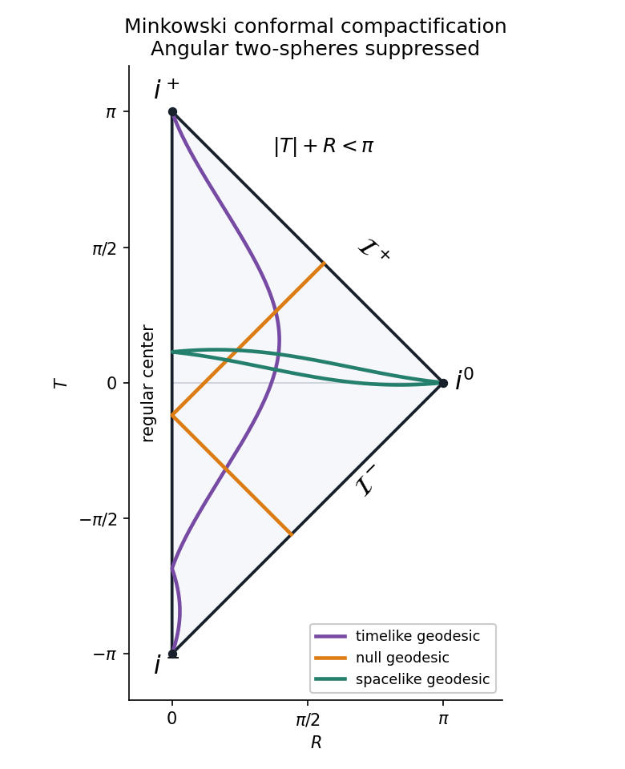

<h1 id="4/solution">Solution</h1>

↑ **Parent:** [4](../4.md)

In ordinary spherical coordinates, $t\in\mathbb R$, $r\in[0,\infty)$, $\theta\in[0,\pi]$ and $\phi\in[0,2\pi)$ with periodic identification. The regular coordinate chart excludes the origin and polar axes; the endpoint ranges include the usual spherical identifications. With null coordinates $u=t-r$ and $v=t+r$, both are real and their joint domain is $v\geq u$. The inverse relations give

$$
\widehat{ds}^{\,2}=du\,dv-\frac{(v-u)^2}{4}d\Sigma^2.
$$

The arctangent coordinates obey $-\pi/2<p\leq q<\pi/2$. Since $du=\sec^2p\,dp$ and $dv=\sec^2q\,dq$, the rescaled metric is

$$
ds^2=4dp\,dq-(\tan q-\tan p)^2\cos^2p\cos^2q\,d\Sigma^2=4dp\,dq-\sin^2(q-p)d\Sigma^2.
$$

Now $T=p+q$, $R=q-p$, so $4dp\,dq=dT^2-dR^2$. Thus the [Minkowski conformal compactification](../../../../../minkowski-conformal-compactification.md) has

$$
\boxed{ds^2=dT^2-dR^2-\sin^2R\,d\Sigma^2.}
$$

The full coordinate ranges are linked, not independent: $T\in(-\pi,\pi)$ and $R\in[0,\pi)$ with $|T|+R<\pi$. Inverse coordinates are $p=(T-R)/2$, $q=(T+R)/2$, $t=[\tan q+\tan p]/2$, $r=[\tan q-\tan p]/2$. The [conformal factor](../../../../../conformal-factor.md) is

$$
\boxed{\Omega=2\cos p\cos q=\cos T+\cos R>0,\qquad g=\Omega^2\widehat g.}
$$

The unphysical metric extends as the unit-radius [Einstein static universe](../../../../../einstein-static-universe.md) on $\mathbb R\times S^3$, where $0\leq R\leq\pi$ with the endpoint two-spheres collapsed. Physical [Minkowski spacetime](../../../../../minkowski-spacetime.md) occupies the triangular radial domain $R\geq0$, $|T|+R<\pi$; the edge $R=0$ is the ordinary spatial center, not an infinity or physical boundary.

In the closure, the infinite-coordinate limits have locations

$$
i^+=(T,R)=(\pi,0),\quad i^-=(-\pi,0),\quad i^0=(0,\pi),
$$

$$
\mathcal I^+:T+R=\pi,\ 0<R<\pi,\qquad\mathcal I^-:T-R=-\pi,\ 0<R<\pi.
$$

These are [future timelike infinity](../../../../../future-timelike-infinity.md), [past timelike infinity](../../../../../past-timelike-infinity.md), [spacelike infinity](../../../../../spacelike-infinity.md), [future null infinity](../../../../../future-null-infinity.md) and [past null infinity](../../../../../past-null-infinity.md). For example $\mathcal I^+$ has $v\to+\infty$ with finite $u$, while $\mathcal I^-$ has $u\to-\infty$ with finite $v$. A diagram point with $0<R<\pi$ stands for a two-sphere, and each null boundary is topologically $\mathbb R\times S^2$; their three corners are points after the angular collapse. On the null boundaries $\Omega=0$ and $d\Omega\ne0$, whereas the three corners have a degenerate zero gradient. Thus a compactifying metric can be smooth there even though those infinity points are not ordinary smooth null-boundary points.

The [geodesic endpoints in Minkowski conformal compactification](../../../../../geodesic-endpoints-in-minkowski-conformal-compactification.md) can be established directly. A physical inertial [timelike geodesic](../../../../../timelike-geodesic.md) has $t=t_0+E\tau$, $\mathbf x=\mathbf x_0+\mathbf p\tau$, with $E>0$ and $E^2-|\mathbf p|^2=1$. At future infinity $u,v\to+\infty$, so $p,q\to\pi/2$ and the curve ends at $i^+$. At past infinity both tend to $-\infty$, giving $i^-$. Every complete inertial timelike path has these endpoints, regardless of velocity.

For a future-directed [null geodesic](../../../../../null-geodesic.md), $t=t_0+E\lambda$, $\mathbf x=\mathbf x_0+E\mathbf n\lambda$ with $|\mathbf n|=1$. As $\lambda\to+\infty$, $v\to+\infty$ but $u$ has a finite limit; the endpoint lies on $\mathcal I^+$. As $\lambda\to-\infty$, $u\to-\infty$ but $v$ has a finite limit, giving an endpoint on $\mathcal I^-$. A [conformal transformation](../../../../../conformal-map.md) preserves these null paths as unparametrized geodesics. The [null affine parameter under a conformal rescaling](../../../../../null-affine-parameter-under-a-conformal-rescaling.md) obeys $d\widetilde\lambda/d\lambda=\Omega^2$; here $\Omega^2=O(\lambda^{-2})$ at the null endpoints, so the unphysical affine parameter reaches them in finite time, although the physical affine parameter is infinite.

A physical [spacelike geodesic](../../../../../spacelike-geodesic.md) has $t=t_0+a\lambda$, $\mathbf x=\mathbf x_0+\mathbf b\lambda$, with $|\mathbf b|>|a|$. At either end $r>|t|$ asymptotically, $u\to-\infty$ and $v\to+\infty$, so both ends approach $i^0$. Timelike and spacelike physical geodesic paths are not generally geodesics of the rescaled metric. Their physical proper time or length is infinite, while $\Omega=O(|\lambda|^{-2})$ gives finite unphysical proper time or length near the endpoints. Infinity at finite diagram coordinates does not imply incompleteness of physical Minkowski geodesics.

**[Figure 1](#4/image-minkowski-conformal-compactification-and-the-endpoints-of-timelike-null-and-spacelike-geodesics). Minkowski conformal compactification and the endpoints of timelike, null and spacelike geodesics**.

The original [Penrose diagram](../../../../../penrose-diagram.md) suppresses the angular spheres. The displayed physical paths illustrate their distinct endpoint types; the two sloping boundaries are null infinity, while the left edge is the regular center.

## ↑ Ancestors (10)

1. [4](../4.md)
2. [Paper 54](../../paper-54-split.md)
3. [Iii](../../split.md)
4. [2003](../../../split.md)
5. [Past exam of the mathematics course of the University of Cambridge](../../../../split.md)
6. [Mathematics course of the University of Cambridge](../../../../../mathematics-course-of-the-university-of-cambridge.md)
7. [Course of the University of Cambridge](../../../../../course-of-the-university-of-cambridge.md)
8. [University of Cambridge](../../../../../university-of-cambridge-split.md)
9. [List of universities](../../../../../list-of-universities.md)
10. [Codex Wiki](../../../../../split.md)
