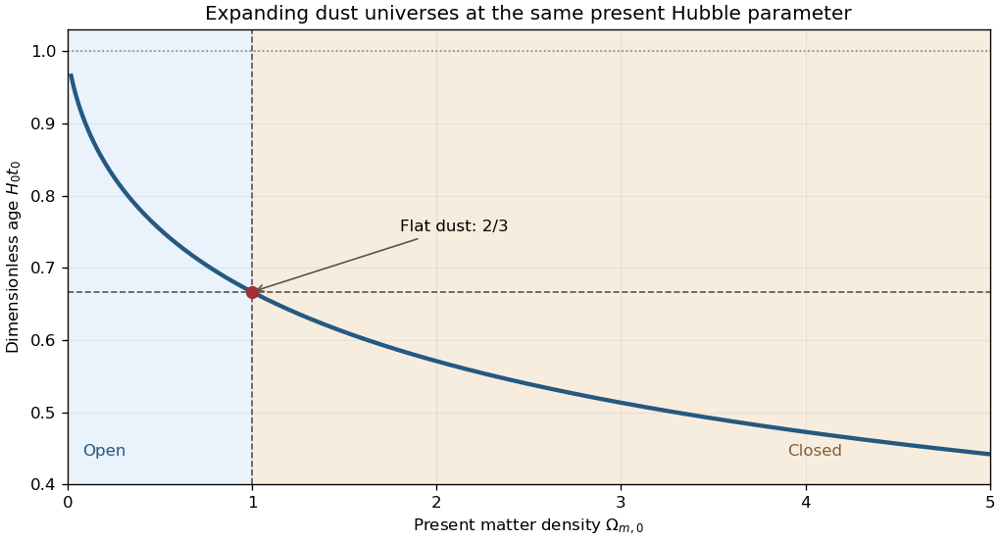

# Paper 55

↑ **Parent:** [Iii](../iii.md)

[https://www.maths.cam.ac.uk/postgrad/part-iii/files/pastpapers/2003/Paper55.pdf](https://www.maths.cam.ac.uk/postgrad/part-iii/files/pastpapers/2003/Paper55.pdf)

**Table of contents**

- [1](#1)
  - [Solution](#1/solution)
- [2](#2)
  - [Solution](#2/solution)
- [3](#3)
  - [Solution](#3/solution)
- [4](#4)
  - [Solution](#4/solution)

## 1

↑ **Parent:** [Paper 55](paper-55.md)

<h3 id="1/solution">Solution</h3>

↑ **Parent:** [1](#1)

Use [natural units](../../../physics.md#natural-units) and [conformal time](../../../cosmology.md#conformal-time) $dt=a\,d\tau$. The [conformal Hubble parameter](../../../cosmology.md#conformal-hubble-parameter) is $\mathcal H=a'/a=aH$. For the [barotropic equation of state](../../../cosmology.md#barotropic-equation-of-state) $P=(\gamma-1)\rho$, the [Friedmann acceleration equation](../../../cosmology.md#friedmann-acceleration-equation) gives

$$
\mathcal H'=a\ddot a=-\frac{4\pi G}{3}a^2(3\gamma-2)\rho.
$$

The [Friedmann equation](../../../cosmology.md#friedmann-equations) gives $8\pi Ga^2\rho/3=\mathcal H^2+k$. Hence the [constant-equation-of-state conformal Riccati equation](../../../cosmology.md#constant-equation-of-state-conformal-riccati-equation) is

$$
\boxed{\mathcal H'+\alpha(\mathcal H^2+k)=0,\qquad\alpha=\frac{3\gamma-2}{2}.}
$$

For $\alpha\ne0$, separation and integration of this [Riccati equation](../../../analysis.md#riccati-equation) yield, after choosing the origin of [conformal time](../../../cosmology.md#conformal-time),

$$
\boxed{\mathcal H=\begin{cases}
\cot(\alpha\tau),&k=1,\\
1/(\alpha\tau),&k=0,\\
\coth(\alpha\tau),&k=-1.
\end{cases}}
$$

The open positive-[energy density](../../../statistical-physics.md#energy-density) branch uses the [hyperbolic cotangent](../../../calculus.md#hyperbolic-cotangent), rather than the [cotangent](../../../geometry-and-topology.md#cotangent). Integrating $a'/a=\mathcal H$ gives

$$
\boxed{a(\tau)=\begin{cases}
A_+\sin^{1/\alpha}(\alpha\tau),&k=1,\\
A_0(\alpha\tau)^{1/\alpha},&k=0,\\
A_-\sinh^{1/\alpha}(\alpha\tau),&k=-1,
\end{cases}}
$$

where the positive constants are fixed by the [energy density](../../../statistical-physics.md#energy-density) normalization. These formulas apply on branches where the bases are positive. For $\alpha>0$, take the [Big Bang](../../../cosmology.md#big-bang) at $\tau=0$. The [cosmic time](../../../cosmology.md#cosmic-time) is then

$$
t_+(\tau)=\frac{A_+}{\alpha}\int_0^{\alpha\tau}(\sin u)^{1/\alpha}\,du,\qquad
t_-(\tau)=\frac{A_-}{\alpha}\int_0^{\alpha\tau}(\sinh u)^{1/\alpha}\,du,
\qquad
t_0(\tau)=\frac{A_0}{\alpha+1}(\alpha\tau)^{(\alpha+1)/\alpha}.
$$

The [integrals](../../../calculus.md#integral) also give the general answer after selecting a suitable reference time when a finite [Big Bang](../../../cosmology.md#big-bang) endpoint does not exist. The exceptional [coasting fluid](../../../cosmology.md#coasting-fluid) $\gamma=2/3$ has $\alpha=0$, so $\mathcal H=h$ is constant: $a=Ae^{h\tau}$ and $t=(A/h)e^{h\tau}+t_*$. If $h=0$, instead $a=A$ and $t=A\tau+t_*$. A flat fluid with $\gamma=0$ is the constant-density [de Sitter spacetime](../../../general-relativity.md#de-sitter-spacetime) case, for which the flat time integral is logarithmic.

During [matter domination](../../../linear-cosmological-density-perturbation.md#matter-domination), $\gamma=1$ and $\alpha=1/2$. Absorbing numerical factors into separate positive constants gives the [closed matter-dominated Friedmann solution](../../../cosmology.md#closed-matter-dominated-friedmann-solution), the flat [Einstein-de Sitter universe](../../../large-scale-structure-of-the-universe.md#einstein-de-sitter-universe) and the [open matter-dominated Friedmann solution](../../../cosmology.md#open-matter-dominated-friedmann-solution):

$$
\begin{array}{c|c|c}
k&a(\tau)&t(\tau)\\\hline
1&C_+(1-\cos\tau)&C_+(\tau-\sin\tau)\\
0&C_0\tau^2&C_0\tau^3/3\\
-1&C_-(\cosh\tau-1)&C_-(\sinh\tau-\tau).
\end{array}
$$

To compare the [age of a dust universe without a cosmological constant](../../../cosmology.md#age-of-a-dust-universe-without-a-cosmological-constant), specify the normalization. At fixed present [Hubble parameter](../../../cosmology.md#hubble-parameter) $H_0$, with $x=a/a_0$ and present matter [cosmological density parameter](../../../cosmology.md#cosmological-density-parameter) $\Omega_m>0$, the [Friedmann equation](../../../cosmology.md#friedmann-equations) gives

$$
H_0t_0=\int_0^1\frac{\sqrt{x}\,dx}{\sqrt{\Omega_m+(1-\Omega_m)x}}.
$$

The integrand decreases strictly with $\Omega_m$ for $0<x<1$. Therefore [age ordering of dust universes at fixed Hubble parameter](../../../cosmology.md#age-ordering-of-dust-universes-at-fixed-hubble-parameter) gives, on the expanding branches,

$$
\boxed{t_{\rm closed}<\frac{2}{3H_0}<t_{\rm open}<\frac1{H_0}.}
$$

The final bound is approached by the empty [Milne universe](../../../cosmology.md#milne-model). This compares models with the same $H_0$; fixing instead the present [scale factor](../../../cosmology.md#scale-factor-cosmology) and [energy density](../../../statistical-physics.md#energy-density) gives a different comparison.

**[Figure 1](#1/image-age-of-an-expanding-dust-universe-at-fixed-present-hubble-parameter). Age of an expanding dust universe at fixed present Hubble parameter**.

## 2

↑ **Parent:** [Paper 55](paper-55.md)

<h3 id="2/solution">Solution</h3>

↑ **Parent:** [2](#2)

The [baryon asymmetry](../../../cosmology.md#baryon-asymmetry) is an excess of net [baryon number](../../../standard-model.md#baryon-number) over zero, conveniently measured by $\eta_B=(n_B-n_{\bar B})/n_\gamma$. Ordinary matter contains abundant [baryons](../../../physics.md#baryon), whereas no comparable primordial [antibaryon](../../../physics.md#antibaryon) population is observed. Large nearby domains of matter and [antimatter](../../../relativistic-quantum-field.md#antimatter) would produce radiation through [particle-antiparticle annihilation](../../../relativistic-quantum-field.md#annihilation) at their boundaries. Antiparticles produced in energetic collisions are not evidence for a cosmological antimatter domain. The small nonzero [baryon-to-photon ratio](../../../cosmology.md#baryon-to-photon-ratio) inferred from [Big Bang nucleosynthesis](../../../cosmology.md#big-bang-nucleosynthesis) is independently tested by [baryon-density consistency between nucleosynthesis and the microwave background](../../../cosmology.md#baryon-density-consistency-between-nucleosynthesis-and-the-microwave-background).

Starting with zero net [baryon number](../../../standard-model.md#baryon-number), the [Sakharov conditions](../../../cosmology.md#sakharov-conditions) require **baryon-number violation, C and CP violation, and departure from thermal equilibrium**. Conservation of [baryon number](../../../standard-model.md#baryon-number) would keep the initial value zero. [C symmetry](../../../quantum-field-theory.md#charge-conjugation-symmetry) or [CP symmetry](../../../quantum-field-theory.md#cp-symmetry) would pair baryon production with equal antibaryon production; [CP rate cancellation in baryogenesis](../../../cosmology.md#cp-rate-cancellation-in-baryogenesis) explains why [C violation](../../../quantum-field-theory.md#violation-of-charge-conjugation) alone does not suffice. In [thermal equilibrium](../../../thermodynamics.md#thermal-equilibrium) with zero imposed charge [chemical potentials](../../../thermodynamics.md#chemical-potential), [CPT symmetry](../../../quantum-field-theory.md#cpt-symmetry) forbids the required net [baryon number](../../../standard-model.md#baryon-number). An asymmetric rate in one reaction must not be mistaken for net production after all reverse reactions are included.

A simple example is [heavy-boson decay baryogenesis](../../../cosmology.md#heavy-boson-decay-baryogenesis). Take equally many heavy $X$ [bosons](../../../quantum-mechanics.md#boson) and their [antiparticles](../../../relativistic-quantum-field.md#antiparticle), with decay channels

$$
X\longrightarrow uu\quad(r),\qquad X\longrightarrow\bar d e^+\quad(1-r),
\qquad
\bar X\longrightarrow\bar u\bar u\quad(\bar r),\qquad
\bar X\longrightarrow d e^-\quad(1-\bar r).
$$

The symbols in parentheses are [branching fractions](../../../relativistic-quantum-field.md#branching-fraction). The two $X$ channels carry [baryon numbers](../../../standard-model.md#baryon-number) $2/3$ and $-1/3$, so both cannot conserve one assigned [baryon number](../../../standard-model.md#baryon-number) for $X$. Their mean [baryon number](../../../standard-model.md#baryon-number) is $r-1/3$, while the mean for $\bar X$ is $-\bar r+1/3$. Consequently,

$$
\boxed{\Delta B_{X\bar X}=r-\bar r,\qquad\epsilon=\frac{r-\bar r}{2},}
$$

where $\epsilon$ is the asymmetry per decaying particle. [CP violation](../../../quantum-field-theory.md#cp-violation) permits $r\ne\bar r$ without violating the equality of total [decay widths](../../../relativistic-quantum-field.md#decay-width) required by [CPT symmetry](../../../quantum-field-theory.md#cpt-symmetry). Microscopically a [direct CP asymmetry](../../../quantum-field-theory.md#direct-cp-asymmetry) requires interference between [decay amplitudes](../../../relativistic-quantum-field.md#decay-amplitude) with both relative [weak phases](../../../quantum-field-theory.md#weak-phase-cp-violation) and [absorptive phases](../../../relativistic-quantum-field.md#absorptive-phase-of-a-decay-amplitude); specifying complex couplings alone would not establish unequal partial [decay widths](../../../relativistic-quantum-field.md#decay-width).

For [radiation domination](../../../linear-cosmological-density-perturbation.md#radiation-domination), a sufficient decay condition is $\Gamma_X\lesssim H(T=M_X)=1.66\sqrt{g_*}M_X^2/m_P$. The heavy population can then survive as the equilibrium abundance drops, before decaying while inverse production is suppressed. Its actual abundance differs from its [thermal equilibrium](../../../thermodynamics.md#thermal-equilibrium) value. If subsequent [baryon-number washout](../../../cosmology.md#baryon-number-washout) is negligible and [cosmological entropy conservation](../../../cosmology.md#cosmological-entropy-conservation) holds, an initial total abundance $Y_X=(n_X+n_{\bar X})/s$ produces

$$
\boxed{Y_B\equiv\frac{n_B-n_{\bar B}}s=\epsilon Y_X.}
$$

Here $s$ is the [entropy density](../../../thermodynamics.md#entropy-density). Residual [baryon-number washout](../../../cosmology.md#baryon-number-washout) multiplies this expression by an efficiency factor below one. The example realizes all three [Sakharov conditions](../../../cosmology.md#sakharov-conditions); it illustrates a mechanism, rather than identifying the actual cosmological source of the [baryon asymmetry](../../../cosmology.md#baryon-asymmetry).

## 3

↑ **Parent:** [Paper 55](paper-55.md)

<h3 id="3/solution">Solution</h3>

↑ **Parent:** [3](#3)

At [neutrino decoupling](../../../cosmology.md#neutrino-decoupling), the interaction rate is comparable with the [Hubble parameter](../../../cosmology.md#hubble-parameter). Equating the supplied rates gives

$$
G_F^2T_D^5=\frac{1.66\sqrt{g_*}T_D^2}{m_P},\qquad
\boxed{T_D=\left(\frac{1.66\sqrt{g_*}}{G_F^2m_P}\right)^{1/3}\simeq1.6\,\mathrm{MeV}.}
$$

Here the [Planck mass](../../../physics.md#planck-mass) is the unreduced $m_P=G^{-1/2}\simeq1.22\times10^{19}\,\mathrm{GeV}$ in [natural units](../../../physics.md#natural-units), $G_F\simeq10^{-5}\,\mathrm{GeV}^{-2}$, and the [effective number of relativistic energy degrees of freedom](../../../cosmology.md#effective-number-of-relativistic-energy-degrees-of-freedom) is $g_*=10.75$. The supplied rate gives an order-of-magnitude [neutrino decoupling](../../../cosmology.md#neutrino-decoupling) estimate; a precise neutron-proton conversion temperature uses its own weak-rate coefficients.

The [chemical equilibrium](../../../thermodynamics.md#chemical-equilibrium) condition for $n+\nu_e\leftrightarrow p+e^-$ is $\mu_n+\mu_{\nu_e}=\mu_p+\mu_e$. With negligible lepton [chemical potentials](../../../thermodynamics.md#chemical-potential), $\mu_n=\mu_p$. The [nonrelativistic Maxwell--Boltzmann number density](../../../statistical-physics.md#nonrelativistic-maxwell-boltzmann-number-density) therefore gives

$$
\frac{n_n}{n_p}=\frac{g_n}{g_p}\left(\frac{m_n}{m_p}\right)^{3/2}e^{-(m_n-m_p)/T}
\simeq\boxed{e^{-Q/T}=\frac{X_n}{X_p}},
$$

because $g_n=g_p=2$ and the small mass difference can be neglected in the prefactor. This is the [neutron-proton chemical equilibrium](../../../cosmology.md#neutron-proton-chemical-equilibrium) relation.

For the [deuterium equilibrium abundance](../../../cosmology.md#deuterium-equilibrium-abundance), $\mu_D=\mu_n+\mu_p$ because photons have zero [chemical potential](../../../thermodynamics.md#chemical-potential). The sign convention in the paper is important: $B=m_D-m_n-m_p<0$, while the positive [nuclear binding energy](../../../physics.md#nuclear-binding-energy) is $\Delta_D=-B$. Using spin multiplicities $g_D=3$, $g_n=g_p=2$ gives

$$
\frac{n_D}{n_nn_p}=\frac34\left(\frac{2\pi m_D}{m_nm_pT}\right)^{3/2}e^{-B/T}.
$$

With $n_B=\eta n_\gamma$, $m_n\simeq m_p\simeq m_N$, $m_D\simeq2m_N$ and [photon number density](../../../statistical-physics.md#photon-number-density) $n_\gamma=2\zeta(3)T^3/\pi^2$, this becomes

$$
\boxed{X_D\simeq\frac{12\zeta(3)}{\sqrt\pi}\,\eta X_nX_p\left(\frac{T}{m_N}\right)^{3/2}e^{-B/T}.}
$$

Here $X_D=n_D/n_B$ is a number fraction; the fraction of baryons bound in [deuterium](../../../chemistry.md#deuterium) is $2X_D$. The formula estimates the onset of the [deuterium bottleneck](../../../cosmology.md#deuterium-bottleneck) opening while depletion of free [neutrons](../../../physics.md#neutron) and [protons](../../../physics.md#proton) remains small. Because $\eta\ll1$, stable [deuterium](../../../chemistry.md#deuterium) becomes abundant only far below the positive [nuclear binding energy](../../../physics.md#nuclear-binding-energy), not simply at $T=\Delta_D$.

Let $T_f$ denote [cosmological weak freeze-out](../../../cosmology.md#cosmological-weak-freeze-out) of the [neutron-to-proton ratio](../../../cosmology.md#neutron-to-proton-ratio), $r_f=e^{-Q/T_f}$, and let $t_N$ mark efficient nuclear burning. [Free-neutron decay after freeze-out](../../../cosmology.md#free-neutron-decay-after-freeze-out) gives

$$
X_n(t_N)\simeq\frac{r_f}{1+r_f}e^{-(t_N-t_f)/\tau_n},\qquad\tau_n=\frac{t_{1/2}}{\log2}.
$$

Almost every surviving [neutron](../../../physics.md#neutron) enters helium-4, whose [atomic nucleus](../../../physics.md#atomic-nucleus) contains two [neutrons](../../../physics.md#neutron) and four baryons. Thus [neutron-limited helium synthesis](../../../cosmology.md#neutron-limited-helium-synthesis) gives

$$
\boxed{Y_p\simeq2X_n(t_N)=\frac{2r_f}{1+r_f}e^{-(t_N-t_f)/\tau_n}.}
$$

A longer neutron [half-life](../../../analysis.md#half-life) leaves more [neutrons](../../../physics.md#neutron) available, increasing the [primordial helium mass fraction](../../../cosmology.md#primordial-helium-mass-fraction). If the longer lifetime reflects weaker [weak interactions](../../../standard-model.md#weak-interaction), the accompanying earlier [cosmological weak freeze-out](../../../cosmology.md#cosmological-weak-freeze-out) can reinforce that effect.

During [radiation domination](../../../linear-cosmological-density-perturbation.md#radiation-domination), $H\propto\sqrt{Gg_*}\,T^2$ whereas the weak conversion rate is proportional to $T^5$. Hence $T_f\propto(Gg_*)^{1/6}$. Increasing the [effective number of relativistic energy degrees of freedom](../../../cosmology.md#effective-number-of-relativistic-energy-degrees-of-freedom) raises $T_f$, increasing $r_f$, and shortens the interval for [free-neutron decay after freeze-out](../../../cosmology.md#free-neutron-decay-after-freeze-out). Both increase the [primordial helium mass fraction](../../../cosmology.md#primordial-helium-mass-fraction) while nuclear burning remains efficient. The same reasoning gives the [primordial helium response to a varying gravitational constant](../../../cosmology.md#primordial-helium-response-to-a-varying-gravitational-constant): larger $G$ over this interval produces more helium, with fixed microscopic rates and the approximate [Friedmann equation](../../../cosmology.md#friedmann-equations) unchanged. Smaller $G$ has the opposite effect. A particular varying-$G$ model must specify its background expansion and time history; the simple trend must not be extrapolated to changes so large that nuclear burning itself fails.

## 4

↑ **Parent:** [Paper 55](paper-55.md)

<h3 id="4/solution">Solution</h3>

↑ **Parent:** [4](#4)

[Cosmic inflation](../../../cosmic-inflation.md) addresses the [horizon problem](../../../cosmology.md#horizon-problem) by extending the causal past of the observed region, the [flatness problem](../../../cosmology.md#flatness-problem) by damping the curvature contribution, and the [cosmological monopole problem](../../../cosmology.md#cosmological-monopole-problem) by diluting unwanted relics. A canonical [inflaton](../../../cosmic-inflation.md#inflaton) can drive this expansion when its [potential energy](../../../classical-mechanics.md#potential-energy) density exceeds twice its [kinetic energy](../../../classical-mechanics.md#kinetic-energy) density.

Use the unreduced [Planck mass](../../../physics.md#planck-mass) $m_P=G^{-1/2}$, consistent with the coefficient in the [Friedmann equation](../../../cosmology.md#friedmann-equations), and take $V_0>0$, $c\ne0$. Seek the [exponential-potential power-law inflation](../../../cosmic-inflation.md#exponential-potential-power-law-inflation) solution $\phi=A\log(\beta t)$ and $a=a_*(t/t_*)^p$. The [kinetic energy](../../../classical-mechanics.md#kinetic-energy) density is proportional to $t^{-2}$. The [inflaton potential](../../../cosmic-inflation.md#inflaton-potential) must have the same scaling, so

$$
\frac{cA}{m_P}=2,\qquad A=\frac{2m_P}{c},\qquad V(\phi(t))=\frac{V_0}{\beta^2t^2}.
$$

Substitution into the [inflaton equation of motion](../../../cosmic-inflation.md#inflaton-equation-of-motion) gives

$$
-A+3pA-\frac{cV_0}{m_P\beta^2}=0,
\qquad\frac{V_0}{\beta^2}=\frac{2m_P^2}{c^2}(3p-1).
$$

The [Friedmann equation](../../../cosmology.md#friedmann-equations) now reduces to

$$
p^2=\frac{8\pi}{3m_P^2}\left(\frac{2m_P^2}{c^2}+\frac{2m_P^2}{c^2}(3p-1)\right)=\frac{16\pi p}{c^2}.
$$

Consequently the nontrivial positive-potential solution is

$$
\boxed{p=\frac{16\pi}{c^2},\qquad
\phi(t)=\frac{2m_P}{c}\log(\beta t),\qquad
\beta^2=\frac{V_0c^2}{2m_P^2(3p-1)},\qquad
a(t)=a_*\left(\frac{t}{t_*}\right)^p.}
$$

A positive $V_0$ requires $p>1/3$. [Accelerating expansion](../../../cosmology.md#accelerating-expansion-of-the-universe) occurs exactly for $p>1$, giving

$$
\boxed{c^2<16\pi.}
$$

This is an exact solution, not a use of the [slow-roll approximation](../../../cosmic-inflation.md#slow-roll-approximation). The [first Hubble slow-roll parameter](../../../cosmic-inflation.md#first-hubble-slow-roll-parameter) and [equation-of-state parameter](../../../cosmology.md#equation-of-state-parameter) are constant:

$$
\epsilon_H=-\frac{\dot H}{H^2}=\frac1p=\frac{c^2}{16\pi},\qquad
w=-1+\frac{2}{3p}=-1+\frac{c^2}{24\pi}.
$$

If the [reduced Planck mass](../../../physics.md#reduced-planck-mass) $M=m_P/\sqrt{8\pi}$ is used instead, the dimensionless exponential slope is $\lambda=c/\sqrt{8\pi}$ and the exponent becomes $p=2/\lambda^2$; these are the same solution.

For $p>1$, the [comoving Hubble radius](../../../cosmology.md#comoving-hubble-radius) decreases as $(aH)^{-1}\propto t^{1-p}$. A region initially in causal contact can grow beyond that radius before the hot [radiation-dominated universe](../../../cosmology.md#radiation-dominated-universe) begins. In the ideal power law extrapolated all the way to $t=0$, the [particle horizon](../../../cosmology.md#particle-horizon) integral $\int_0^t dt'/a(t')$ diverges, so the solution has no finite past particle horizon. A finite, physically trustworthy inflationary interval instead requires a sufficiently large [number of e-folds](../../../cosmic-inflation.md#number-of-e-folds) to enlarge an initially causal patch.

For a small curvature contribution, the [Friedmann equation](../../../cosmology.md#friedmann-equations) gives $|\Omega-1|=|k|/(a^2H^2)\propto t^{2-2p}\to0$, solving the [flatness problem](../../../cosmology.md#flatness-problem). Conserved nonrelativistic [magnetic monopoles](../../../physics.md#magnetic-monopole) have [number density](../../../statistical-physics.md#number-density) proportional to $a^{-3}$, while the inflaton [energy density](../../../statistical-physics.md#energy-density) is proportional to $t^{-2}$; their energy-density ratio therefore falls as $t^{2-3p}$. This gives the required dilution, provided later [reheating](../../../cosmic-inflation.md#reheating) does not recreate them. [Inflationary shear damping](../../../cosmology.md#inflationary-shear-damping) similarly suppresses anisotropic expansion.

The main failure is **no automatic graceful exit or reheating**. The [first Hubble slow-roll parameter](../../../cosmic-inflation.md#first-hubble-slow-roll-parameter) never reaches one, and the exponential [inflaton potential](../../../cosmic-inflation.md#inflaton-potential) has no finite minimum about which the field can oscillate. Additional dynamics are needed for a [graceful exit from inflation](../../../cosmic-inflation.md#graceful-exit-from-inflation) and transfer to a hot [radiation-dominated universe](../../../cosmology.md#radiation-dominated-universe). The ideal solution also retains a curvature singularity at $t=0$; solving the [horizon problem](../../../cosmology.md#horizon-problem) does not itself explain the beginning of the universe. For $c=0$, the constant [inflaton potential](../../../cosmic-inflation.md#inflaton-potential) instead permits constant-field [de Sitter spacetime](../../../general-relativity.md#de-sitter-spacetime) expansion; the logarithmic field solution is inapplicable.

## ↑ Ancestors (8)

1. [Iii](../iii.md)
2. [2003](../../2003.md)
3. [Past exam of the mathematics course of the University of Cambridge](../../../past-exam-of-the-mathematics-course-of-the-university-of-cambridge.md)
4. [Mathematics course of the University of Cambridge](../../../university-of-cambridge.md#mathematics-course-of-the-university-of-cambridge)
5. [Course of the University of Cambridge](../../../university-of-cambridge.md#course-of-the-university-of-cambridge)
6. [University of Cambridge](../../../university-of-cambridge.md)
7. [List of universities](../../../README.md#list-of-universities)
8. [Codex Wiki](../../../README.md)
