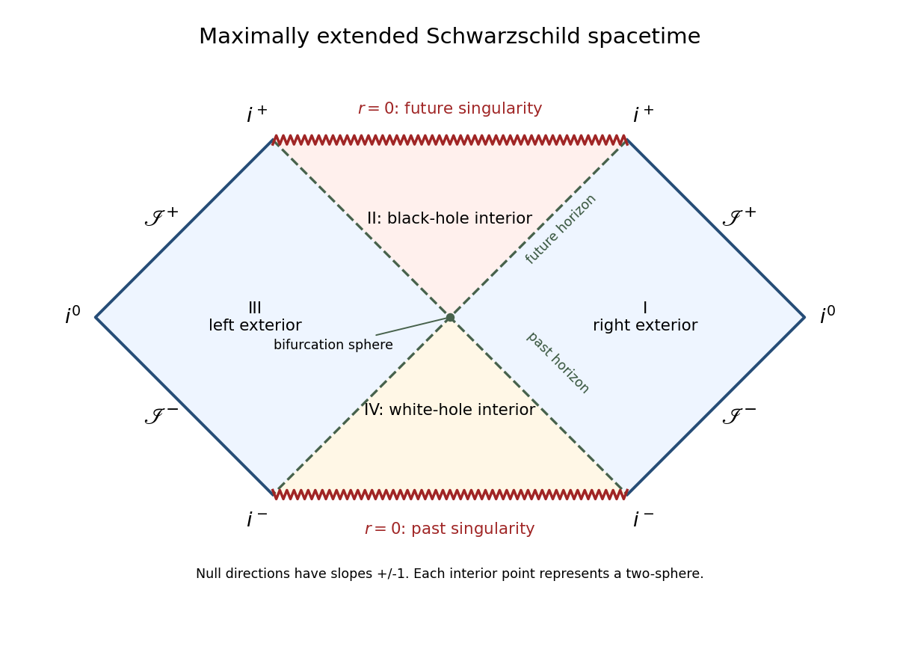

<h1 id="3/solution">Solution</h1>

↑ **Parent:** [3](../3.md)

Take $M>0$ and write $f=1-2M/r$. Integrating $dr_*/dr=f^{-1}$ gives the [Schwarzschild tortoise coordinate](../../../../../schwarzschild-tortoise-coordinate.md)

$$
r_*=r+2M\log\left|\frac r{2M}-1\right|.
$$

The advanced and retarded [Eddington-Finkelstein coordinates](../../../../../eddington-finkelstein-coordinates.md) are respectively $v=t+r_*$ and $u=t-r_*$. Substituting $dt=dv-dr/f$ or $dt=du+dr/f$ gives

$$
\boxed{ds^2=-f\,dv^2+2\,dv\,dr+r^2d\Omega_2^2,}
\qquad
\boxed{ds^2=-f\,du^2-2\,du\,dr+r^2d\Omega_2^2.}
$$

Both radial-time blocks have determinant $-1$ and smooth coefficients at $r=2M$. Consequently the [Schwarzschild event horizon](../../../../../schwarzschild-event-horizon.md) is a coordinate singularity of the original chart, not a degeneracy of the geometry. The [Kretschmann scalar](../../../../../kretschmann-scalar.md) $48M^2/r^6$ is finite there, while it diverges at $r=0$. Angular coordinate degeneracies at the polar axes are removed separately by ordinary sphere charts.

The [Ingoing Eddington-Finkelstein coordinates](../../../../../ingoing-eddington-finkelstein-coordinates.md) extend the right exterior through its future [black hole](../../../../../black-hole.md) horizon. Radial [null geodesics](../../../../../null-geodesic.md) obey either $dv=0$ or $dr/dv=f/2$. Inside $r=2M$, the latter also moves towards smaller $r$ as $v$ increases, and the future-directed ingoing family has decreasing $r$. Thus neither family can escape to the exterior. The future horizon is the boundary separating points that can send signals to future [null infinity](../../../../../null-infinity.md) from those that cannot. The retarded chart extends through the past horizon instead. Reversing the time orientation gives the [white hole](../../../../../white-hole.md): future-directed signals can leave it, but exterior signals cannot enter it. These are distinct branches in the eternal extension; the white-hole branch need not occur in a spacetime formed by collapse.

For a simultaneous extension through both branches, start in the right exterior and define the [Kruskal–Szekeres coordinates](../../../../../kruskal-szekeres-coordinates.md)

$$
U=-e^{-u/(4M)},\qquad V=e^{v/(4M)}.
$$

Their product and the extended metric are

$$
\boxed{UV=\left(1-\frac r{2M}\right)e^{r/(2M)},\qquad
 ds^2=-\frac{32M^3}{r}e^{-r/(2M)}\,dU\,dV+r^2d\Omega_2^2.}
$$

Indeed $du=-4M\,dU/U$ and $dv=4M\,dV/V$ transform $-f\,du\,dv$ into the displayed expression. The function of $r$ on the right of the product relation has derivative $-r e^{r/(2M)}/(4M^2)$, nonzero at $r=2M$, so $r$ is a smooth function of $UV$ across zero. The coefficient of $dU\,dV$ there is $-16M^2/e$, finite and nonzero. Allowing either sign of $U,V$ therefore gives the regular maximal extension with $UV<1$ and $r>0$.

With $T_K=(V+U)/2$ and $X_K=(V-U)/2$, the radial metric is a positive multiple of $-dT_K^2+dX_K^2$. The two exterior regions have $(U,V)=(-,+)$ and $(+,-)$. The future interior, or [black hole](../../../../../black-hole.md) region, has $(+,+)$; the past interior, or [white hole](../../../../../white-hole.md) region, has $(-,-)$. The [Killing horizons](../../../../../killing-horizon.md) are $U=0$ and $V=0$, meeting on the [bifurcation surface](../../../../../bifurcation-surface.md) at $U=V=0$.

For the [Penrose diagram](../../../../../penrose-diagram.md), compactify the null variables before forming time and space:

$$
\bar U=\arctan U,\qquad \bar V=\arctan V,\qquad
T=\frac{\bar V+\bar U}{2},\qquad X=\frac{\bar V-\bar U}{2}.
$$

This [Schwarzschild conformal compactification](../../../../../schwarzschild-conformal-compactification.md) preserves radial null directions because $dU\,dV=\sec^2\bar U\sec^2\bar V\,(dT^2-dX^2)$. The ranges $|\bar U|,|\bar V|<\pi/2$ bound the diagram, and $UV<1$ cuts off its future and past tips. On $UV=1$ with $U,V>0$, $\bar U+\bar V=\pi/2$, so the future [curvature singularity](../../../../../curvature-singularity.md) is $T=\pi/4$. The past [curvature singularity](../../../../../curvature-singularity.md) is similarly $T=-\pi/4$. Both have $|X|<\pi/4$ and are spacelike. The horizon lines remain $T=\pm X$.

**[Figure 1](#3/image-penrose-diagram-of-maximally-extended-schwarzschild-spacetime-with-two-exteriors-black-and-white-hole-interiors-horizons-and-conformal-infinities). Penrose diagram of maximally extended Schwarzschild spacetime, with two exteriors, black and white hole interiors, horizons and conformal infinities**.

Each point of this radial [Penrose diagram](../../../../../penrose-diagram.md) represents a two-sphere, except at limiting boundaries. Each exterior has its own future and past [null infinity](../../../../../null-infinity.md), $\mathscr I^+$ and $\mathscr I^-$. For example in the right exterior, $V\to\infty$ at fixed $U<0$ gives $\mathscr I^+$, whereas $U\to-\infty$ at fixed $V>0$ gives $\mathscr I^-$. Its [spacelike infinity](../../../../../spacelike-infinity.md) is $(T,X)=(0,\pi/2)$; its future and past [timelike infinity](../../../../../timelike-infinity.md) are the vertices $(\pi/4,\pi/4)$ and $(-\pi/4,\pi/4)$. The left exterior has the reflected counterparts. These conformal boundary points are ideal endpoints, not finite-distance spacetime events; the physical affine or proper parameters of escaping geodesics diverge.

The horizons are regular null surfaces, while the horizontal $r=0$ boundaries are genuine [curvature singularities](../../../../../curvature-singularity.md). The central point represents the regular [bifurcation surface](../../../../../bifurcation-surface.md), not a singularity. Future-directed radial causal curves have nondecreasing $U,V$, so a curve cannot go from one exterior to the other: changing the requisite signs would require one null variable to decrease. Crossing a future horizon instead leads towards the future singularity. **The maximal extension has two causally disconnected exteriors, a future black-hole region and a past white-hole region.**

## ↑ Ancestors (10)

1. [3](../3.md)
2. [Paper 56](../../paper-56-split.md)
3. [Iii](../../split.md)
4. [2003](../../../split.md)
5. [Past exam of the mathematics course of the University of Cambridge](../../../../split.md)
6. [Mathematics course of the University of Cambridge](../../../../../mathematics-course-of-the-university-of-cambridge.md)
7. [Course of the University of Cambridge](../../../../../course-of-the-university-of-cambridge.md)
8. [University of Cambridge](../../../../../university-of-cambridge-split.md)
9. [List of universities](../../../../../list-of-universities.md)
10. [Codex Wiki](../../../../../split.md)
