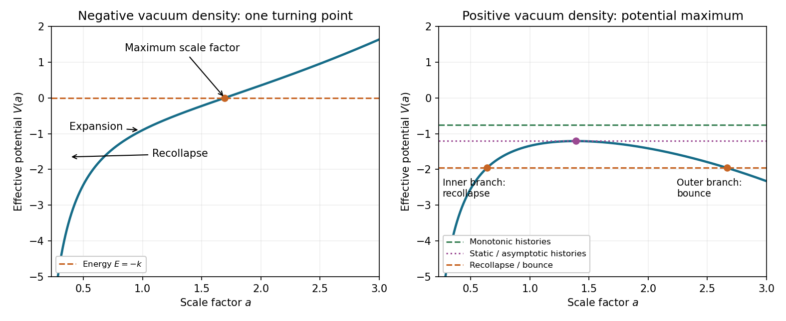

<h1 id="1/i/solution">Solution</h1>

↑ **Parent:** [I](../i.md)

Use [cosmic time](../../../../../../cosmic-time.md) $t$ here; derivatives with respect to [conformal time](../../../../../../conformal-time.md) will be used from Question 2 onward. Conservation of [pressureless matter](../../../../../../pressureless-matter.md) and [radiation in cosmology](../../../../../../radiation-in-cosmology.md) makes $\rho_m a^3$ and $\rho_r a^4$ constant. Define

$$
M=\frac{8\pi G}{3}\rho_m a^3,\qquad Q=\frac{8\pi G}{3}\rho_r a^4,\qquad \omega^2=\frac{8\pi G}{3}|\rho_\Lambda|.
$$

The [Friedmann equation](../../../../../../friedmann-equations.md) is a mechanical energy equation,

$$
a_t^2+V(a)=-k,\qquad V(a)=-\frac{M}{a}-\frac{Q}{a^2}+\omega^2a^2.
$$

For nonnegative dust and radiation, at least one nonzero, $V$ tends to $-\infty$ as $a\to0$ and to $+\infty$ as $a\to\infty$, while

$$
V'(a)=\frac{M}{a^2}+\frac{2Q}{a^3}+2\omega^2a>0.
$$

Thus every energy line meets the potential once. An expanding solution reaches this [turning point](../../../../../../turning-point.md) and then contracts: $a_{tt}=-V'(a)/2<0$. The [Friedmann effective potential for matter, radiation and vacuum](../../../../../../friedmann-effective-potential-for-matter-radiation-and-vacuum.md) is sketched below, alongside the positive-vacuum case.

**[Figure 1](#1/i/image-friedmann-effective-potentials-for-negative-and-positive-vacuum-density). Friedmann effective potentials for negative and positive vacuum density**.

To bound the full [cosmic time](../../../../../../cosmic-time.md) from the initial zero of $a$ to its final zero, use the [Friedmann acceleration equation](../../../../../../friedmann-acceleration-equation.md):

$$
a_{tt}=-\frac{4\pi G}{3}(\rho_m+2\rho_r+2|\rho_\Lambda|)a\leq-\omega^2a.
$$

Put maximum expansion at $t=0$, with $a(0)=a_{\max}$ and $a_t(0)=0$. The forced-oscillator identity is

$$
a(t)=a_{\max}\cos(\omega t)+\frac1\omega\int_0^t\sin[\omega(t-s)]\,[a_{ss}(s)+\omega^2a(s)]\,ds.
$$

Until the first zero and for $0\leq t\leq\pi/(2\omega)$, the kernel is nonnegative and the bracket is nonpositive. Hence $a(t)\leq a_{\max}\cos(\omega t)$, so contraction cannot remain at positive $a$ beyond $\pi/(2\omega)$. Applying the same argument backward from maximum expansion bounds the expanding half. Therefore the [negative-vacuum Friedmann lifetime bound](../../../../../../negative-vacuum-friedmann-lifetime-bound.md) is

$$
\boxed{t_{\rm life}\leq\frac{\pi}{\omega}=\sqrt{\frac{3\pi}{8G|\rho_\Lambda|}}.}
$$

At either endpoint, nonzero dust or radiation has divergent density. If both are absent, the same estimate instead bounds the open [Anti-de Sitter spacetime](../../../../../../anti-de-sitter-spacetime.md) coordinate patch; its coordinate zeros are not a finite lifetime of the maximally extended vacuum spacetime.

## ↑ Ancestors (11)

1. [I](../i.md)
2. [1](../../1.md)
3. [Paper 58](../../../paper-58-split.md)
4. [Iii](../../../split.md)
5. [2003](../../../../split.md)
6. [Past exam of the mathematics course of the University of Cambridge](../../../../../split.md)
7. [Mathematics course of the University of Cambridge](../../../../../../mathematics-course-of-the-university-of-cambridge.md)
8. [Course of the University of Cambridge](../../../../../../course-of-the-university-of-cambridge.md)
9. [University of Cambridge](../../../../../../university-of-cambridge-split.md)
10. [List of universities](../../../../../../list-of-universities.md)
11. [Codex Wiki](../../../../../../split.md)
