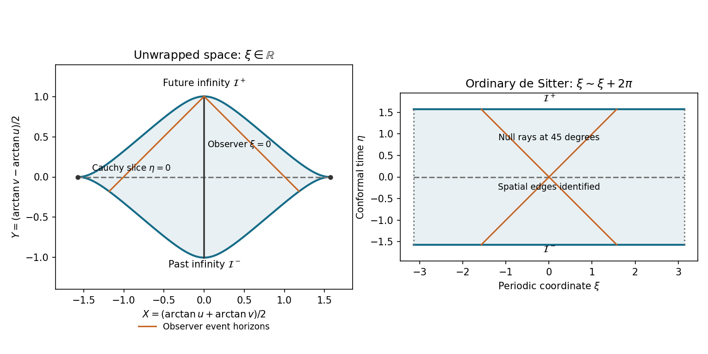

<h1 id="5/b/solution">Solution</h1>

↑ **Parent:** [B](../b.md)

The positive [conformal factor](../../../../../../conformal-factor.md) leaves the [causal structure](../../../../../../causal-structure.md) unchanged. In the strip $-\pi/2<\eta<\pi/2$, a future-directed [causal curve](../../../../../../causal-curve.md) obeys

$$
\left|\frac{d\xi}{d\eta}\right|\leq1,
$$

and [null geodesics](../../../../../../null-geodesic.md) have slopes $\pm1$. Its past and future conformal boundaries $\eta=\mp\pi/2$ are spacelike. A finite [conformal time](../../../../../../conformal-time.md) interval limits the range of light signals: the observer at $\xi=0$ can receive a signal from $(\eta,\xi)$ before future infinity exactly when $|\xi|<\pi/2-\eta$. Equality describes its observer-dependent [cosmological event horizon](../../../../../../cosmological-event-horizon.md).

For a finite [Penrose diagram](../../../../../../penrose-diagram.md) of the unwrapped spatial coordinate, set $U=\arctan u$, $V=\arctan v$, $X=(U+V)/2$, and $Y=(V-U)/2$. Then the metric is conformal to $-dY^2+dX^2$; light rays remain at $45$ degrees, and the boundaries are the images of $v-u=\pm\pi$. The figure also shows the spatially periodic de Sitter cylinder so that the global distinction is explicit.

**[Figure 2](#5/b/image-causal-compactification-of-the-unwrapped-de-sitter-strip-and-the-spatially-periodic-de-sitter-cylinder). Causal compactification of the unwrapped de Sitter strip and the spatially periodic de Sitter cylinder**.

**Both the covering spacetime and the de Sitter cylinder are globally hyperbolic.** To see this directly in the covering spacetime, suppose an inextendible future-directed [causal curve](../../../../../../causal-curve.md) had a future limiting conformal time strictly below $\pi/2$. The slope bound makes $\xi$ Cauchy as that time is approached, so the curve has a limiting point inside the spacetime and can be extended, a contradiction. The past endpoint similarly approaches $-\pi/2$. Thus every constant-$\eta$ line is crossed exactly once and is a [Cauchy hypersurface](../../../../../../cauchy-surface.md). On the cylinder the same argument uses compactness of the spatial circle. Equivalently causal diamonds between finite events are bounded and closed within the strip, hence compact.

Initial field data on a complete [Cauchy hypersurface](../../../../../../cauchy-surface.md) determine a unique solution for a well-posed hyperbolic [Cauchy problem](../../../../../../cauchy-problem.md), with the relevant constraints imposed for constrained systems. Spacelike conformal infinity does not require additional timelike-boundary conditions. An observer's cosmological horizon limits which data that observer can see; it does not destroy global uniqueness from data on the whole hypersurface.

## ↑ Ancestors (11)

1. [B](../b.md)
2. [5](../../5.md)
3. [Paper 58](../../../paper-58-split.md)
4. [Iii](../../../split.md)
5. [2003](../../../../split.md)
6. [Past exam of the mathematics course of the University of Cambridge](../../../../../split.md)
7. [Mathematics course of the University of Cambridge](../../../../../../mathematics-course-of-the-university-of-cambridge.md)
8. [Course of the University of Cambridge](../../../../../../course-of-the-university-of-cambridge.md)
9. [University of Cambridge](../../../../../../university-of-cambridge-split.md)
10. [List of universities](../../../../../../list-of-universities.md)
11. [Codex Wiki](../../../../../../split.md)
