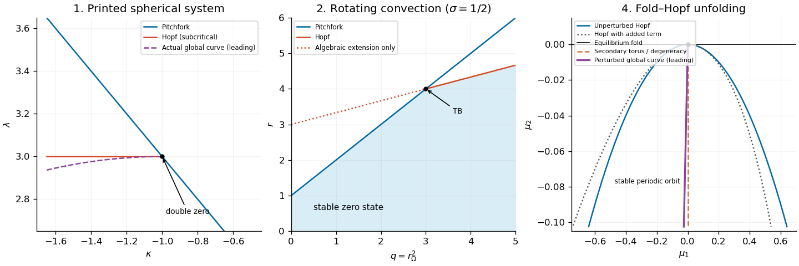
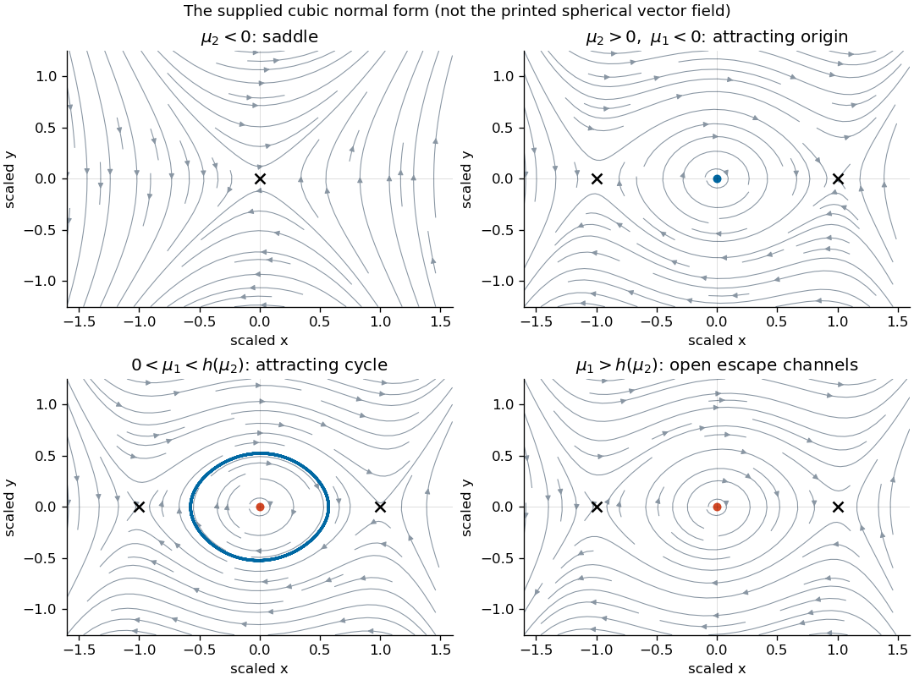
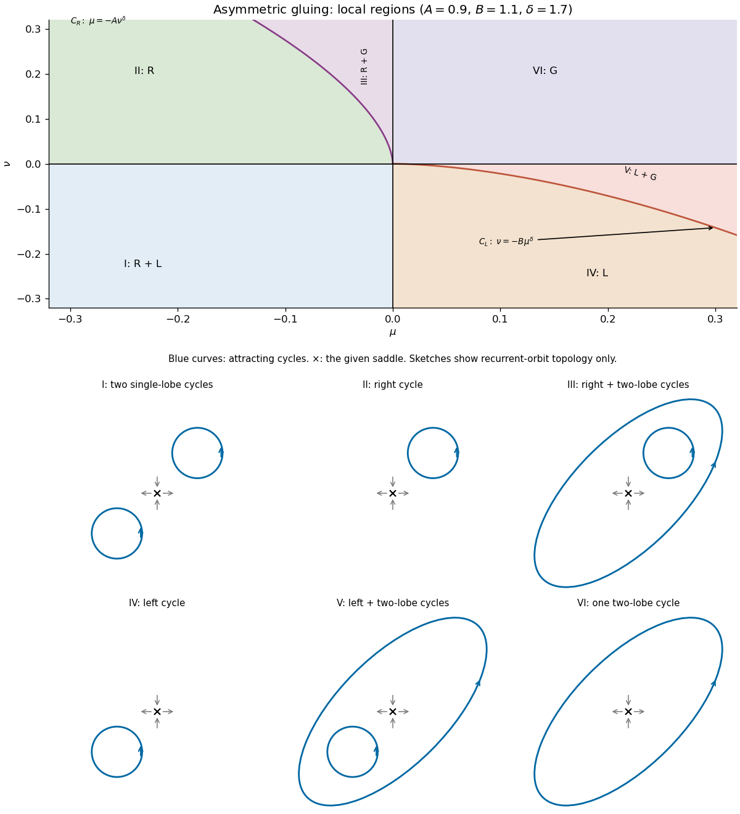
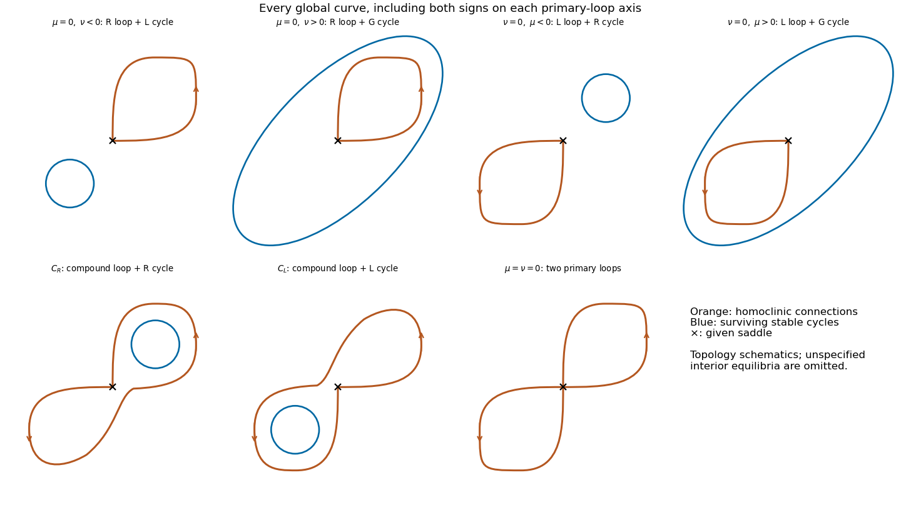
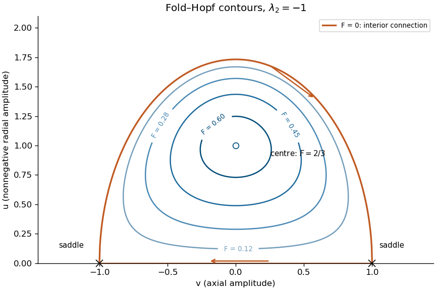

# Paper 59

↑ **Parent:** [Iii](../iii.md)

[https://www.maths.cam.ac.uk/postgrad/part-iii/files/pastpapers/2003/Paper59.pdf](https://www.maths.cam.ac.uk/postgrad/part-iii/files/pastpapers/2003/Paper59.pdf)

**Table of contents**

- [1](#1)
  - [a](#1/a)
    - [Solution](#1/a/solution)
  - [b](#1/b)
    - [Solution](#1/b/solution)
  - [c](#1/c)
    - [Solution](#1/c/solution)
  - [d](#1/d)
    - [Solution](#1/d/solution)
  - [e](#1/e)
    - [Solution](#1/e/solution)
- [2](#2)
  - [a](#2/a)
    - [Solution](#2/a/solution)
  - [b](#2/b)
    - [Solution](#2/b/solution)
  - [c](#2/c)
    - [Solution](#2/c/solution)
  - [d](#2/d)
    - [Solution](#2/d/solution)
- [3](#3)
  - [a](#3/a)
    - [Solution](#3/a/solution)
  - [b](#3/b)
    - [Solution](#3/b/solution)
  - [c](#3/c)
    - [Solution](#3/c/solution)
- [4](#4)
  - [a](#4/a)
    - [Solution](#4/a/solution)
  - [b](#4/b)
    - [Solution](#4/b/solution)
  - [c](#4/c)
    - [Solution](#4/c/solution)
  - [d](#4/d)
    - [Solution](#4/d/solution)
  - [e](#4/e)
    - [Solution](#4/e/solution)

## 1

↑ **Parent:** [Paper 59](paper-59.md)

<h3 id="1/a">a</h3>

↑ **Parent:** [1](#1)

<h4 id="1/a/solution">Solution</h4>

↑ **Parent:** [A](#1/a)

At both points, $\cos\theta=0$ and $\sin2\phi=0$, so both components of the [vector field](../../../calculus.md#vector-field) vanish. Thus **both points are [equilibrium points](../../../dynamical-systems.md#equilibrium-point-of-a-dynamical-system) for every parameter value**. These are regular points of the [spherical coordinates](../../../calculus.md#spherical-coordinate-system) chart: the coordinate singularity at the pole plays no role in their [linearization](../../../algebra.md#linearization).

<h3 id="1/b">b</h3>

↑ **Parent:** [1](#1)

<h4 id="1/b/solution">Solution</h4>

↑ **Parent:** [B](#1/b)

Use local coordinates $q=\theta-\pi/2$, $p=\phi$ at $P_1$. The [Jacobian matrix](../../../calculus.md#jacobian-matrix), its [trace](../../../linear-algebra.md#matrix-trace) and its [determinant](../../../linear-algebra.md#determinant) are

$$
J=\begin{pmatrix}\lambda-1&-2\\1-\kappa&-2\end{pmatrix},\qquad T=\lambda-3,\qquad D=2(2-\lambda-\kappa).
$$

Consequently $P_1$ is attracting when $T<0,D>0$, repelling when $T>0,D>0$, and a [saddle equilibrium](../../../dynamical-systems.md#saddle-equilibrium) when $D<0$. A transition between a [node](../../../dynamical-systems.md#node-dynamical-systems) and a [focus](../../../dynamical-systems.md#focus-dynamical-systems) at $T^2=4D$ changes the linear geometry but is not a [bifurcation](../../../dynamical-systems.md#bifurcation) of the local topological [phase portrait](../../../dynamical-systems.md#phase-portrait).

The [stationary bifurcation](../../../dynamical-systems.md#stationary-bifurcation) curve is $\lambda+\kappa=2$. To identify it, write $C=\cos2\phi$, $S=\sin2\phi$. At a non-equatorial [equilibrium point](../../../dynamical-systems.md#equilibrium-point-of-a-dynamical-system), eliminating $S$ gives

$$
C=\frac{\lambda+\kappa}{2},\qquad \cos\theta=\frac{2S}{\kappa-\lambda}.
$$

Near $(3,-1)$, if $d=2-\lambda-\kappa>0$, these yield $p=\pm\sqrt d/2+O(d^{3/2})$ and $q=p+o(\sqrt d)$. The two branches are related by the local reflection $(q,p)\mapsto(-q,-p)$. Their [determinants](../../../linear-algebra.md#determinant) are $-4d+o(d)$, so they are [saddle equilibria](../../../dynamical-systems.md#saddle-equilibrium). This is a [pitchfork bifurcation](../../../dynamical-systems.md#pitchfork-bifurcation-normal-form); on the portion with $T<0$ the saddle branches lie on the side where $P_1$ is stable, giving a [subcritical pitchfork bifurcation](../../../dynamical-systems.md#subcritical-pitchfork-bifurcation).

A [Hopf bifurcation](../../../dynamical-systems.md#hopf-bifurcation) requires $T=0,D>0$, hence

$$
\boxed{\lambda=3,\quad\kappa<-1.}
$$

The oscillation frequency is $\omega=\sqrt{-2(1+\kappa)}$. At the intersection $\boxed{(\lambda,\kappa)=(3,-1)}$, $J\ne0$ but $J^2=0$: there is a double zero [eigenvalue](../../../linear-operator-theory.md#eigenvalue) with one [eigenvector](../../../linear-operator-theory.md#eigenvector). The map from $(\lambda,\kappa)$ to $(T,D)$ has nonzero [Jacobian determinant](../../../calculus.md#jacobian-determinant), so two independent parameter conditions produce this [codimension-two bifurcation](../../../dynamical-systems.md#codimension-two-bifurcation). Reflection removes quadratic terms; the appropriate initial comparison is with a [reflection-symmetric cubic double-zero normal form](../../../dynamical-systems.md#reflection-symmetric-cubic-double-zero-normal-form), subject to the cubic degeneracy checked below.

For completeness, the printed [vector field](../../../calculus.md#vector-field) has a subcritical, rather than supercritical, [Hopf bifurcation](../../../dynamical-systems.md#hopf-bifurcation). In the mechanical coordinates $x=p$, $y=\dot p$, at $\lambda=3$ its cubic acceleration has $x^2y$ coefficient $b=6(\kappa-3)(\kappa+1)/(\kappa-1)^2$ and $y^3$ coefficient $d_3=-2/(\kappa-1)^2$. For a small harmonic oscillation, the averaged cubic change of $H=(y^2+\omega^2x^2)/2$ is $\omega^2A^4(b+3d_3\omega^2)/8$, where

$$
b+3d_3\omega^2=\frac{6(\kappa+1)}{\kappa-1}>0.
$$

Thus a small unstable [periodic orbit](../../../dynamical-systems.md#periodic-orbit) lies on the attracting side of the [Hopf bifurcation](../../../dynamical-systems.md#hopf-bifurcation). This calculation matters when comparing the original equations with the later assumed [normal form](../../../dynamical-systems.md#normal-form-dynamical-systems).

**[Figure 1](#1/b/image-local-bifurcation-curves-for-the-spherical-system-rotating-convection-and-the-fold-hopf-system). Local bifurcation curves for the spherical system, rotating convection, and the fold–Hopf system**.

<h3 id="1/c">c</h3>

↑ **Parent:** [1](#1)

<h4 id="1/c/solution">Solution</h4>

↑ **Parent:** [C](#1/c)

The cubic [Taylor expansion](../../../calculus.md#taylor-expansion) at the double-zero point is

$$
\begin{aligned}
\dot q&=2q-2p-\frac43q^3+2p^2q+pq^2+\frac43p^3+O(5),\\
\dot p&=2q-2p-\frac13q^3-2p^2q+\frac43p^3+O(5).
\end{aligned}
$$

There are no quadratic or quartic terms because the local [vector field](../../../calculus.md#vector-field) is odd under $(q,p)\mapsto(-q,-p)$. Set $u=p$, $v=q-p$, and use $\tau=2t$. The [linear transformation](../../../vector-space.md#linear-map) is invertible, and the positive time rescaling preserves orbit orientation. With primes denoting $d/d\tau$, the result is

$$
\begin{aligned}
u'&=v-\frac12u^3-\frac32u^2v-\frac12uv^2-\frac16v^3+O(5),\\
v'&=2u^3+\frac32u^2v-uv^2-\frac12v^3+O(5).
\end{aligned}
$$

This supplies the requested cubic functions, with a remainder stronger than $O(4)$.

There is an important [normal form](../../../dynamical-systems.md#normal-form-dynamical-systems) check. Setting $x=u$, $y=u'$ straightens the first equation, and differentiating gives

$$
x'=y,\qquad y'=2x^3-4xy^2-y^3+O(5).
$$

In particular the [nilpotent cubic damping invariant](../../../dynamical-systems.md#nilpotent-cubic-damping-invariant) is $g_{21}+3f_{30}=3/2-3/2=0$. A nonsingular cubic [near-identity transformation](../../../dynamical-systems.md#near-identity-transformation) and rescaling cannot change this vanishing invariant into the nonzero $-x^2y$ coefficient in the supplied later [normal form](../../../dynamical-systems.md#normal-form-dynamical-systems). The conclusions for that assumed system are therefore given separately from the independently derived conclusions for the printed original equations.

<h3 id="1/d">d</h3>

↑ **Parent:** [1](#1)

<h4 id="1/d/solution">Solution</h4>

↑ **Parent:** [D](#1/d)

First analyze the supplied [normal form](../../../dynamical-systems.md#normal-form-dynamical-systems) as a [dynamical system](../../../dynamical-systems.md#dynamical-system) in its own right. Its [equilibrium points](../../../dynamical-systems.md#equilibrium-point-of-a-dynamical-system) are $O=(0,0)$ and, for $\mu_2>0$, $S_\pm=(\pm\sqrt{\mu_2},0)$. At $O$, the [trace](../../../linear-algebra.md#matrix-trace) is $\mu_1$ and the [determinant](../../../linear-algebra.md#determinant) is $\mu_2$. At $S_\pm$, the [determinant](../../../linear-algebra.md#determinant) is $-2\mu_2$, so both are [saddle equilibria](../../../dynamical-systems.md#saddle-equilibrium). Thus $\mu_2=0$ is the [pitchfork bifurcation](../../../dynamical-systems.md#pitchfork-bifurcation-normal-form) curve, and $\mu_1=0,\mu_2>0$ is the [Hopf bifurcation](../../../dynamical-systems.md#hopf-bifurcation) curve. With the allowed supercritical [Hopf bifurcation](../../../dynamical-systems.md#hopf-bifurcation), an attracting [limit cycle](../../../dynamical-systems.md#limit-cycle) is born on $\mu_1>0$ around the repelling origin.

The [Hamiltonian](../../../classical-mechanics.md#hamiltonian) $H=y^2/2+\mu_2x^2/2-x^4/4$ obeys $\dot H=(\mu_1-x^2)y^2$. Set $s=\mu_2>0$, $x=\sqrt s X$, $y=sY$, $\tau=\sqrt s\,t$, and $\mu_1=cs$. The limiting [Hamiltonian system](../../../classical-mechanics.md#hamiltonian-system) has two oppositely directed [heteroclinic orbits](../../../dynamical-systems.md#heteroclinic-orbit) with $Y=\pm(1-X^2)/\sqrt2$ for $-1<X<1$. The [Melnikov energy-balance method](../../../dynamical-systems.md#melnikov-energy-balance-method) gives

$$
\int_{-1}^1(c-X^2)(1-X^2)\,dX=\frac43c-\frac4{15}.
$$

Its unique simple zero gives a [heteroclinic cycle](../../../dynamical-systems.md#heteroclinic-cycle) curve

$$
\boxed{\mu_1=h(\mu_2),\qquad h(s)=s/5+o(s),\quad s>0.}
$$

The two connections occur on the same curve because reflection interchanges them. The attracting [limit cycle](../../../dynamical-systems.md#limit-cycle) grows toward this [heteroclinic cycle](../../../dynamical-systems.md#heteroclinic-cycle), then disappears. In the small unfolding neighborhood there is one such connection curve, rather than two independently split curves. There are no nearby [homoclinic orbits](../../../dynamical-systems.md#homoclinic-orbit) replacing it: the two equal-height outer saddles are the relevant separatrix endpoints.

This calculation transfers to the original equations only if the asserted reduction is valid. The cubic calculation in part (c) shows it is not valid for the printed coefficients. Nevertheless, the claim of a single nearby [global bifurcation](../../../dynamical-systems.md#global-bifurcation) curve for the original equations can be proved independently. Put $\eta=-(\kappa+1)>0$, $\lambda=3+\eta^2L$, $x=\phi=\sqrt\eta X$, $y=\dot\phi=\eta Y$, and $\tau=\sqrt\eta\,t$. Eliminating $\theta$ using $\sin q=(y+\sin2x)/(\cos2x-\kappa)$ produces

$$
\begin{aligned}
X'&=Y,\\
Y'&=-2X+8X^3+\eta\left(\frac{10}{3}X^3+2LX-16X^5-4XY^2\right)\\
&\quad+\eta^{3/2}Y\left(L+6X^2-12X^4-\frac12Y^2\right)+O(\eta^2).
\end{aligned}
$$

The order-$\eta$ correction is reversible and has no first-order separatrix energy imbalance. On the limiting positive connection, $-1/2<X<1/2$ and $Y=1/2-2X^2$. The first dissipative balance is

$$
\int_{-1/2}^{1/2}\left(L-\frac18+7X^2-14X^4\right)\left(\frac12-2X^2\right)\,dX
=\frac13\left(L+\frac3{20}\right).
$$

Again the zero is simple, and reflection makes the two [heteroclinic orbits](../../../dynamical-systems.md#heteroclinic-orbit) simultaneous. Hence the actual original equations have the unique local connection curve

$$
\boxed{\lambda=3-\frac3{20}(\kappa+1)^2+o((\kappa+1)^2),\qquad\kappa<-1.}
$$

The unstable [limit cycle](../../../dynamical-systems.md#limit-cycle) on the subcritical [Hopf bifurcation](../../../dynamical-systems.md#hopf-bifurcation) side reaches this curve. Thus the original system still has one nearby global connection curve, but its tangency and cycle stability differ from those of the supplied assumed cubic [normal form](../../../dynamical-systems.md#normal-form-dynamical-systems). These statements concern connections contained in the shrinking neighborhood of $P_1$; they do not exclude unrelated distant [global bifurcations](../../../dynamical-systems.md#global-bifurcation) elsewhere on the sphere.

<h3 id="1/e">e</h3>

↑ **Parent:** [1](#1)

<h4 id="1/e/solution">Solution</h4>

↑ **Parent:** [E](#1/e)

For the supplied [normal form](../../../dynamical-systems.md#normal-form-dynamical-systems), the four local topological [phase portraits](../../../dynamical-systems.md#phase-portrait) are as follows. When $\mu_2<0$, only the origin is present and it is a [saddle equilibrium](../../../dynamical-systems.md#saddle-equilibrium). When $\mu_2>0,\mu_1<0$, the origin is attracting, between the two outer [saddle equilibria](../../../dynamical-systems.md#saddle-equilibrium); inward-facing [separatrices](../../../dynamical-systems.md#separatrix) enter its basin. When $\mu_2>0$ and $0<\mu_1<h(\mu_2)$, the origin is repelling and a stable [limit cycle](../../../dynamical-systems.md#limit-cycle) surrounds it, inside the separatrix boundary formed by the outer [saddle equilibria](../../../dynamical-systems.md#saddle-equilibrium). Finally, when $\mu_2>0,\mu_1>h(\mu_2)$, the origin remains repelling but the local [limit cycle](../../../dynamical-systems.md#limit-cycle) has disappeared, and trajectories leave the central region through the opened separatrix channels. Whether the origin is a [node](../../../dynamical-systems.md#node-dynamical-systems) or a [focus](../../../dynamical-systems.md#focus-dynamical-systems) within one of these regions does not change this orbit topology.

On the connection curve, the two outer [saddle equilibria](../../../dynamical-systems.md#saddle-equilibrium) are joined in both directions; the period of the disappearing [limit cycle](../../../dynamical-systems.md#limit-cycle) diverges. This is a [heteroclinic cycle](../../../dynamical-systems.md#heteroclinic-cycle), not a pair of saddle [homoclinic orbits](../../../dynamical-systems.md#homoclinic-orbit). The sketches below show the four open regions of the supplied system; they are not presented as phase portraits of the inequivalent printed spherical equations.

**[Figure 2](#1/e/image-four-phase-portraits-of-the-supplied-reflection-symmetric-cubic-normal-form). Four phase portraits of the supplied reflection-symmetric cubic normal form**.

## 2

↑ **Parent:** [Paper 59](paper-59.md)

<h3 id="2/a">a</h3>

↑ **Parent:** [2](#2)

<h4 id="2/a/solution">Solution</h4>

↑ **Parent:** [A](#2/a)

Use the [Galerkin method](../../../partial-differential-equation.md#galerkin-method): substitute the retained trigonometric modes and project onto them with the $L^2$ [inner product](../../../linear-algebra.md#inner-product) over the rectangle. Each mode satisfies the printed [boundary conditions](../../../differential-equation.md#boundary-condition). Write $X=\alpha x$, $Z=\pi z$, and abbreviate the four mode prefactors by $C=2\sqrt2\beta/\alpha$, $D=2\sqrt2/\beta$, $V_1=2\sqrt2\sigma\pi R_\Omega/(\alpha\beta)$ and $V_2=\sigma R_\Omega/\alpha$. The [Jacobian determinant](../../../calculus.md#jacobian-determinant) in the advection terms is $J(f,g)=f_xg_z-f_zg_x$.

The [stream function](../../../fluid-mechanics.md#stream-function) is a single [Laplacian eigenfunction](../../../partial-differential-equation.md#laplacian-eigenfunction), so $\nabla^2\psi=-\beta^2\psi$ and $J(\psi,\nabla^2\psi)=0$ exactly. For the temperature modes, direct multiplication gives

$$
\begin{aligned}
J(\psi,Db\cos X\sin Z)&=4\pi ab\sin2Z,\\
\operatorname{proj}J(\psi,-c\sin2Z/\pi)&=2\sqrt2\beta ac\cos X\sin Z.
\end{aligned}
$$

For the transverse-velocity modes, the retained products are

$$
\begin{aligned}
J(\psi,V_1d\sin X\cos Z)&=-\frac{4\sigma\pi^2R_\Omega}{\alpha}ad\sin2X,\\
\operatorname{proj}J(\psi,V_2e\sin2X)&=\beta^2V_1ae\sin X\cos Z.
\end{aligned}
$$

For example, $\sin Z\cos2Z=(\sin3Z-\sin Z)/2$ and $\sin X\cos2X=(\sin3X-\sin X)/2$ supply the signs of the two retained $ac$ and $ae$ couplings. The third harmonics are orthogonal to the retained modes and are discarded by this [Galerkin method](../../../partial-differential-equation.md#galerkin-method); they are not claimed to vanish in the full [partial differential equations](../../../partial-differential-equation.md).

Before changing time, the five coefficient equations are

$$
\begin{aligned}
\frac{da}{dt}&=-\sigma\beta^2a+\frac{\sigma R\alpha^2}{\beta^4}b-\frac{\sigma^2\pi^2R_\Omega^2}{\beta^4}d,\\
\frac{db}{dt}&=\beta^2(a-b-ac),\\
\frac{dc}{dt}&=4\pi^2(-c+ab),\\
\frac{dd}{dt}&=\beta^2(a-\sigma d-ae),\\
\frac{de}{dt}&=-4\sigma\alpha^2e+4\pi^2ad.
\end{aligned}
$$

Dividing by $\beta^2$ gives the stated [five-mode rotating-convection truncation](../../../viscous-fluid-flow.md#five-mode-rotating-convection-truncation), with

$$
\boxed{r=\frac{\alpha^2}{\beta^6}R,\qquad r_\Omega=\frac{\pi}{\beta^3}R_\Omega,\qquad h=\varpi=\frac{4\pi^2}{\beta^2}.}
$$

The squared rotation parameter is $q=r_\Omega^2\ge0$. The printed $R_\Omega$ is proportional to rotation rate, so it is a square-root-type rotation parameter rather than the more usual [Taylor number](../../../geophysical-fluid-dynamics.md#taylor-number) proportional to squared rotation rate; the algebra uses the coefficient as printed. At zero rotation the physical transverse velocity modes vanish; the normalized $d,e$ equations can still be understood through their continuous zero-rotation limit.

<h3 id="2/b">b</h3>

↑ **Parent:** [2](#2)

<h4 id="2/b/solution">Solution</h4>

↑ **Parent:** [B](#2/b)

Let $q=r_\Omega^2$ and $h=\varpi$. The $c,e$ [eigenvalues](../../../linear-operator-theory.md#eigenvalue) at the conductive [equilibrium point](../../../dynamical-systems.md#equilibrium-point-of-a-dynamical-system) are $-h$ and $-(4-h)\sigma$, both negative since $0<h<4$ and $\sigma>0$. The coupled $(a,b,d)$ [Jacobian matrix](../../../calculus.md#jacobian-matrix) has characteristic polynomial

$$
P(s)=(s+\sigma)^2(s+1)-\sigma r(s+\sigma)+\sigma^2q(s+1)
=s^3+A_1s^2+A_2s+A_3,
$$

where

$$
A_1=1+2\sigma,\qquad A_2=\sigma^2+2\sigma-\sigma r+\sigma^2q,\qquad A_3=\sigma^2(1+q-r).
$$

A simple zero [eigenvalue](../../../linear-operator-theory.md#eigenvalue) occurs on $\boxed{r_P=1+q}$. The reflection $(a,b,d)\mapsto(-a,-b,-d)$, with $c,e$ fixed, makes its generic [steady-state bifurcation](../../../dynamical-systems.md#steady-state-bifurcation) a [pitchfork bifurcation](../../../dynamical-systems.md#pitchfork-bifurcation-normal-form).

For a nonzero imaginary pair, substitute $s=i\omega$ into $P$: the real and imaginary parts require $A_3=A_1A_2$ and $\omega^2=A_2>0$. Hence

$$
\boxed{r_H=2(1+\sigma)+\frac{2\sigma^2}{1+\sigma}q,\qquad
\omega_H^2=\sigma^2\left(\frac{1-\sigma}{1+\sigma}q-1\right).}
$$

With $0<\sigma<1$, this [Hopf bifurcation](../../../dynamical-systems.md#hopf-bifurcation) curve is present only for $q>q_{TB}=(1+\sigma)/(1-\sigma)$. At its intersection with the [pitchfork bifurcation](../../../dynamical-systems.md#pitchfork-bifurcation-normal-form) curve,

$$
\boxed{q_{TB}=\frac{1+\sigma}{1-\sigma},\qquad r_{TB}=\frac2{1-\sigma},}
$$

and $P(s)=s^2(s+1+2\sigma)$. The zero [eigenvalue](../../../linear-operator-theory.md#eigenvalue) has geometric multiplicity one: its [eigenvector](../../../linear-operator-theory.md#eigenvector) has $b=a$, $d=a/\sigma$. Thus this is a reflection-symmetric [Bogdanov–Takens bifurcation](../../../dynamical-systems.md#bogdanov-takens-bifurcation), rather than two independent zero modes.

The [Routh-Hurwitz stability criterion](../../../dynamical-systems.md#routh-hurwitz-stability-criterion) gives the stable trivial state below $r_P$ for $q<q_{TB}$ and below $r_H$ for $q>q_{TB}$. The rest of the line $r_P$, beyond $q_{TB}$, is a stationary [bifurcation](../../../dynamical-systems.md#bifurcation) of an already unstable trivial state. Likewise the extension of $r_H$ below $q_{TB}$ is only an algebraic line, since its putative frequency is not real. The middle panel of the [bifurcation diagram](../../../dynamical-systems.md#bifurcation-diagram) in part 1(b) distinguishes the actual curves from this extension.

<h3 id="2/c">c</h3>

↑ **Parent:** [2](#2)

<h4 id="2/c/solution">Solution</h4>

↑ **Parent:** [C](#2/c)

To determine the nonlinear [pitchfork bifurcation](../../../dynamical-systems.md#pitchfork-bifurcation-normal-form), solve the four slaved steady equations exactly. Set

$$
k=\frac{h}{(4-h)\sigma^2}=\frac{\pi^2}{\alpha^2\sigma^2},\qquad u=a^2.
$$

The nonzero [equilibrium points](../../../dynamical-systems.md#equilibrium-point-of-a-dynamical-system) satisfy

$$
b=\frac{a}{1+u},\quad c=\frac{u}{1+u},\quad d=\frac{a}{\sigma(1+ku)},\quad e=\frac{ku}{1+ku},\qquad
r=(1+u)\left(1+\frac{q}{1+ku}\right).
$$

Thus

$$
r-(1+q)=[1-q(k-1)]u+qk(k-1)u^2+O(u^3).
$$

If $k\le1$, the coefficient of $u$ is positive for every physical $q\ge0$: there is **no change of pitchfork direction at a nonnegative rotation parameter**. If $k>1$, the change occurs at

$$
\boxed{q_D=r_\Omega^2=\frac1{k-1}=\frac{(4-h)\sigma^2}{h-(4-h)\sigma^2},\qquad r_D=1+q_D.}
$$

Below $q_D$ the nonzero branch lies on $r>r_P$; above $q_D$ it initially lies on $r<r_P$. At $q_D$, $r-r_D=ku^2+O(u^3)$, so $|a|$ grows like $(r-r_D)^{1/4}$ rather than the ordinary square-root scaling.

The [rational equilibrium curve at a degenerate pitchfork](../../../dynamical-systems.md#rational-equilibrium-curve-at-a-degenerate-pitchfork) also gives the nearby [saddle-node bifurcations](../../../dynamical-systems.md#saddle-node-bifurcation) of the two reflection-related nonzero branches. For $q>q_D$,

$$
\boxed{u_{SN}=\frac{\sqrt{q(k-1)}-1}{k},\qquad
r_{SN}=\frac{k-1+q+2\sqrt{q(k-1)}}{k},}
$$

and

$$
r_P-r_{SN}=\frac{(\sqrt{q(k-1)}-1)^2}{k}.
$$

The two [saddle-node bifurcations](../../../dynamical-systems.md#saddle-node-bifurcation) occur on one parameter curve by reflection symmetry; its separation from the [pitchfork bifurcation](../../../dynamical-systems.md#pitchfork-bifurcation-normal-form) curve is quadratic in $q-q_D$.

The stability statement needs a further condition. At $r_P$, the other coupled [eigenvalues](../../../linear-operator-theory.md#eigenvalue) have polynomial $s^2+(1+2\sigma)s+\sigma[(1+\sigma)-(1-\sigma)q]$. They are stable only for $q<q_{TB}$. If $q_D<q_{TB}$, a one-dimensional [centre manifold](../../../dynamical-systems.md#center-manifold) gives the local form $a'=\chi a[\Delta-[1-q(k-1)]a^2-ka^4+\cdots]$, where $\Delta=r-r_P$ and $\chi=\sigma/[(1+\sigma)-(1-\sigma)q_D]>0$. The quintic term stabilizes the large branch. The interval $r_{SN}<r<r_P$ then has a stable conductive state and two stable finite-amplitude states, with the two small unstable branches separating their [basins of attraction](../../../dynamical-systems.md#basin-of-attraction). This is the usual subcritical convection [hysteresis](../../../critical-phenomenon.md#hysteresis). If $q_D>q_{TB}$, the branch still reverses its direction, but the trivial state already has an additional unstable mode; this equilibrium-curve calculation alone does not imply a stable bistable wedge. At equality a two-dimensional [centre manifold](../../../dynamical-systems.md#center-manifold) is essential.

<h3 id="2/d">d</h3>

↑ **Parent:** [2](#2)

<h4 id="2/d/solution">Solution</h4>

↑ **Parent:** [D](#2/d)

A codimension-three degeneracy is possible when the double-zero [eigenvalue](../../../linear-operator-theory.md#eigenvalue) condition and the vanishing cubic restoring coefficient of the [pitchfork bifurcation](../../../dynamical-systems.md#pitchfork-bifurcation-normal-form) coincide. Equating $q_D$ and $q_{TB}$ gives

$$
\boxed{k=\frac2{1+\sigma},\qquad
h=\frac{8\sigma^2}{1+\sigma+2\sigma^2},\qquad
\alpha^2=\frac{\pi^2(1+\sigma)}{2\sigma^2}.}
$$

Equivalently $L=\sqrt{2\sigma^2/(1+\sigma)}$. For every $0<\sigma<1$, this is a physically admissible aspect ratio and $0<h<4$. The other two parameters are $q=(1+\sigma)/(1-\sigma)$ and $r=2/(1-\sigma)$.

At this point the fifth-order restoring term is nonzero: the steady relation is $r-r_{TB}=ka^4+O(a^6)$ with $k>0$. It is therefore a degenerate reflection-symmetric [Bogdanov–Takens bifurcation](../../../dynamical-systems.md#bogdanov-takens-bifurcation) with three independent conditions: zero [determinant](../../../linear-algebra.md#determinant), zero frequency, and zero cubic restoring coefficient. Varying the aspect ratio supplies the third parameter, in addition to $r,q$. At a fixed generic aspect ratio it is not a codimension-two event available by varying only $r,q$.

It is **not a triple-zero eigenvalue**: the three-mode characteristic polynomial still has the noncritical factor $s+1+2\sigma$, while the $c,e$ [eigenvalues](../../../linear-operator-theory.md#eigenvalue) remain strictly negative. The extra degeneracy is nonlinear. A fifth-order, two-dimensional [normal form](../../../dynamical-systems.md#normal-form-dynamical-systems) is needed for its complete unfolding; the one-dimensional quintic [pitchfork bifurcation](../../../dynamical-systems.md#pitchfork-bifurcation-normal-form) used away from $q_{TB}$ cannot be substituted at the double-zero point.

## 3

↑ **Parent:** [Paper 59](paper-59.md)

<h3 id="3/a">a</h3>

↑ **Parent:** [3](#3)

<h4 id="3/a/solution">Solution</h4>

↑ **Parent:** [A](#3/a)

Take small incoming sections $y=\pm h$ and outgoing sections $x=\pm h$ after straightening the [stable manifold](../../../dynamical-systems.md#stable-manifold) and [unstable manifold](../../../dynamical-systems.md#unstable-manifold) of the origin. Its [eigenvalues](../../../linear-operator-theory.md#eigenvalue) are $1,-\delta$, so the leading local passage satisfies $x(t)=x_0e^t$, $y(t)=y_0e^{-\delta t}$. The exit time and transverse exit coordinate are

$$
T=\log\frac{h}{|x_0|},\qquad y_{\mathrm{out}}=\operatorname{sgn}(y_0)h^{1-\delta}|x_0|^\delta.
$$

Thus the local passage contracts strongly as $x_0\to0$, while its duration diverges. Smooth global reinjection from the right outgoing section to the upper incoming section has leading transverse coordinate $-\mu+K_Ry_{\mathrm{out}}$; the corresponding left-to-lower return has $\nu+K_Ly_{\mathrm{out}}$. Choose the parameters as these signed splitting coordinates and absorb $h^{1-\delta}$ into $A,B$.

After scaling the incoming-section labels to $y_n=\pm1$, the leading [Poincaré return map](../../../dynamical-systems.md#poincare-map) is

$$
x_{n+1}=\begin{cases}-\mu+A\operatorname{sgn}(y_n)|x_n|^\delta,&x_n>0,\\
\nu+B\operatorname{sgn}(y_n)|x_n|^\delta,&x_n<0,
\end{cases}\qquad y_{n+1}=\operatorname{sgn}(x_n).
$$

The second coordinate records which outgoing branch was used, not an independent continuous amplitude. A smooth planar flow preserves the orientation of a transverse-section return. For the right-to-upper pair of sections, the ordered pair consisting of the flow direction and the positive section tangent has the same orientation at both ends; the same is true for the left-to-lower pair. Hence $A,B>0$ for these sign conventions and a nondegenerate global return.

For general nonlinear $P,Q$, this is an **asymptotic return model**, with smooth parameter corrections and higher-order local-passage corrections. The hypotheses do not imply an exact power-law map in the original coordinates. Interpreting the printed parameters themselves as linear splitting coordinates also requires a nondegenerate two-parameter unfolding: the two splitting derivatives must be nonzero. For example, composing a generic right-loop splitting with $\mu\mapsto\mu^2$ preserves the stated loop at $\mu=0$ but does not give the printed signed $-\mu$ offset. The subsequent region diagram uses the standard generic splitting-coordinate interpretation. Nor is $x=0$ a normal return point: it lies on the [stable manifold](../../../dynamical-systems.md#stable-manifold), whose trajectory takes infinite time to reach the [saddle equilibrium](../../../dynamical-systems.md#saddle-equilibrium). This explains how the map describes nearby recurrent trajectories without extending a finite-time return across the singular separatrix.

<h3 id="3/b">b</h3>

↑ **Parent:** [3](#3)

<h4 id="3/b/solution">Solution</h4>

↑ **Parent:** [B](#3/b)

We count [periodic orbits](../../../dynamical-systems.md#periodic-orbit) whose trajectories remain near the two specified [homoclinic orbits](../../../dynamical-systems.md#homoclinic-orbit); the local hypotheses impose no bound on unrelated distant cycles. Choose the return domain small enough that $A\delta|x|^{\delta-1}$ and $B\delta|x|^{\delta-1}$ are less than one. Each admissible return branch is then a [contraction mapping](../../../analysis.md#contraction-mapping).

A right-lobe [periodic orbit](../../../dynamical-systems.md#periodic-orbit) is a [fixed point](../../../function.md#fixed-point) $(p,+1)$ with $p>0$ and $p=-\mu+Ap^\delta$. For small amplitudes it exists exactly when $\mu<0$, and $p=-\mu+o(|\mu|)$. Similarly, a left-lobe [periodic orbit](../../../dynamical-systems.md#periodic-orbit) has $(x,y)=(-q,-1)$, $q>0$, $q=-\nu+Bq^\delta$, and exists for $\nu<0$. Their [Floquet multipliers](../../../dynamical-systems.md#floquet-multiplier) tend to zero, so both are attracting.

A [period-two orbit](../../../dynamical-systems.md#period-two-orbit) of the section map corresponds to one flow [periodic orbit](../../../dynamical-systems.md#periodic-orbit) traversing both lobes. Write its states as $(p,-1)$ and $(-q,+1)$. Its positive amplitudes satisfy

$$
\boxed{q=\mu+Ap^\delta,\qquad p=\nu+Bq^\delta.}
$$

The two-step derivative is $AB\delta^2p^{\delta-1}q^{\delta-1}$, again tending to zero. The [asymmetric planar gluing return map](../../../dynamical-systems.md#asymmetric-planar-gluing-return-map) therefore gives at most one such attracting two-lobe cycle in the small domain. Its boundaries are obtained by setting one amplitude to zero:

$$
\boxed{C_R:\ \mu=-A\nu^\delta\ (\nu>0),\qquad
C_L:\ \nu=-B\mu^\delta\ (\mu>0).}
$$

For the original flow these are leading equations, with corrections $o(\nu^\delta)$ or $o(\mu^\delta)$. On $C_R$, the negative unstable branch makes both excursions before returning to the positive stable branch; on $C_L$ the positive unstable branch returns to the negative stable branch. Each is a compound [homoclinic orbit](../../../dynamical-systems.md#homoclinic-orbit), with one extra passage near the [saddle equilibrium](../../../dynamical-systems.md#saddle-equilibrium). They are distinct from the primary loop curves $\mu=0$ and $\nu=0$.

The six open regions and their local cycles are:

| Region | Attracting flow cycles |
| --- | --- |
| $\mu<0,\ \nu<0$ | Right and left single-lobe cycles |
| $\nu>0,\ \mu<-A\nu^\delta$ | Right single-lobe cycle only |
| $\nu>0,\ -A\nu^\delta<\mu<0$ | Right single-lobe cycle and two-lobe cycle |
| $\mu>0,\ \nu<-B\mu^\delta$ | Left single-lobe cycle only |
| $\mu>0,\ -B\mu^\delta<\nu<0$ | Left single-lobe cycle and two-lobe cycle |
| $\mu>0,\ \nu>0$ | Two-lobe cycle only |

There is no additional small alternating cycle when both parameters are negative. Indeed the two positive-amplitude equations would imply $q<Ap^\delta$ and $p<Bq^\delta$, giving $p<BA^\delta p^{\delta^2}$, impossible for sufficiently small positive $p$. On each mixed-sign quadrant the contraction equations give the two-lobe cycle precisely on the side of the compound curve toward the positive quadrant.

On $\mu=0$, there is the primary right [homoclinic orbit](../../../dynamical-systems.md#homoclinic-orbit), together with a left cycle if $\nu<0$ or a two-lobe cycle if $\nu>0$. On $\nu=0$ the analogous statement holds with left and right interchanged. On $C_R$ there is a compound [homoclinic orbit](../../../dynamical-systems.md#homoclinic-orbit) and the right single-lobe cycle; on $C_L$ there is a compound [homoclinic orbit](../../../dynamical-systems.md#homoclinic-orbit) and the left single-lobe cycle. At $(0,0)$ the two primary loops meet at the same [saddle equilibrium](../../../dynamical-systems.md#saddle-equilibrium). The approach to each [homoclinic orbit](../../../dynamical-systems.md#homoclinic-orbit) has a diverging period; it is not a saddle-node collision of two finite-period cycles.

**[Figure 3](#3/b/image-parameter-regions-and-schematic-phase-portraits-for-asymmetric-planar-gluing). Parameter regions and schematic phase portraits for asymmetric planar gluing**.

**[Figure 4](#3/b/image-primary-compound-and-double-homoclinic-connections-on-every-global-bifurcation-curve). Primary, compound, and double homoclinic connections on every global bifurcation curve**.

<h3 id="3/c">c</h3>

↑ **Parent:** [3](#3)

<h4 id="3/c/solution">Solution</h4>

↑ **Parent:** [C](#3/c)

With reflection symmetry, choose $\mu=\nu=m$ and $A=B$. The two primary [homoclinic orbit](../../../dynamical-systems.md#homoclinic-orbit) curves are then encountered simultaneously at $m=0$. For $m<0$ the return has two attracting single-lobe cycles; for $m>0$ it has one attracting two-lobe cycle. This is the [symmetric homoclinic gluing bifurcation](../../../dynamical-systems.md#symmetric-homoclinic-gluing-bifurcation): two cycles meet the two saddle loops and are replaced by a cycle traversing both lobes. Since $\delta>1$, the [saddle equilibrium](../../../dynamical-systems.md#saddle-equilibrium) contracts strongly enough for the nearby cycles to be stable.

One can also use the [signed gluing-map reduction](../../../dynamical-systems.md#signed-gluing-map-reduction) $z=-xy$. In the symmetric return map it gives $z'=m+A\operatorname{sgn}(z)|z|^\delta$. A negative [fixed point](../../../function.md#fixed-point) lifts to two reflection-related flow cycles; a positive [fixed point](../../../function.md#fixed-point) lifts to one [period-two orbit](../../../dynamical-systems.md#period-two-orbit) of the two-sheet section map, hence one two-lobe flow cycle. This distinction prevents counting the two section intersections as two different flow cycles.

Without reflection symmetry the two splitting parameters are independent. The primary loops occur separately, and the two compound curves bound small coexistence wedges where a single-lobe and a two-lobe cycle are both stable. Thus the six-region picture is the generic two-parameter unfolding of the symmetric gluing event. The simultaneous encounter of both primary loops is codimension two for a general planar flow but codimension one in the reflection-symmetric family. The contraction argument applies to the small return domain; it makes no assertion that a globally arbitrary $P,Q$ system has only these cycles everywhere.

## 4

↑ **Parent:** [Paper 59](paper-59.md)

<h3 id="4/a">a</h3>

↑ **Parent:** [4](#4)

<h4 id="4/a/solution">Solution</h4>

↑ **Parent:** [A](#4/a)

For $r>0$, polar coordinates give $\dot r=r(\mu_1-2x)$ and $\dot\theta=1$; the remaining amplitude equation is $\dot x=\mu_2+x^2+r^2$. Interpret $r=0$ in the original complex coordinate, where the phase is undefined.

If $\mu_2<0$, put $a=\sqrt{-\mu_2}$. The full [equilibrium points](../../../dynamical-systems.md#equilibrium-point-of-a-dynamical-system) are $E_\pm:(z,x)=(0,\pm a)$. Their [eigenvalues](../../../linear-operator-theory.md#eigenvalue) are

$$
E_+:\quad 2a,\ \mu_1-2a\pm i,\qquad
E_-:\quad -2a,\ \mu_1+2a\pm i.
$$

Thus $E_-$ is stable for $\mu_1<-2a$ and has a two-dimensional [unstable manifold](../../../dynamical-systems.md#unstable-manifold) for $\mu_1>-2a$. The point $E_+$ has a one-dimensional [unstable manifold](../../../dynamical-systems.md#unstable-manifold) for $\mu_1<2a$ and is repelling for $\mu_1>2a$. On $\mu_2=0$ they merge in a [saddle-node bifurcation](../../../dynamical-systems.md#saddle-node-bifurcation); the simultaneous zero and imaginary [eigenvalues](../../../linear-operator-theory.md#eigenvalue) at $(\mu_1,\mu_2)=(0,0)$ give a [fold-Hopf bifurcation](../../../dynamical-systems.md#fold-hopf-bifurcation).

A steady positive amplitude represents a full [periodic orbit](../../../dynamical-systems.md#periodic-orbit), not a full equilibrium. Solving the amplitude equations gives

$$
\boxed{x_*=\mu_1/2,\qquad r_*^2=-\mu_2-\mu_1^2/4,\qquad \text{period}=2\pi.}
$$

It exists in the wedge $\mu_2<-\mu_1^2/4$. The transverse amplitude [Jacobian matrix](../../../calculus.md#jacobian-matrix) has characteristic polynomial $s^2-\mu_1s+4r_*^2$. Its two transverse [Floquet exponents](../../../differential-equation.md#floquet-exponent) have negative real part for $\mu_1<0$ and positive real part for $\mu_1>0$; the phase direction supplies the neutral [Floquet multiplier](../../../dynamical-systems.md#floquet-multiplier) one.

The wedge boundaries are [Hopf bifurcations](../../../dynamical-systems.md#hopf-bifurcation) at $\mu_1=-2a$ from $E_-$ and $\mu_1=2a$ from $E_+$. The left branch is supercritical, producing a stable [periodic orbit](../../../dynamical-systems.md#periodic-orbit) as $E_-$ loses stability; the right branch is subcritical in the oscillatory subspace, with an unstable [periodic orbit](../../../dynamical-systems.md#periodic-orbit) on the side where the transverse complex pair of $E_+$ is stable. The real unstable direction of $E_+$ persists throughout. There are no full [equilibrium points](../../../dynamical-systems.md#equilibrium-point-of-a-dynamical-system) when $\mu_2>0$, and $\dot x>0$ then excludes a local [periodic orbit](../../../dynamical-systems.md#periodic-orbit). The right panel of the [bifurcation diagram](../../../dynamical-systems.md#bifurcation-diagram) in part 1(b) shows the primary curves and the perturbed global curve calculated below.

<h3 id="4/b">b</h3>

↑ **Parent:** [4](#4)

<h4 id="4/b/solution">Solution</h4>

↑ **Parent:** [B](#4/b)

Within the positive-amplitude wedge the reduced [periodic orbit](../../../dynamical-systems.md#periodic-orbit) equilibrium has amplitude [trace](../../../linear-algebra.md#matrix-trace) $\mu_1$ and positive [determinant](../../../linear-algebra.md#determinant) $4r_*^2$. At $\mu_1=0,\mu_2<0$ the transverse pair is imaginary, so the possible secondary event is a [Hopf bifurcation](../../../dynamical-systems.md#hopf-bifurcation) of the amplitude equations, corresponding to an invariant [torus](../../../topology.md#torus) in the full system.

It is degenerate. Set $\mu_2=-a^2$ and $\mu_1=0$. The [first integral of the quadratic fold-Hopf amplitude flow](../../../dynamical-systems.md#first-integral-of-the-quadratic-fold-hopf-amplitude-flow) is

$$
F=r(a^2-r^2/3-x^2),\qquad F_r=a^2-r^2-x^2,\qquad F_x=-2rx.
$$

The amplitude equations have the [Hamiltonian system](../../../classical-mechanics.md#hamiltonian-system) form $\dot r=F_x$, $\dot x=-F_r$, so $\dot F=0$. At $(r,x)=(a,0)$, $F$ has a strict local maximum $2a^3/3$ and negative-definite Hessian. Every nearby regular level is a closed amplitude [periodic orbit](../../../dynamical-systems.md#periodic-orbit), rather than one isolated orbit selected by nonlinear damping. Adding the rotating phase gives an entire family of invariant [tori](../../../topology.md#torus); the full motion is quasiperiodic or periodic according to the phase advance during one amplitude period.

For $\mu_1\ne0$, the amplitude [vector field](../../../calculus.md#vector-field) has constant [divergence](../../../calculus.md#divergence) $\mu_1$. The [Bendixson-Dulac theorem](../../../dynamical-systems.md#bendixson-dulac-theorem) rules out closed amplitude trajectories in the physical simply connected half-plane $r>0$. Hence there is no ordinary branch of isolated invariant [tori](../../../topology.md#torus) on either side in this quadratic system. The secondary event has vanishing radial saturation coefficients; its imaginary linear pair alone does not establish a nondegenerate torus bifurcation.

<h3 id="4/c">c</h3>

↑ **Parent:** [4](#4)

<h4 id="4/c/solution">Solution</h4>

↑ **Parent:** [C](#4/c)

With the added term, $\dot r=r(\mu_1-2x+x^2)$, while $\dot\theta=1$ and $\dot x=\mu_2+x^2+r^2$. The prescribed rescaling yields

$$
\boxed{u'=-2uv+\varepsilon u(\lambda_1+v^2),\qquad
v'=\lambda_2+v^2+u^2,\qquad \theta'=1/\varepsilon,}
$$

where primes denote $d/d\tau$. In the limit $\varepsilon=0$, the [first integral](../../../differential-equation.md#first-integral) is $F=-u(\lambda_2+u^2/3+v^2)$, since $u'=F_v$, $v'=-F_u$.

Write $\lambda_2=-a^2<0$. The physical amplitude half-plane is $u\ge0$, with $v$ of either sign; it is the radial variable $u$, not the axial variable $v$, that is nonnegative. The [centre equilibrium](../../../dynamical-systems.md#center-equilibrium) is $(u,v)=(a,0)$, at $F=2a^3/3$. The boundary [saddle equilibria](../../../dynamical-systems.md#saddle-equilibrium) are $(0,\pm a)$, both at $F=0$. For $0<F<2a^3/3$, the contours are nested closed curves around the centre. The level $F=0$ consists of the boundary $u=0$ and the interior arc

$$
\boxed{u^2=3(a^2-v^2),\quad -a\le v\le a.}
$$

On the axis $v'=v^2-a^2<0$, giving a [heteroclinic orbit](../../../dynamical-systems.md#heteroclinic-orbit) from $(0,a)$ to $(0,-a)$. On the arc $v'=2(a^2-v^2)>0$, giving the reverse [heteroclinic orbit](../../../dynamical-systems.md#heteroclinic-orbit). Together they form a [heteroclinic cycle](../../../dynamical-systems.md#heteroclinic-cycle). The other parts of the zero level and negative levels give nonclosed trajectories outside this bounded region. The requested contour sketch is shown in the physical radial half-plane.

**[Figure 5](#4/c/image-conserved-amplitude-contours-and-the-heteroclinic-cycle-of-the-quadratic-fold-hopf-system). Conserved amplitude contours and the heteroclinic cycle of the quadratic fold–Hopf system**.

<h3 id="4/d">d</h3>

↑ **Parent:** [4](#4)

<h4 id="4/d/solution">Solution</h4>

↑ **Parent:** [D](#4/d)

For the perturbed amplitude equations, direct differentiation of the [first integral](../../../differential-equation.md#first-integral) gives

$$
F'=-\varepsilon u(\lambda_1+v^2)(\lambda_2+u^2+v^2).
$$

The axis connection contributes zero since $u=0$. On the unperturbed interior [heteroclinic orbit](../../../dynamical-systems.md#heteroclinic-orbit), $u=\sqrt{3(a^2-v^2)}$ and $v'=2(a^2-v^2)$, so the first-order change is

$$
\Delta F=-\varepsilon\sqrt3\int_{-a}^a(\lambda_1+v^2)\sqrt{a^2-v^2}\,dv+O(\varepsilon^2).
$$

The substitution $v=a\cos\phi$ gives

$$
\int_{-a}^a\sqrt{a^2-v^2}\,dv=\frac{\pi a^2}{2},\qquad
\int_{-a}^av^2\sqrt{a^2-v^2}\,dv=\frac{\pi a^4}{8}.
$$

Consequently

$$
\Delta F=-\frac{\varepsilon\pi\sqrt3a^2}{2}(\lambda_1+a^2/4)+O(\varepsilon^2).
$$

The simple zero of this [Melnikov energy-balance method](../../../dynamical-systems.md#melnikov-energy-balance-method) calculation gives the [heteroclinic splitting of a fold-Hopf amplitude cycle](../../../dynamical-systems.md#heteroclinic-splitting-of-a-fold-hopf-amplitude-cycle):

$$
\boxed{\lambda_1=\lambda_2/4+O(\varepsilon),\qquad
\mu_1=\mu_2/4+O(|\mu_2|^{3/2}),\quad\mu_2<0.}
$$

This is a leading persistence curve, not an exact parameter equality for the perturbed orbit. It lies between the two primary [Hopf bifurcation](../../../dynamical-systems.md#hopf-bifurcation) curves near the origin and on the negative-$\mu_1$ side of the secondary torus curve $\mu_1=0$. With the added term the primary [Hopf bifurcation](../../../dynamical-systems.md#hopf-bifurcation) curves themselves shift to $\mu_1=\pm2\sqrt{-\mu_2}+\mu_2$.

The sign of the amplitude balance also identifies the local torus branch. Over a small closed limiting contour, $\Delta F=-\varepsilon\oint u(\lambda_1+v^2)\,dv$. Its enclosed-area form sets $\lambda_1$ equal to minus the area-average of $v^2$. This average tends to zero at the centre and to $a^2/4$ at the [heteroclinic cycle](../../../dynamical-systems.md#heteroclinic-cycle). Near the centre, negative $\lambda_1$ attracts trajectories toward the stable amplitude equilibrium; outside a zero-balance contour, $F$ decreases and the amplitude excursion grows. Thus the secondary bifurcation creates an unstable invariant [torus](../../../topology.md#torus) on the stable-periodic-orbit side. Its continuation reaches the global connection as the balance tends to $\lambda_1=-a^2/4$. The [bifurcation diagram](../../../dynamical-systems.md#bifurcation-diagram) distinguishes this perturbed connection from the entire degenerate family present in the unperturbed system.

<h3 id="4/e">e</h3>

↑ **Parent:** [4](#4)

<h4 id="4/e/solution">Solution</h4>

↑ **Parent:** [E](#4/e)

The [normal form](../../../dynamical-systems.md#normal-form-dynamical-systems) is invariant under $z\mapsto e^{i\varphi}z$. This continuous [rotational symmetry](../../../linear-algebra.md#rotational-symmetry) makes the axis invariant and reduces the nontrivial geometry to two amplitude variables. The axis connection from $E_+$ to $E_-$ persists without parameter tuning, while rotating the outer connection produces a family of connections from $E_-$ back to $E_+$. A two-dimensional autonomous amplitude flow cannot by itself produce the proposed saddle-focus return chaos: symmetry reduction hides the phase-dependent reinjection needed for that mechanism.

Generic higher-order terms need not retain this exact [rotational symmetry](../../../linear-algebra.md#rotational-symmetry). A [normal form](../../../dynamical-systems.md#normal-form-dynamical-systems) can preserve it to a finite truncation order while the full equations have small symmetry-breaking remainders. These unfold the special connection geometry into phase-dependent returns; nearby parameter curves can contain [homoclinic orbits](../../../dynamical-systems.md#homoclinic-orbit) to a [saddle-focus](../../../dynamical-systems.md#saddle-focus-equilibrium), and the [Shilnikov bifurcation](../../../dynamical-systems.md#shilnikov-bifurcation) mechanism becomes available. Their exact placement depends on the omitted terms and is not fixed by the displayed truncation alone.

For example, at the perturbed positive-axis saddle, the real unstable [eigenvalue](../../../linear-operator-theory.md#eigenvalue) is $\lambda_u=2a$ and the stable complex pair has real part $\mu_1-2a+a^2$. Near the calculated connection curve $\mu_1=-a^2/4+o(a^2)$, the contracting ratio is

$$
\delta=-\frac{\operatorname{Re}\lambda_s}{\lambda_u}
=1-\frac{3a}{8}+o(a)<1.
$$

This is the positive-saddle-value regime, explaining why the relevant saddle-focus return can be expanding.

In the [Shilnikov return map](../../../dynamical-systems.md#shilnikov-return-map), take a positive return coordinate $y$ and $0<\delta<1$, with nondegenerate $A\ne0,B\ne0$. At the connection parameter $\mu=0$, the [fixed point](../../../function.md#fixed-point) condition is

$$
\cos(B\log y+\Phi)=y^{1-\delta}/A.
$$

The right side tends to zero, whereas the phase passes through infinitely many oscillations as $y\downarrow0$. Hence there are infinitely many positive [fixed points](../../../function.md#fixed-point) accumulating at zero, with logarithmically spaced amplitudes. For these points,

$$
f'(y)=Ay^{\delta-1}\{\delta\cos(B\log y+\Phi)-B\sin(B\log y+\Phi)\},
$$

whose magnitude tends to infinity along the accumulating fixed-point sequence. They represent long-period saddle [periodic orbits](../../../dynamical-systems.md#periodic-orbit) of the full return, with period growing like $\lambda_u^{-1}\log(1/y)$, rather than infinitely many stable cycles.

Successive turning branches of this oscillatory return can stretch and fold across suitable intervals. The full saddle-focus [Poincaré return map](../../../dynamical-systems.md#poincare-map) then admits invariant [Smale horseshoes](../../../dynamical-systems.md#smale-horseshoe) and chaotic itineraries near a generic [homoclinic orbit](../../../dynamical-systems.md#homoclinic-orbit) at a [Shilnikov bifurcation](../../../dynamical-systems.md#shilnikov-bifurcation). Varying $\mu$ unfolds accumulating saddle-node and period-doubling events. Whether any resulting invariant set attracts trajectories depends on the other return direction and the omitted terms; the leading scalar map alone does not prove a chaotic attractor for every perturbation. Its domain also excludes negative iterates, which leave the chosen return branch. The degeneracies $A=0$ or $B=0$ would remove the oscillatory mechanism, so the conclusion uses generic, genuinely saddle-focus reinjection.

## ↑ Ancestors (8)

1. [Iii](../iii.md)
2. [2003](../../2003.md)
3. [Past exam of the mathematics course of the University of Cambridge](../../../past-exam-of-the-mathematics-course-of-the-university-of-cambridge.md)
4. [Mathematics course of the University of Cambridge](../../../university-of-cambridge.md#mathematics-course-of-the-university-of-cambridge)
5. [Course of the University of Cambridge](../../../university-of-cambridge.md#course-of-the-university-of-cambridge)
6. [University of Cambridge](../../../university-of-cambridge.md)
7. [List of universities](../../../README.md#list-of-universities)
8. [Codex Wiki](../../../README.md)
