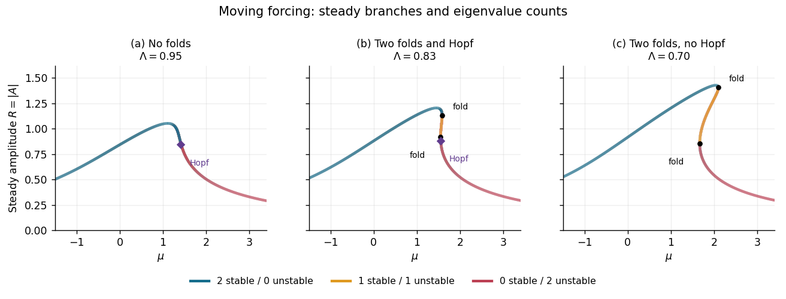

<h1 id="2/ii/solution">Solution</h1>

↑ **Parent:** [Ii](../ii.md)

Let the [equilibrium](../../../../../../equilibrium-point-of-a-dynamical-system.md) be $A_*=Re^{i\theta}$ and write $\delta A=e^{i\theta}(u+iv)$. The [linearization](../../../../../../linearization.md) of the cubic term gives $\delta(|A|^2A)=2s\delta A+A_*^2\delta\overline A$. Therefore the real [stability matrix](../../../../../../stability-matrix.md) is

$$
J=\begin{pmatrix}\mu-3s&-\Lambda\\\Lambda&\mu-s\end{pmatrix}.
$$

Its [eigenvalues](../../../../../../eigenvalue.md) obey

$$
\boxed{\sigma^2+2(2s-\mu)\sigma+(3s-\mu)(s-\mu)+\Lambda^2=0,\qquad \sigma_\pm=\mu-2s\pm\sqrt{s^2-\Lambda^2}.}
$$

The square root may be imaginary; stability uses real parts. The [determinant](../../../../../../determinant.md) $D$ is exactly $F_s$, so a zero [eigenvalue](../../../../../../eigenvalue.md) occurs only at the turning points derived above. Away from the cusp those are ordinary [saddle-node bifurcations](../../../../../../saddle-node-bifurcation.md); the parameterization joining point has $D>0$.

At a candidate [Hopf bifurcation](../../../../../../hopf-bifurcation.md), the [trace](../../../../../../matrix-trace.md) vanishes: $\mu_H=2s_H$. Substitution into the steady cubic gives $s_H(s_H^2+\Lambda^2)=1$, which has one positive root. The pair is genuinely imaginary only if

$$
\omega_H^2=D_H=\Lambda^2-s_H^2=\frac1{s_H}-2s_H^2>0.
$$

Thus $s_H<2^{-1/3}$ and, equivalently,

$$
\boxed{\Lambda>2^{-1/3},\qquad \mu_H=2s_H,\qquad \omega_H=\sqrt{\Lambda^2-s_H^2}.}
$$

This direct calculation proves the threshold without needing the additional monotonicity assumption. The equality gives a double-zero [eigenvalue](../../../../../../eigenvalue.md), not an ordinary [Hopf bifurcation](../../../../../../hopf-bifurcation.md). Along a fixed-$\Lambda$ branch, implicit differentiation gives $ds/d\mu=-2s(\mu-s)/D$; at this crossing $d\operatorname{Re}\sigma/d\mu=1+4s_H^2/D_H>0$. A nonzero nonlinear Hopf coefficient then gives the usual [Hopf bifurcation](../../../../../../hopf-bifurcation.md).

The [fold and Hopf thresholds of a directly forced cubic amplitude](../../../../../../fold-and-hopf-thresholds-of-a-directly-forced-cubic-amplitude.md) divide the diagrams into three regimes. At noncritical points the two [eigenvalues](../../../../../../eigenvalue.md), counted with multiplicity by the signs of their real parts, are classified as follows:

- For $\Lambda>\sqrt3/2$, there is one [equilibrium](../../../../../../equilibrium-point-of-a-dynamical-system.md) for every $\mu$. It has two stable [eigenvalues](../../../../../../eigenvalue.md) for $\mu<\mu_H$ and two unstable [eigenvalues](../../../../../../eigenvalue.md) for $\mu>\mu_H$.
- For $\sqrt3/2>\Lambda>2^{-1/3}$, the largest-amplitude branch has two stable [eigenvalues](../../../../../../eigenvalue.md); the intermediate-amplitude branch has one stable and one unstable [eigenvalue](../../../../../../eigenvalue.md). The smallest-amplitude branch emerging from the lower fold has two stable [eigenvalues](../../../../../../eigenvalue.md) up to its Hopf crossing, and two unstable [eigenvalues](../../../../../../eigenvalue.md) beyond it. The relative location of the Hopf point and the other fold in $\mu$ is not fixed throughout this interval.
- For $0<\Lambda<2^{-1/3}$, the largest-amplitude branch again has two stable [eigenvalues](../../../../../../eigenvalue.md), the intermediate branch has one of each, and the smallest-amplitude branch has two unstable [eigenvalues](../../../../../../eigenvalue.md). The trace-zero point lies on the saddle segment and is not a [Hopf bifurcation](../../../../../../hopf-bifurcation.md) because its [determinant](../../../../../../determinant.md) is negative.

At a fold one [eigenvalue](../../../../../../eigenvalue.md) is zero; at a Hopf point the pair has zero real part. These nonhyperbolic points are marked separately in the sketches.

**[Figure 1](#2/ii/image-steady-amplitudes-of-the-moving-forced-pattern-with-folds-hopf-points-and-stable-unstable-eigenvalue-counts-in-all-three-regimes). Steady amplitudes of the moving forced pattern, with folds, Hopf points and stable/unstable eigenvalue counts in all three regimes**.

## ↑ Ancestors (11)

1. [Ii](../ii.md)
2. [2](../../2.md)
3. [Paper 60](../../../paper-60-split.md)
4. [Iii](../../../split.md)
5. [2003](../../../../split.md)
6. [Past exam of the mathematics course of the University of Cambridge](../../../../../split.md)
7. [Mathematics course of the University of Cambridge](../../../../../../mathematics-course-of-the-university-of-cambridge.md)
8. [Course of the University of Cambridge](../../../../../../course-of-the-university-of-cambridge.md)
9. [University of Cambridge](../../../../../../university-of-cambridge-split.md)
10. [List of universities](../../../../../../list-of-universities.md)
11. [Codex Wiki](../../../../../../split.md)
