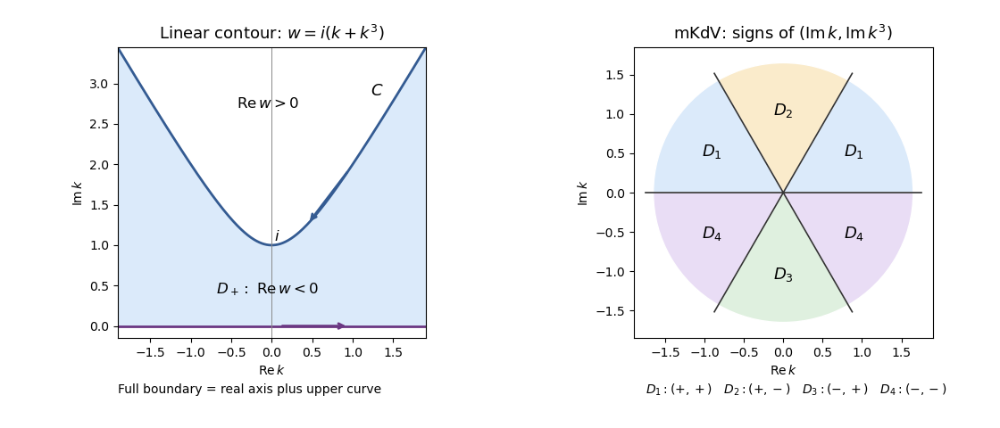

<h1 id="1/b/solution">Solution</h1>

↑ **Parent:** [B](../b.md)

Use the [Half-range Fourier transform](../../../../../../half-range-fourier-transform.md) and the [finite-time spectral boundary transforms](../../../../../../finite-time-spectral-boundary-transform.md)

$$
\widehat q(k,t)=\int_0^\infty e^{-ikx}q(x,t)\,dx,\quad Q_0(k)=\widehat q(k,0),\quad
G_j(k,t)=\int_0^t e^{w(k)s}g_j(s)\,ds,
$$

where $g_j=\partial_x^jq(0,\cdot)$ for $j=0,1,2$. The spatial transforms are [holomorphic](../../../../../../complex-differentiability-at-a-point.md) in $\operatorname{Im}k<0$, while these finite-time transforms are [entire functions](../../../../../../entire-function.md). For now $g_2$ is an unknown boundary trace. Integrating the [local relation](../../../../../../local-relation.md) over the half-strip, using spatial decay at infinity, gives the [global relation](../../../../../../global-relation-for-a-linear-boundary-value-problem.md)

$$
e^{w(k)t}\widehat q(k,t)=Q_0(k)+F(k,t),\qquad
F=(1+k^2)G_0-ikG_1-G_2.
$$

The boundary sign follows from integrating the flux derivative: its contribution is minus the flux at zero.

[Fourier inversion](../../../../../../fourier-inversion-theorem.md) first gives the initial real-line integral plus a real-line integral of $F$. To put the boundary contribution on its useful complex contour, define

$$
D_+=\{k=u+iv:v>0,\ \operatorname{Re}w(k)<0\}
=\{u+iv:0<v<\sqrt{1+3u^2}\}.
$$

Orient its full boundary with $D_+$ on the left. It consists of the real axis from left to right and the upper curve $C:k=u+i\sqrt{1+3u^2}$ from right to left. The real-axis piece must not be discarded for this dispersion. The [contour integration](../../../../../../contour-integration.md) representation is

$$
\boxed{q(x,t)=\frac1{2\pi}\int_{\mathbb R}e^{ikx-w(k)t}Q_0(k)\,dk
+\frac1{2\pi}\int_{\partial D_+}e^{ikx-w(k)t}F(k,t)\,dk.}
$$

To justify the replacement, the integral of $e^{ikx-wt}F$ along $C$ is zero by closing above $C$. In that region $\operatorname{Re}w\ge0$, and each boundary term is an integral of $e^{-w(t-s)}$ over $0\le s\le t$ times a polynomial in $k$. This has no growing temporal exponential there; $e^{ikx}$ suppresses the upper closing arc for $x>0$. The [Cauchy integral theorem](../../../../../../cauchy-s-integral-theorem.md) then applies. The figure shows the full contour and, separately, the sectors used in the nonlinear problem.

**[Figure 1](#1/b/image-full-cubic-dispersion-contour-and-bounded-column-sectors-for-reverse-dispersion-mkdv). Full cubic-dispersion contour and bounded-column sectors for reverse-dispersion mKdV**.

One may replace $F(k,t)$ by $F(k,T)$ for any finite $T\ge t$. Their difference is a future-time integral over $t<s<T$; its factor $e^{w(s-t)}$ decays inside $D_+$, so its integral around $\partial D_+$ vanishes. All contour formulas are understood as limits of truncated contours, with standard small displacements if a boundary transform needs an Abel limit. Compatibility of the initial and boundary data controls the corner behavior. This is the [two-trace half-line cubic dispersion representation](../../../../../../two-trace-half-line-cubic-dispersion-representation.md).

## ↑ Ancestors (11)

1. [B](../b.md)
2. [1](../../1.md)
3. [Paper 61](../../../paper-61-split.md)
4. [Iii](../../../split.md)
5. [2003](../../../../split.md)
6. [Past exam of the mathematics course of the University of Cambridge](../../../../../split.md)
7. [Mathematics course of the University of Cambridge](../../../../../../mathematics-course-of-the-university-of-cambridge.md)
8. [Course of the University of Cambridge](../../../../../../course-of-the-university-of-cambridge.md)
9. [University of Cambridge](../../../../../../university-of-cambridge-split.md)
10. [List of universities](../../../../../../list-of-universities.md)
11. [Codex Wiki](../../../../../../split.md)
