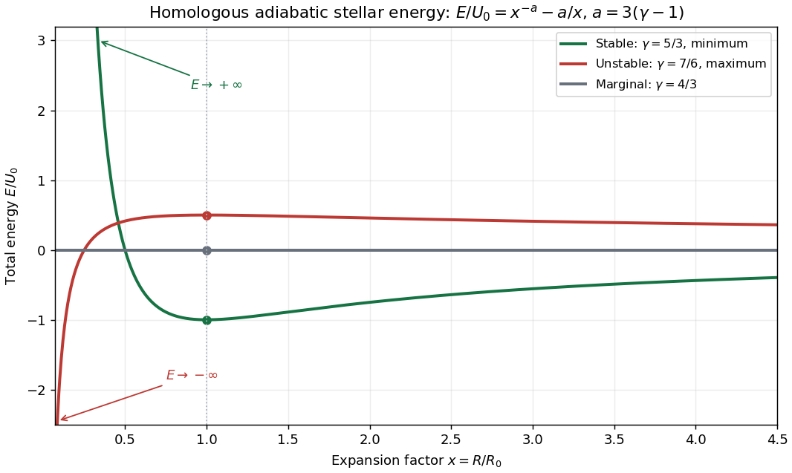

<h1 id="1/solution">Solution</h1>

↑ **Parent:** [1](../1.md)

For an [ideal gas](../../../../../ideal-gas.md) with constant [adiabatic index](../../../../../heat-capacity-ratio.md) $\gamma>1$, let $c_v$ and $c_p$ be specific heat capacities and $\mathcal R=c_p-c_v$. The [ideal gas law](../../../../../ideal-gas-law.md) and the [internal energy of an ideal gas](../../../../../internal-energy-of-an-ideal-gas.md) give $P=\rho\mathcal RT$ and specific internal energy $e=c_vT$. Since $\gamma=c_p/c_v$, the [internal energy](../../../../../internal-energy.md) per unit volume is $\rho e=P/(\gamma-1)$. Consequently a star with [spherical symmetry](../../../../../spherical-symmetry.md) has

$$
\boxed{U=\frac1{\gamma-1}\int P\,dV=\frac{4\pi}{\gamma-1}\int_0^R P(r)r^2\,dr.}
$$

The radial integral requires the volume measure $dV=4\pi r^2dr$: the first printed expression omits this factor if its differential is read literally as $dr$. The mass-coordinate expression confirms the required volume interpretation.

Define the enclosed mass $M(r)$, total mass $M_{\rm tot}$ and dimensionless shell label $m=M(r)/M_{\rm tot}$. [Mass conservation](../../../../../mass-conservation.md) gives $M_{\rm tot}\,dm=dM=\rho\,dV$, so the [change of variables](../../../../../change-of-variables-formula.md) gives

$$
\boxed{U=\frac{M_{\rm tot}}{\gamma-1}\int_0^1\frac{P(m)}{\rho(m)}\,dm.}
$$

Here $m$ labels a fixed material shell rather than its radial position. In a mass-preserving [stellar homology](../../../../../stellar-homology.md), $r(m)=xr_0(m)$ with $x=R/R_0$. Both a shell's radius and thickness gain a factor $x$, so its volume gains $x^3$ and its [mass density](../../../../../density.md) becomes $\rho(m)=x^{-3}\rho_0(m)$. An [adiabatic process](../../../../../adiabatic-process.md) keeps $P/\rho^\gamma$ fixed separately in each shell, even if that constant differs between shells. Thus $P=x^{-3\gamma}P_0$ and $P/\rho=x^{-3(\gamma-1)}P_0/\rho_0$. Integration at fixed mass labels proves

$$
\boxed{U(x)=U_0x^{-3(\gamma-1)}.}
$$

The [spherical shell theorem](../../../../../spherical-shell-theorem.md) gives the [Newtonian gravitational potential energy](../../../../../newtonian-gravitational-potential-energy.md) by assembling shells against the mass already inside them:

$$
W=-\int_0^{M_{\rm tot}}\frac{GM}{r(M)}\,dM.
$$

Every radius gains the same factor $x$, while $M$ and $dM$ remain fixed. Hence

$$
\boxed{W(x)=W_0x^{-1},\qquad E(x)=U_0x^{-a}+W_0x^{-1},\quad a=3(\gamma-1).}
$$

This is the [homologous adiabatic stellar stability](../../../../../homologous-adiabatic-stellar-stability.md) test. The derivative with respect to the physical stellar radius is $\partial_R=R_0^{-1}\partial_x$. Stationarity at $x=1$ therefore requires $-aU_0-W_0=0$, or

$$
\boxed{|W_0|=3(\gamma-1)U_0.}
$$

After imposing this equilibrium relation, $E/U_0=x^{-a}-a/x$ and

$$
\frac{dE}{dx}=aU_0\left(x^{-2}-x^{-a-1}\right),\qquad
\left.\frac{\partial^2E}{\partial R^2}\right|_{R_0}=\frac{a(a-1)U_0}{R_0^2}.
$$

Since $a>0$, a strict energy minimum under this homologous displacement requires

$$
\boxed{\gamma>\frac43.}
$$

For $a>1$, contraction sends $E$ to $+\infty$, expansion sends it to $0$ from below, and $x=1$ is the unique minimum, with $E(1)=(1-a)U_0<0$. For $0<a<1$, contraction sends $E$ to $-\infty$, expansion sends it to $0$ from above, and $x=1$ is the unique maximum. When $a=1$, the equilibrium relation makes $E(x)=0$ for every $x$: the scale direction is marginal, not strictly stable. The plotted curves display these three possibilities. This checks homologous radial stability; stability against every stellar displacement needs a fuller perturbation analysis.

**[Figure 1](#1/image-stellar-energy-under-homologous-adiabatic-expansion-stable-minimum-unstable-maximum-and-marginal-scaling). Stellar energy under homologous adiabatic expansion: stable minimum, unstable maximum and marginal scaling**.

## ↑ Ancestors (10)

1. [1](../1.md)
2. [Paper 62](../../paper-62-split.md)
3. [Iii](../../split.md)
4. [2003](../../../split.md)
5. [Past exam of the mathematics course of the University of Cambridge](../../../../split.md)
6. [Mathematics course of the University of Cambridge](../../../../../mathematics-course-of-the-university-of-cambridge.md)
7. [Course of the University of Cambridge](../../../../../course-of-the-university-of-cambridge.md)
8. [University of Cambridge](../../../../../university-of-cambridge-split.md)
9. [List of universities](../../../../../list-of-universities.md)
10. [Codex Wiki](../../../../../split.md)
