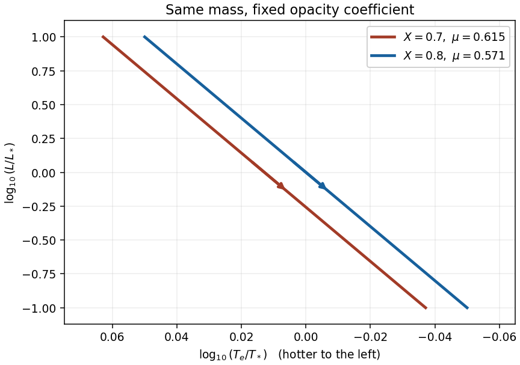

<h1 id="1/b/solution">Solution</h1>

↑ **Parent:** [B](../b.md)

For fully ionized [hydrogen](../../../../../../hydrogen.md) and [helium](../../../../../../helium.md) with mass fractions $X$ and $Y=1-X$, the inverse [mean molecular weight](../../../../../../mean-molecular-weight.md) counts nuclei plus free electrons:

$$
\mu^{-1}=2X+\frac34Y=\frac34+\frac54X.
$$

Thus $\mu_1=8/13$ for $X_1=0.7$, $\mu_2=4/7$ for $X_2=0.8$, and $\mu_1/\mu_2=14/13$. Keep the same $M,\kappa_0$ and dimensionless structure constants when comparing these toy sequences. From part (a),

$$
T_e\propto\mu^{1/2}M^{1/4}R^{1/8},\qquad L\propto\mu^2MR^{5/2}.
$$

Eliminating $R$ gives the [composition shift of a convective pre-main-sequence track](../../../../../../composition-shift-of-a-convective-pre-main-sequence-track.md):

$$
\boxed{L\propto\mu^{-8}M^{-4}T_e^{20}}.
$$

Consequently the tracks in a [Hertzsprung-Russell diagram](../../../../../../hertzsprung-russell-diagram.md) are almost vertical, with $d\log L/d\log T_e=20$. At equal [luminosity](../../../../../../luminosity.md), $T_{e,1}/T_{e,2}=(14/13)^{2/5}\simeq1.030$: **the $X=0.7$ track lies to the hotter, left-hand side of the $X=0.8$ track**. Since contraction decreases $R$, both $L$ and $T_e$ decrease in this particular [opacity](../../../../../../opacity.md) model. Both arrows therefore point downward and slightly rightward on the conventional hot-left diagram.

**[Figure 1](#1/b/image-convective-contraction-tracks-at-equal-mass-with-evolution-downward-and-rightward). Convective contraction tracks at equal mass, with evolution downward and rightward**.

The plotted reference scales are arbitrary; the horizontal separation is the predicted $\Delta\log_{10}T_e=(2/5)\log_{10}(14/13)$. They are schematic [Hayashi tracks](../../../../../../hayashi-track.md) under the specified atmospheric [opacity](../../../../../../opacity.md) law, rather than calibrated stellar models.

A [protostar](../../../../../../protostar.md) leaves this contraction sequence when its assumptions fail. Increasing [central stellar temperature](../../../../../../central-stellar-temperature.md) makes [stellar nuclear fusion](../../../../../../stellar-nuclear-fusion.md) significant: burning of [deuterium](../../../../../../deuterium.md) can temporarily slow contraction, and sustained [hydrogen burning](../../../../../../hydrogen-burning.md) brings the star to the [main sequence](../../../../../../main-sequence.md). In a sufficiently massive [pre-main-sequence star](../../../../../../pre-main-sequence-star.md), a [radiative core](../../../../../../radiative-core.md) develops, the interior ceases to share one adiabat, and evolution can proceed along a hotter [Henyey track](../../../../../../henyey-track.md). Changing atmospheric [opacity](../../../../../../opacity.md), partial [ionization](../../../../../../ionization.md), or substantial continuing [accretion](../../../../../../accretion.md) also changes the predicted path. For sufficiently low mass, [electron degeneracy pressure](../../../../../../electron-degeneracy-pressure.md) instead limits the increase of central temperature, as in part (c).

## ↑ Ancestors (11)

1. [B](../b.md)
2. [1](../../1.md)
3. [Paper 63](../../../paper-63-split.md)
4. [Iii](../../../split.md)
5. [2003](../../../../split.md)
6. [Past exam of the mathematics course of the University of Cambridge](../../../../../split.md)
7. [Mathematics course of the University of Cambridge](../../../../../../mathematics-course-of-the-university-of-cambridge.md)
8. [Course of the University of Cambridge](../../../../../../course-of-the-university-of-cambridge.md)
9. [University of Cambridge](../../../../../../university-of-cambridge-split.md)
10. [List of universities](../../../../../../list-of-universities.md)
11. [Codex Wiki](../../../../../../split.md)
