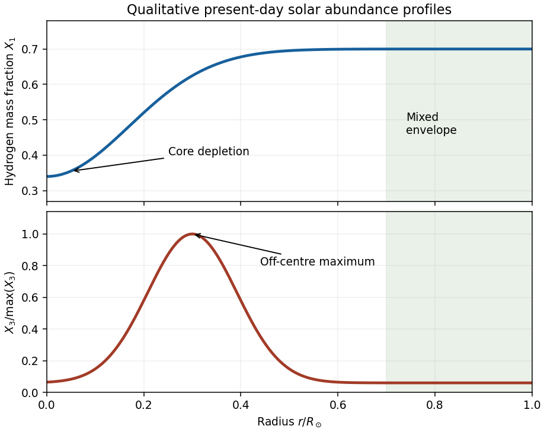

<h1 id="2/solution">Solution</h1>

↑ **Parent:** [2](../2.md)

The event rate counts unordered pairs of reacting [nuclei](../../../../../atomic-nucleus.md). For unlike species there are $n_in_j$ pairs per unit-volume normalization; for identical species there are approximately $n_i^2/2$ pairs, since counting ordered pairs counts each collision twice. The [Kronecker delta](../../../../../kronecker-delta.md) therefore supplies exactly the required divisor $1+\delta_{ij}$. It is the event rate, not the destruction rate of identical nuclei: one identical-pair reaction destroys two nuclei.

The [temperature](../../../../../temperature.md) dependence combines the high-energy tail of the [Maxwell-Boltzmann distribution](../../../../../maxwell-boltzmann-distribution.md) with [quantum tunnelling](../../../../../quantum-tunnelling.md) through the [Coulomb barrier](../../../../../coulomb-barrier.md). The principal exponential factor in the energy integral is $\exp[-E/(k_BT)-b/\sqrt E]$. Its stationary point, the [Gamow peak](../../../../../gamow-peak.md), has $E_0\propto T^{2/3}$ and exponent $\eta=3E_0/(k_BT)\propto T^{-1/3}$. Integrating around this peak gives a prefactor proportional to $T^{-2/3}$, or $\eta^2$, when the nuclear factor varies slowly. Thus the supplied [thermonuclear reaction rate](../../../../../thermonuclear-reaction-rate.md) is locally proportional to $\eta^2e^{-\eta}$. The slow weak interaction in the proton-proton reaction also makes its overall coefficient very small; its local thermal slope follows the supplied formula.

At fixed [number densities](../../../../../number-density.md), define the [local temperature exponent of a thermonuclear reaction](../../../../../local-temperature-exponent-of-a-thermonuclear-reaction.md) by a logarithmic derivative. Since $d\eta/d\log T=-\eta/3$,

$$
\frac{d\log\lambda_{ij}}{d\log T}=(2/\eta-1)(-\eta/3)=\frac{\eta-2}{3}.
$$

For proton-proton reactions, $A=1/2$ and $Z_1=1$. At $T_6=15$, $\eta_{11}=13.67$ and $\alpha=3.89$. For two [helium-3](../../../../../helium-3.md) nuclei, $A=3/2$ and $Z_3^2Z_3^2=16$, giving $\eta_{33}=49.68$ and $\beta=15.89$. For [helium-3](../../../../../helium-3.md) with [helium-4](../../../../../helium-4.md), $A=12/7$ and the same charge product gives $\eta_{34}=51.95$ and $\gamma=16.65$. Hence

$$
\boxed{\alpha\simeq4,\qquad\beta\simeq16,\qquad\gamma\simeq16,\quad\gamma>\beta}.
$$

These are local powers near the specified temperature, not constant exponents over an arbitrarily large range. The greater reduced nuclear mass in the $34$ reaction increases its tunnelling exponent and its thermal sensitivity.

For the [effective proton-proton reaction network](../../../../../effective-proton-proton-reaction-network.md), denote the event rates by

$$
R_{11}=\tfrac12\lambda_{11}n_1^2,\quad R_{21}=\lambda_{21}n_2n_1,\quad R_{33}=\tfrac12\lambda_{33}n_3^2,\quad R_{34}=\lambda_{34}n_3n_4,\quad R_{17}=\lambda_{17}n_1n_7.
$$

The short-lived beryllium intermediate can be eliminated, so production through $R_{34}$ feeds $n_7$, representing predominantly lithium-7. This rapid conversion is [electron capture](../../../../../electron-capture.md). Count the nuclei consumed and produced in each reaction: $11$ consumes two protons and makes one [deuterium](../../../../../deuterium.md); $21$ consumes a proton and a [deuterium](../../../../../deuterium.md) and makes one [helium-3](../../../../../helium-3.md); $33$ consumes two [helium-3](../../../../../helium-3.md) and makes one [helium-4](../../../../../helium-4.md) and two protons; $34$ consumes one of each helium isotope; $17$ consumes a proton and lithium-7 and makes two [helium-4](../../../../../helium-4.md). It follows that

$$
\begin{aligned}
\dot n_1&=-\lambda_{11}n_1^2-\lambda_{21}n_2n_1+\lambda_{33}n_3^2-\lambda_{17}n_1n_7,\\
\dot n_2&=\tfrac12\lambda_{11}n_1^2-\lambda_{21}n_2n_1,\\
\dot n_3&=\lambda_{21}n_2n_1-\lambda_{33}n_3^2-\lambda_{34}n_3n_4,\\
\dot n_4&=\tfrac12\lambda_{33}n_3^2-\lambda_{34}n_3n_4+2\lambda_{17}n_1n_7.
\end{aligned}
$$

For closure, $\dot n_7=\lambda_{34}n_3n_4-\lambda_{17}n_1n_7$. These nuclear terms conserve $n_1+2n_2+3n_3+4n_4+7n_7$, providing an independent stoichiometric check. They describe a fixed local volume; compression or mixing would add transport terms.

The roughly one-second destruction time of [deuterium](../../../../../deuterium.md) is negligible compared with the proton-burning and [helium-3](../../../../../helium-3.md) evolution times. Its abundance rapidly adjusts to the slowly evolving production rate. Set $\dot n_2\simeq0$, giving the [deuterium quasi-equilibrium in proton-proton burning](../../../../../deuterium-quasi-equilibrium-in-proton-proton-burning.md)

$$
\lambda_{21}n_2n_1\simeq\tfrac12\lambda_{11}n_1^2,\qquad n_2\simeq\frac{\lambda_{11}n_1}{2\lambda_{21}}.
$$

Substitution, without setting $\dot n_1=0$, gives

$$
\boxed{\begin{aligned}
\dot n_1&\simeq-\tfrac32\lambda_{11}n_1^2+\lambda_{33}n_3^2-\lambda_{17}n_1n_7,\\
\dot n_3&\simeq\tfrac12\lambda_{11}n_1^2-\lambda_{33}n_3^2-\lambda_{34}n_3n_4.
\end{aligned}}
$$

The [helium-3 relaxation time](../../../../../helium-3-relaxation-time.md) of about $6\times10^5$ years is likewise short compared with the central proton-burning time and the age of the [Sun](../../../../../sun.md). On this relaxation time the proton and [helium-4](../../../../../helium-4.md) abundances, and the background temperature, can be treated as fixed. Put $A=\lambda_{33}$, $B=\lambda_{34}n_4$, $C=\lambda_{11}n_1^2/2$. Then $\dot n_3=C-An_3^2-Bn_3$, and its nonnegative equilibrium is

$$
\boxed{n_{3e}=-\frac{\lambda_{34}n_4}{2\lambda_{33}}+\sqrt{\left(\frac{\lambda_{34}n_4}{2\lambda_{33}}\right)^2+\frac{\lambda_{11}n_1^2}{2\lambda_{33}}}}.
$$

The other root is negative and unphysical. Write $n_3=n_{3e}+x$ and subtract the equilibrium equation. Exactly, for a fixed background,

$$
\dot x=-(2\lambda_{33}n_{3e}+\lambda_{34}n_4)x-\lambda_{33}x^2.
$$

Dropping the quadratic displacement gives

$$
\boxed{\dot x=-x/\tau,\qquad\tau=(2\lambda_{33}n_{3e}+\lambda_{34}n_4)^{-1}}.
$$

Thus small displacements decay exponentially. A slowly moving equilibrium introduces an additional $-\dot n_{3e}$ term, negligible to leading order when $\tau$ is short compared with background evolution.

To estimate the [temperature for helium-3 freeze-out](../../../../../temperature-for-helium-3-freeze-out.md), use the cooler pp-I-dominated region and neglect $B$ compared with $2An_{3e}$. Then $n_{3e}\simeq n_1\sqrt{\lambda_{11}/(2\lambda_{33})}$ and $\tau^{-1}\simeq n_1\sqrt{2\lambda_{11}\lambda_{33}}$. With the local powers just obtained and fixed proton [number density](../../../../../number-density.md), $n_{3e}\propto T^{-6}$ and $\tau\propto T^{-10}$. Adopting $t_\odot\simeq4.6\times10^9\,\mathrm{yr}$ gives

$$
T\simeq15\times10^6\left(\frac{6\times10^5}{4.6\times10^9}\right)^{1/10}\!\mathrm K\simeq\boxed{6.1\times10^6\,\mathrm K}.
$$

This is an order-of-magnitude extrapolation of local exponents. Keeping the supplied exponential factors gives the [helium-3 freeze-out estimate with Gamow factors](../../../../../helium-3-freeze-out-estimate-with-gamow-factors.md)

$$
\frac{\tau(T)}{\tau(T_c)}=\left(\frac{T}{T_c}\right)^{2/3}\exp\!\left[\frac{\eta_{11,c}+\eta_{33,c}}2\left(\left(\frac{T_c}{T}\right)^{1/3}-1\right)\right],
$$

which yields about $6.8\times10^6\,\mathrm K$ with the same normalization and fixed-density approximation. Thus the robust estimate is several million kelvin. The supplied data do not fix the local density, composition or pp-II fraction away from the centre, so they cannot determine an exact transition temperature or radius. In particular, using $\tau\propto T^{-16}$ alone would omit the temperature dependence of the equilibrium [helium-3](../../../../../helium-3.md) abundance.

The [solar hydrogen and helium-3 abundance profiles](../../../../../solar-hydrogen-and-helium-3-abundance-profiles.md) follow from burning, finite equilibration time and [convection](../../../../../convection.md). Central [hydrogen](../../../../../hydrogen.md) has been consumed, so $X_1$ is lowest in the centre and increases toward its much less processed outer value. In the hot centre, rapid destruction keeps [helium-3](../../../../../helium-3.md) small. Moving outward initially raises its equilibrium abundance because $\lambda_{11}/\lambda_{33}$ rises strongly as temperature falls. Further out, equilibration is no longer reached within the solar age, and still farther out even production is slow. Hence $X_3$ has an off-centre maximum and then declines toward its small outer abundance. The outer convective envelope mixes each abundance toward a constant value.

**[Figure 2](#2/image-present-solar-hydrogen-depletion-and-the-off-centre-helium-3-abundance-maximum). Present solar hydrogen depletion and the off-centre helium-3 abundance maximum**.

The sketch shows these qualitative shapes; the helium-3 ordinate is scaled to its own maximum. The illustrated amplitudes, peak radius and envelope boundary are schematic, not a numerical solar-model solution.

## ↑ Ancestors (10)

1. [2](../2.md)
2. [Paper 63](../../paper-63-split.md)
3. [Iii](../../split.md)
4. [2003](../../../split.md)
5. [Past exam of the mathematics course of the University of Cambridge](../../../../split.md)
6. [Mathematics course of the University of Cambridge](../../../../../mathematics-course-of-the-university-of-cambridge.md)
7. [Course of the University of Cambridge](../../../../../course-of-the-university-of-cambridge.md)
8. [University of Cambridge](../../../../../university-of-cambridge-split.md)
9. [List of universities](../../../../../list-of-universities.md)
10. [Codex Wiki](../../../../../split.md)
