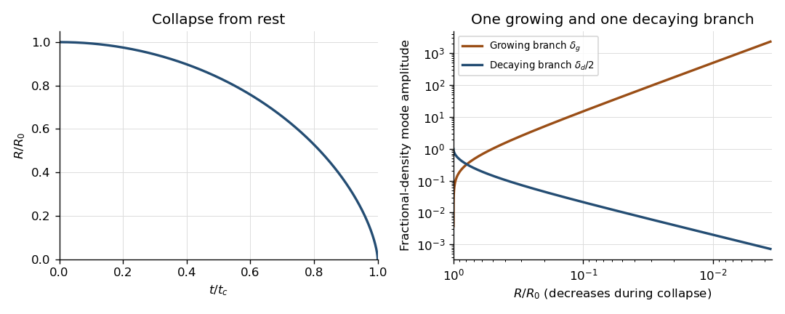

<h1 id="1/solution">Solution</h1>

↑ **Parent:** [1](../1.md)

Write $H=\dot R/R$. A fluid element in the [homologous spherical flow](../../../../../homologous-spherical-flow.md) obeys $\dot{\mathbf r}=H\mathbf r$, so $\mathbf r/R$ remains constant. Also $\nabla\cdot\mathbf u_0=3H$. Along every element, the [continuity equation](../../../../../continuity-equation.md) therefore gives $D\rho_0/Dt=-3H\rho_0$. Every element starts with the same [mass density](../../../../../density.md), and hence has the same [mass density](../../../../../density.md) at subsequent times:

$$
\boxed{\rho_0(t)=\rho_{00}\left(\frac{R_0}{R(t)}\right)^3.}
$$

This proves preservation of uniformity, rather than assuming it when conserving the total mass.

By the [shell theorem](../../../../../spherical-shell-theorem.md), only the mass interior to radius $r$ contributes to its [gravitational acceleration](../../../../../gravitational-acceleration.md). That mass is $4\pi\rho_0r^3/3$. The same result follows directly from the [Poisson equation for Newtonian gravity](../../../../../poisson-equation-for-newtonian-gravity.md): spherical symmetry gives $(r^2\Phi_r)_r=4\pi G\rho_0r^2$, and regularity at the centre sets the integration constant to zero. Hence $\Phi_r=4\pi G\rho_0r/3$ and

$$
\mathbf g=-\frac{4\pi G\rho_0}{3}\mathbf r.
$$

The [material derivative](../../../../../material-derivative.md) of the background [velocity](../../../../../velocity.md) is $(\dot H+H^2)\mathbf r=(\ddot R/R)\mathbf r$. There is no [pressure](../../../../../pressure.md) force, and the [momentum](../../../../../momentum.md) equation consequently reduces to

$$
\boxed{R^2\ddot R=-K,\qquad K=\frac{4\pi G}{3}\rho_{00}R_0^3=GM.}
$$

Multiplication by $\dot R$ and integration, using collapse from rest, gives

$$
\frac12\dot R^2=K\left(\frac1R-\frac1{R_0}\right).
$$

Choose the negative square root for contraction. Put $C^2=2K/R_0$ and $R=R_0\cos^2(\phi/2)$. For $0<\phi<\pi$, the energy integral then gives $\dot R=-C\tan(\phi/2)$, while $dR/d\phi=-R_0\sin\phi/2$. Their ratio is

$$
\frac{dt}{d\phi}=\frac{R_0}{2C}(1+\cos\phi)=\frac RC.
$$

Integrating from the initial turning point proves the [cycloid](../../../../../cycloid.md) parametrization of [pressureless homologous spherical collapse](../../../../../pressureless-homologous-spherical-collapse.md):

$$
\boxed{R=\frac{R_0}{2}(1+\cos\phi),\qquad
Ct=\frac{R_0}{2}(\phi+\sin\phi),\qquad
C^2=\frac{8\pi G\rho_{00}R_0^2}{3}.}
$$

It covers the entire contracting branch, with complete collapse at $\phi=\pi$ and $t_c=\sqrt{3\pi/(32G\rho_{00})}$. At $R=0$ the uniform dust configuration is singular, so the smooth calculation is restricted to $t<t_c$.

Each [Fourier mode](../../../../../fourier-mode.md) among the [comoving perturbations of a homologously collapsing cloud](../../../../../comoving-perturbations-of-a-homologously-collapsing-cloud.md) has its phase fixed on each fluid element. In fact, for $\mathbf k=\mathbf q/R$,

$$
\left(\partial_t+\mathbf u_0\cdot\nabla\right)e^{i\mathbf k\cdot\mathbf r}
=i(\dot{\mathbf k}+H\mathbf k)\cdot\mathbf r\,e^{i\mathbf k\cdot\mathbf r}=0.
$$

Its physical wavelength contracts in proportion to $R$, while its wavelength in the [comoving coordinate](../../../../../comoving-coordinate.md) $\mathbf r/R$ stays fixed. This is the physical reason to use a time-dependent [wavenumber](../../../../../wavenumber.md); holding the physical [wavenumber](../../../../../wavenumber.md) fixed would not follow the contracting pattern. Boundary effects are being excluded in this bulk [Fourier mode](../../../../../fourier-mode.md) calculation.

Let $\rho' =\rho_1(t)e^{i\mathbf k\cdot\mathbf r}$ and let the perturbed [velocity](../../../../../velocity.md) and [Newtonian gravitational potential](../../../../../newtonian-gravitational-potential.md) have amplitudes $\mathbf u_1(t)$ and $\Phi_1(t)$. Linearizing the [continuity equation](../../../../../continuity-equation.md), the uniform background eliminates $\mathbf u_1\cdot\nabla\rho_0$. The advected phase eliminates its own time derivative, leaving

$$
\boxed{\dot\rho_1+3\frac{\dot R}{R}\rho_1+
\frac{i\rho_0}{R}\mathbf q\cdot\mathbf u_1=0.}
$$

For the [density contrast](../../../../../density-contrast.md) $\delta=\rho_1/\rho_0$, use $\dot\rho_0=-3H\rho_0$ to obtain $\dot\delta=-i\mathbf k\cdot\mathbf u_1$. The linear [momentum](../../../../../momentum.md) equation and [Poisson equation for Newtonian gravity](../../../../../poisson-equation-for-newtonian-gravity.md) are

$$
\dot{\mathbf u}_1+H\mathbf u_1=-i\mathbf k\Phi_1,
\qquad -k^2\Phi_1=4\pi G\rho_0\delta.
$$

Differentiating the [density contrast](../../../../../density-contrast.md) equation must include $\dot{\mathbf k}=-H\mathbf k$:

$$
\ddot\delta=-i(\dot{\mathbf k}\cdot\mathbf u_1+\mathbf k\cdot\dot{\mathbf u}_1)
=2iH\mathbf k\cdot\mathbf u_1-k^2\Phi_1
=-2H\dot\delta+4\pi G\rho_0\delta.
$$

Thus the compressive [Fourier mode](../../../../../fourier-mode.md) with $k\ne0$ satisfies

$$
\boxed{\ddot\delta+2\frac{\dot R}{R}\dot\delta-4\pi G\rho_0\delta=0.}
$$

The pressureless approximation removes the usual acoustic restoring term of [Jeans instability](../../../../../jeans-instability.md). A transverse [velocity](../../../../../velocity.md) perturbation instead obeys $\dot{\mathbf u}_{1\perp}+H\mathbf u_{1\perp}=0$ and does not drive this [density contrast](../../../../../density-contrast.md).

Since $d/dt=(C/R)d/d\phi$, the [density contrast](../../../../../density-contrast.md) equation becomes

$$
\delta_{\phi\phi}-\tan(\phi/2)\delta_\phi
-\frac{3}{1+\cos\phi}\delta=0.
$$

For a direct verification, put $s=\tan(\phi/2)$. As $d/d\phi=(1+s^2)d/(2ds)$, the first-derivative terms cancel, reducing the equation to

$$
\delta_{ss}-\frac{6}{1+s^2}\delta=0.
$$

The function $\delta_g=s(1+s^2)/2$ has second derivative $3s$ and satisfies this equation. Transforming back gives the required growing branch:

$$
\boxed{\delta_g=\frac{\sin\phi}{(1+\cos\phi)^2}.}
$$

To establish what the other solution does, use [reduction of order](../../../../../reduction-of-order.md), not just the growth of this example. The coefficient of $\delta_\phi$ is $d\log R/d\phi$, so an independent solution is proportional to $\delta_g\int d\phi/(R\delta_g^2)$. Choose the integration endpoint at complete collapse to select the decaying branch:

$$
\begin{aligned}
\delta_d&=\delta_g\int_\phi^\pi\frac{(1+\cos s)^3}{\sin^2s}\,ds\\
&=\delta_g\left[4\cot(\phi/2)+\sin\phi-3(\pi-\phi)\right].
\end{aligned}
$$

For example, evaluating the integral with $a=\tan(s/2)$ gives integrand $4/[a^2(1+a^2)^2]$ and antiderivative $-4/a-6\arctan a-2a/(1+a^2)$. Its endpoint value gives the displayed expression. Its [Wronskian](../../../../../wronskian.md) with $\delta_g$ is $-(1+\cos\phi)^{-1}$, so the two solutions are independent on $0<\phi<\pi$.

For $\epsilon=\pi-\phi\to0$, $R\sim R_0\epsilon^2/4$, $\delta_g\sim4\epsilon^{-3}$ and the integral in $\delta_d$ is $\epsilon^5/40+O(\epsilon^7)$. Consequently the two [density modes of a collapsing pressureless sphere](../../../../../density-modes-of-a-collapsing-pressureless-sphere.md) have

$$
\boxed{\delta_g\propto R^{-3/2},\qquad \delta_d\propto R.}
$$

Equivalently, with $\tau=t_c-t$, the local powers are $\tau^{-1}$ and $\tau^{2/3}$. There is **one independent growing branch**: every solution is $A\delta_g+B\delta_d$, and only the branch with $A=0$ decays at collapse. The uniqueness is up to normalization and addition of the decaying solution; it does not mean that only one literal function can grow. A fixed nonzero initial perturbation will eventually violate $|\delta|\ll1$, so the divergent linear result is not a nonlinear solution through collapse.

**[Figure 1](#1/image-homogeneous-collapse-from-rest-and-the-growing-and-decaying-fractional-density-modes). Homogeneous collapse from rest and the growing and decaying fractional-density modes**.

## ↑ Ancestors (10)

1. [1](../1.md)
2. [Paper 64](../../paper-64-split.md)
3. [Iii](../../split.md)
4. [2003](../../../split.md)
5. [Past exam of the mathematics course of the University of Cambridge](../../../../split.md)
6. [Mathematics course of the University of Cambridge](../../../../../mathematics-course-of-the-university-of-cambridge.md)
7. [Course of the University of Cambridge](../../../../../course-of-the-university-of-cambridge.md)
8. [University of Cambridge](../../../../../university-of-cambridge-split.md)
9. [List of universities](../../../../../list-of-universities.md)
10. [Codex Wiki](../../../../../split.md)
