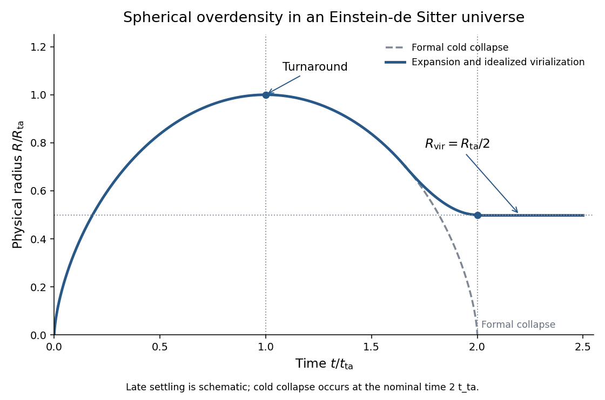

<h1 id="4/b/solution">Solution</h1>

↑ **Parent:** [B](../b.md)

An initially overdense spherical region first expands approximately with the background, but its self-gravity slows it more strongly. It reaches [turnaround of spherical collapse](../../../../../../turnaround-of-spherical-collapse.md) at its maximum radius, recollapses, and forms a bound approximately stationary object when infall energy is redistributed into random motions. An exactly cold, uniform pressureless solution would instead collapse to zero radius; virialization replaces that formal endpoint.

For fixed mass $M$ and no [cosmological constant](../../../../../../cosmological-constant.md), integrate $\ddot R=-GM/R^2$ for a bound shell. Its specific energy can be written $\varepsilon=-GM/(2A)$, and the cycloidal parametrization is

$$
R=A(1-\cos\theta),\qquad t=B(\theta-\sin\theta),\qquad A^3=GMB^2.
$$

Substitution in $\dot R^2/2-GM/R=\varepsilon$ verifies this parametrization. At $\theta=\pi$, $R_{\rm ta}=2A$ and $t_{\rm ta}=\pi B$; formal collapse occurs at $\theta=2\pi$, so $t_{\rm coll}=2t_{\rm ta}$.

**[Figure 1](#4/b/image-expansion-turnaround-and-idealized-virialization-of-a-spherical-overdensity-compared-with-formal-cold-collapse). Expansion, turnaround and idealized virialization of a spherical overdensity, compared with formal cold collapse**.

For a uniform sphere, $W=-3GM^2/(5R)$. At turnaround the coherent kinetic energy vanishes, so $E=W_{\rm ta}$. At the final equilibrium, the [virial theorem](../../../../../../virial-theorem.md) gives $2T_{\rm vir}+W_{\rm vir}=0$, whence $E=W_{\rm vir}/2$. [Conservation of energy](../../../../../../conservation-of-energy.md) therefore implies

$$
\boxed{R_{\rm vir}=\frac{R_{\rm ta}}2,\qquad\rho_{\rm vir}=8\rho_{\rm ta}.}
$$

This [virial radius from turnaround energy](../../../../../../virial-radius-from-turnaround-energy.md) assumes conserved mass and energy, negligible surface-pressure/tidal terms, and the same gravitational profile coefficient. The sketch's settling segment is qualitative; the cycloid is the exact pre-virialization cold model, not a dissipative relaxation solution.

To compare with the cosmological density, use $\bar\rho(t)=1/(6\pi Gt^2)$ in an [Einstein-de Sitter universe](../../../../../../einstein-de-sitter-universe.md). The turnaround sphere has

$$
\rho_{\rm ta}=\frac{3M}{4\pi(2A)^3}=\frac3{32\pi GB^2},
\qquad
\frac{\rho_{\rm ta}}{\bar\rho(t_{\rm ta})}=\frac{9\pi^2}{16}.
$$

Since the background density falls by four between $t_{\rm ta}$ and $t_{\rm coll}$, the [Einstein-de Sitter virial overdensity](../../../../../../einstein-de-sitter-virial-overdensity.md) is

$$
\boxed{\frac{\rho_{\rm vir}}{\bar\rho(t_{\rm coll})}=32\frac{9\pi^2}{16}=18\pi^2.}
$$

Finally $\bar\rho(z)=\rho_0(1+z)^3$, so assigning the nominal collapse redshift gives

$$
\boxed{\rho_{\rm vir}(z_{\rm coll})=18\pi^2\rho_0(1+z_{\rm coll})^3.}
$$

The density ratio eight compares the same object's physical densities at turnaround and virialization; $18\pi^2$ compares its final density with the background at the later collapse epoch.

## ↑ Ancestors (11)

1. [B](../b.md)
2. [4](../../4.md)
3. [Paper 66](../../../paper-66-split.md)
4. [Iii](../../../split.md)
5. [2003](../../../../split.md)
6. [Past exam of the mathematics course of the University of Cambridge](../../../../../split.md)
7. [Mathematics course of the University of Cambridge](../../../../../../mathematics-course-of-the-university-of-cambridge.md)
8. [Course of the University of Cambridge](../../../../../../course-of-the-university-of-cambridge.md)
9. [University of Cambridge](../../../../../../university-of-cambridge-split.md)
10. [List of universities](../../../../../../list-of-universities.md)
11. [Codex Wiki](../../../../../../split.md)
