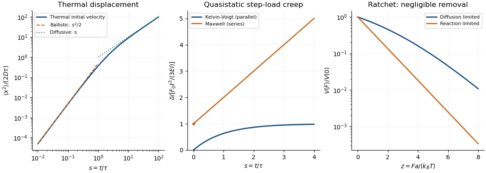

<h1 id="6/b/solution">Solution</h1>

↑ **Parent:** [B](../b.md)

Let $y(x,t)$ be downward deflection, $0\le x\le\ell$, with $y(0,t)=y_x(0,t)=0$. Take a uniform circular [elastic beam](../../../../../../elastic-beam.md), $I=\pi r^4/4$, small slopes, and linear material response. Write $E$ for its axial elastic modulus and $\eta_s$ for its axial viscous coefficient; these are material quantities, not the solvent viscosity. The extension of the printed parallel model has moment law

$$
M=EIy_{xx}+\eta_sIy_{xxt},\qquad \tau=\eta_s/E.
$$

With [mass](../../../../../../mass.md) per unit length $\rho A$, transverse momentum balance in the interior is

$$
\boxed{\rho Ay_{tt}+EIy_{xxxx}+\eta_sIy_{xxxxt}=0.}
$$

The free-tip conditions are $M(\ell,t)=0$ and $M_x(\ell,t)=-F(t)$ with this downward-positive convention; the clamp supplies the remaining reactions.

Neglecting [inertia](../../../../../../inertia.md) gives $M=F(t)(\ell-x)$. Twice integrating the moment law with the clamp conditions gives

$$
y+\tau y_t=\frac{F(t)x^2(3\ell-x)}{6EI},\qquad \delta+\tau\dot\delta=\frac{F(t)\ell^3}{3EI},\quad\delta=y(\ell,t).
$$

For a step $F_0$ and an initially relaxed [elastic beam](../../../../../../elastic-beam.md), [Kelvin-Voigt cantilever creep](../../../../../../kelvin-voigt-cantilever-creep.md) is

$$
\boxed{\delta(t)=\frac{F_0\ell^3}{3EI}(1-e^{-t/\tau}),\qquad t\ge0.}
$$

Thus the equivalent tip [spring](../../../../../../spring.md) and [dashpot](../../../../../../dashpot.md) are $k_{\rm eff}=3EI/\ell^3$ and $\mu_{\rm eff}=3\eta_sI/\ell^3$.

If the intended material is instead a true series [Maxwell fluid](../../../../../../linear-maxwell-fluid.md), its moment satisfies $\dot M+M/\tau=EIy_{xxt}$. Together with momentum balance $\rho Ay_{tt}+M_{xx}=0$, this gives the full interior equation $\rho A(y_{ttt}+y_{tt}/\tau)+EIy_{xxxxt}=0$, with the moment law retained for boundary and initial conditions. In the quasistatic limit,

$$
\dot\delta=\frac{\ell^3}{3EI}\left(\dot F+\frac F\tau\right),\qquad \boxed{\delta(t)=\frac{F_0\ell^3}{3EI}(1+t/\tau)\quad(t>0).}
$$

This [Maxwell cantilever creep](../../../../../../maxwell-cantilever-creep.md) has an initial elastic jump followed by linear creep, not a finite plateau. The jump is the ideal massless step-load limit; [inertia](../../../../../../inertia.md) resolves the transient. A two-element series model has no nonzero relaxed modulus, so “Maxwell solid” is not an additional specification of a solid with finite long-time stiffness. Such a solid would need an additional [spring](../../../../../../spring.md). The small-deflection approximation requires $\delta\ll\ell$ and eventually fails for unbounded creep.

**[Figure 1](#6/b/image-thermal-displacement-crossover-parallel-and-series-elastic-beam-creep-and-diffusion-limited-versus-reaction-limited-ratchet-slowdown). Thermal displacement crossover, parallel and series elastic beam creep, and diffusion-limited versus reaction-limited ratchet slowdown**.

## ↑ Ancestors (11)

1. [B](../b.md)
2. [6](../../6.md)
3. [Paper 71](../../../paper-71-split.md)
4. [Iii](../../../split.md)
5. [2003](../../../../split.md)
6. [Past exam of the mathematics course of the University of Cambridge](../../../../../split.md)
7. [Mathematics course of the University of Cambridge](../../../../../../mathematics-course-of-the-university-of-cambridge.md)
8. [Course of the University of Cambridge](../../../../../../course-of-the-university-of-cambridge.md)
9. [University of Cambridge](../../../../../../university-of-cambridge-split.md)
10. [List of universities](../../../../../../list-of-universities.md)
11. [Codex Wiki](../../../../../../split.md)
