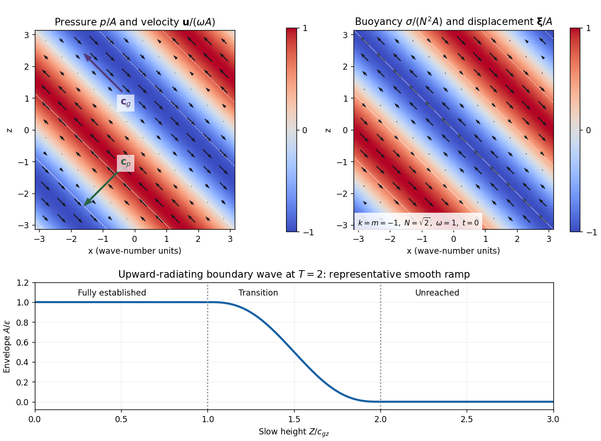

<h1 id="1/solution">Solution</h1>

↑ **Parent:** [1](../1.md)

Use $p$ for disturbance pressure divided by the constant inertial density. The ideal, nonrotating [Linearized Boussinesq equations](../../../../../linearized-boussinesq-equations.md) are

$$
\mathbf u_t=-\nabla p+\sigma\widehat{\mathbf z},\qquad
\sigma_t+N^2(z)w=0,\qquad \nabla\cdot\mathbf u=0.
$$

Here $N^2>0$ is a prescribed time-independent [buoyancy frequency](../../../../../buoyancy-frequency.md) squared. Taking the scalar product of momentum with velocity gives $\partial_t(|\mathbf u|^2/2)=-\nabla\cdot(p\mathbf u)+\sigma w$, using [incompressibility](../../../../../incompressible-flow.md). Multiplying the buoyancy equation by $\sigma/N^2(z)$ gives $\partial_t[\sigma^2/(2N^2)]=-\sigma w$. No spatial derivative of $N$ is needed in this cancellation. Thus

$$
\boxed{E_t+\nabla\cdot(p\mathbf u)=0,\qquad E=\frac12|\mathbf u|^2+\frac{\sigma^2}{2N^2}.}
$$

This is positive disturbance energy per unit inertial density; its flux is pressure work.

For constant $N$, write a [plane internal gravity wave](../../../../../plane-internal-gravity-wave.md) with wave vector $\mathbf K=(\mathbf k_h,m)$ and phase $\theta=\mathbf k_h\cdot\mathbf x_h+mz-\omega t$. Let $k_h=|\mathbf k_h|>0$ and $K^2=k_h^2+m^2$. In complex amplitudes, [incompressibility](../../../../../incompressible-flow.md) and horizontal momentum give

$$
\mathbf k_h\cdot\widehat{\mathbf u}_h+m\widehat w=0,\qquad
\widehat{\mathbf u}_h=\frac{\mathbf k_h}{\omega}\widehat p,
\qquad \widehat\sigma=-\frac{iN^2}{\omega}\widehat w.
$$

Consequently $\widehat p=-\omega m\widehat w/k_h^2$. Substitution into vertical momentum, $-i\omega\widehat w=-im\widehat p+\widehat\sigma$, yields

$$
\boxed{\omega^2=\frac{N^2k_h^2}{K^2}.}
$$

The same [dispersion relation](../../../../../dispersion-relation.md) follows directly from the displacement equation: its two terms become $K^2\omega^2\widehat\zeta$ and $-N^2k_h^2\widehat\zeta$. The positive-frequency branch is $\omega=Nk_h/K$; the other branch is its sign reversal.

Choose real vertical-displacement amplitude $A$. The [internal-wave polarization](../../../../../internal-wave-polarization.md) can be written

$$
\boldsymbol\xi=A\mathbf e\cos\theta,\quad
\mathbf u=\omega A\mathbf e\sin\theta,\quad
\sigma=-N^2A\cos\theta,\quad
p=-\frac{\omega^2m}{k_h^2}A\sin\theta,
\qquad \mathbf e=\left(-\frac{m\mathbf k_h}{k_h^2},1\right).
$$

Velocity and displacement lie along the phase planes, perpendicular to $\mathbf K$, and are a quarter cycle out of phase. [Buoyancy](../../../../../buoyancy.md) is opposite in sign to vertical displacement. In the requested two-dimensional sketch take $k<0$, $m<0$ and $\omega>0$: the [phase velocity](../../../../../phase-velocity.md) $\omega\mathbf K/K^2$ points down and left. Then $\mathbf e=(-m/k,1)$ points up and left, and positive $p$ accompanies positive $w$ and negative $u$. Negative-pressure bands have the opposite velocity. Multiplication by pressure therefore transports energy up and left in both signs of band.

Differentiating the positive-frequency [dispersion relation](../../../../../dispersion-relation.md) gives the [group velocity](../../../../../group-velocity.md)

$$
\boxed{\mathbf c_{gh}=\frac{Nm^2\mathbf k_h}{k_hK^3},\qquad c_{gz}=-\frac{Nk_hm}{K^3}=-\frac{\omega m}{K^2}.}
$$

In particular $\mathbf K\cdot\mathbf c_g=0$. Since $|\mathbf e|^2=K^2/k_h^2$, the wavelength averages are

$$
\overline E=\frac{N^2A^2}{2},\qquad
\overline{p\mathbf u}=-\frac{\omega^3mA^2}{2k_h^2}\mathbf e.
$$

Using $N^2=\omega^2K^2/k_h^2$ in the last expression proves

$$
\boxed{\overline{p\mathbf u}=\mathbf c_g\,\overline E.}
$$

For $k,m<0$ the [group velocity](../../../../../group-velocity.md) points up and left, perpendicular to the down-left [phase velocity](../../../../../phase-velocity.md). The pressure sign pattern, rather than the direction of moving crests, determines the energy-flux direction shown below.

For the moving-boundary problem, first take the fluid to occupy $z>0$ with the boundary near $z=0$. An outgoing [boundary-forced internal gravity wave](../../../../../boundary-forced-internal-gravity-wave.md) must have $c_{gz}>0$. With the specified $k>0$ and $\omega>0$, the [radiation condition](../../../../../radiation-condition.md) therefore selects

$$
\boxed{m=-k\sqrt{N^2/\omega^2-1}.}
$$

If instead the fluid occupies $z<0$, radiation requires $c_{gz}<0$ and the positive root for $m$. The fluid half-space is needed to select a unique sign; the following formulas use the upper half-space.

For [slowly modulated internal-wave boundary forcing](../../../../../slowly-modulated-internal-wave-boundary-forcing.md), put $\zeta=A(T,Z)e^{i\theta}$, $T=\mu t$, $Z=\mu z$. Acting on $A$ by $\partial_t\mapsto-i\omega+\mu\partial_T$ and $\partial_z\mapsto im+\mu\partial_Z$, the displacement equation has leading term $(K^2\omega^2-N^2k^2)A$. Its order-$\mu$ term is

$$
2i\mu\omega K^2\left(A_T-\frac{m\omega}{K^2}A_Z\right)
=2i\mu\omega K^2(A_T+c_{gz}A_Z).
$$

Thus characteristics carry the boundary amplitude into the fluid:

$$
\boxed{A(T,Z)=a(T-Z/c_{gz}),\qquad \zeta=A(T,Z)e^{i(kx+mz-\omega t)}+O(\mu).}
$$

Real parts are understood. To the same leading order,

$$
\widehat{\boldsymbol\xi}=A(-m/k,0,1),\quad
\widehat{\mathbf u}=-i\omega A(-m/k,0,1),\quad
\widehat\sigma=-N^2A,\quad
\widehat p=i\frac{\omega^2m}{k^2}A.
$$

Slow-envelope corrections to these polarization formulas are order $\mu$. At $T=2$, the amplitude is $\epsilon$ for $0\le Z\le c_{gz}$, falls smoothly across $c_{gz}<Z<2c_{gz}$, and is zero beyond $2c_{gz}$. This translating ramp is also shown in the figure.

**[Figure 1](#1/image-internal-wave-pressure-and-velocity-buoyancy-and-displacement-and-the-causal-amplitude-ramp-at-slow-time-t-equals-two). Internal-wave pressure and velocity, buoyancy and displacement, and the causal amplitude ramp at slow time T equals two**.

The mean boundary work per unit horizontal area is $\overline W=\rho_{00}\overline{p(0)w(0)}$ at quadratic disturbance order. The small boundary displacement permits evaluation at the unperturbed plane. From the flux calculation,

$$
\overline W=\rho_{00}c_{gz}\frac{N^2a(T)^2}{2}.
$$

The finite causal wave train has energy integral

$$
I_E(t)=\int_0^\infty\overline E\,dz
=\frac{N^2c_{gz}}{2\mu}\int_0^T a(s)^2\,ds.
$$

Differentiation, or integration of the local energy law with zero flux beyond the front, proves

$$
\boxed{\frac{dI_E}{dt}=\frac{\overline W}{\rho_{00}}.}
$$

Finally, distinguish the oscillatory velocity from the second-order [Eulerian mean](../../../../../eulerian-mean-flow.md) $\overline u$. The displacement polarizations give

$$
\overline{\xi_xu+\zeta_xw}
=-\frac{\omega A^2}{2}\left(\frac{m^2}{k}+k\right)
=-\frac{k}{\omega}\overline E.
$$

The supplied mean-flow relation therefore yields $\overline u_t=(k/\omega)\overline E_t+O(\mu^2)$ at quadratic wave order. Equivalently, the horizontal momentum flux is $\overline{uw}=(k/\omega)c_{gz}\overline E$, and envelope-energy transport gives the same acceleration through $\overline u_t=-\partial_z\overline{uw}$.

In the frame moving horizontally at $c=\omega/k$, the boundary pattern is stationary and the initial mean current is $-c$. Subtract that background's kinetic energy before integrating over the infinite half-space. The [internal-wave work in a phase-speed frame](../../../../../internal-wave-work-in-a-phase-speed-frame.md) is then

$$
\Delta K_{\rm mean}^{(c)}=\frac{\rho_{00}}2\int_0^\infty[(\overline u-c)^2-c^2]\,dz
=-\rho_{00}c\int_0^\infty\overline u\,dz+O(\epsilon^4).
$$

Its rate of change is

$$
\boxed{\frac{d\Delta K_{\rm mean}^{(c)}}{dt}
=-\rho_{00}c\frac{k}{\omega}\frac{dI_E}{dt}
=-\overline W.}
$$

The mean-current cross term supplies the quadratic energy loss in this moving frame; the lab-frame mean kinetic energy alone is fourth order in wave amplitude. The equality is at the leading slow and quadratic orders used throughout the forcing calculation.

## ↑ Ancestors (10)

1. [1](../1.md)
2. [Paper 72](../../paper-72-split.md)
3. [Iii](../../split.md)
4. [2003](../../../split.md)
5. [Past exam of the mathematics course of the University of Cambridge](../../../../split.md)
6. [Mathematics course of the University of Cambridge](../../../../../mathematics-course-of-the-university-of-cambridge.md)
7. [Course of the University of Cambridge](../../../../../course-of-the-university-of-cambridge.md)
8. [University of Cambridge](../../../../../university-of-cambridge-split.md)
9. [List of universities](../../../../../list-of-universities.md)
10. [Codex Wiki](../../../../../split.md)
