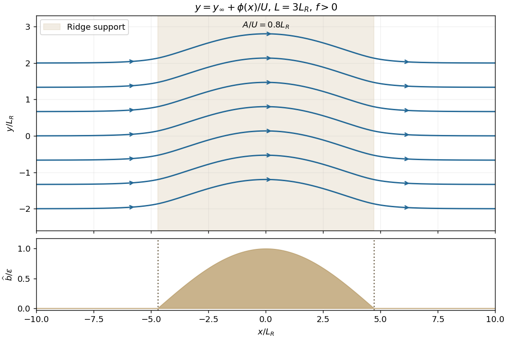

<h1 id="3/solution">Solution</h1>

↑ **Parent:** [3](../3.md)

With the free-surface elevation denoted by $\zeta$, the rotating [shallow water equations](../../../../../shallow-water-equations.md) over a fixed bottom are

$$
\frac{D_Hu}{Dt}-fv=-g\zeta_x,\qquad
\frac{D_Hv}{Dt}+fu=-g\zeta_y,\qquad
h_t+\partial_x(hu)+\partial_y(hv)=0,
\quad h=h_{00}+\zeta-b.
$$

The momentum gradient is that of the surface elevation, not depth alone; bottom slope enters through the depth and continuity equation. Taking $\partial_x$ of meridional momentum minus $\partial_y$ of zonal momentum gives the [vorticity equation](../../../../../vorticity-equation.md)

$$
\frac{D_H\omega_r}{Dt}+(f+\omega_r)\nabla_H\cdot\mathbf u_H=0,
\qquad \omega_r=v_x-u_y.
$$

The terms quadratic in velocity gradients combine into $\omega_r\nabla_H\cdot\mathbf u_H$; the constant [Coriolis parameter](../../../../../coriolis-parameter.md) contributes $f\nabla_H\cdot\mathbf u_H$. Continuity gives $D_Hh/Dt=-h\nabla_H\cdot\mathbf u_H$. Dividing the two equations proves the exact [shallow-water potential vorticity](../../../../../shallow-water-potential-vorticity.md) invariant

$$
\boxed{\frac{D_H}{Dt}\left(\frac{f+\omega_r}{h}\right)=0.}
$$

For the [quasi-geostrophic approximation](../../../../../quasi-geostrophic-approximation.md), let $U_s$ and $\ell$ be representative velocity and horizontal length scales. Require the [Rossby number](../../../../../rossby-number.md) $\mathrm{Ro}=U_s/(|f|\ell)\ll1$, a shallow layer, and slow evolution on time $\ell/U_s$. Put $L_R=\sqrt{gh_{00}}/|f|$ and assume $\mathrm{Bu}=(L_R/\ell)^2$ is order one. Leading momentum then gives [geostrophic balance](../../../../../geostrophic-balance.md), and a [quasi-geostrophic streamfunction](../../../../../quasi-geostrophic-streamfunction.md) can be chosen as

$$
\psi=\frac g f\zeta,\qquad u_g=-\psi_y,\quad v_g=\psi_x.
$$

Its surface-height scale satisfies $|\zeta|/h_{00}=O(\mathrm{Ro}/\mathrm{Bu})\ll1$. Take the bottom-height ratio of the same small order, with gentle slopes, so $\eta=\zeta-b$ obeys $|\eta|/h_{00}\ll1$. Relative vorticity is order $\mathrm{Ro}f$, and expanding the exact [potential vorticity](../../../../../potential-vorticity.md) gives

$$
\frac{f+\omega_r}{h}
=\frac f{h_{00}}+\frac1{h_{00}}\left(\nabla_H^2\psi-\frac\psi{L_R^2}+\frac f{h_{00}}b\right)+\text{higher orders}.
$$

Because the leading geostrophic velocity is horizontally nondivergent, ageostrophic advection of the anomaly is one order smaller. At the first evolving order the [shallow-water quasi-geostrophic potential vorticity](../../../../../shallow-water-quasi-geostrophic-potential-vorticity.md) equation is

$$
\boxed{Q_t+J(\psi,Q)=0,\qquad
Q=\nabla_H^2\psi-L_R^{-2}\psi+\frac f{h_{00}}b,\qquad
J(\psi,Q)=\psi_xQ_y-\psi_yQ_x.}
$$

The constant reference $f/h_{00}$ has zero gradient and drops out. These assumptions also require all topographically induced velocities to retain a small [Rossby number](../../../../../rossby-number.md); the small bottom-height condition alone is not a full justification of quasi-geostrophic balance.

The uniform eastward current has $\psi_0=-Uy$ up to an additive constant, so $\zeta_0=-(fU/g)y$. With $b_0=-(fU/g)y$, surface and bottom slopes are equal and $h=h_{00}$. Its relative vorticity vanishes and $Q_0=0$. This sloping background is used locally where its surface and bottom departures remain within the small-height regime.

Add the compact ridge and set $\psi=-Uy+\phi(x)$. Then $u=U$, $v=\phi'(x)$, and $Q$ depends only on $x$. The steady equation becomes $UQ_x=0$. Uniform incoming [potential vorticity](../../../../../potential-vorticity.md) fixes that constant to zero, giving the [cosine-ridge shallow-water geostrophic response](../../../../../cosine-ridge-shallow-water-geostrophic-response.md)

$$
\boxed{\phi''-L_R^{-2}\phi=-\frac f{h_{00}}\widehat b(x),\qquad\phi\to0\text{ as }|x|\to\infty.}
$$

Let $a=\pi L/2$, $\lambda=L_R^{-1}$ and

$$
A=\frac{f\epsilon/h_{00}}{L^{-2}+L_R^{-2}}.
$$

The forcing is even, so the decaying response is even. A cosine particular solution inside the ridge leaves an even homogeneous term; outside, retain only the decaying exponential. Since the forcing is bounded and contains no delta function, both $\phi$ and $\phi'$ are continuous at the edges. Write $\phi=A\cos(x/L)+D\cosh(x/L_R)$ inside and $\phi=B e^{-(|x|-a)/L_R}$ outside. Matching at $x=a$ gives

$$
B=D\cosh(a/L_R),\qquad
-A/L+(D/L_R)\sinh(a/L_R)=-B/L_R.
$$

Solving yields $D=A(L_R/L)e^{-a/L_R}$, hence

$$
\boxed{\phi(x)=
\begin{cases}
A\left[\cos(x/L)+\dfrac{L_R}{L}e^{-a/L_R}\cosh(x/L_R)\right],&|x|\le a,\\
A\dfrac{L_R}{L}e^{-a/L_R}\cosh(a/L_R)e^{-(|x|-a)/L_R},&|x|\ge a.
\end{cases}}
$$

A globally decaying homogeneous solution that is continuously differentiable is zero, so this matched solution is unique.

A steady [streamline](../../../../../streamline.md) is a constant-$\psi$ curve. If its upstream ordinate is $y_\infty$, it therefore has

$$
\boxed{y(x)=y_\infty+\frac{\phi(x)}U.}
$$

For $f>0$, $\phi$ is positive: the flow first turns toward increasing $y$, passes the crest at its largest deflection, then returns to its upstream ordinate. Reversing the sign of $f$ reverses the deflection. For $L=3L_R$, the center deflection is $A[1+e^{-3\pi/2}/3]/U$ and each tail decays on scale $L_R$. The figure shows several streamlines and the ridge support; the deflection extends beyond the ridge.

**[Figure 2](#3/image-quasi-geostrophic-streamlines-over-a-compact-cosine-ridge-with-l-equal-to-three-rossby-deformation-radii). Quasi-geostrophic streamlines over a compact cosine ridge with L equal to three Rossby deformation radii**.

One compatible realization of the initial condition has $h(x)=h_{00}-\widehat b(x)$ and $\zeta=b_0(y)$. Its stated zonal velocity then satisfies $u(x)h(x)=Uh_{00}$, so the initial mass flux is constant and $v=0$. The data given only far upstream do not uniquely determine the initial height everywhere; this is the natural mass-flux-compatible choice. It is not fully balanced over the ridge: $fu(x)$ differs from $-g\zeta_y=fU$. The resulting transverse acceleration initiates [geostrophic adjustment](../../../../../geostrophic-adjustment.md) and launches fast [inertia-gravity waves](../../../../../inertia-gravity-wave.md).

Initially the relative vorticity is zero, but exact [shallow-water potential vorticity](../../../../../shallow-water-potential-vorticity.md) is $f/[h_{00}-\widehat b(x)]$, not the uniform upstream value. That localized anomaly is materially transported downstream, approximately at $U$ in the leading [quasi-geostrophic approximation](../../../../../quasi-geostrophic-approximation.md); it is not annihilated by adjustment. Fresh incoming parcels of uniform PV subsequently supply the ridge region, whose balanced [potential-vorticity inversion](../../../../../potential-vorticity-inversion.md) approaches the steady solution above. The fast waves can carry unbalanced energy away on the inertia-gravity time scale, short compared with the advective time at small [Rossby number](../../../../../rossby-number.md). In an open domain this can leave the local balanced response; an ideal closed or reflecting domain need not settle monotonically, because undamped waves can return. Radiation, advection of the initial PV anomaly, and any weak damping must be distinguished from irreversible loss of PV.

## ↑ Ancestors (10)

1. [3](../3.md)
2. [Paper 72](../../paper-72-split.md)
3. [Iii](../../split.md)
4. [2003](../../../split.md)
5. [Past exam of the mathematics course of the University of Cambridge](../../../../split.md)
6. [Mathematics course of the University of Cambridge](../../../../../mathematics-course-of-the-university-of-cambridge.md)
7. [Course of the University of Cambridge](../../../../../course-of-the-university-of-cambridge.md)
8. [University of Cambridge](../../../../../university-of-cambridge-split.md)
9. [List of universities](../../../../../list-of-universities.md)
10. [Codex Wiki](../../../../../split.md)
