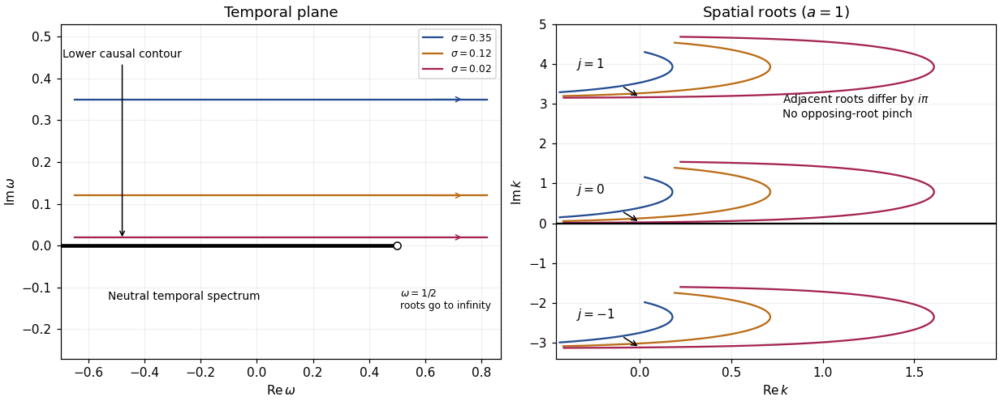

# Paper 74

↑ **Parent:** [Iii](../iii.md)

[https://www.maths.cam.ac.uk/postgrad/part-iii/files/pastpapers/2003/Paper74.pdf](https://www.maths.cam.ac.uk/postgrad/part-iii/files/pastpapers/2003/Paper74.pdf)

**Table of contents**

- [1](#1)
  - [Solution](#1/solution)
- [2](#2)
  - [Solution](#2/solution)
- [3](#3)
  - [a](#3/a)
    - [Solution](#3/a/solution)
  - [b](#3/b)
    - [Solution](#3/b/solution)
- [4](#4)
  - [Solution](#4/solution)
  - [i](#4/i)
    - [Solution](#4/i/solution)
  - [ii](#4/ii)
    - [Solution](#4/ii/solution)
  - [iii](#4/iii)
    - [Solution](#4/iii/solution)
- [5](#5)
  - [a](#5/a)
    - [Solution](#5/a/solution)
    - [i](#5/a/i)
      - [Solution](#5/a/i/solution)
    - [ii](#5/a/ii)
      - [Solution](#5/a/ii/solution)
  - [b](#5/b)
    - [Solution](#5/b/solution)

## 1

↑ **Parent:** [Paper 74](paper-74.md)

<h3 id="1/solution">Solution</h3>

↑ **Parent:** [1](#1)

**Fluid-loaded plate.** Use complex [amplitudes](../../../physics.md#wave-amplitude) with time dependence $e^{-i\omega t}$ and take the [velocity potential](../../../fluid-mechanics.md#velocity-potential) in the fluid above the [elastic plate](../../../continuum-mechanics.md#elastic-plate) to be $\Phi$. Let $\rho_0$ and $c_0$ be the undisturbed [mass density](../../../fluid-mechanics.md#density) and [speed of sound](../../../compressible-flow.md#speed-of-sound). The linearized [Euler equations](../../../fluid-mechanics.md#euler-equations-for-an-inviscid-fluid) give $p=i\rho_0\omega\Phi$; the [kinematic boundary condition](../../../fluid-mechanics.md#kinematic-boundary-condition) is $\Phi_y(x,0)=-i\omega\eta(x)$. We model loading from one fluid half-space, with no fluid loading on the other face. Loading by identical fluids on both faces instead doubles the fluid term below.

Define the [Fourier transform](../../../analysis.md#fourier-transform) and its inverse by

$$
\widehat f(k)=\int_{\mathbb R}f(x)e^{-ikx}\,dx,\qquad f(x)=\frac1{2\pi}\int_C\widehat f(k)e^{ikx}\,dk.
$$

The [Sommerfeld radiation condition](../../../inverse-problem.md#sommerfeld-radiation-condition) selects $\widehat\Phi(k,y)=\widehat\Phi(k,0)e^{-\gamma y}$, with $\gamma^2=k^2-k_0^2$ and $k_0=\omega/c_0$. Here and in the diffraction calculation below, the outgoing [square root](../../../algebra.md#square-root) is specified by first taking $\operatorname{Im}\omega>0$. Draw a vertical cut upwards from $+k_0$ and another downwards from $-k_0$, and put

$$
\gamma=\gamma_u\gamma_l,\qquad \gamma_u=\sqrt{k+k_0},\quad -\frac\pi2<\arg(k+k_0)<\frac{3\pi}2,\qquad
\gamma_l=\sqrt{k-k_0},\quad -\frac{3\pi}2<\arg(k-k_0)<\frac\pi2.
$$

Thus $\gamma_u$ is analytic in the upper half-plane and $\gamma_l$ in the lower half-plane. In the real-frequency limit,

$$
\gamma=\sqrt{k^2-k_0^2}>0\quad (|k|>k_0),\qquad
\gamma=-i\sqrt{k_0^2-k^2}\quad (|k|<k_0).
$$

The [Fourier transform](../../../analysis.md#fourier-transform) contour $C$ follows the real axis with the limiting-absorption pole prescriptions. In particular, an outgoing propagating component has positive vertical [wavenumber](../../../wave-equation.md#wavenumber).

The [kinematic boundary condition](../../../fluid-mechanics.md#kinematic-boundary-condition) gives $\widehat\Phi(0)=i\omega\widehat\eta/\gamma$, so $\widehat p(0)=-\rho_0\omega^2\widehat\eta/\gamma$. Eliminating the fluid [pressure](../../../thermodynamics.md#pressure) from the bending balance gives the [line-forced fluid-loaded bending plate](../../../continuum-mechanics.md#line-forced-fluid-loaded-bending-plate) kernel

$$
K(k)=\beta k^4-m\omega^2-\frac{\rho_0\omega^2}{\gamma},\qquad D(k)=\gamma K(k).
$$

For harmonic line [force](../../../classical-mechanics.md#force) [amplitude](../../../physics.md#wave-amplitude) $F_0$ at the origin, the plate displacement and fluid [velocity potential](../../../fluid-mechanics.md#velocity-potential) are therefore

$$
\boxed{\eta(x)=\frac{F_0}{2\pi}\int_C\frac{\gamma(k)e^{ikx}}{D(k)}\,dk},\qquad
\boxed{\Phi(x,y)=\frac{i\omega F_0}{2\pi}\int_C\frac{e^{ikx-\gamma y}}{D(k)}\,dk}.
$$

An arbitrary localized loading replaces $F_0$ by its [Fourier transform](../../../analysis.md#fourier-transform). This representation both calculates the response and identifies its different [wave](../../../physics.md#wave) components through [poles](../../../isolated-singularity.md#pole) and [branch points](../../../complex-analysis.md#branch-point).

For an observer $x=r\cos\theta$, $y=r\sin\theta$, with $0<\theta<\pi$, the [method of steepest descent](../../../analysis.md#method-of-steepest-descent) uses the [saddle point](../../../analysis.md#saddle-point) $k_s=k_0\cos\theta$. At fixed angle away from grazing, the [acoustic far field](../../../linear-acoustics.md#acoustic-far-field) is

$$
\Phi_{\rm rad}\sim\frac{i\omega F_0\sin\theta}{D(k_s)}\sqrt{\frac{k_0}{2\pi r}}e^{ik_0r-i\pi/4},\qquad p_{\rm rad}=i\rho_0\omega\Phi_{\rm rad}.
$$

The $r^{-1/2}$ spreading is that of cylindrical [acoustic waves](../../../fluid-mechanics.md#acoustic-wave). The [phase velocity](../../../wave-equation.md#phase-velocity) parallel to the plate is $\omega/|k|$: components with $|k|<k_0$ are supersonic in that sense and radiate, whereas those with $|k|>k_0$ are subsonic and exponentially decay normally to the plate. The latter have reactive fluid loading and zero mean normal [acoustic energy flux](../../../continuum-mechanics.md#acoustic-energy-flux).

There is also a real guided root $\kappa>k_0$. Indeed, $K(k_0+)=-\infty$, $K(+\infty)=+\infty$, and

$$
K'(k)=4\beta k^3+\frac{\rho_0\omega^2 k}{\gamma^3}>0\quad(k>k_0).
$$

The [residue theorem](../../../analysis.md#residue-theorem) then gives an outgoing displacement contribution $iF_0e^{i\kappa|x|}/K'(\kappa)$. It transports energy along the plate while its fluid field decays as $e^{-\gamma(\kappa)y}$. Other zeros on continued sheets can describe leaky or resonant [waves](../../../physics.md#wave); [branch point](../../../complex-analysis.md#branch-point) contributions describe near and grazing fields. A fixed-angle [acoustic far field](../../../linear-acoustics.md#acoustic-far-field) expansion is not uniform near the plate, where these components can matter.

For a propagating spectral component, write $\ell=(k_0^2-k^2)^{1/2}$. Its upward normal [velocity](../../../classical-mechanics.md#velocity) is $i\ell\widehat\Phi$ and its [pressure](../../../thermodynamics.md#pressure) is $i\rho_0\omega\widehat\Phi$. Applying [Parseval's identity](../../../fourier-analysis.md#parseval-identity) to the time-averaged [acoustic energy flux](../../../continuum-mechanics.md#acoustic-energy-flux) gives the upward power per unit length of the forcing line:

$$
\boxed{P_y=\frac{\rho_0\omega^3|F_0|^2}{4\pi}\int_{-k_0}^{k_0}\frac{\sqrt{k_0^2-k^2}}{|D(k)|^2}\,dk
=\frac{\rho_0\omega^3k_0^2|F_0|^2}{4\pi}\int_0^\pi\frac{\sin^2\theta}{|D(k_0\cos\theta)|^2}\,d\theta}.
$$

Equivalently, the integrand is $|\widehat\eta|^2/\ell$ with prefactor $\rho_0\omega^3/(4\pi)$. Integrating the radial [acoustic intensity](../../../continuum-mechanics.md#acoustic-energy-flux) of the far field over a semicircle gives the same expression. The input power $\omega\operatorname{Im}(F_0^*\eta(0))/2$ also feeds guided [waves](../../../physics.md#wave) along the plate, so it must not be identified with $P_y$ alone.

**Rigid half-plane diffraction.** Suppress the time factor and assume $0<\theta_0<\pi$. Write $a=k_0\cos\theta_0$, $b=k_0\sin\theta_0$, and denote the incident spatial field by $I=e^{-iax-iby}$. The [Helmholtz equation](../../../partial-differential-equation.md#helmholtz-equation), [Sommerfeld radiation condition](../../../inverse-problem.md#sommerfeld-radiation-condition), and square-root branches are as above. Across the open positive axis the scattered field and its normal derivative are continuous. Across the rigid negative axis its normal derivative is also continuous, while its potential can jump. Let $J(x)$ be this jump, supported on $x<0$. The transformed scattered field is

$$
\widehat\phi(k,y)=\tfrac12\operatorname{sgn}(y)\widehat J_u(k)e^{-\gamma|y|}.
$$

The jump transform is analytic in the upper half-plane. The absence of an even scattered component follows from derivative continuity and the outgoing condition. Its normal derivative on either face is $-\gamma\widehat J_u/2$.

On the negative axis this derivative must cancel $-ib e^{-iax}$. Since the [Half-range Fourier transform](../../../analysis.md#half-range-fourier-transform) of $H(-x)e^{-iax}$ is $i/(k+a)$, the [Wiener-Hopf equation](../../../differential-equation.md#wiener-hopf-equation) has the form

$$
\gamma_u\gamma_l\widehat J_u=\frac{2b}{k+a}+G_l(k),
$$

where $G_l$ is the transform of an unknown function supported on $x>0$ and analytic in the lower half-plane. The incident pole $k=-a$ lies below the Fourier contour. Divide by $\gamma_l$ and perform [pole subtraction in a Wiener-Hopf equation](../../../differential-equation.md#pole-subtraction-in-a-wiener-hopf-equation):

$$
\frac{2b}{(k+a)\gamma_l(k)}=
\frac{2b}{(k+a)\gamma_l(-a)}+
\frac{2b}{k+a}\left(\frac1{\gamma_l(k)}-\frac1{\gamma_l(-a)}\right).
$$

The first term is upper analytic and the second lower analytic, since the latter's apparent pole cancels. Equality of the two continued sides gives an entire function. The finite-energy edge condition, with $J(x)=O(\sqrt{-x})$, and the decay of the transforms at infinity force that function to vanish by [Liouville's theorem](../../../complex-analysis.md#liouville-theorem). Consequently

$$
\widehat J_u(k)=\frac{2b}{\gamma_l(-a)(k+a)\gamma_u(k)},\qquad
\boxed{\phi(x,y)=\frac{\operatorname{sgn}(y)b}{2\pi\gamma_l(-a)}\int_C\frac{e^{ikx-\gamma|y|}}{(k+a)\gamma_u(k)}\,dk}.
$$

This is the [Wiener-Hopf solution of rigid half-plane diffraction](../../../partial-differential-equation.md#wiener-hopf-solution-of-rigid-half-plane-diffraction) with the present transform and time conventions.

Deforming to a [steepest descent contour](../../../analysis.md#steepest-descent-contour) gives a residue from the incident pole precisely when $x+|y|\cot\theta_0<0$. At that pole $\gamma(-a)=-ib$; its residue produces

$$
\phi_{\rm GO}=\operatorname{sgn}(y)e^{-iax+ib|y|}H(-x-|y|\cot\theta_0).
$$

Thus the total [geometrical optics](../../../optics.md#geometrical-optics) field is $I$ plus a reflected [wave](../../../physics.md#wave) in the upper reflection region; in the lower shadow region the scattered residue cancels $I$, and outside that shadow the direct incident [wave](../../../physics.md#wave) remains. This gives both the [amplitude](../../../physics.md#wave-amplitude) and the spatial support of the [geometrical optics](../../../optics.md#geometrical-optics) fields rather than merely naming a reflected [wave](../../../physics.md#wave).

For $x=r\cos\theta$, $y=r\sin\theta$, $-\pi<\theta<\pi$, the saddle contribution uses $\gamma_l(-a)=-i\sqrt{2k_0}\cos(\theta_0/2)$ and $\gamma_u(k_s)=\sqrt{2k_0}\cos(\theta/2)$. The diffracted [wave](../../../physics.md#wave) is

$$
\boxed{\phi_d\sim\frac{e^{ik_0r+i\pi/4}}{\sqrt{2\pi k_0r}}\frac{2\sin(\theta/2)\sin(\theta_0/2)}{\cos\theta+\cos\theta_0}
=\frac{e^{ik_0r+i\pi/4}}{2\sqrt{2\pi k_0r}}\left[\sec\frac{\theta+\theta_0}{2}-\sec\frac{\theta-\theta_0}{2}\right]}.
$$

The total field is $I+\phi_{\rm GO}+\phi_d$ to this order. This far-field expression applies away from the shadow/reflection boundaries $|\theta|=\pi-\theta_0$. There the pole and saddle coalesce, and a uniform [Fresnel integral](../../../analysis.md#fresnel-integral) approximation replaces the divergent separate terms by a smooth transition. The exact contour integral remains well defined.

## 2

↑ **Parent:** [Paper 74](paper-74.md)

<h3 id="2/solution">Solution</h3>

↑ **Parent:** [2](#2)

Write the perturbation [Stokes streamfunction](../../../fluid-mechanics.md#stokes-streamfunction) as $\psi=\phi(r)e^{ikz-i\omega t}$, with $\omega=kc$ and nonzero $k$. Its radial and axial [velocity](../../../classical-mechanics.md#velocity) [amplitudes](../../../physics.md#wave-amplitude) are $u=-ik\phi/r$ and $w=\phi'/r$. These automatically obey [incompressibility](../../../fluid-mechanics.md#incompressible-flow). Linearizing the radial and axial [Euler equations](../../../fluid-mechanics.md#euler-equations-for-an-inviscid-fluid), with [pressure](../../../thermodynamics.md#pressure) [amplitude](../../../physics.md#wave-amplitude) $P$, gives

$$
ik(U-c)u=-P'/\rho_0,\qquad ik(U-c)w+U'u=-ikP/\rho_0.
$$

Thus

$$
P/\rho_0=-(U-c)\phi'/r+U'\phi/r,\qquad P'/\rho_0=-k^2(U-c)\phi/r.
$$

Differentiating the first expression, the terms involving $U'\phi'$ cancel. Equating the two expressions for $P'$ proves the [axisymmetric inviscid pipe stability equation](../../../hydrodynamic-stability.md#axisymmetric-inviscid-pipe-stability-equation):

$$
\boxed{(U-c)\left[r\left(\frac{\phi'}r\right)'-k^2\phi\right]-r\left(\frac{U'}r\right)'\phi=0}.
$$

At the axis, finite smooth axisymmetric [velocity](../../../classical-mechanics.md#velocity) requires $\phi=O(r^2)$, after choosing the irrelevant constant in the [streamfunction](../../../fluid-mechanics.md#stream-function). At the wall, impermeability gives $\phi(a)=0$. There is no tangential no-slip condition in this inviscid problem. A decoupled azimuthal disturbance satisfies $ik(U-c)u_\theta=0$ and does not introduce a growing discrete mode when $U\ne c$.

For real $k$, suppose $c=c_r+ic_i$ with $c_i\ne0$, so division by $U-c$ is legitimate. Multiply the [ordinary differential equation](../../../differential-equation.md#ordinary-differential-equation) by $\phi^*/[r(U-c)]$, integrate, and apply [integration by parts](../../../calculus.md#integration-by-parts). The endpoint terms vanish by the preceding regularity and wall conditions, leaving

$$
\int_0^a\frac{|\phi'|^2+k^2|\phi|^2}{r}\,dr+
\int_0^a\frac{(U'/r)'|\phi|^2}{U-c}\,dr=0.
$$

Taking its imaginary part yields

$$
c_i\int_0^a\frac{(U'/r)'|\phi|^2}{|U-c|^2}\,dr=0.
$$

**A growing temporal mode therefore requires a sign change of $(U'/r)'$, rather than a sign change of $U''$ alone.** This is the cylindrical counterpart of [Rayleigh's inflection-point theorem](../../../hydrodynamic-stability.md#rayleigh-s-inflection-point-theorem). If this derivative vanishes identically, the positive first integral rules out a nontrivial growing real-wavenumber mode as well. Isolated zeros without a sign change do not make the second integral vanish for a nonzero regular mode.

For the parabolic [Poiseuille flow](../../../viscous-fluid-flow.md#hagen-poiseuille-equation), $U'/r=-2U_0/a^2$ is constant. Under the specified exclusion of critical levels, division gives

$$
\phi''-\frac{\phi'}r-k^2\phi=0.
$$

Setting $\phi=rf$, or equivalently choosing $n=1$ in $r^{-n}\phi$, turns this into

$$
r^2f''+rf'-(k^2r^2+1)f=0.
$$

It is the [Modified Bessel differential equation](../../../analysis.md#modified-bessel-differential-equation) of order one. Hence $\phi=r[A I_1(kr)+B K_1(kr)]$. Since $rK_1(kr)$ tends to a nonzero constant at the axis, it gives a singular radial [velocity](../../../classical-mechanics.md#velocity) and must be excluded. The admissible [mode shape](../../../wave-equation.md#mode-shape) is therefore

$$
\boxed{\phi=A rI_1(kr),\qquad I_1(ka)=0}.
$$

For $k=0$, direct solution gives $\phi=C r^2$ after axis regularity, and the wall condition again forces the trivial solution. For nonzero $k$, the nonzero roots of $I_1$ are imaginary. Writing $j_{1,l}>0$ for the zeros of the ordinary [Bessel function](../../../analysis.md#bessel-function) $J_1$, the [evanescent potential modes of inviscid Poiseuille flow](../../../hydrodynamic-stability.md#evanescent-potential-modes-of-inviscid-poiseuille-flow) are

$$
\boxed{k=\pm i j_{1,l}/a,\qquad \phi\propto rJ_1(j_{1,l}r/a)}.
$$

Their perturbation [vorticity](../../../fluid-mechanics.md#vorticity) vanishes: $\partial_z u-\partial_r w=k^2\phi/r-(\phi'/r)'=0$. These modes grow exponentially in one axial direction and decay in the other. They can describe end-forced or spatially localized potential fields, but neither sign gives a bounded [normal mode](../../../wave-equation.md#normal-mode) on a whole infinite pipe. Moreover, the reduced radial equation contains no $c$: it supplies no temporal [eigenvalue](../../../linear-operator-theory.md#eigenvalue) condition. An arbitrary imaginary part assigned to $\omega=kc$ here is consequently not evidence for a physical temporal instability.

The real-wavenumber calculation does exclude growing discrete axisymmetric modes of this inviscid profile. It does not establish every form of stability: singular neutral disturbances with $c$ in the range of $U$, transient dynamics, non-axisymmetric disturbances, and finite-amplitude transition require separate treatment. The exclusion $U\ne c$ specifically removes the inviscid continuous spectrum.

With [viscosity](../../../fluid-mechanics.md#dynamic-viscosity), linearize the [Navier-Stokes equations](../../../viscous-fluid-flow.md#navier-stokes-equation) instead and eliminate [pressure](../../../thermodynamics.md#pressure) to obtain a fourth-order cylindrical counterpart of the [Orr-Sommerfeld equation](../../../hydrodynamic-stability.md#orr-sommerfeld-equation). Impose both $\phi(a)=0$ and $\phi'(a)=0$, with appropriate regularity at the axis. The resulting [eigenvalue problem](../../../linear-operator-theory.md#eigenvalue-problem) involves the [Reynolds number](../../../fluid-mechanics.md#reynolds-number) and determines complex [frequencies](../../../physics.md#frequency), rather than leaving $c$ arbitrary. Viscosity supplies diffusion, no-slip boundary layers and critical-layer regularization, so the inviscid sign argument alone no longer decides its spectrum. That observation does not imply that viscous pipe flow must have a growing linear eigenmode; finite-amplitude pipe transition is a different question.

## 3

↑ **Parent:** [Paper 74](paper-74.md)

<h3 id="3/a">a</h3>

↑ **Parent:** [3](#3)

<h4 id="3/a/solution">Solution</h4>

↑ **Parent:** [A](#3/a)

The real-wavenumber [dispersion relation](../../../wave-equation.md#dispersion-relation) has the explicit branch

$$
\omega(k)=\tfrac12(1-e^{-2ak}),\qquad \omega'(k)=ae^{-2ak}>0\quad(k\in\mathbb R).
$$

Its [frequencies](../../../physics.md#frequency) are real. A real-axis [Fourier transform](../../../analysis.md#fourier-transform) propagator multiplies every component by $e^{-i\omega(k)t}$, of modulus one, so a square-integrable localized disturbance has constant $L^2$ norm. For sufficiently smooth localized data with an integrable [Fourier transform](../../../analysis.md#fourier-transform), its pointwise [amplitude](../../../physics.md#wave-amplitude) also has a time-independent upper bound. In particular, there is no exponential growth along a fixed or moving ray.

The [Briggs-Bers criterion](../../../wave-equation.md#briggs-bers-criterion) makes the same conclusion while enforcing causality. Start the temporal inversion line at $\operatorname{Im}\omega=\sigma>0$ and the spatial inversion contour on the real $k$ axis. The spatial roots can be followed explicitly:

$$
k_j(\omega)=-\frac{1}{2a}\operatorname{Log}(1-2\omega)+\frac{i\pi j}{a},\qquad j\in\mathbb Z.
$$

Choose the principal logarithm along this upper temporal half-plane. Since $\operatorname{Im}(1-2\omega)<0$, the $j=0$ root lies above the real $k$ axis; the $j=-1$ root lies below it. Successive roots remain separated by $i\pi/a$. As $\sigma$ is lowered, $k_0$ approaches the real axis when $\omega<1/2$ is real. The spatial contour is then indented beneath that root, as required by continuation from positive $\sigma$. No lower root meets it: their separation stays nonzero.

Algebraically,

$$
D_k=-2ae^{-2ak}\ne0
$$

for every finite complex $k$, so there is no finite [spatial pinch point](../../../wave-equation.md#spatial-pinch-point). The logarithmic singularity at $\omega=1/2$ sends roots to $\operatorname{Re}k=+\infty$; it is on the real-frequency boundary, not a positive-growth pinch in the upper temporal half-plane. The continuum of neutral poles is the real curve $\omega<1/2$ in the $\omega$ plane. It is reached as a causal boundary value, rather than producing an upper-half-plane singularity.

The figure follows neighboring spatial roots while lowering horizontal temporal contours. It shows why merely finding roots in both spatial half-planes does not establish an instability: those roots never collide across the inversion contour.

**[Figure 1](#3/a/image-causal-temporal-contours-and-nonpinching-spatial-roots-of-the-triangular-jet-dispersion-relation). Causal temporal contours and nonpinching spatial roots of the triangular-jet dispersion relation**.

**These modes have neither absolute wave-packet instability nor convective wave-packet instability; they are temporally neutral.** Their positive real [group velocity](../../../wave-equation.md#group-velocity) transports [wave packets](../../../wave-equation.md#wave-packet) downstream. Nonreal spatial roots describe spatial continuation and evanescence, not temporal amplification. The exponential growth criteria concern the causal impulse response, not an unrestricted choice of a complex root.

<h3 id="3/b">b</h3>

↑ **Parent:** [3](#3)

<h4 id="3/b/solution">Solution</h4>

↑ **Parent:** [B](#3/b)

Expanding the exponential for $|ka|\ll1$ gives $e^{-2ka}=1-2ka+2k^2a^2+O((ka)^3)$. Substitution of the [plane wave](../../../quantum-mechanics.md#plane-wave) $A=e^{i(kx-\omega t)}$ in the model gives

$$
-i\omega=-iak+ia^2k^2,\qquad \boxed{\omega=ak-a^2k^2},
$$

which is exactly the quadratic approximation to the [dispersion relation](../../../wave-equation.md#dispersion-relation).

For the slowly varying width, put $X=\epsilon x$ and use the [WKB approximation](../../../analysis.md#wkb-approximation)

$$
A=B(X)\exp\left(\frac{i}{\epsilon}S(X)-i\Omega t\right),\qquad k(X)=S_X.
$$

The derivatives are

$$
A_x=(ikB+\epsilon B_X)e^{iS/\epsilon-i\Omega t},\quad
A_{xx}=[-k^2B+i\epsilon(k_XB+2kB_X)+\epsilon^2B_{XX}]e^{iS/\epsilon-i\Omega t}.
$$

At leading order $\Omega=ak-a^2k^2$. On the downstream small-wavenumber branch write

$$
k=\frac q{a(X)},\qquad q=\frac{1-\sqrt{1-4\Omega}}2,
$$

so $q$ is independent of $X$. The next order gives the [slowly varying triangular-jet envelope](../../../analysis.md#slowly-varying-triangular-jet-envelope) transport equation

$$
(a-2a^2k)B_X=a^2k_XB,\qquad
\frac{B_X}{B}=-\frac{q}{1-2q}\frac{a_X}{a}.
$$

Integration therefore yields

$$
\boxed{B(X)=B(0)\left[\frac{a(X)}{a(0)}\right]^{-q/(1-2q)}},\qquad
\boxed{B(X)\simeq B(0)\left[\frac{a(X)}{a(0)}\right]^{-\Omega}}\quad(\Omega\ll1).
$$

Indeed, $q/(1-2q)=\Omega+O(\Omega^2)$. The requested power is the leading low-frequency envelope, not the exact finite-frequency exponent of the quadratic model. The corresponding leading field is this [wave envelope](../../../wave-equation.md#envelope-waves) times $\exp(i\int_0^x q/a(\epsilon s)\,ds-i\Omega t)$. Positive slowly varying width and separation from the zero of the local [group velocity](../../../wave-equation.md#group-velocity), $1-2q=0$, are needed for this [WKB approximation](../../../analysis.md#wkb-approximation). Extremely large $|\log[a(X)/a(0)]|$ can also invalidate replacing the exact exponent by $\Omega$.

## 4

↑ **Parent:** [Paper 74](paper-74.md)

<h3 id="4/solution">Solution</h3>

↑ **Parent:** [4](#4)

Use [mass conservation](../../../continuum-mechanics.md#mass-conservation) and conservative [momentum conservation](../../../classical-mechanics.md#momentum-conservation), with [viscous stress](../../../fluid-mechanics.md#viscous-stress-tensor) $\sigma_{ij}$ defined so that its divergence is the viscous force:

$$
\rho_t+\partial_i(\rho u_i)=0,\qquad
(\rho u_i)_t+\partial_j(\rho u_i u_j)=-\partial_i p+\partial_j\sigma_{ij}.
$$

Differentiate the first equation in time and eliminate the momentum time derivative using the second. This gives

$$
\rho_{tt}=\partial_i\partial_j(\rho u_i u_j)+\nabla^2p-\partial_i\partial_j\sigma_{ij}.
$$

Set $\rho'=\rho-\rho_0$ and $p'=p-p_0$, where the reference values and $c_0$ are constant. Subtract $c_0^2\nabla^2\rho'$ to obtain the exact [Lighthill acoustic analogy](../../../linear-acoustics.md#lighthill-acoustic-analogy)

$$
\boxed{(\partial_t^2-c_0^2\nabla^2)\rho'=\partial_i\partial_jT_{ij},\qquad
T_{ij}=\rho u_i u_j+(p'-c_0^2\rho')\delta_{ij}-\sigma_{ij}}.
$$

The [Lighthill stress tensor](../../../linear-acoustics.md#lighthill-stress-tensor) includes nonlinear momentum transport, departure from the reference linear pressure-density relation, and [viscous stress](../../../fluid-mechanics.md#viscous-stress-tensor). For an inviscid fluid the last term is absent. The derivation is an exact rearrangement of the conservation equations; treating the tensor as a known localized source is a subsequent approximation.

<h3 id="4/i">i</h3>

↑ **Parent:** [4](#4)

<h4 id="4/i/solution">Solution</h4>

↑ **Parent:** [I](#4/i)

Convolution with the [retarded acoustic Green function](../../../wave-equation.md#retarded-acoustic-green-function), followed by two integrations by parts in the source coordinate, yields

$$
\rho'(x,t)=\partial_{x_i}\partial_{x_j}\int\frac{T_{ij}(y,t-|x-y|/c_0)}{4\pi c_0^2|x-y|}\,dV_y.
$$

For the [acoustic compact-source approximation](../../../linear-acoustics.md#acoustic-compact-source-approximation), replace the distance and the source [retarded time](../../../electromagnetism.md#retarded-time) by $r=|x|$ and $\tau=t-r/c_0$ in the leading moment. Thus the integral is $S_{ij}(\tau)/(4\pi c_0^2r)$, where $S_{ij}=\int T_{ij}\,dV$. In the [acoustic far field](../../../linear-acoustics.md#acoustic-far-field), each spatial derivative acts predominantly on retarded time: $\partial_{x_i}\tau=-n_i/c_0$, where $n_i=x_i/r$. Derivatives of $1/r$ and of $n_i$ give lower powers of $r$. The two retarded derivatives therefore give

$$
\boxed{\rho'_Q(x,t)\sim\frac{n_i n_j\ddot S_{ij}(\tau)}{4\pi c_0^4r}
=\frac{x_i x_j\ddot S_{ij}(\tau)}{4\pi c_0^4r^3}}.
$$

This is the compact [acoustic quadrupole](../../../linear-acoustics.md#acoustic-quadrupole) field, retaining its angular stress projection.

For the [compact acoustic quadrupole Mach-number scaling](../../../linear-acoustics.md#compact-acoustic-quadrupole-mach-number-scaling), let the source length be $\ell$, typical fluctuation speed be $U$, and typical time be $\ell/U$. The low-[Mach number](../../../compressible-flow.md#mach-number) stress is $T=O(\rho_0U^2)$, so $S=O(\rho_0U^2\ell^3)$ and $\ddot S=O(\rho_0U^4\ell)$. Consequently

$$
\boxed{\rho'_Q/\rho_0=O\left(\frac{\ell}{r}m^4\right),\qquad m=U/c_0}.
$$

With the geometric ratio separated, this is the stated fourth-power dependence. It assumes an advective source time scale and compactness $\omega\ell/c_0=O(m)\ll1$. An externally driven source with an independent [frequency](../../../physics.md#frequency) does not acquire the same Mach power automatically.

<h3 id="4/ii">ii</h3>

↑ **Parent:** [4](#4)

<h4 id="4/ii/solution">Solution</h4>

↑ **Parent:** [Ii](#4/ii)

Interpret the surface delta as $\delta_s=|\nabla F|\delta(F)$, so integration against it gives a surface integral. If $F$ is signed distance, this equals the notation $\delta(F)$ directly. This convention is needed because an arbitrary rescaling of the level-set function must not change the physical source.

Define the volume flux $\mathcal V(t)=\int_S V_n\,dS$ and total [pressure](../../../thermodynamics.md#pressure) [force](../../../classical-mechanics.md#force) $f(t)=\int_S pn\,dS$. Here $\mathcal V$ is the rate of change of body volume, not the volume itself. The surface [acoustic monopole](../../../linear-acoustics.md#acoustic-monopole) contributes, in the [acoustic compact-source approximation](../../../linear-acoustics.md#acoustic-compact-source-approximation),

$$
\rho'_M=\partial_t\frac{\rho_0\mathcal V(\tau)}{4\pi c_0^2r}
=\frac{\rho_0\dot{\mathcal V}(\tau)}{4\pi c_0^2r}.
$$

The surface [acoustic dipole](../../../linear-acoustics.md#acoustic-dipole) contributes

$$
\rho'_D=-\nabla_x\cdot\frac{f(\tau)}{4\pi c_0^2r}
=\frac{n\cdot\dot f(\tau)}{4\pi c_0^3r}+\frac{n\cdot f(\tau)}{4\pi c_0^2r^2}.
$$

The second term is a nonradiating near-field term and is smaller in the [acoustic far field](../../../linear-acoustics.md#acoustic-far-field). Writing $\mathcal F(t)=x\cdot f(t)$ with the observation point fixed, the leading augmentation is therefore

$$
\boxed{\rho'_{\rm surf}\sim\frac{\rho_0\dot{\mathcal V}(\tau)}{4\pi rc_0^2}
+\frac{\dot{\mathcal F}(\tau)}{4\pi r^2c_0^3}}.
$$

**The printed dipole coefficient is missing a factor $1/c_0$.** The extra inverse speed follows from differentiating $\tau=t-r/c_0$, and is required dimensionally: the printed expression with $c_0^2$ has the units of density times speed. This corrected [acoustic loading noise](../../../linear-acoustics.md#acoustic-loading-noise) term also agrees with the [far-field acoustic force and stress moments](../../../linear-acoustics.md#far-field-acoustic-force-and-stress-moments). The monopole coefficient is unchanged.

<h3 id="4/iii">iii</h3>

↑ **Parent:** [4](#4)

<h4 id="4/iii/solution">Solution</h4>

↑ **Parent:** [Iii](#4/iii)

Let $a(t)=a_0+a_1(t)$ and use $s=|y|$ for the source radius, reserving $r$ for observation distance. Incompressible spherical [potential flow](../../../fluid-mechanics.md#potential-flow) satisfies $s^2u_s=a^2\dot a$. Its [velocity potential](../../../fluid-mechanics.md#velocity-potential), tending to zero at infinity, and [velocity](../../../classical-mechanics.md#velocity) are

$$
\Phi(y,t)=-\frac{a^2\dot a}{s},\qquad
u_s=\frac{a^2\dot a}{s^2}.
$$

The unsteady [Bernoulli equation](../../../fluid-mechanics.md#bernoulli-equation) gives

$$
p(s,t)-p_\infty=\rho_0\left[\frac{\frac{d}{dt}(a^2\dot a)}s-\frac{a^4\dot a^2}{2s^4}\right],\qquad
p(a,t)-p_\infty=\rho_0\left(a\ddot a+\tfrac32\dot a^2\right).
$$

The surface [pressure](../../../thermodynamics.md#pressure) is independent of angle. Hence the integrated surface [force](../../../classical-mechanics.md#force) is zero, $f=p(a,t)\int_S n\,dS=0$, and **the leading compact surface dipole contribution vanishes**. This also makes $\mathcal F=0$ in the notation of the preceding part.

The volume flux is $\mathcal V=4\pi a^2\dot a$, so the [acoustic thickness noise](../../../linear-acoustics.md#acoustic-thickness-noise) contribution is

$$
\boxed{\rho'_M=\frac{\rho_0}{c_0^2r}(a^2\ddot a+2a\dot a^2)_{\tau}}
=\frac{\rho_0a_0^2}{c_0^2r}\ddot a_1(\tau)+O(a_1^2).
$$

The leading part is linear in the radial oscillation. Keeping the quadratic terms explicitly gives $\rho_0[a_0^2\ddot a_1+a_0\frac{d^2}{dt^2}(a_1^2)]/(c_0^2r)$.

For the [acoustic quadrupole](../../../linear-acoustics.md#acoustic-quadrupole), use $T_{ij}\simeq\rho_0u_i u_j$. To leading quadratic order,

$$
u_i=a_0^2\dot a_1\frac{y_i}{s^3},\qquad
\int_{s\ge a_0}\frac{y_i y_j}{s^6}\,dV
=\int_{a_0}^\infty\frac{ds}{s^2}\int n_i n_j\,d\Omega
=\frac{4\pi}{3a_0}\delta_{ij}.
$$

Thus

$$
S_{ij}=\frac{4\pi}{3}\rho_0a_0^3\dot a_1^2\delta_{ij},\qquad
\boxed{\rho'_Q=\frac{\rho_0a_0^3}{3c_0^4r}\frac{d^2}{dt^2}\big(\dot a_1^2\big)_{\tau}}.
$$

Keeping the instantaneous lower limit $s=a(t)$ instead gives $S_{ij}=4\pi\rho_0a^3\dot a^2\delta_{ij}/3$, whose leading small-oscillation term is the expression just obtained. Although the stress moment is isotropic, its contracted second derivative is not zero: $n_i n_j\delta_{ij}=1$.

For a sinusoidal radius perturbation $a_1=A\cos\omega t$, the leading [compact radiation moments of a pulsating spherical bubble](../../../linear-acoustics.md#compact-radiation-moments-of-a-pulsating-spherical-bubble) are

$$
\rho'_M=-\frac{\rho_0a_0^2A\omega^2}{c_0^2r}\cos\omega\tau+O(A^2),\qquad
\rho'_Q=\frac{2\rho_0a_0^3A^2\omega^4}{3c_0^4r}\cos2\omega\tau.
$$

Writing $\delta=A/a_0$ and $\alpha=\omega a_0/c_0$, the quadrupole [amplitude](../../../physics.md#wave-amplitude) relative to the linear monopole is $2\delta\alpha^2/3$. The monopole also has a quadratic correction, $-2\rho_0a_0A^2\omega^2\cos2\omega\tau/(c_0^2r)$; the volume-stress quadrupole is smaller than this quadratic monopole correction by $\alpha^2/3$.

**In the small-amplitude compact regime, the linear monopole dominates, the leading dipole is zero, and the volume quadrupole is weaker and begins at twice the oscillation [frequency](../../../physics.md#frequency).** The compact formulas require $\alpha\ll1$ as well as a far observer. The stated small surface [Mach number](../../../compressible-flow.md#mach-number) $|\dot a_1|/c_0\sim\delta\alpha\ll1$ alone does not imply compactness. The incompressible near field has a decaying tail, but its stress moment is dominated by distances of order $a_0$; an acoustic matching region is still needed outside it. These are leading compact contributions, not a claim to retain every finite-wavelength correction at the smaller quadrupole order.

## 5

↑ **Parent:** [Paper 74](paper-74.md)

<h3 id="5/a">a</h3>

↑ **Parent:** [5](#5)

<h4 id="5/a/solution">Solution</h4>

↑ **Parent:** [A](#5/a)

The positive drift places the [boundary layer](../../../continuum-mechanics.md#boundary-layer) at the left endpoint. Set $y_{\rm out}=y_0+\epsilon y_1+\cdots$ and impose the right [boundary condition](../../../differential-equation.md#boundary-condition) order by order. The leading [ordinary differential equation](../../../differential-equation.md#ordinary-differential-equation) is $[(1+x)y_0]'=0$, so $y_0=2/(1+x)$. At the next order,

$$
[(1+x)y_1]'=-y_0''=-\frac4{(1+x)^3},\qquad y_1(1)=0,
$$

which integrates to

$$
\boxed{y_{\rm out}=\frac2{1+x}+\epsilon\left[\frac2{(1+x)^3}-\frac1{2(1+x)}\right]+O(\epsilon^2)}.
$$

The outer limit at the left endpoint is two, so it cannot satisfy the left boundary value without a rapidly varying correction.

For the inner expansion use $X=x/\epsilon$ and $y=Y_0(X)+\epsilon Y_1(X)+\cdots$. Its equations and boundary values are

$$
Y_0''+Y_0'=0,\qquad Y_0(0)=1,
$$

$$
Y_1''+Y_1'=-(XY_0'+Y_0),\qquad Y_1(0)=0.
$$

Matching the leading constant gives $Y_0=2-e^{-X}$. The first-order forcing is then $-2+(1-X)e^{-X}$. A particular solution is $-2X+\tfrac12X^2e^{-X}$, and matching determines the constant to be $3/2$. Enforcing $Y_1(0)=0$ gives

$$
\boxed{y_{\rm in}=2-e^{-X}+\epsilon\left[\frac32-2X+\left(\frac{X^2}{2}-\frac32\right)e^{-X}\right]+O(\epsilon^2)}.
$$

In the overlap region the common expansion is $2+\epsilon(3/2-2X)$. Adding the inner and outer approximations and subtracting that common part gives the [uniform asymptotic approximation](../../../analysis.md#uniform-asymptotic-approximation)

$$
\boxed{y_{\rm comp}(x)=\frac2{1+x}+\epsilon\left[\frac2{(1+x)^3}-\frac1{2(1+x)}\right]
-e^{-x/\epsilon}+\epsilon\left(\frac{x^2}{2\epsilon^2}-\frac32\right)e^{-x/\epsilon}}.
$$

It has error $O(\epsilon^2)$ uniformly for $0\le x\le1$, apart from an exponentially small endpoint adjustment of the same asymptotic irrelevance. At $x=0$ it equals one exactly, and at $x=1$ it differs from one only exponentially. The polynomial multiplying the exponential remains bounded on the inner scale.

There is an independent check from a first integral. The equation is $[\epsilon y'+(1+x)y]'=0$, so its exact solution has the form

$$
y(x)=e^{-(x+x^2/2)/\epsilon}\left[1+\frac C\epsilon\int_0^x e^{(s+s^2/2)/\epsilon}\,ds\right],
$$

where $C$ is selected by the right boundary value. Endpoint expansion of this integral gives $C=2-\epsilon/2+O(\epsilon^2)$, the same outer coefficients and the same inner expansion. This check also establishes the uniform order of the composite approximation without treating an inner residual as an outer estimate.

<h4 id="5/a/i">i</h4>

↑ **Parent:** [A](#5/a)

<h5 id="5/a/i/solution">Solution</h5>

↑ **Parent:** [I](#5/a/i)

The negative drift moves the [outflow boundary layer](../../../differential-equation.md#outflow-boundary-layer) to $x=1$. The first-order outer equation is $-(1+x)y_0'+y_0=0$. It must satisfy the left [boundary condition](../../../differential-equation.md#boundary-condition), giving $y_0=1+x$. This tends to two at the right endpoint.

Use $X=(1-x)/\epsilon$. The leading inner equation is $Y_0''+2Y_0'=0$, and impose $Y_0(0)=1$ and $Y_0\to2$ on matching. Thus $Y_0=2-e^{-2X}$, and a leading [uniform asymptotic approximation](../../../analysis.md#uniform-asymptotic-approximation) is

$$
\boxed{y\sim1+x-e^{-2(1-x)/\epsilon}}.
$$

For higher accuracy, expand the drift as $2-\epsilon X$ in the inner equation, solve the successive inhomogeneous equations, and match to outer corrections satisfying zero left endpoint data. There is no need for a left endpoint layer. Choosing the growing exponential at the wrong endpoint would prevent matching and is the reason the layer location matters.

<h4 id="5/a/ii">ii</h4>

↑ **Parent:** [A](#5/a)

<h5 id="5/a/ii/solution">Solution</h5>

↑ **Parent:** [Ii](#5/a/ii)

Here the drift vanishes at the left endpoint. The outer equation is $xy_0'+y_0=0$, giving $y_0=1/x$ after applying the right boundary value. The ordinary $x=O(\epsilon)$ layer does not balance diffusion and drift: their balance selects $x=O(\sqrt\epsilon)$ instead.

For the [square-root boundary layer at a vanishing drift](../../../differential-equation.md#square-root-boundary-layer-at-a-vanishing-drift), put $X=x/\sqrt\epsilon$. The inner equation is

$$
Y''+XY'+Y=0,\qquad (Y'+XY)'=0.
$$

Matching $1/x$ requires a leading inner [amplitude](../../../physics.md#wave-amplitude) of order $\epsilon^{-1/2}$, so an inner expansion with an everywhere order-one leading term would be incorrect. This can be seen directly by integrating the original equation once:

$$
\epsilon y'+xy=C,\qquad
y(x)=e^{-x^2/(2\epsilon)}\left[1+\frac C\epsilon\int_0^x e^{s^2/(2\epsilon)}\,ds\right].
$$

The right boundary value determines

$$
C=\frac{\epsilon(e^{1/(2\epsilon)}-1)}{\int_0^1e^{s^2/(2\epsilon)}ds}=1+O(\epsilon).
$$

In the inner variable the exact representation becomes

$$
Y(X)=e^{-X^2/2}+\frac C{\sqrt\epsilon}e^{-X^2/2}\int_0^X e^{s^2/2}\,ds.
$$

The first term enforces $Y(0)=1$, while the second is zero there and matches $C/(\sqrt\epsilon X)=C/x$ for large $X$. One would expand this integral in the overlap region, determine successive outer terms from the right boundary, and subtract their common expansion. **The endpoint layer has width $\sqrt\epsilon$ and an $O(\epsilon^{-1/2})$ interior peak**, while its value at the endpoint remains one. This distinguishes it from the ordinary exponential layers in the two preceding cases.

<h3 id="5/b">b</h3>

↑ **Parent:** [5](#5)

<h4 id="5/b/solution">Solution</h4>

↑ **Parent:** [B](#5/b)

Introduce the slow time $T=\epsilon t$ and expand $y=y_0(t,T)+\epsilon y_1(t,T)+\cdots$. At leading order write

$$
y_0=R(T)\cos\psi,\qquad \psi=t+\varphi(T),\qquad R(0)=1,\quad\varphi(0)=0.
$$

The first-order equation is

$$
(\partial_t^2+1)y_1=-2\partial_t\partial_Ty_0-(\partial_ty_0)^n
=2R_T\sin\psi+2R\varphi_T\cos\psi-(-1)^nR^n\sin^n\psi.
$$

Its resonant sine and cosine components must vanish by the [solvability condition in the method of multiple scales](../../../differential-equation.md#solvability-condition-in-the-method-of-multiple-scales). Let angle brackets denote a full-period average. The cosine projection of the nonlinear term is zero, since $\langle\sin^n\psi\cos\psi\rangle=0$. The sine projection gives

$$
\boxed{\varphi_T=0,\qquad R_T=(-1)^nR^n\langle\sin^{n+1}\psi\rangle}.
$$

This is the [averaged oscillator damping by a power of velocity](../../../differential-equation.md#averaged-oscillator-damping-by-a-power-of-velocity).

If $n$ is odd, define

$$
C_n=\langle\sin^{n+1}\psi\rangle=\frac{1}{2^{n+1}}\binom{n+1}{(n+1)/2}>0.
$$

Then $R_T=-C_nR^n$, giving

$$
\boxed{y(t)=e^{-\epsilon t/2}\cos t+O(\epsilon)\quad(n=1)},
$$

$$
\boxed{y(t)=\left[1+(n-1)C_n\epsilon t\right]^{-1/(n-1)}\cos t+O(\epsilon)\quad(n>1\text{ odd})}.
$$

For every fixed $n$, these leading [multiple-scale expansions](../../../differential-equation.md#method-of-multiple-scales) are uniform on bounded slow-time intervals $0\le\epsilon t\le T_0$. The unforced phase remains $t$ to this order. A bounded first-order correction supplies the small adjustment to the initial derivative and initial displacement; it does not change this leading result.

If $n$ is even, the average of the odd power $\sin^{n+1}\psi$ vanishes. Thus $R_T=0$ and

$$
\boxed{y(t)=\cos t+O(\epsilon)\quad(n\text{ even},\ t=O(\epsilon^{-1}))}.
$$

The first-order forcing has only a constant and even harmonics, so it produces no fundamental resonance. Its bounded particular solution can be supplemented by homogeneous sine and cosine terms to satisfy the initial conditions. There can be an $O(\epsilon^2)$ [frequency](../../../physics.md#frequency) correction, but its phase accumulation is only $O(\epsilon)$ on the present time scale. In contrast to the odd case, the even-power force is invariant under [velocity](../../../classical-mechanics.md#velocity) reversal and the equation is reversible; calling it positive damping for both signs of [velocity](../../../classical-mechanics.md#velocity) would be wrong. The [mechanical energy](../../../classical-mechanics.md#mechanical-energy) identity makes the distinction clear:

$$
\frac{d}{dt}\frac{(y')^2+y^2}{2}=-\epsilon(y')^{n+1}.
$$

This is nonpositive for odd $n$ and changes sign for even $n$; its cycle average reproduces the [amplitude](../../../physics.md#wave-amplitude) equation above.

For large odd $n$, the central binomial coefficient gives

$$
C_n\sim\sqrt{\frac{2}{\pi n}},\qquad L_n=(n-1)C_n\sim\sqrt{\frac{2n}{\pi}},\qquad
R=\exp\left[-\frac{\log(1+L_n\epsilon t)}{n-1}\right].
$$

This form reveals several time regimes. For $L_n\epsilon t\ll1$, $R=1-C_n\epsilon t+\cdots$; at $t=O(1/(\epsilon\sqrt n))$, the [amplitude](../../../physics.md#wave-amplitude) change is only $O(1/n)$. For $L_n\epsilon t\gg1$ but $\log(L_n\epsilon t)\ll n$, the leading change is $R\simeq1-\log(L_n\epsilon t)/n$. In particular, at $t=O(1/\epsilon)$ it is only $O(\log n/n)$, despite the long elapsed time. High powers damp mainly near [velocity](../../../classical-mechanics.md#velocity) maxima, and even a small [amplitude](../../../physics.md#wave-amplitude) reduction strongly suppresses subsequent damping.

An order-one [amplitude](../../../physics.md#wave-amplitude) reduction in the averaged law requires $\log(L_n\epsilon t)=O(n)$. Formally, $t=e^{(n-1)\sigma}/(\epsilon L_n)$ gives $R\sim e^{-\sigma}$, and for fixed odd $n>1$ its late envelope is an algebraic power $t^{-1/(n-1)}$. These exponential-in-$n$ time scales are predictions of extending the averaged law; the fixed-$n$, bounded-$\epsilon t$ multiple-scale error estimate alone does not establish uniform accuracy that far. A joint large-$n$, small-$\epsilon$ approximation also needs control of the increasingly sharp nonlinear peaks, rather than assuming fixed-$n$ error constants are uniform. Taking $n$ fixed first and then examining the large-$n$ envelope avoids that unsupported interchange of limits.

## ↑ Ancestors (8)

1. [Iii](../iii.md)
2. [2003](../../2003.md)
3. [Past exam of the mathematics course of the University of Cambridge](../../../past-exam-of-the-mathematics-course-of-the-university-of-cambridge.md)
4. [Mathematics course of the University of Cambridge](../../../university-of-cambridge.md#mathematics-course-of-the-university-of-cambridge)
5. [Course of the University of Cambridge](../../../university-of-cambridge.md#course-of-the-university-of-cambridge)
6. [University of Cambridge](../../../university-of-cambridge.md)
7. [List of universities](../../../README.md#list-of-universities)
8. [Codex Wiki](../../../README.md)
