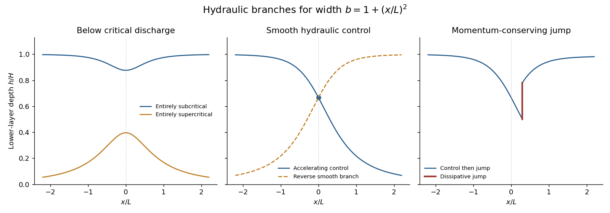

<h1 id="3/a/solution">Solution</h1>

↑ **Parent:** [A](../a.md)

The [shallow-water approximation](../../../../../../shallow-water-approximation.md) requires the depth to be small compared with the horizontal scale of variation, small vertical accelerations and nearly hydrostatic pressure. Take cross-sectionally uniform lower-layer velocity and a sufficiently deep, effectively stationary upper layer. Under the [Boussinesq approximation](../../../../../../boussinesq-approximation.md), $g'=g(\rho_1-\rho_0)/\rho_0$ is the [reduced gravity](../../../../../../reduced-gravity-split.md). Conservation of lower-layer volume gives constant discharge $Q=bhu$.

Dividing the [Bernoulli equation](../../../../../../bernoulli-equation.md) by $g'$ gives the [shallow-water specific energy](../../../../../../shallow-water-specific-energy.md)

$$
\boxed{E=h+\frac{Q^2}{2g'b^2h^2},\qquad
\left.\frac{\partial E}{\partial h}\right|_{Q,b}=1-\frac{Q^2}{g'b^2h^3}=1-F^2,\qquad
F=\frac{u}{\sqrt{g'h}}.}
$$

At fixed $Q,b$, the energy curve has its minimum at the critical depth $h_c=(Q^2/(g'b^2))^{1/3}$, where $E_c=3h_c/2$. Above this minimum there are two depth branches: deeper [subcritical flow](../../../../../../subcritical-flow.md) has $F<1$, and shallower [supercritical flow](../../../../../../supercritical-flow.md) has $F>1$.

The two long-wave speeds relative to the bed are $u\pm\sqrt{g'h}$. In subcritical flow one family can propagate upstream and one downstream; in supercritical flow both travel downstream for $u>0$. At [hydraulic control](../../../../../../hydraulic-control.md), $u-\sqrt{g'h}=0$, and a smooth transcritical solution must also satisfy the geometric regularity condition. The flow may remain entirely on either branch, cross smoothly through the control from subcritical to supercritical, or take the reverse smooth branch under appropriate boundary conditions. A downstream [hydraulic jump](../../../../../../hydraulic-jump.md) can return supercritical flow to the subcritical branch while losing energy.

**[Figure 1](#3/a/image-depth-branches-in-a-contracting-and-expanding-channel-including-hydraulic-control-and-a-dissipative-hydraulic-jump). Depth branches in a contracting and expanding channel, including hydraulic control and a dissipative hydraulic jump**.

The sketch distinguishes smooth branch changes at a critical section from a jump: a jump conserves mass and momentum, not the original Bernoulli head.

## ↑ Ancestors (11)

1. [A](../a.md)
2. [3](../../3.md)
3. [Paper 76](../../../paper-76-split.md)
4. [Iii](../../../split.md)
5. [2003](../../../../split.md)
6. [Past exam of the mathematics course of the University of Cambridge](../../../../../split.md)
7. [Mathematics course of the University of Cambridge](../../../../../../mathematics-course-of-the-university-of-cambridge.md)
8. [Course of the University of Cambridge](../../../../../../course-of-the-university-of-cambridge.md)
9. [University of Cambridge](../../../../../../university-of-cambridge-split.md)
10. [List of universities](../../../../../../list-of-universities.md)
11. [Codex Wiki](../../../../../../split.md)
