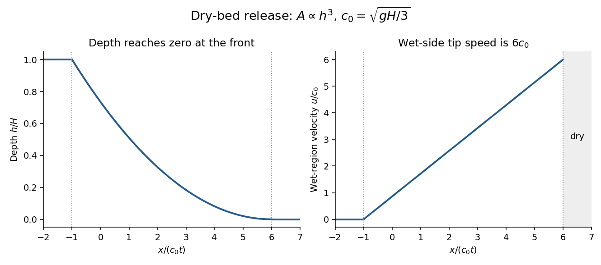

<h1 id="4/b/solution">Solution</h1>

↑ **Parent:** [B](../b.md)

Put the broken dam at $x=0$ and let $c_0=\sqrt{gH/3}$. A dry bed is assumed downstream. The left-family [rarefaction wave](../../../../../../rarefaction-wave.md) joins the undisturbed reservoir $h=H,u=0$ to the dry front. The other [Riemann invariant](../../../../../../riemann-invariant.md) is fixed at $u+6c=6c_0$. Within the fan its characteristic speed equals $\xi=x/t=u-c$, so

$$
c=\frac{6c_0-\xi}{7},\qquad
u=\frac6{7}(c_0+\xi).
$$

Thus the [dry-bed dam break with cubic wetted area](../../../../../../dry-bed-dam-break-with-cubic-wetted-area.md) has the fields

$$
\boxed{h(x,t)=\begin{cases}
H,&x/t\leq-c_0,\\
H\left[\frac{6-x/(c_0t)}7\right]^2,&-c_0<x/t<6c_0,\\
0,&x/t\geq6c_0,
\end{cases}}
$$

$$
\boxed{u(x,t)=\begin{cases}
0,&x/t\leq-c_0,\\
\frac6{7}(c_0+x/t),&-c_0<x/t<6c_0.
\end{cases}\qquad x_f(t)=6c_0t.}
$$

Velocity is not a meaningful fluid quantity in the dry region; its wet-side limiting value is $u_f=6c_0=2\sqrt{3gH}$. The upstream head travels at $-c_0$, while the front travels at the stated constant speed in this inviscid model.

**[Figure 2](#4/b/image-depth-and-velocity-profiles-for-the-dry-bed-dam-break-with-the-printed-cubic-wetted-area-geometry). Depth and velocity profiles for the dry-bed dam break with the printed cubic wetted-area geometry**.

Bottom drag slows the flow and changes the dry-tip structure, where the depth is small and bed stress per unit fluid mass becomes especially important. It can replace the inviscid zero-depth high-speed tail by a drag-controlled nose. An exact altered profile or front speed requires a specified drag law; the inviscid speed should not be extrapolated to a thin real irrigation-channel front without that qualification.

## ↑ Ancestors (11)

1. [B](../b.md)
2. [4](../../4.md)
3. [Paper 76](../../../paper-76-split.md)
4. [Iii](../../../split.md)
5. [2003](../../../../split.md)
6. [Past exam of the mathematics course of the University of Cambridge](../../../../../split.md)
7. [Mathematics course of the University of Cambridge](../../../../../../mathematics-course-of-the-university-of-cambridge.md)
8. [Course of the University of Cambridge](../../../../../../course-of-the-university-of-cambridge.md)
9. [University of Cambridge](../../../../../../university-of-cambridge-split.md)
10. [List of universities](../../../../../../list-of-universities.md)
11. [Codex Wiki](../../../../../../split.md)
