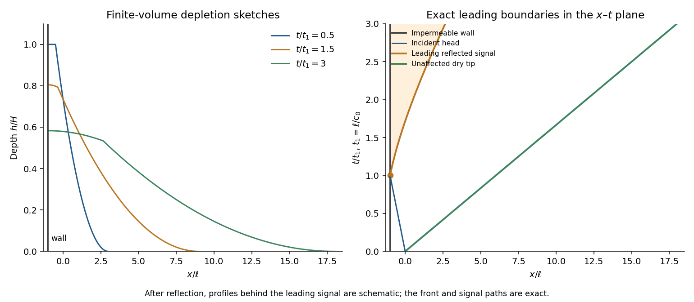

<h1 id="4/c/solution">Solution</h1>

↑ **Parent:** [C](../c.md)

Treat the newly placed sand barrier as impermeable during the initial release. The downstream isolated reservoir occupies $-\ell<x<0$ with depth $H$ and has finite volume $\alpha H^3\ell/3$. The remaining upstream water stays behind the barrier; it does not continuously feed the released region. Assume $\ell\gg H$ so that the [shallow-water approximation](../../../../../../shallow-water-approximation.md) is appropriate.

Until the rarefaction head reaches the barrier at

$$
\boxed{t_1=\ell/c_0,}
$$

the previous dam-break solution is unchanged on the released side. The wall imposes $u(-\ell,t)=0$. After $t_1$, a reflected downstream family adjusts the flow near the wall. It is a lowering/depletion adjustment, not a new upstream supply. The upstream depth decreases, the finite water volume spreads downstream, and the unmodified simple-wave region shrinks relatively.

The leading characteristic of this adjustment can be determined exactly without solving the whole reflected region. In the still-unmodified fan,

$$
\frac{dx_r}{dt}=u+c=\frac{12c_0+5x_r/t}{7},\qquad x_r(t_1)=-\ell.
$$

Integrating gives the [finite-reservoir reflection of a cubic-area dam-break rarefaction](../../../../../../finite-reservoir-reflection-of-a-cubic-area-dam-break-rarefaction.md):

$$
\boxed{x_r(t)=6c_0t-7c_0t_1^{2/7}t^{5/7},\qquad t\geq t_1.}
$$

The solution to the right of this curve is still the original fan. Crucially $x_f-x_r=7c_0t_1^{2/7}t^{5/7}>0$ at every finite time. Therefore the ideal inviscid dry tip remains at $x_f=6c_0t$: finite reservoir volume does not by itself justify an immediate change to that front law. Only a vanishingly small amount of fluid occupies its very thin forward tail at late times. Bottom drag, leakage or other front physics changes this conclusion.

**[Figure 3](#4/c/image-finite-reservoir-depletion-sketches-and-the-exact-leading-reflected-characteristic-in-the-x-t-plane). Finite-reservoir depletion sketches and the exact leading reflected characteristic in the x–t plane**.

The profiles behind the reflected edge are schematic; there the two characteristic families interact and the original one-invariant fan no longer supplies the complete fields. The x–t diagram distinguishes the wall, the incident head, the exact reflected leading edge and the unaffected dry-tip trajectory.

## ↑ Ancestors (11)

1. [C](../c.md)
2. [4](../../4.md)
3. [Paper 76](../../../paper-76-split.md)
4. [Iii](../../../split.md)
5. [2003](../../../../split.md)
6. [Past exam of the mathematics course of the University of Cambridge](../../../../../split.md)
7. [Mathematics course of the University of Cambridge](../../../../../../mathematics-course-of-the-university-of-cambridge.md)
8. [Course of the University of Cambridge](../../../../../../course-of-the-university-of-cambridge.md)
9. [University of Cambridge](../../../../../../university-of-cambridge-split.md)
10. [List of universities](../../../../../../list-of-universities.md)
11. [Codex Wiki](../../../../../../split.md)
