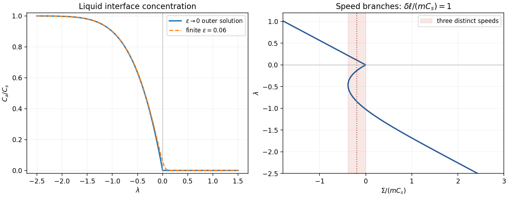
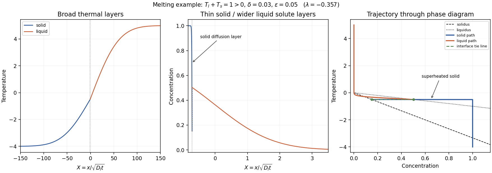

<h1 id="2/solution">Solution</h1>

↑ **Parent:** [2](../2.md)

Use $\ell=L/c_p$, $\epsilon=\sqrt{D_s/D_l}$ and $\delta=\sqrt{D_l/\kappa}$, with $0<k_D<1$. Equal reference densities and constant material properties are implicit in these diffusion balances. Put $a(t)=2\lambda\sqrt{D_lt}$ and $T_a=-mC_a$. The four similarity fields are

$$
\begin{aligned}
T_s(x,t)&=T_s+(T_a-T_s)\frac{\operatorname{erfc}[-x/(2\sqrt{\kappa t})]}{\operatorname{erfc}(-\delta\lambda)},&&x<a,\\
T_l(x,t)&=T_l+(T_a-T_l)\frac{\operatorname{erfc}[x/(2\sqrt{\kappa t})]}{\operatorname{erfc}(\delta\lambda)},&&x>a,\\
C_s(x,t)&=C_s+(k_DC_a-C_s)\frac{\operatorname{erfc}[-x/(2\sqrt{D_st})]}{\operatorname{erfc}(-\lambda/\epsilon)},&&x<a,\\
C_l(x,t)&=C_a\frac{\operatorname{erfc}[x/(2\sqrt{D_lt})]}{\operatorname{erfc}(\lambda)},&&x>a.
\end{aligned}
$$

Here the same letters $T_s,T_l,C_s$ on the right denote their far-field values. Substitution into the heat and solute diffusion equations verifies the fields; their interface values and far-field limits verify every boundary condition. The [concentration](../../../../../concentration.md) has an equilibrium jump from $k_DC_a$ to $C_a$, whereas [temperature](../../../../../temperature.md) is continuous.

The interfacial conservation laws are

$$
\kappa(T_{s,x}-T_{l,x})=\ell\dot a,
\qquad D_s C_{s,x}-D_l C_{l,x}=(1-k_D)C_a\dot a.
$$

For example,

$$
T_{s,x}(a)=\frac{(T_a-T_s)e^{-\delta^2\lambda^2}}{\sqrt{\pi\kappa t}\operatorname{erfc}(-\delta\lambda)},\quad
T_{l,x}(a)=\frac{(T_l-T_a)e^{-\delta^2\lambda^2}}{\sqrt{\pi\kappa t}\operatorname{erfc}(\delta\lambda)}.
$$

Since $\dot a=\lambda\sqrt{D_l/t}$, dividing the two jump conditions by $\dot a$ gives, for nonzero $\lambda$,

$$
\boxed{\ell=\frac{T_a-T_s}{-F(-\delta\lambda)}-\frac{T_l-T_a}{F(\delta\lambda)},\qquad
(1-k_D)C_a=\frac{k_DC_a-C_s}{-F(-\lambda/\epsilon)}+\frac{C_a}{F(\lambda)},}
$$

where $F(z)=\sqrt\pi z e^{z^2}\operatorname{erfc}z$. At $\lambda=0$, use the undivided flux conditions or the continuous limit, rather than divide by zero. The [liquidus](../../../../../liquidus.md) relation and the [segregation coefficient](../../../../../solid-liquid-segregation-coefficient.md) also give the [solidus](../../../../../solidus.md) $T_S(C)=-mC/k_D$.

For the thermal expansion, write $z=\delta\lambda$ and use

$$
F(z)=\sqrt\pi z-2z^2+O(z^3),\qquad
\frac1{F(z)}=\frac1{\sqrt\pi z}+\frac2\pi+O(z).
$$

Keeping the constant terms in these reciprocals is essential for the full first-order answer. The result is

$$
\boxed{T_a=\frac{T_l+T_s}{2}+\frac{\sqrt\pi}{2}\delta\lambda
\left[\ell+\frac2\pi(T_l-T_s)\right]+O(\delta^3(|\ell|+|T_l-T_s|)).}
$$

The remainder has this form for bounded $\lambda$; a looser $O(\delta^2)$ statement is also valid in the distinguished scaling $\ell=O(\delta^{-1})$. Dropping the temperature-difference term while claiming first-order accuracy for fixed $\ell$ would be incorrect.

Solving the solute balance algebraically gives

$$
C_a=\frac{C_s/F(-\lambda/\epsilon)}{(1-k_D)+k_D/F(-\lambda/\epsilon)-1/F(\lambda)}.
$$

For fixed positive $\lambda$, $F(-\lambda/\epsilon)\to-\infty$, and $C_a\to0$, with a positive exponentially small correction. For fixed negative $\lambda$, $F(-\lambda/\epsilon)\to1$, and

$$
\boxed{C_a=\frac{C_sF(\lambda)}{F(\lambda)-1},\qquad \lambda<0.}
$$

It falls from $C_s$ as $\lambda\to-\infty$ to zero as $\lambda\to0^-$. The outer positive branch is zero. For finite $\epsilon$ the transition is rounded over $|\lambda|=O(\epsilon)$; the exact zero-speed limit is $C_a(0)=\epsilon C_s/(1+k_D\epsilon)$, not an actual [concentration](../../../../../concentration.md) discontinuity.

To count speeds, take the leading distinguished thermal balance, set $\Sigma=T_l+T_s$ and $K=\sqrt\pi\delta\ell$, and combine $T_a=-mC_a$ with the thermal result:

$$
\boxed{\Sigma=-2mC_a(\lambda)-K\lambda.}
$$

This is the intended leading approximation when $\delta\ell=O(mC_s)$ and $T_l-T_s=O(1)$. The full first-order expression instead replaces $K$ by $\sqrt\pi\delta[\ell+2(T_l-T_s)/\pi]$. Thus the printed threshold is asymptotic, not an exact criterion for finite $\delta,\epsilon$.

For $r=-\lambda>0$, put $H(r)=\sqrt\pi r e^{r^2}\operatorname{erfc}(-r)$. The [small-solid-diffusivity melting concentration](../../../../../small-solid-diffusivity-melting-concentration.md) is $C_sH/(1+H)$, so

$$
\Sigma(r)=Kr-2mC_s\frac{H(r)}{1+H(r)},\qquad
\Sigma'(r)=K-2mC_s\frac{H'(r)}{[1+H(r)]^2}.
$$

The second term decreases strictly from $2mC_s\sqrt\pi$ to zero. One can check the strict decrease without guessing its shape. Set $A(r)=\sqrt\pi e^{r^2}\operatorname{erfc}(-r)$, so $A'=2rA+2$, $A\geq\sqrt\pi+2r$, and $H=rA$. Direct differentiation gives

$$
2H'^2-(1+H)H''
=2\{(1+r^2+2r^4)A^2+r(4r^2-1)A+2r^2-2\}>0.
$$

The bracket increases with $A$ on $r\geq0$. Substituting its lower bound yields a [polynomial](../../../../../polynomial-split.md) with constant coefficient $\pi-2>0$ and all other coefficients positive. Hence $[H'/(1+H)^2]' <0$, as claimed.

If $\delta\ell>2mC_s$, then $K>2mC_s\sqrt\pi$ and $\Sigma(r)$ increases from zero to infinity. The freezing branch has $\Sigma=-K\lambda<0$ and is also monotone. Together these give **one speed for each imposed sum** within the approximation. If $0<\delta\ell<2mC_s$, the melting branch initially decreases, has exactly one minimum and then increases to infinity. For sums between that minimum and zero there are **two melting speeds plus one freezing speed: three solutions**. At the lower fold there are two distinct speeds, one being a double solution. At zero the limiting outer branches join; finite solid diffusivity rounds the join into a nearby fold. Away from the fold values the other sums have one solution. At the threshold itself the initial slope vanishes; it is the transition between these cases.

**[Figure 1](#2/image-interfacial-concentration-and-the-three-speed-region-in-the-leading-binary-alloy-similarity-model). Interfacial concentration and the three-speed region in the leading binary-alloy similarity model**.

For $\Sigma>0$, the solution is on the melting branch $\lambda<0$. Its thermal layers have scale $\sqrt{\kappa t}=\sqrt{D_lt}/\delta$, much larger than the liquid-solute scale $\sqrt{D_lt}$. Because the front is retreating, the solid solute layer is thinner still:

$$
\boxed{\text{solid solute thickness}\sim\frac{D_s}{|\dot a|}
=\frac{\epsilon^2\sqrt{D_lt}}{|\lambda|}.}
$$

This follows by expanding the large-positive-argument [complementary error function](../../../../../complementary-error-function.md) ratio on the solid side: near $a$, its decay length is $D_s/|\dot a|$. Using simply $\sqrt{D_st}$ would miss the retreating-front compression of that layer.

Across this narrow layer, solid [concentration](../../../../../concentration.md) drops from almost $C_s$ to $k_DC_a$, while [temperature](../../../../../temperature.md) stays almost $T_a$. At the interface $T_a=T_S(k_DC_a)$. Moving slightly into the solid increases its [concentration](../../../../../concentration.md) toward $C_s$, lowering its solidus to $-mC_s/k_D$, whereas the [temperature](../../../../../temperature.md) has barely changed. Since $C_a<C_s$ and $k_D<1$, $T_a=-mC_a>-mC_s/k_D$. Thus an adjacent region can satisfy **$T>T_S(C)$: constitutional superheating**. Its existence is especially clear when far-field solid is initially stable but heat diffuses across the narrow composition layer.

The phase-diagram path goes from $(C_s,T_s)$ through a broad thermal rise, then nearly horizontally toward $(k_DC_a,T_a)$ across the thin solid diffusion layer. At the interface it traverses the isothermal equilibrium tie line to $(C_a,T_a)$. On the liquid side [concentration](../../../../../concentration.md) falls to zero over the liquid-solute layer, while the remaining thermal adjustment to $T_l$ takes place over the much wider heat layer. The path of the depleted solid approaches the solidus from its superheated side. That region should melt at additional sites or develop a two-phase [mushy layer](../../../../../mushy-layer.md); the original single-boundary similarity construction is then a mathematical branch rather than a physically stable description of the entire sample.

**[Figure 2](#2/image-melting-branch-temperature-and-solute-layers-and-their-trajectory-through-the-alloy-phase-diagram). Melting-branch temperature and solute layers and their trajectory through the alloy phase diagram**.

## ↑ Ancestors (10)

1. [2](../2.md)
2. [Paper 77](../../paper-77-split.md)
3. [Iii](../../split.md)
4. [2003](../../../split.md)
5. [Past exam of the mathematics course of the University of Cambridge](../../../../split.md)
6. [Mathematics course of the University of Cambridge](../../../../../mathematics-course-of-the-university-of-cambridge.md)
7. [Course of the University of Cambridge](../../../../../course-of-the-university-of-cambridge.md)
8. [University of Cambridge](../../../../../university-of-cambridge-split.md)
9. [List of universities](../../../../../list-of-universities.md)
10. [Codex Wiki](../../../../../split.md)
