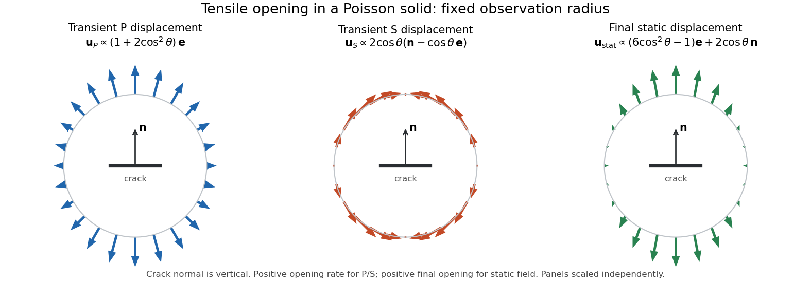

<h1 id="4/iv/solution">Solution</h1>

↑ **Parent:** [Iv](../iv.md)

The first two terms are the radiative [P wave](../../../../../../p-wave.md) and [S wave](../../../../../../s-wave.md) displacements:

$$
\boxed{\mathbf u_P^{\rm rad}=\frac{\lambda+2\mu\gamma^2}{4\pi\rho\alpha^3R}\,\mathbf e\,\dot V(t-R/\alpha),\qquad
\mathbf u_S^{\rm rad}=\frac{2\mu\gamma}{4\pi\rho\beta^3R}(\mathbf n-\gamma\mathbf e)\dot V(t-R/\beta)}.
$$

They decay as $R^{-1}$ and are purely transient: once the opening rate vanishes, each disappears after its respective arrival time. The P displacement is longitudinal and the S displacement transverse. An abrupt opening history makes these formulas distributions; a smooth finite-duration intrusion gives ordinary pulses.

Suppose the source starts from zero opening and ends with volume change $V_0$. At times later than the end of intrusion plus $R/\beta$, both retarded openings equal $V_0$ and

$$
I=\frac{V_0R^2}{2}\left(\frac1{\beta^2}-\frac1{\alpha^2}\right).
$$

The remaining terms combine to the static [displacement field](../../../../../../displacement-field-mechanics.md)

$$
\boxed{\mathbf u_{\rm stat}=\frac{V_0}{4\pi\rho R^2}
\left\{\left[\frac{\lambda+\mu-3\mu\gamma^2}{\alpha^2}
+\frac{\mu(3\gamma^2-1)}{\beta^2}\right]\mathbf e
+\frac{2\mu\gamma}{\alpha^2}\mathbf n\right\}}.
$$

It decays as $R^{-2}$, so it must not be identified with the transient far-field pulses.

For a [Poisson solid](../../../../../../poisson-solid.md), $\lambda=\mu$, $\alpha^2=3\beta^2$ and $\mu=\rho\beta^2$. Let $\theta$ be polar angle from the crack normal, with unit vector $\mathbf e_\theta$ in the increasing-$\theta$ direction. Then $\gamma=\cos\theta$ and $\mathbf n-\gamma\mathbf e=-\sin\theta\mathbf e_\theta$. The [tensile-crack radiation pattern](../../../../../../tensile-crack-radiation-pattern.md) becomes

$$
\boxed{\mathbf u_P^{\rm rad}=\frac{\dot V_P}{12\pi\sqrt3\,\beta R}(1+2\cos^2\theta)\mathbf e,\qquad
\mathbf u_S^{\rm rad}=-\frac{\dot V_S}{4\pi\beta R}\sin2\theta\,\mathbf e_\theta}.
$$

At fixed $R$ and positive opening rate, the P pattern is outward, has no angular node, and is three times larger along the normal than in the crack plane. The signed S amplitude has four alternating lobes: it vanishes along the normal and in the crack plane, and its magnitude is maximal at $45^\circ$ to them. Neither field has an azimuthal SH component about the crack normal.

The final static field simplifies to

$$
\boxed{\mathbf u_{\rm stat}=\frac{V_0}{12\pi R^2}
[(6\cos^2\theta-1)\mathbf e+2\cos\theta\mathbf n]
=\frac{V_0}{12\pi R^2}[(8\cos^2\theta-1)\mathbf e-\sin2\theta\mathbf e_\theta]}.
$$

Its radial part is outward near the poles, changes sign at $\cos^2\theta=1/8$, and is inward in the crack plane. The tangential part has the same signed angular factor as the S radiation, but is permanent and has a different distance dependence. Its radial sign changes are not nodes of the whole vector because the tangential component generally remains nonzero there. Rotating a meridional sketch around the crack normal gives the complete three-dimensional axisymmetric pattern.

**[Figure 1](#4/iv/image-transient-p-and-s-displacement-patterns-and-final-static-displacement-for-a-tensile-crack-in-a-poisson-solid). Transient P and S displacement patterns and final static displacement for a tensile crack in a Poisson solid**.

The arrows show displacement at points on a circle of constant observation radius. Each panel uses its own scale; the separate formulas retain the physical P/S prefactors and arrival times. The normal is vertical and the crack lies horizontally.

## ↑ Ancestors (11)

1. [Iv](../iv.md)
2. [4](../../4.md)
3. [Paper 78](../../../paper-78-split.md)
4. [Iii](../../../split.md)
5. [2003](../../../../split.md)
6. [Past exam of the mathematics course of the University of Cambridge](../../../../../split.md)
7. [Mathematics course of the University of Cambridge](../../../../../../mathematics-course-of-the-university-of-cambridge.md)
8. [Course of the University of Cambridge](../../../../../../course-of-the-university-of-cambridge.md)
9. [University of Cambridge](../../../../../../university-of-cambridge-split.md)
10. [List of universities](../../../../../../list-of-universities.md)
11. [Codex Wiki](../../../../../../split.md)
