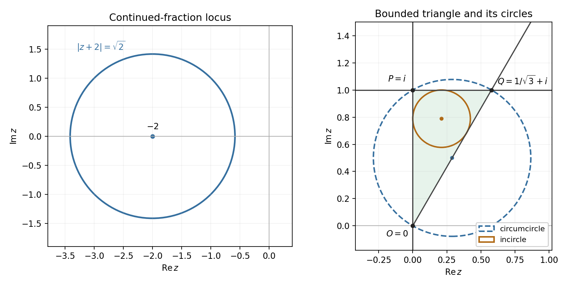

<h1 id="7a/solution">Solution</h1>

↑ **Parent:** [7A](../7a.md)

Put $q=|z|^2$ and retain the domain restriction $z\ne0$. Then $z+1/\bar z=(q+1)/\bar z$, so the continued fraction simplifies to

$$
\boxed{\zeta=\frac{q+1}{\bar z(q+2)}
=\frac{z(q+1)}{q(q+2)}.}
$$

The other denominators are nonzero automatically because $q+1,q+2>0$. Writing $z=x+iy$, the real-part condition becomes

$$
\frac{x(q+1)}{q(q+2)}=\frac{x+1/4}{q}.
$$

Multiplying by $q(q+2)$ and rearranging gives $q+4x+2=0$. Thus the first [geometric locus](../../../../../geometric-locus.md) in the [complex plane](../../../../../complex-plane.md) is the [circle](../../../../../circle.md)

$$
\boxed{(x+2)^2+y^2=2,\quad\text{or equivalently }|z+2|=\sqrt2.}
$$

Its center is $-2$ and radius is $\sqrt2$; it does not contain the excluded point $z=0$ on its circumference.

The [principal complex logarithm](../../../../../principal-complex-logarithm.md) has imaginary part equal to the [complex argument](../../../../../argument-complex-analysis.md), so its equation gives the open ray

$$
z=re^{i\pi/3},\qquad r>0,
\quad\text{equivalently }y=\sqrt3x,\ x>0.
$$

If one interprets the logarithm as multivalued, requiring a value with imaginary part $\pi/3$ gives the same ray. Expanding $z^2$ in the other equation gives $2ixy=2ix$, hence $x(y-1)=0$. Its solution is the union of the entire imaginary axis and the horizontal line $y=1$.

These latter loci bound a [right triangle](../../../../../right-triangle.md) with vertices

$$
O=0,\qquad P=i,\qquad Q=\frac1{\sqrt3}+i.
$$

The bounded open region is **$0<x<1/\sqrt3$, $\sqrt3x<y<1$**. Its closure is the closed [triangle](../../../../../triangle.md). Although the logarithm is undefined at $O$, the imaginary-axis locus includes that vertex. The earlier [circle](../../../../../circle.md) is a separate locus and is not a side of this [triangle](../../../../../triangle.md).

The right angle is at $P$, so the [circumcenter](../../../../../circumcenter.md) is the midpoint of hypotenuse $OQ$:

$$
z_c=\frac1{2\sqrt3}+\frac i2,\qquad R=\frac{|Q|}{2}=\frac1{\sqrt3}.
$$

Thus its [circumcircle](../../../../../circumcircle.md) has the complex equation

$$
\boxed{\left|z-\left(\frac1{2\sqrt3}+\frac i2\right)\right|^2=\frac13.}
$$

To find the [incircle](../../../../../incircle-of-a-triangle.md), let its radius be $r$. Tangency to $x=0$ and $y=1$ puts its center at $z_i=r+i(1-r)$. The distance from that point to $y-\sqrt3x=0$ is $(1-r-\sqrt3r)/2$. Requiring this distance to be $r$ gives

$$
r=\frac1{3+\sqrt3}=\frac{3-\sqrt3}{6}.
$$

Therefore

$$
\boxed{|z-[r+i(1-r)]|^2=r^2,\qquad r=\frac{3-\sqrt3}{6}.}
$$

This tangent [circle](../../../../../circle.md) is indeed the largest contained [circle](../../../../../circle.md). For any contained disk of radius $\rho$, its center has distances $d_j\geq\rho$ from the three side lines. Splitting the [triangle](../../../../../triangle.md) into [triangles](../../../../../triangle.md) with that center as vertex gives area $\Delta=\tfrac12\sum_j\ell_jd_j\geq s\rho$, where $s$ is its semiperimeter. Here $\Delta=1/(2\sqrt3)$ and $s=(1+\sqrt3)/2$, so $\rho\leq\Delta/s=r$. Our [circle](../../../../../circle.md) attains this [upper bound](../../../../../upper-bound-in-a-partially-ordered-set.md), proving maximality rather than just tangency.

**[Figure 1](#7a/image-complex-loci-and-the-bounded-triangle-with-its-circumcircle-and-incircle). Complex loci and the bounded triangle with its circumcircle and incircle**.

## ↑ Ancestors (10)

1. [7A](../7a.md)
2. [Paper 1](../../paper-1-split.md)
3. [Ia](../../split.md)
4. [2004](../../../split.md)
5. [Past exam of the mathematics course of the University of Cambridge](../../../../split.md)
6. [Mathematics course of the University of Cambridge](../../../../../mathematics-course-of-the-university-of-cambridge.md)
7. [Course of the University of Cambridge](../../../../../course-of-the-university-of-cambridge.md)
8. [University of Cambridge](../../../../../university-of-cambridge-split.md)
9. [List of universities](../../../../../list-of-universities.md)
10. [Codex Wiki](../../../../../split.md)
