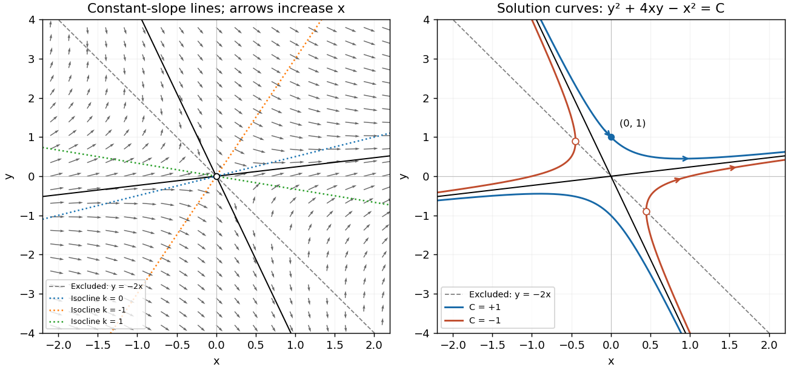
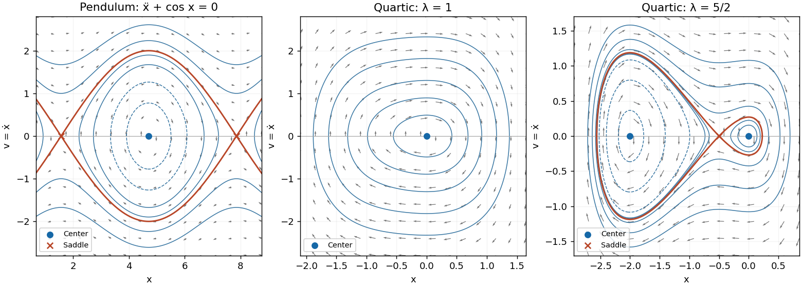

# Paper 2

↑ **Parent:** [Ia](../ia.md)

[https://www.maths.cam.ac.uk/undergrad/pastpapers/files/2004/PaperIA_2.pdf](https://www.maths.cam.ac.uk/undergrad/pastpapers/files/2004/PaperIA_2.pdf)

**Table of contents**

- [Section I](#section-i)
  - [1B](#1b)
    - [Solution](#1b/solution)
  - [2B](#2b)
    - [Solution](#2b/solution)
  - [3F](#3f)
    - [Solution](#3f/solution)
    - [a](#3f/a)
      - [Solution](#3f/a/solution)
    - [b](#3f/b)
      - [Solution](#3f/b/solution)
  - [4F](#4f)
    - [Solution](#4f/solution)
- [Section II](#section-ii)
  - [5B](#5b)
    - [Solution](#5b/solution)
  - [6B](#6b)
    - [Solution](#6b/solution)
  - [7B](#7b)
    - [Solution](#7b/solution)
    - [i](#7b/i)
      - [Solution](#7b/i/solution)
    - [ii](#7b/ii)
      - [Solution](#7b/ii/solution)
  - [8B](#8b)
    - [Solution](#8b/solution)
  - [9F](#9f)
    - [Solution](#9f/solution)
  - [10F](#10f)
    - [Solution](#10f/solution)
  - [11F](#11f)
    - [Solution](#11f/solution)
  - [12F](#12f)
    - [Solution](#12f/solution)

## Section I

↑ **Parent:** [Paper 2](paper-2.md)

### 1B

↑ **Parent:** [Section I](#section-i)

<h4 id="1b/solution">Solution</h4>

↑ **Parent:** [1B](#1b)

For a straight-line solution $y=mx$, substitution into the [differential equation](../../../differential-equation.md) gives $m=(1-2m)/(2+m)$. Thus $m^2+4m-1=0$, and the two possible slopes are

$$
\boxed{m_\pm=-2\pm\sqrt5.}
$$

These straight lines solve the [differential equation](../../../differential-equation.md) on either side of the origin. At the origin itself the right-hand side is undefined.

An [isocline](../../../differential-equation.md#isocline) of slope $k$ has equation $(1-2k)x-(2+k)y=0$. For $k\ne-2$ it is the straight line $y=(1-2k)x/(2+k)$; for $k=-2$ it is $x=0$, excluding the origin. In particular, $y=x/2$ is the zero-slope [isocline](../../../differential-equation.md#isocline). The line $y=-2x$ is excluded from the domain of the [differential equation](../../../differential-equation.md); slopes tend to infinity on approaching it. Draw the flow vectors proportional to $(1,(x-2y)/(2x+y))$, with positive horizontal component. This specifies orientation by increasing $x$, rather than by an auxiliary time variable.

To integrate, put $y=xu$ where $x\ne0$. Then

$$
xu'=\frac{1-4u-u^2}{2+u},\qquad
\int\frac{2+u}{1-4u-u^2}\,du=\int\frac{dx}{x}.
$$

The left-hand [integral](../../../calculus.md#integral) is $-\tfrac12\log|1-4u-u^2|$, so the nonconstant-$u$ solutions have the [first integral](../../../differential-equation.md#first-integral)

$$
\boxed{y^2+4xy-x^2=C.}
$$

The constant-$u$ solutions omitted by separation are exactly the two straight lines already found, corresponding to $C=0$. Alternatively, differentiating this [first integral](../../../differential-equation.md#first-integral) gives $(2y+4x)y'+4y-2x=0$, which recovers the original [differential equation](../../../differential-equation.md) wherever $2x+y\ne0$ and also verifies continuation through $x=0$ when $y\ne0$.

The [first integral](../../../differential-equation.md#first-integral) describes [hyperbolas](../../../geometry-and-topology.md#hyperbola) with the two straight-line solutions as [asymptotes](../../../topology.md#asymptote). For $C=1$, the upper branch crosses the vertical axis at $(0,1)$ and exists for every real $x$. For $C=-1$, each branch is confined to $|x|\geq1/\sqrt5$ and reaches a vertical tangent on the excluded line $y=-2x$; the corresponding classical solution intervals exclude those endpoints. These give the two distinct types of curves requested in the sketch.

The [initial condition](../../../differential-equation.md#initial-condition) selects $C=1$ and the upper branch, hence

$$
\boxed{y(x)=-2x+\sqrt{5x^2+1},\qquad -\infty<x<\infty.}
$$

Here $2x+y=\sqrt{5x^2+1}>0$, so this really is a global solution of the [initial value problem](../../../differential-equation.md#initial-value-problem), and $y'(0)=-2$ agrees with the right-hand side.

**[Figure 1](#1b/image-isoclines-increasing-x-flow-vectors-and-the-two-types-of-solution-hyperbolas). Isoclines, increasing-x flow vectors and the two types of solution hyperbolas**.

### 2B

↑ **Parent:** [Section I](#section-i)

<h4 id="2b/solution">Solution</h4>

↑ **Parent:** [2B](#2b)

Write $y=e^{-px}v$. Direct differentiation gives

$$
y''+2py'+p^2y=e^{-px}v''.
$$

The [homogeneous linear differential equation](../../../differential-equation.md#homogeneous-linear-differential-equation) therefore has $v=A+Bx$. A [linearly independent](../../../vector-space.md#linear-independence) pair of solutions is

$$
\boxed{y_1=e^{-px},\qquad y_2=xe^{-px}.}
$$

Their [Wronskian](../../../differential-equation.md#wronskian) is $e^{-2px}$, which never vanishes; the argument also includes $p=0$.

For the [inhomogeneous linear differential equation](../../../differential-equation.md#inhomogeneous-linear-differential-equation), the same substitution gives $v''=1$. Since $y(0)=0$ implies $v(0)=0$, and $y'(0)=0$ then implies $v'(0)=0$, integration gives $v=x^2/2$. Thus the required solution of the [initial value problem](../../../differential-equation.md#initial-value-problem) is

$$
\boxed{y(x)=\frac{x^2}{2}e^{-px}.}
$$

### 3F

↑ **Parent:** [Section I](#section-i)

<h4 id="3f/solution">Solution</h4>

↑ **Parent:** [3F](#3f)

For [random variables](../../../random-variable.md) with finite second [moments](../../../probability-theory.md#moment), their [covariance](../../../variance.md#covariance) is

$$
\boxed{\operatorname{cov}(X,Y)=\mathbb E\big[(X-\mathbb EX)(Y-\mathbb EY)\big]=\mathbb E[XY]-\mathbb EX\,\mathbb EY.}
$$

The [Cauchy-Schwarz inequality](../../../probability-and-statistics.md#cauchy-schwarz-inequality) ensures the product is integrable under this hypothesis. More generally the definition works whenever the displayed [expectations](../../../probability-theory.md#expected-value) exist. Assertions about arbitrary [random variables](../../../random-variable.md) below are understood on this domain: without suitable moments a [covariance](../../../variance.md#covariance) need not be defined at all.

<h4 id="3f/a">a</h4>

↑ **Parent:** [3F](#3f)

<h5 id="3f/a/solution">Solution</h5>

↑ **Parent:** [A](#3f/a)

[Linearity of expectation](../../../probability-theory.md#linearity-of-expectation) gives $\mathbb E(X+Y)=\mathbb EX+\mathbb EY$. Expand the centered product and use [linearity of expectation](../../../probability-theory.md#linearity-of-expectation) again:

$$
\begin{aligned}
\operatorname{cov}(X+Y,Z)
&=\mathbb E\big[((X-\mathbb EX)+(Y-\mathbb EY))(Z-\mathbb EZ)\big]\\
&=\operatorname{cov}(X,Z)+\operatorname{cov}(Y,Z).
\end{aligned}
$$

Thus **the assertion is true whenever the covariances are defined**. Neither [independence](../../../random-variable.md#independent-random-variables) nor identical distributions are required.

<h4 id="3f/b">b</h4>

↑ **Parent:** [3F](#3f)

<h5 id="3f/b/solution">Solution</h5>

↑ **Parent:** [B](#3f/b)

The [covariance](../../../variance.md#covariance) is symmetric, because multiplication of real [random variables](../../../random-variable.md) is commutative. Expanding with the [bilinearity](../../../linear-algebra.md#bilinearity) just proved gives

$$
\begin{aligned}
\operatorname{cov}(X+Y,X-Y)
&=\operatorname{var}(X)-\operatorname{cov}(X,Y)
 +\operatorname{cov}(Y,X)-\operatorname{var}(Y)\\
&=\operatorname{var}(X)-\operatorname{var}(Y).
\end{aligned}
$$

Identical [probability distributions](../../../probability-theory.md#probability-distribution) imply equal second [moments](../../../probability-theory.md#moment) and equal [means](../../../probability-theory.md#expected-value), hence equal [variances](../../../variance.md). Therefore **the assertion is true**, with

$$
\boxed{\operatorname{cov}(X+Y,X-Y)=0.}
$$

The cancellation shows exactly why no assumption of [independence](../../../random-variable.md#independent-random-variables) is needed.

### 4F

↑ **Parent:** [Section I](#section-i)

<h4 id="4f/solution">Solution</h4>

↑ **Parent:** [4F](#4f)

A [probability density function](../../../continuous-probability-distribution.md#probability-density-function) must integrate to one. Therefore

$$
1=c\int_0^1x(1-x)\,dx=c\left(\frac12-\frac13\right),
\qquad\boxed{c=6}.
$$

The first two [moments](../../../probability-theory.md#moment) are

$$
\mathbb EX=6\int_0^1x^2(1-x)\,dx=6\left(\frac13-\frac14\right)=\frac12,
\qquad
\mathbb EX^2=6\int_0^1x^3(1-x)\,dx=6\left(\frac14-\frac15\right)=\frac3{10}.
$$

Consequently the [mean](../../../probability-theory.md#expected-value) and [variance](../../../variance.md) are

$$
\boxed{\mathbb EX=\frac12,\qquad \operatorname{var}(X)=\frac3{10}-\frac14=\frac1{20}.}
$$

## Section II

↑ **Parent:** [Paper 2](paper-2.md)

### 5B

↑ **Parent:** [Section II](#section-ii)

<h4 id="5b/solution">Solution</h4>

↑ **Parent:** [5B](#5b)

The origin is an [ordinary point](../../../complex-analysis.md#ordinary-point-criterion-for-a-second-order-equation), since the coefficients of the [second-order linear differential equation](../../../differential-equation.md#second-order-linear-differential-equation) are [polynomials](../../../polynomial.md). Seek a [power series](../../../real-analysis.md#power-series) $y=\sum_{n\geq0}a_nx^n$. Matching the coefficients of $x^0$ and $x^1$ gives $a_2=a_3=0$. Matching the coefficient of $x^{j+2}$ gives

$$
(j+4)(j+3)a_{j+4}+(4j+1)a_j=0,
\qquad
\boxed{a_{j+4}=-\frac{4j+1}{(j+4)(j+3)}a_j\quad(j\geq0).}
$$

Thus the four residue classes of indices modulo four evolve separately. The [initial conditions](../../../differential-equation.md#initial-condition) for the first solution give $a_0=1$, $a_1=0$, and hence

$$
y_1(x)=\sum_{m=0}^{\infty}(-1)^m
\left(\prod_{j=0}^{m-1}\frac{16j+1}{(4j+4)(4j+3)}\right)x^{4m}
=1-\frac{x^4}{12}+\frac{17x^8}{672}-\frac{17x^{12}}{2688}+\cdots.
$$

The second set of [initial conditions](../../../differential-equation.md#initial-condition) gives $a_0=0$, $a_1=1$, and

$$
y_2(x)=\sum_{m=0}^{\infty}(-1)^m
\left(\prod_{j=0}^{m-1}\frac{16j+5}{(4j+5)(4j+4)}\right)x^{4m+1}
=x-\frac{x^5}{4}+\frac{7x^9}{96}-\frac{259x^{13}}{14976}+\cdots.
$$

An empty product equals one. In either [power series](../../../real-analysis.md#power-series), the ratio of successive nonzero terms tends to zero for every fixed $x$: the coefficient ratio is of order $1/m$, while the power increases by four. The [ratio test](../../../real-analysis.md#ratio-test) therefore proves convergence for every $x$, and termwise differentiation verifies the [differential equation](../../../differential-equation.md). These normalized solutions are [linearly independent](../../../vector-space.md#linear-independence).

For their [Wronskian](../../../differential-equation.md#wronskian) $W=y_1y_2'-y_1'y_2$, differentiating and substituting the [differential equation](../../../differential-equation.md) gives

$$
W'=y_1y_2''-y_1''y_2=-4x^3W,\qquad W(0)=1.
$$

Thus the [Abel identity](../../../differential-equation.md#abel-s-identity) yields

$$
\boxed{W(x)=e^{-x^4}.}
$$

On the interval containing zero where $y_1$ has no zero,

$$
\left(\frac{y_2}{y_1}\right)'=\frac{W}{y_1^2}=\frac{e^{-x^4}}{y_1(x)^2}.
$$

Since $y_2(0)/y_1(0)=0$, integration proves the requested [reduction of order](../../../differential-equation.md#reduction-of-order) formula:

$$
\boxed{y_2(x)=y_1(x)\int_0^x\frac{e^{-\xi^4}}{y_1(\xi)^2}\,d\xi.}
$$

This is a local formula around the origin, as requested. The [power series](../../../real-analysis.md#power-series) define both solutions globally; an ordinary integral through a zero of $y_1$ is not intended. [Reduction of order across a zero of the known solution](../../../differential-equation.md#reduction-of-order-across-a-zero-of-the-known-solution) instead uses continuation of the actual solution.

### 6B

↑ **Parent:** [Section II](#section-ii)

<h4 id="6b/solution">Solution</h4>

↑ **Parent:** [6B](#6b)

Substitute the [linear recurrence relation](../../../algebra.md#linear-recurrence-relation) for each of $p_{n+2}$ and $q_{n+2}$ in the [discrete Wronskian](../../../algebra.md#discrete-wronskian):

$$
\begin{aligned}
W_{n+1}
&=p_{n+1}[-b(n)q_{n+1}-c(n)q_n]
 -[-b(n)p_{n+1}-c(n)p_n]q_{n+1}\\
&=c(n)(p_nq_{n+1}-p_{n+1}q_n)=c(n)W_n.
\end{aligned}
$$

Iterating gives

$$
\boxed{W_{n+1}=W_1\prod_{m=1}^nc(m).}
$$

No division was used, so vanishing $c(m)$ cause no exception.

For constant coefficients, seek a solution $x_n=r^n$. The [characteristic equation of a linear recurrence](../../../algebra.md#characteristic-equation-of-a-linear-recurrence) is $r^2+\alpha r+1=0$. Choose $\theta\in[0,\pi]$ with $\cos\theta=-\alpha/2$. Its roots are $r=e^{i\theta}$ and $e^{-i\theta}$, since $r+r^{-1}=2\cos\theta$. For the two resulting solutions,

$$
\boxed{W_n=e^{-i\theta}-e^{i\theta}=-2i\sin\theta.}
$$

It is independent of $n$, exactly as the product identity predicts when $c(n)=1$.

When $-2<\alpha<2$ the roots are distinct and the [discrete Wronskian](../../../algebra.md#discrete-wronskian) is nonzero. At $\alpha=-2$ or $2$, the two displayed solutions coincide and $W_n=0$; the identity still holds. If an independent pair is wanted at these endpoints, take $r^n$ and $nr^n$, where $r=1$ or $-1$ respectively. Direct substitution verifies both, and their [discrete Wronskian](../../../algebra.md#discrete-wronskian) is $r^{2n+1}=r\ne0$.

### 7B

↑ **Parent:** [Section II](#section-ii)

<h4 id="7b/solution">Solution</h4>

↑ **Parent:** [7B](#7b)

Introduce the velocity variable $v=\dot x$. The [second-order differential equation](../../../differential-equation.md#second-order-differential-equation) becomes the [autonomous planar system](../../../dynamical-systems.md#autonomous-planar-system)

$$
\boxed{\dot x=v,\qquad \dot v=f(x,v).}
$$

A [critical point of a dynamical system](../../../dynamical-systems.md#equilibrium-point-of-a-dynamical-system) is a point where both components of the [vector field](../../../calculus.md#vector-field) vanish: here $v=0$ and $f(x,0)=0$. It is a stationary solution in the [phase plane](../../../dynamical-systems.md#phase-plane). The [Jacobian matrix](../../../calculus.md#jacobian-matrix) at each such point gives the local [linear stability of a planar equilibrium](../../../dynamical-systems.md#linear-stability-of-a-planar-equilibrium). For the equations below, a conserved [energy](../../../classical-mechanics.md#energy) also determines the nonlinear [phase portrait](../../../dynamical-systems.md#phase-portrait); this is important because purely imaginary [eigenvalues](../../../linear-operator-theory.md#eigenvalue) alone do not generally prove that an equilibrium is a [center equilibrium](../../../dynamical-systems.md#center-equilibrium).

<h4 id="7b/i">i</h4>

↑ **Parent:** [7B](#7b)

<h5 id="7b/i/solution">Solution</h5>

↑ **Parent:** [I](#7b/i)

Here the [autonomous planar system](../../../dynamical-systems.md#autonomous-planar-system) is $\dot x=v$, $\dot v=-\cos x$. Its [equilibrium points](../../../dynamical-systems.md#equilibrium-point-of-a-dynamical-system) are

$$
\boxed{(x_*,v_*)=(\pi/2+n\pi,0),\qquad n\in\mathbb Z.}
$$

The [Jacobian matrix](../../../calculus.md#jacobian-matrix) is

$$
J_*=\begin{pmatrix}0&1\\ \sin x_*&0\end{pmatrix},
\qquad \mu^2=\sin x_*=(-1)^n.
$$

For even $n$, the [eigenvalues](../../../linear-operator-theory.md#eigenvalue) are $1,-1$, so these points are unstable [saddle equilibria](../../../dynamical-systems.md#saddle-equilibrium). Writing $\xi=x-x_*$, their local unstable and stable directions are $v=\xi$ and $v=-\xi$ respectively. For odd $n$, the [eigenvalues](../../../linear-operator-theory.md#eigenvalue) are $i,-i$.

To classify the latter points nonlinearly, differentiate the [first integral](../../../differential-equation.md#first-integral)

$$
H(x,v)=\frac{v^2}{2}+\sin x:
\qquad \dot H=v(-\cos x)+\cos x\,v=0.
$$

At $x_*=3\pi/2+2m\pi$ this [energy](../../../classical-mechanics.md#energy) has a strict local minimum. Its nearby [level sets](../../../topology.md#level-set) are closed curves, proving that the odd-$n$ points are stable [center equilibria](../../../dynamical-systems.md#center-equilibrium), with no attraction to the center. The [phase portrait](../../../dynamical-systems.md#phase-portrait) consists of closed oscillatory orbits for $-1<H<1$, [heteroclinic orbits](../../../dynamical-systems.md#heteroclinic-orbit) at $H=1$ joining consecutive [saddle equilibria](../../../dynamical-systems.md#saddle-equilibrium), and open rotating orbits for $H>1$. The separating curves have

$$
v=\pm\sqrt{2(1-\sin x)}.
$$

Above the horizontal axis $\dot x=v>0$, so flow is rightward; below it flow is leftward. The closed orbits are clockwise, and these same signs orient every separating and rotating orbit.

<h4 id="7b/ii">ii</h4>

↑ **Parent:** [7B](#7b)

<h5 id="7b/ii/solution">Solution</h5>

↑ **Parent:** [Ii](#7b/ii)

For both parameters the [autonomous planar system](../../../dynamical-systems.md#autonomous-planar-system) is $\dot x=v$, $\dot v=-x(x^2+\lambda x+1)$. It has the conserved [energy](../../../classical-mechanics.md#energy)

$$
H=\frac{v^2}{2}+V_\lambda(x),\qquad
V_\lambda(x)=\frac{x^4}{4}+\frac{\lambda x^3}{3}+\frac{x^2}{2}.
$$

Indeed $\dot H=v\dot v+V_\lambda'(x)\dot x=0$. At any [equilibrium point](../../../dynamical-systems.md#equilibrium-point-of-a-dynamical-system) $(x_*,0)$ the [eigenvalues](../../../linear-operator-theory.md#eigenvalue) satisfy

$$
\mu^2=-V_\lambda''(x_*)=-(3x_*^2+2\lambda x_*+1).
$$

For $\lambda=1$, the quadratic $x^2+x+1$ is strictly positive, so the only [equilibrium point](../../../dynamical-systems.md#equilibrium-point-of-a-dynamical-system) is $(0,0)$, with [eigenvalues](../../../linear-operator-theory.md#eigenvalue) $\pm i$. Since $V_1'(x)$ has the sign of $x$, $V_1$ has a unique strict minimum at zero and tends to infinity in both directions. All positive [energy](../../../classical-mechanics.md#energy) levels are closed curves surrounding this stable [center equilibrium](../../../dynamical-systems.md#center-equilibrium). They are clockwise: rightward when $v>0$ and leftward when $v<0$.

For $\lambda=5/2$, factor $x^2+(5/2)x+1=(x+2)(x+1/2)$. The three [equilibrium points](../../../dynamical-systems.md#equilibrium-point-of-a-dynamical-system) and their classifications are

$$
\boxed{\begin{array}{c|c|c}
(x_*,0)&\text{eigenvalues}&\text{type}\\\hline
(-2,0)&\pm i\sqrt3&\text{center}\\
(-1/2,0)&\pm\sqrt3/2&\text{saddle}\\
(0,0)&\pm i&\text{center}
\end{array}}
$$

The two [center equilibria](../../../dynamical-systems.md#center-equilibrium) are stable but not asymptotically stable; the [saddle equilibrium](../../../dynamical-systems.md#saddle-equilibrium) is unstable. At the [saddle equilibrium](../../../dynamical-systems.md#saddle-equilibrium) the local unstable and stable directions are $v=(\sqrt3/2)(x+1/2)$ and $v=-(\sqrt3/2)(x+1/2)$.

The potential values are $V(-2)=-2/3$, $V(0)=0$, and $V(-1/2)=7/192$. Consequently there are closed loops around the left center for $-2/3<H<0$, closed loops in both wells for $0<H<7/192$, and a figure-eight pair of [homoclinic orbits](../../../dynamical-systems.md#homoclinic-orbit) at $H=7/192$. At $H=0$ the right center is a stationary point while the left well still has a closed orbit. For $H>7/192$, each closed curve encircles both centers and the saddle.

The two [homoclinic orbits](../../../dynamical-systems.md#homoclinic-orbit) satisfy $v=\pm\sqrt{2(7/192-V(x))}$. Their outer turning points can be located exactly from

$$
V(x)-\frac7{192}=\frac{(2x+1)^2(12x^2+28x-7)}{192},
\qquad
x_{\rm L,R}=\frac{-7\mp\sqrt{70}}6.
$$

Every nonstationary [energy](../../../classical-mechanics.md#energy) curve is oriented to the right in the upper half-plane and to the left in the lower half-plane. The sketches show the closed curves, the separating orbits, the stable and unstable saddle directions and the direction of flow.

**[Figure 2](#7b/ii/image-clockwise-phase-flows-alternating-pendulum-saddles-and-centers-and-the-one-well-and-two-well-quartic-potentials). Clockwise phase flows, alternating pendulum saddles and centers, and the one-well and two-well quartic potentials**.

### 8B

↑ **Parent:** [Section II](#section-ii)

<h4 id="8b/solution">Solution</h4>

↑ **Parent:** [8B](#8b)

Write the [linear differential equation](../../../differential-equation.md#linear-differential-equation) as $\dot{\mathbf x}=M\mathbf x$, with

$$
M=\begin{pmatrix}-4&-3\\3&-4\end{pmatrix}.
$$

Its [characteristic polynomial](../../../linear-operator-theory.md#characteristic-polynomial) is $(\lambda+4)^2+9$. Thus a choice of [eigenvalues](../../../linear-operator-theory.md#eigenvalue) and [eigenvectors](../../../linear-operator-theory.md#eigenvector) is

$$
\boxed{\lambda_1=-4+3i,\quad\mathbf x^{(1)}=\binom1{-i},
\qquad\lambda_2=-4-3i,\quad\mathbf x^{(2)}=\binom1i.}
$$

The distinct [eigenvalues](../../../linear-operator-theory.md#eigenvalue) give two [linearly independent](../../../vector-space.md#linear-independence) solutions, and the general complex solution is

$$
\mathbf x(t)=a_1\mathbf x^{(1)}e^{\lambda_1t}+a_2\mathbf x^{(2)}e^{\lambda_2t}.
$$

Real solutions have $a_2=\overline{a_1}$. Equivalently,

$$
\mathbf x(t)=e^{-4t}\binom{C\cos3t-D\sin3t}{C\sin3t+D\cos3t},\qquad C,D\in\mathbb R.
$$

They spiral counterclockwise towards the origin, which is a [stable spiral](../../../dynamical-systems.md#stable-spiral).

In a forced [linear differential equation](../../../differential-equation.md#linear-differential-equation), [resonance in a differential equation](../../../differential-equation.md#resonance-in-a-differential-equation) occurs when exponential forcing excites a mode with the same exponent as its [eigenvalue](../../../linear-operator-theory.md#eigenvalue), producing a polynomial factor such as $t$ multiplying that exponential. Merely matching an exponent is not enough: its projection onto that mode must be nonzero. Here $te^{\lambda_jt}$ still decays in absolute magnitude because the real part of $\lambda_j$ is negative; resonance refers to this extra factor, not necessarily to unbounded growth.

For each forcing vector, resolve it in the [eigenvector](../../../linear-operator-theory.md#eigenvector) basis:

$$
\binom{p_j}{q_j}=c_{1j}\binom1{-i}+c_{2j}\binom1i,
\qquad c_{1j}=\frac{p_j+iq_j}{2},\quad c_{2j}=\frac{p_j-iq_j}{2}.
$$

If $u_k$ is the coefficient of the $k$th [eigenvector](../../../linear-operator-theory.md#eigenvector), its scalar equation is $\dot u_k=\lambda_k u_k+\sum_jc_{kj}e^{\lambda_jt}$. Multiplying by $e^{-\lambda_kt}$ and integrating shows that the $j=k$ contribution is $c_{kk}te^{\lambda_kt}$, whereas a $j\ne k$ contribution is $c_{kj}e^{\lambda_jt}/(\lambda_j-\lambda_k)$. Therefore the exact conditions for no resonant response are

$$
\boxed{p_1+iq_1=0,\qquad p_2-iq_2=0.}
$$

Under these conditions one [particular solution](../../../differential-equation.md#particular-solution) is

$$
\mathbf x_{\rm p}(t)=\frac{c_{21}}{6i}\mathbf x^{(2)}e^{\lambda_1t}
-\frac{c_{12}}{6i}\mathbf x^{(1)}e^{\lambda_2t},
$$

which contains no factor of $t$. For a real forcing, $p_2=\overline{p_1}$ and $q_2=\overline{q_1}$, and the two boxed conditions are conjugate to each other.

### 9F

↑ **Parent:** [Section II](#section-ii)

<h4 id="9f/solution">Solution</h4>

↑ **Parent:** [9F](#9f)

The [probability generating function](../../../probability-theory.md#probability-generating-function) is

$$
p_X(z)=\mathbb E[z^X]=\sum_{n\geq1}\mathbb P(X=n)z^n,\qquad |z|\leq1.
$$

For [independent random variables](../../../random-variable.md#independent-random-variables), the bounded factors $z^X$ and $z^Y$ have factorizing [expectation](../../../probability-theory.md#expected-value), so

$$
\boxed{p_{X+Y}(z)=\mathbb E[z^Xz^Y]=\mathbb E[z^X]\mathbb E[z^Y]=p_X(z)p_Y(z).}
$$

This includes complex $z$ in the indicated disk by absolute convergence.

For the dice construction, encode the labels of an ordinary die by $F(z)=z+z^2+\cdots+z^6$. Its [probability generating function](../../../probability-theory.md#probability-generating-function) is $F(z)/6$. A useful factorization into [polynomial factors](../../../polynomial.md#polynomial-factor) is

$$
F(z)=z(1+z)(1+z+z^2)(1-z+z^2).
$$

Use [redistribution of polynomial factors for dice](../../../probability-theory.md#redistribution-of-polynomial-factors-for-dice) to define

$$
\begin{aligned}
A(z)&=\frac{F(z)}{1-z+z^2}=z(1+z)(1+z+z^2)=z+2z^2+2z^3+z^4,\\
B(z)&=F(z)(1-z+z^2)=z+z^3+z^4+z^5+z^6+z^8.
\end{aligned}
$$

Both [polynomials](../../../polynomial.md) have nonnegative integer [coefficients](../../../vector-space.md#coefficient), no constant term, and coefficient sum six. They therefore describe fair six-sided dice with strictly positive face labels

$$
\boxed{A:(1,2,2,3,3,4),\qquad B:(1,3,4,5,6,8).}
$$

When these dice are thrown with [independent](../../../random-variable.md#independent-random-variables) outcomes, the sum has [probability generating function](../../../probability-theory.md#probability-generating-function) $A(z)B(z)/36=F(z)^2/36$. Equality of [coefficients](../../../vector-space.md#coefficient) proves equality of every sum [probability](../../../probability-theory.md#probability), including all totals from two to twelve, with zero probability outside that range. Both dice are nonstandard, completing the construction.

### 10F

↑ **Parent:** [Section II](#section-ii)

<h4 id="10f/solution">Solution</h4>

↑ **Parent:** [10F](#10f)

For [events](../../../probability-theory.md#event) with $\mathbb P(B)>0$, the [conditional probability](../../../probability-theory.md#conditional-probability) is

$$
\boxed{\mathbb P(A\mid B)=\frac{\mathbb P(A\cap B)}{\mathbb P(B)}.}
$$

Use the [sample space](../../../probability-theory.md#sample-space) $\Omega=\{1,2,3,4\}\times\{0,1\}^4$, where the first coordinate is the chosen coin and the other coordinates record which of its two physically distinguished faces lands upwards on each toss. There are $4\cdot16=64$ equally likely elementary outcomes. Label the double-headed coin by one. For that coin both face indices mean heads; for each other coin only face index one means heads. In particular, strings of observed heads and tails are not equally likely outcomes.

Let $E$ be the [event](../../../probability-theory.md#event) that the first three tosses show heads. With coin one all sixteen face-index strings are permitted. For each ordinary coin the first three indices must be one and the fourth is free, giving two strings. Thus $|E|=16+3\cdot2=22$. Of these outcomes, sixteen from the double-headed coin and one from each ordinary coin also have a fourth head. Hence

$$
\boxed{\mathbb P(\text{fourth head}\mid E)=\frac{16+3}{22}=\frac{19}{22}.}
$$

Equivalently, [Bayes' theorem](../../../probability-theory.md#bayes-theorem) gives [conditional probability](../../../probability-theory.md#conditional-probability) $8/11$ of having selected the double-headed coin after $E$; the fourth-head [probability](../../../probability-theory.md#probability) is then $8/11+(3/11)(1/2)=19/22$. The tosses are [independent](../../../random-variable.md#independent-random-variables) conditional on the selected coin, while mixing over the same coin explains their unconditional dependence.

### 11F

↑ **Parent:** [Section II](#section-ii)

<h4 id="11f/solution">Solution</h4>

↑ **Parent:** [11F](#11f)

Take $\lambda>0$ as the rate of the [exponential distribution](../../../continuous-probability-distribution.md#exponential-distribution). By [independence](../../../random-variable.md#independent-random-variables), the [joint probability density](../../../continuous-probability-distribution.md#joint-probability-density) of the original pair is $\lambda^2e^{-\lambda(x_1+x_2)}$ on $x_1,x_2>0$. Put $s=Y_1$, $r=Y_2$. The inverse [change of variables](../../../calculus.md#change-of-variables-formula) is

$$
x_1=\frac{sr}{1+r},\qquad x_2=\frac{s}{1+r},\qquad s>0,\ r>0.
$$

Its [Jacobian determinant](../../../calculus.md#jacobian-determinant) is

$$
\det\frac{\partial(x_1,x_2)}{\partial(s,r)}
=\det\begin{pmatrix}r/(1+r)&s/(1+r)^2\\1/(1+r)&-s/(1+r)^2\end{pmatrix}
=-\frac{s}{(1+r)^2}.
$$

Using the absolute value in the [change of variables formula](../../../calculus.md#change-of-variables-formula), the transformed [joint probability density](../../../continuous-probability-distribution.md#joint-probability-density) is

$$
\boxed{f_{Y_1,Y_2}(s,r)=\frac{\lambda^2s e^{-\lambda s}}{(1+r)^2}\quad(s>0,r>0),}
$$

and zero otherwise. The support is the entire positive quadrant, and the factors are separately normalized:

$$
\int_0^\infty\lambda^2s e^{-\lambda s}\,ds=1,
\qquad \int_0^\infty\frac{dr}{(1+r)^2}=1.
$$

Integrating out either variable therefore yields these factors as the [marginal densities](../../../probability-theory.md#marginal-density). Factorization of the [joint probability density](../../../continuous-probability-distribution.md#joint-probability-density) proves [independence](../../../random-variable.md#independent-random-variables), with

$$
\boxed{f_{Y_1}(s)=\lambda^2s e^{-\lambda s}\ (s>0),\qquad f_{Y_2}(r)=\frac1{(1+r)^2}\ (r>0).}
$$

The sum has a shape-two [gamma distribution](../../../continuous-probability-distribution.md#gamma-distribution), and the ratio has a [beta-prime distribution](../../../continuous-probability-distribution.md#beta-prime-distribution) with parameters one and one, independent of $\lambda$. Its [cumulative distribution function](../../../probability-theory.md#cumulative-distribution-function) is $r/(1+r)$ for $r>0$.

### 12F

↑ **Parent:** [Section II](#section-ii)

<h4 id="12f/solution">Solution</h4>

↑ **Parent:** [12F](#12f)

Because the [events](../../../probability-theory.md#event) are pairwise [disjoint events](../../../probability-theory.md#disjoint-events), their count can only be zero or one. The [event](../../../probability-theory.md#event) that the count is zero is the [complement of an event](../../../probability-theory.md#complement-of-an-event) of their union. Finite additivity therefore gives

$$
\boxed{\mathbb P(N=0)=1-\mathbb P\left(\bigcup_{i=1}^r A_i\right)
=1-\sum_{i=1}^r\mathbb P(A_i).}
$$

Now use $N\geq1$ for the fixed number of independently located ships. Normalize the radius to one and write their positions as unit vectors $a_1,\ldots,a_N$. A point $x$ on the [sphere](../../../geometry-and-topology.md#sphere) is reached by ship $i$ precisely when $a_i\cdot x>0$, so each ship reaches an open [hemisphere](../../../geometry-and-topology.md#hemisphere). Coverage fails exactly when there is a unit vector $x$ with $a_i\cdot x\leq0$ for every $i$. Equivalently, all ship positions lie in some closed [hemisphere](../../../geometry-and-topology.md#hemisphere).

With [probability](../../../probability-theory.md#probability) one no pair of ship vectors is antipodal and no three are linearly dependent: the exceptional choices lie on sets of zero surface area. For such a configuration, containment in a closed [hemisphere](../../../geometry-and-topology.md#hemisphere) implies containment in an open [hemisphere](../../../geometry-and-topology.md#hemisphere). To see this, choose its inward normal $u$, so $u\cdot a_i\geq0$. At most two vectors lie on its boundary. If there are two, their sum has positive dot product with each, since they are not antipodal; if there is one, use that vector itself. Perturb $u$ slightly in this direction. The boundary dot products become positive while all already positive dot products remain positive. Thus the strict and non-strict containment conditions have the same [probability](../../../probability-theory.md#probability) here.

Condition on the unoriented axes $\{a_i,-a_i\}$. Choose representatives $b_i$ by any fixed sign convention. By uniform sampling and [independence](../../../random-variable.md#independent-random-variables), the actual positions are $a_i=\varepsilon_i b_i$ with $N$ [independent](../../../random-variable.md#independent-random-variables) fair signs $\varepsilon_i\in\{-1,1\}$. Conditional on these axes, each of the $2^N$ sign choices has [probability](../../../probability-theory.md#probability) $2^{-N}$.

The [great circles](../../../geometry-and-topology.md#great-circle) $b_i\cdot u=0$ partition the [sphere](../../../geometry-and-topology.md#sphere) into $R_N=N(N-1)+2$ open regions. In each region the sign vector $\sigma(u)=(\operatorname{sgn}(b_i\cdot u))_i$ is constant. No sign vector labels two different regions: its strict inequalities define a convex cone, and normalized line segments within that cone connect any two points of its spherical section. The [regions of a general-position great-circle arrangement](../../../geometry-and-topology.md#regions-of-a-general-position-great-circle-arrangement) therefore yield exactly $R_N$ realized sign vectors.

The chosen positions lie in an open [hemisphere](../../../geometry-and-topology.md#hemisphere) if and only if some $u$ has $u\cdot a_i>0$ for every $i$, that is, $\varepsilon_i=\operatorname{sgn}(b_i\cdot u)$ for every $i$. Failure of coverage thus corresponds exactly to one of the $R_N$ realized sign choices. These choices are mutually exclusive [events](../../../probability-theory.md#event), each of [conditional probability](../../../probability-theory.md#conditional-probability) $2^{-N}$, so the first part applies:

$$
\mathbb P(\text{failure}\mid\text{axes})=\frac{R_N}{2^N}.
$$

The result is independent of the axes. Averaging gives the [coverage of a sphere by random open hemispheres](../../../probability-theory.md#coverage-of-a-sphere-by-random-open-hemispheres):

$$
\boxed{\mathbb P(\text{every point is reached})=1-\frac{N(N-1)+2}{2^N},\qquad N\geq1.}
$$

For $N=1,2,3$ this is zero; for $N=4$ it is $1/8$. If no ship lands, coverage has [probability](../../../probability-theory.md#probability) zero separately. The counting uses equiprobable orientation signs, not an assumption that the spherical regions have equal area.

## ↑ Ancestors (8)

1. [Ia](../ia.md)
2. [2004](../../2004.md)
3. [Past exam of the mathematics course of the University of Cambridge](../../../past-exam-of-the-mathematics-course-of-the-university-of-cambridge.md)
4. [Mathematics course of the University of Cambridge](../../../university-of-cambridge.md#mathematics-course-of-the-university-of-cambridge)
5. [Course of the University of Cambridge](../../../university-of-cambridge.md#course-of-the-university-of-cambridge)
6. [University of Cambridge](../../../university-of-cambridge.md)
7. [List of universities](../../../README.md#list-of-universities)
8. [Codex Wiki](../../../README.md)
