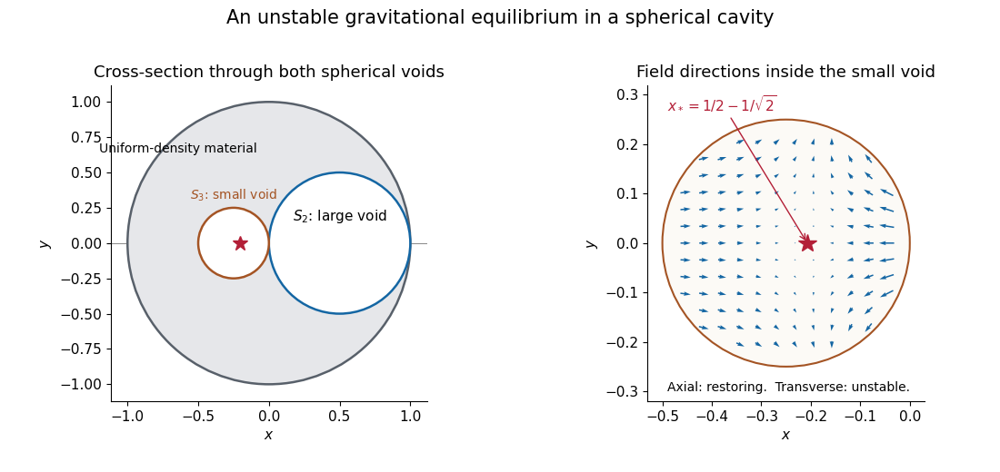

<h1 id="11c/solution">Solution</h1>

↑ **Parent:** [11C](../11c.md)

Choose zero [gravitational potential](../../../../../newtonian-potential-of-a-point-mass.md) at infinity. Apply [superposition](../../../../../superposition-principle.md) to a uniform sphere of positive density and the two voids represented by spheres of negative density. The [shell theorem](../../../../../spherical-shell-theorem.md) makes every component act as a point mass outside the large sphere. With $c_2=(1/2,0,0)$ and $c_3=(-1/4,0,0)$,

$$
\boxed{\Phi(x)=-\frac{4\pi G\rho}{3}\left[\frac1{|x|}-\frac{1/8}{|x-c_2|}-\frac{1/64}{|x-c_3|}\right],\qquad |x|>1.}
$$

The volume factors are the cubes of the three radii.

Inside the smaller void, the large sphere and the removed small sphere have interior fields $-Cx$ and $+C(x-c_3)$, where $C=4\pi G\rho/3$. They combine into the [uniform gravitational field in an off-center spherical cavity](../../../../../uniform-gravitational-field-in-an-off-center-spherical-cavity.md), $-Cc_3=C(1/4,0,0)$. The point is outside the other void's sphere, whose removed mass contributes a repulsive field. Thus

$$
\mathbf g(x)=C\left[\frac14e_1+\frac18\frac{x-c_2}{|x-c_2|^3}\right].
$$

An equilibrium must lie on the line through the two centers. Write $x=qe_1$ with $-1/2<q<0$. Its equation is $1/4-1/[8(1/2-q)^2]=0$, giving

$$
\boxed{x_*=(1/2-1/\sqrt2,0,0).}
$$

This point is inside the smaller void, but it is not stable. Let $d=|x_*-c_2|=1/\sqrt2$. The field's [Jacobian matrix](../../../../../jacobian-matrix.md) has eigenvalues

$$
-\frac{C}{4d^3},\qquad\frac{C}{8d^3},\qquad\frac{C}{8d^3}.
$$

The axial displacement is restoring, while transverse displacements accelerate away from equilibrium. Therefore **there is no point in that void where a test particle remains stably at rest**. The [cavity equilibrium destabilized by a second void](../../../../../cavity-equilibrium-destabilized-by-a-second-void.md) is a saddle; existence of a zero force is insufficient for stability.

**[Figure 1](#11c/image-the-two-spherical-voids-and-the-unstable-equilibrium-inside-the-smaller-void). The two spherical voids and the unstable equilibrium inside the smaller void**.

## ↑ Ancestors (10)

1. [11C](../11c.md)
2. [Paper 3](../../paper-3-split.md)
3. [Ia](../../split.md)
4. [2004](../../../split.md)
5. [Past exam of the mathematics course of the University of Cambridge](../../../../split.md)
6. [Mathematics course of the University of Cambridge](../../../../../mathematics-course-of-the-university-of-cambridge.md)
7. [Course of the University of Cambridge](../../../../../course-of-the-university-of-cambridge.md)
8. [University of Cambridge](../../../../../university-of-cambridge-split.md)
9. [List of universities](../../../../../list-of-universities.md)
10. [Codex Wiki](../../../../../split.md)
