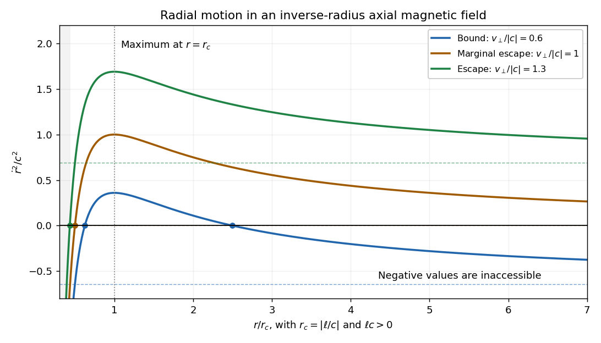

<h1 id="11a/solution">Solution</h1>

↑ **Parent:** [11A](../11a.md)

Taking the [scalar product](../../../../../dot-product.md) of the [Lorentz force](../../../../../lorentz-force.md) equation with the [velocity](../../../../../velocity.md) gives

$$
\frac{d}{dt}\left(\frac12m|\dot{\mathbf r}|^2\right)
=q\dot{\mathbf r}\cdot(\dot{\mathbf r}\times\mathbf B)=0.
$$

The triple product vanishes because the [cross product](../../../../../cross-product.md) is perpendicular to its first factor. Thus **the [kinetic energy](../../../../../kinetic-energy.md) is constant**, even if the [magnetic field](../../../../../magnetic-field.md) varies with [position](../../../../../position.md): [magnetic forces do no work](../../../../../magnetic-forces-do-no-work.md).

In [cylindrical coordinates](../../../../../cylindrical-coordinate-system.md), the radial, angular and vertical equations are

$$
m(\ddot r-r\dot\theta^2)=qr\dot\theta B(r),\qquad
m(r\ddot\theta+2\dot r\dot\theta)=-q\dot r B(r),\qquad
m\ddot z=0.
$$

For a nonstationary circular orbit with constant $r$ and $z$, the first equation gives $-m\dot\theta^2=qB(r)\dot\theta$. Hence its signed [angular velocity](../../../../../angular-velocity.md) is $\boxed{\dot\theta=-qB(r)/m}$. The sign gives the sense of circulation. The zero root describes a stationary transverse [position](../../../../../position.md), not a moving circular orbit. A constant vertical [velocity](../../../../../velocity.md) can be superposed to produce a helix.

Define the mechanical [angular momentum](../../../../../angular-momentum.md) about the axis by $L=mr^2\dot\theta$. Multiplying the angular equation by $r$ gives

$$
\dot L=-qrB(r)\dot r.
$$

For the inverse-radius [magnetic field](../../../../../magnetic-field.md) this becomes $\dot L=-qB_0\dot r$. Integrating from an initial radius $r_0$ proves

$$
\boxed{L=L_0-qB_0(r-r_0).}
$$

Let $c=qB_0/m$ and $\ell=(L_0+qB_0r_0)/m$, so that $L/m=\ell-cr$. Since $\dot z$ is constant and the total [kinetic energy](../../../../../kinetic-energy.md) is constant, the transverse [speed](../../../../../speed.md) squared

$$
v_\perp^2=\dot r^2+r^2\dot\theta^2
$$

is also constant. Substituting the [angular momentum](../../../../../angular-momentum.md) relation gives the required radial curve:

$$
\boxed{\dot r^2=W(r)=v_\perp^2-\left(\frac{\ell}{r}-c\right)^2
=v_\perp^2-c^2+\frac{2\ell c}{r}-\frac{\ell^2}{r^2}.}
$$

Only the region $W(r)\geq0$ is accessible. For $\ell\ne0$, $W(r)\to-\infty$ as $r\to0$, and its horizontal asymptote is $v_\perp^2-c^2$. Its derivative is $W'(r)=2\ell(\ell-cr)/r^3$. Thus, when $\ell c>0$, it has a single maximum $W=v_\perp^2$ at $r=\ell/c$. The positive roots of $W$ are the [turning points](../../../../../turning-point.md) obtained from $r=\ell/(c\pm v_\perp)$.

For nonzero $c$ and $\ell c>0$, write $r_c=|\ell/c|$. When $0<v_\perp<|c|$, two [turning points](../../../../../turning-point.md) occur at

$$
r_-=\frac{r_c}{1+v_\perp/|c|},\qquad
r_+=\frac{r_c}{1-v_\perp/|c|},
$$

and the radius is confined between them. At $v_\perp=|c|$, there is only the finite lower [turning point](../../../../../turning-point.md) $r_c/2$; $W$ tends to zero from above and an outgoing particle reaches arbitrarily large radius. For $v_\perp>|c|$, only the lower [turning point](../../../../../turning-point.md) remains and the outgoing radial [velocity](../../../../../velocity.md) approaches $\sqrt{v_\perp^2-c^2}$. The sketch shows these three cases and omits inaccessible negative values of $\dot r^2$ from the physical interpretation.

**[Figure 1](#11a/image-radial-speed-curves-and-turning-points-in-an-inverse-radius-axial-magnetic-field). Radial-speed curves and turning points in an inverse-radius axial magnetic field**.

For completeness, if $\ell c<0$, $W$ rises monotonically from $-\infty$ to its asymptote; admissible motion then requires $v_\perp>|c|$ and is radially unbound after any inward branch turns. If $\ell=0$, $W=v_\perp^2-c^2$ is constant; equality gives a circular orbit rather than escape. Above threshold the outgoing branch escapes, whereas an incoming branch reaches the singular axis in finite time and cannot be continued through it without specifying a nonsingular core field. These cases explain why a borderline escape assertion needs an initial-direction qualification.

The transverse [escape velocity](../../../../../escape-velocity.md) threshold for [radial escape in an inverse-radius axial magnetic field](../../../../../radial-escape-in-an-inverse-radius-axial-magnetic-field.md) is

$$
\boxed{v_{\perp,\mathrm{esc}}=\frac{|qB_0|}{m}.}
$$

For a radial launch at $r_0$, $\ell=cr_0$, and equality permits marginal escape; for $\ell\ne0$, larger transverse [speed](../../../../../speed.md) guarantees radial escape in forward time after any initial inward leg turns. The singular incoming $\ell=0$ branch is the exception described above. More general launches at equality can instead give the circular exception $\ell=0$. A vertical [velocity](../../../../../velocity.md) adds to the total [speed](../../../../../speed.md) but cannot pay the transverse escape-energy requirement; if escape merely means unbounded $z$, any nonzero $\dot z$ already achieves that. If $qB_0=0$, transverse motion is force-free and there is no positive escape-speed threshold.

## ↑ Ancestors (10)

1. [11A](../11a.md)
2. [Paper 4](../../paper-4-split.md)
3. [Ia](../../split.md)
4. [2004](../../../split.md)
5. [Past exam of the mathematics course of the University of Cambridge](../../../../split.md)
6. [Mathematics course of the University of Cambridge](../../../../../mathematics-course-of-the-university-of-cambridge.md)
7. [Course of the University of Cambridge](../../../../../course-of-the-university-of-cambridge.md)
8. [University of Cambridge](../../../../../university-of-cambridge-split.md)
9. [List of universities](../../../../../list-of-universities.md)
10. [Codex Wiki](../../../../../split.md)
