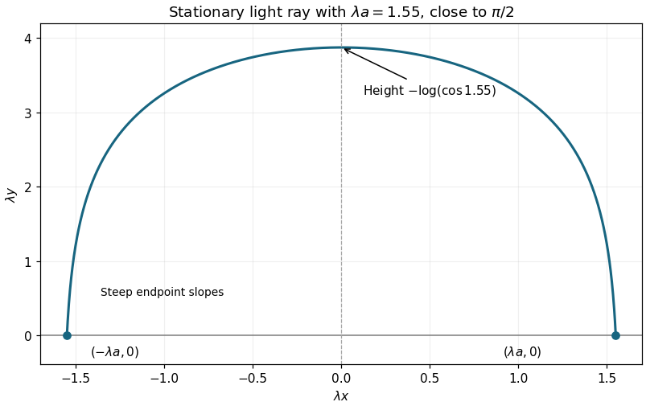

# Paper 3

↑ **Parent:** [Ib](../ib.md)

[https://www.maths.cam.ac.uk/undergrad/pastpapers/files/2004/PaperIB_3.pdf](https://www.maths.cam.ac.uk/undergrad/pastpapers/files/2004/PaperIB_3.pdf)

**Table of contents**

- [1E](#1e)
  - [Solution](#1e/solution)
- [2F](#2f)
  - [Solution](#2f/solution)
- [3G](#3g)
  - [Solution](#3g/solution)
- [4F](#4f)
  - [Solution](#4f/solution)
- [5E](#5e)
  - [Solution](#5e/solution)
- [6D](#6d)
  - [Solution](#6d/solution)
- [7B](#7b)
  - [Solution](#7b/solution)
- [8B](#8b)
  - [Solution](#8b/solution)
- [9D](#9d)
  - [Solution](#9d/solution)
- [10C](#10c)
  - [Solution](#10c/solution)
- [11A](#11a)
  - [Solution](#11a/solution)
- [12G](#12g)
  - [Solution](#12g/solution)
- [13E](#13e)
  - [i](#13e/i)
    - [Solution](#13e/i/solution)
  - [ii](#13e/ii)
    - [Solution](#13e/ii/solution)
  - [iii](#13e/iii)
    - [Solution](#13e/iii/solution)
- [14F](#14f)
  - [i](#14f/i)
    - [Solution](#14f/i/solution)
  - [ii](#14f/ii)
    - [Solution](#14f/ii/solution)
  - [iii](#14f/iii)
    - [Solution](#14f/iii/solution)
  - [iv](#14f/iv)
    - [Solution](#14f/iv/solution)
- [15G](#15g)
  - [Solution](#15g/solution)
- [16F](#16f)
  - [Solution](#16f/solution)
- [17E](#17e)
  - [i](#17e/i)
    - [Solution](#17e/i/solution)
  - [ii](#17e/ii)
    - [Solution](#17e/ii/solution)
  - [iii](#17e/iii)
    - [Solution](#17e/iii/solution)
- [18D](#18d)
  - [Solution](#18d/solution)
- [19B](#19b)
  - [Solution](#19b/solution)
- [20D](#20d)
  - [Solution](#20d/solution)
- [21C](#21c)
  - [Solution](#21c/solution)
- [22A](#22a)
  - [Solution](#22a/solution)
- [23G](#23g)
  - [Solution](#23g/solution)

## 1E

↑ **Parent:** [Paper 3](paper-3.md)

<h3 id="1e/solution">Solution</h3>

↑ **Parent:** [1E](#1e)

The [dual space](../../../linear-algebra.md#dual-space) is $V^*=\operatorname{Hom}_{\mathbb R}(V,\mathbb R)$, the vector space of real-valued [linear maps](../../../vector-space.md#linear-map) on $V$, with pointwise addition and scalar multiplication. Choose a [basis](../../../vector-space.md#basis) $e_1,\ldots,e_n$ of $V$. Every $v$ has unique coordinates $v=\sum_i x_ie_i$, so $e^i(v)=x_i$ defines a [linear functional](../../../linear-algebra.md#linear-functional), with $e^i(e_j)=\delta_{ij}$.

If $\sum_i a_ie^i=0$, evaluation on $e_j$ gives $a_j=0$, proving linear independence. For any $\ell\in V^*$, linearity gives $\ell(v)=\sum_i x_i\ell(e_i)$, hence $\ell=\sum_i\ell(e_i)e^i$. Thus the [dual basis](../../../linear-algebra.md#dual-basis) spans the [dual space](../../../linear-algebra.md#dual-space) as well, proving

$$
\boxed{\dim V^*=n=\dim V.}
$$

## 2F

↑ **Parent:** [Paper 3](paper-3.md)

<h3 id="2f/solution">Solution</h3>

↑ **Parent:** [2F](#2f)

Write $\tau=(1+\sqrt{-3})/2$. The parity condition gives $R=\mathbb Z[\tau]$, since $(a+b\sqrt{-3})/2=(a-b)/2+b\tau$. For any such element,

$$
N(z)=z\overline z=\frac{a^2+3b^2}{4}\ge0.
$$

If $a,b$ are even the numerator is divisible by four; if they are odd it is congruent to $1+3=0$ modulo four. Therefore **$N(z)$ is a nonnegative integer**. It is zero only at zero, and the [Eisenstein-integer norm](../../../commutative-algebra.md#eisenstein-integer-norm) is multiplicative because [complex conjugation](../../../complex-analysis.md#complex-conjugation) respects multiplication.

If $z$ is a unit, $N(z)N(z^{-1})=1$, so $N(z)=1$. Conversely $N(z)=1$ makes $\overline z$ its inverse in $R$. The equation $a^2+3b^2=4$ permits exactly $(a,b)=(\pm2,0)$ or $(\pm1,\pm1)$. Hence

$$
\boxed{R^\times=\{\pm1,\pm\tau,\pm\tau^2\},\qquad |R^\times|=6.}
$$

Indeed $\tau^2=\tau-1$ and $\tau^3=-1$, so this [unit group](../../../algebra.md#unit-group) is cyclic of order six.

For the prime-ideal assertion, $\tau^2-\tau+1=0$ and the polynomial $t^2-t+1$ has distinct roots $3,5$ modulo seven. Consequently evaluation at either root defines a surjective ring map $R\to\mathbb F_7$. Its kernels

$$
\mathfrak p=(7,\tau-3),\qquad\mathfrak q=(7,\tau-5)
$$

are distinct [maximal ideals](../../../commutative-algebra.md#maximal-ideal), hence [prime ideals](../../../commutative-algebra.md#prime-ideal). If $A+B\tau$ belongs to both, then $A+3B\equiv A+5B\equiv0\pmod7$. Subtraction gives $2B\equiv0$, so both $A$ and $B$ are divisible by seven. The converse inclusion is immediate, proving

$$
\boxed{7R=\mathfrak p\cap\mathfrak q.}
$$

Equivalently, the two distinct factors of the reduced polynomial give the [Chinese remainder theorem](../../../mathematics.md#chinese-remainder-theorem) decomposition $R/7R\cong\mathbb F_7\times\mathbb F_7$. This proof does not require the permitted unique-factorization assumption.

## 3G

↑ **Parent:** [Paper 3](paper-3.md)

<h3 id="3g/solution">Solution</h3>

↑ **Parent:** [3G](#3g)

The [Euler formula for a sphere](../../../homology.md#euler-formula-for-a-sphere), applied to the surface of a convex polyhedron, is **$V-E+F=2$**. In a regular polyhedron let $q\ge3$ be the common number of edges incident at a vertex. Counting vertex-edge and face-edge incidences, pentagonal faces give $qV=2E$ and $5F=2E$. Hence

$$
2=E\left(\frac2q-1+\frac25\right),
$$

whose right-hand side can be positive only if $q<10/3$. Thus $q=3$. Substitution then yields $2=E/15$, proving

$$
\boxed{E=30,\qquad V=20,\qquad F=12.}
$$

These are the counts of the [dodecahedron](../../../geometry-and-topology.md#dodecahedron). Here regular polyhedron is understood in the convex, ordinary-face sense used by the stated Euler formula; self-intersecting star constructions do not share these hypotheses.

## 4F

↑ **Parent:** [Paper 3](paper-3.md)

<h3 id="4f/solution">Solution</h3>

↑ **Parent:** [4F](#4f)

Nonnegativity and symmetry of the [maximum product metric](../../../topological-analysis.md#maximum-product-metric) follow from those of the two factor metrics. Its value is zero precisely when both coordinates agree. For three points $u=(x,x')$, $v=(y,y')$, $w=(z,z')$, the two [triangle inequalities](../../../topological-analysis.md#triangle-inequality) give

$$
D(u,w)\le\max\{d(x,y)+d(y,z),d'(x',y')+d'(y',z')\}
\le D(u,v)+D(v,w).
$$

All metric axioms therefore hold.

When the two factors are the same [metric space](../../../topological-analysis.md#metric-space), consider an off-diagonal point $(x,y)$ and set $\delta=d(x,y)>0$. A product-metric ball of radius $\delta/3$ cannot contain any $(z,z)$: such membership would imply $d(x,z),d(y,z)<\delta/3$ and then $d(x,y)<2\delta/3$, a contradiction. The complement of the diagonal is thus open, so

$$
\boxed{\Delta\text{ is closed in }X\times X.}
$$

This proves the [closed diagonal of a metric space](../../../topological-analysis.md#closed-diagonal-of-a-metric-space). Equality of the factors here means equality as metric spaces, as intended; merely sharing an underlying set while allowing unrelated metrics would be a different assertion.

## 5E

↑ **Parent:** [Paper 3](paper-3.md)

<h3 id="5e/solution">Solution</h3>

↑ **Parent:** [5E](#5e)

The contour has [winding number](../../../complex-analysis.md#winding-number) one around the single pole at zero. By the [Cauchy integral formula](../../../analysis.md#cauchy-integral-formula), or the [residue](../../../analysis.md#residue) of $1/z$,

$$
\boxed{\oint_C\frac{dz}z=2\pi i.}
$$

Rotation by $z\mapsto iz$ carries each oriented edge to the next oriented edge and leaves $dz/z$ unchanged. The four edge integrals are therefore equal, each $\pi i/2$.

On the right edge use $z=1+it$, $-1\le t\le1$, so

$$
\frac{\pi i}{2}=\int_{-1}^1\frac{i\,dt}{1+it}
=\int_{-1}^1\frac{t+i}{1+t^2}\,dt
=i\int_{-1}^1\frac{dt}{1+t^2}.
$$

The real integrand $t/(1+t^2)$ is odd and integrates to zero. Dividing by $i$ gives **$\int_{-1}^1(1+t^2)^{-1}dt=\pi/2$** without needing its real antiderivative.

## 6D

↑ **Parent:** [Paper 3](paper-3.md)

<h3 id="6d/solution">Solution</h3>

↑ **Parent:** [6D](#6d)

For an endpoint-fixed variation $\eta=\delta x$,

$$
\delta S=\int_0^T(\dot x\dot\eta-\omega^2x\eta)dt
=[\dot x\eta]_0^T-\int_0^T(\ddot x+\omega^2x)\eta\,dt.
$$

The boundary term vanishes. Thus every solution of the [harmonic oscillator equation](../../../classical-mechanics.md#simple-harmonic-motion) is stationary for this [action functional](../../../classical-mechanics.md#action). For $\sin\omega T\ne0$, the endpoint-matching solution is the linear combination

$$
x_c(t)=\frac{a\sin\omega(T-t)+b\sin\omega t}{\sin\omega T},
$$

which directly satisfies $x_c(0)=a$, $x_c(T)=b$ and $\ddot x_c=-\omega^2x_c$. This proves stationarity, rather than assuming the explicit path is a minimum.

On that path, $(x_c\dot x_c)'=\dot x_c^2-\omega^2x_c^2$, so [integration by parts](../../../calculus.md#integration-by-parts) reduces the entire action to an endpoint term. The endpoint derivatives are

$$
\dot x_c(0)=\frac{\omega(b-a\cos\omega T)}{\sin\omega T},\qquad
\dot x_c(T)=\frac{\omega(b\cos\omega T-a)}{\sin\omega T}.
$$

Therefore the [fixed-endpoint harmonic-oscillator action](../../../classical-mechanics.md#fixed-endpoint-harmonic-oscillator-action) is

$$
\boxed{S[x_c]=\left[\frac12x_c\dot x_c\right]_0^T
=\frac{\omega}{2\sin\omega T}\bigl[(a^2+b^2)\cos\omega T-2ab\bigr].}
$$

The displayed formula assumes nonresonant endpoints. If $\omega\ne0$ and $\omega T=k\pi$, a solution exists only for $b=(-1)^ka$; then $x=a\cos\omega t+B\sin\omega t$ is a family and its action is zero. For $\omega=0$ the limiting stationary path is linear, with action $(b-a)^2/(2T)$.

## 7B

↑ **Parent:** [Paper 3](paper-3.md)

<h3 id="7b/solution">Solution</h3>

↑ **Parent:** [7B](#7b)

Choose positive circulation anticlockwise as viewed from positive $z$. The linked magnetic flux is $\Phi=2\ell XB$, so [Faraday law](../../../electromagnetism.md#faraday-s-law-of-induction), including the motional contribution, gives

$$
\boxed{\mathcal E=-\frac{d\Phi}{dt}=-2\ell\frac{d(XB)}{dt}.}
$$

The conducting circuit consists of two arms of length $X$ and two transverse pieces of length $2\ell$. Its resistance is $\mathcal R=2R(X+2\ell)$, where $R$ is resistance per unit length. Neglecting self-inductance as in the quasistatic circuit model, the current is

$$
I=\frac{\mathcal E}{\mathcal R}=-\frac{\ell}{R(X+2\ell)}\frac{d(XB)}{dt}.
$$

On the moving rod this positive current points along $+y$, so the [Lorentz force](../../../electromagnetism.md#lorentz-force) is $I(2\ell\mathbf e_y)\times(B\mathbf e_z)=2\ell IB\mathbf e_x$. Its mass is $2\ell M$, not the mass of the entire circuit. Newton's equation consequently gives

$$
\boxed{M\ddot X=IB=-\frac{B}{R(X+2\ell)}\frac{d(X\ell B)}{dt}.}
$$

For constant $B$, the force opposes $\dot X$, as expected from [Lenz's law](../../../electromagnetism.md#lenz-s-law). The prescribed time dependence of the external field can also supply energy to the rod.

## 8B

↑ **Parent:** [Paper 3](paper-3.md)

<h3 id="8b/solution">Solution</h3>

↑ **Parent:** [8B](#8b)

Take $S'$ to move along $+x$ at velocity $V$, with the origins coincident at zero time. The [Lorentz transformation](../../../special-relativity.md#lorentz-transformation) is

$$
x'=\gamma_V(x-Vt),\qquad t'=\gamma_V(t-Vx/c^2),\qquad
\gamma_V=(1-V^2/c^2)^{-1/2}.
$$

Differentiating along the particle trajectory gives the [relativistic velocity-addition formula](../../../special-relativity.md#velocity-addition-formula)

$$
\boxed{u'=\frac{u-V}{1-uV/c^2}.}
$$

For a timelike particle, $|u|<c$ and $|V|<c$. Direct algebra gives

$$
1-\frac{u'^2}{c^2}
=\frac{(1-u^2/c^2)(1-V^2/c^2)}{(1-uV/c^2)^2}>0,
$$

so **$|u'|<c$**, in particular $u'<c$. Strictness requires a massive, subluminal particle; for a photon with $u=\pm c$, the transformation preserves $u'=\pm c$ instead.

## 9D

↑ **Parent:** [Paper 3](paper-3.md)

<h3 id="9d/solution">Solution</h3>

↑ **Parent:** [9D](#9d)

With the proton treated as fixed and electron mass $m$, the classical [energy](../../../classical-mechanics.md#energy) and [angular momentum](../../../classical-mechanics.md#angular-momentum) are

$$
E=\frac12m|\dot{\mathbf r}|^2-\frac{e^2}{4\pi\epsilon_0r},\qquad
\mathbf L=m\mathbf r\times\dot{\mathbf r}.
$$

For a circular orbit, $L=mrv$ and [Coulomb's law](../../../electromagnetism.md#coulomb-s-law) determines its [centripetal acceleration](../../../classical-mechanics.md#centripetal-acceleration):

$$
\frac{mv^2}{r}=\frac{e^2}{4\pi\epsilon_0r^2},\qquad mrv=n\hbar.
$$

Eliminating $v$ gives $r=4\pi\epsilon_0n^2\hbar^2/(me^2)$. Thus the [Bohr radius](../../../physics.md#bohr-radius) and orbit radii are

$$
\boxed{a=\frac{4\pi\epsilon_0\hbar^2}{me^2},\qquad r_n=n^2a,\quad n=1,2,\ldots.}
$$

The [kinetic energy](../../../classical-mechanics.md#kinetic-energy) is half the magnitude of the attractive [potential energy](../../../classical-mechanics.md#potential-energy). Hence

$$
\boxed{E_n=-\frac{e^2}{8\pi\epsilon_0r_n}
=-\frac{me^4}{2(4\pi\epsilon_0)^2\hbar^2n^2}.}
$$

This is the circular-orbit [Bohr model](../../../physics.md#bohr-model); including proton recoil replaces $m$ by the reduced mass.

## 10C

↑ **Parent:** [Paper 3](paper-3.md)

<h3 id="10c/solution">Solution</h3>

↑ **Parent:** [10C](#10c)

For velocity $\mathbf u=\nabla\phi$ and a conservative body force $-\nabla\chi$, the unsteady [Bernoulli equation](../../../fluid-mechanics.md#bernoulli-equation) is

$$
\boxed{\phi_t+\frac12|\nabla\phi|^2+\frac p\rho+\chi=C(t).}
$$

It follows by integrating the inviscid [Euler equations](../../../fluid-mechanics.md#euler-equations-for-an-inviscid-fluid) in space; a purely time-dependent potential gauge can absorb $C(t)$.

Use a coordinate along the thin U-tube from the left surface to the right, and let the right surface rise by $\zeta$ while the left falls by $\zeta$. [Incompressibility](../../../fluid-mechanics.md#incompressible-flow) and uniform area give velocity $\dot\zeta$ along the whole fluid column. If its total length is $L$, the velocity-potential difference between the surfaces is $L\dot\zeta$; the column length stays constant as their displacements cancel. Both surfaces have atmospheric pressure and the same speed. Subtracting their Bernoulli balances, with $\chi=gy$, therefore yields

$$
L\ddot\zeta+2g\zeta=0.
$$

In the long-leg approximation underlying the requested formula, the base bend contributes negligible length and $L=2h$. Consequently

$$
\boxed{h\ddot\zeta+g\zeta=0,\qquad\omega=\sqrt{g/h}.}
$$

If the horizontal connector or bend has nonnegligible length, it belongs in $L$ and the general frequency is $\sqrt{2g/L}$; the stated height alone would then not determine the inertia.

## 11A

↑ **Parent:** [Paper 3](paper-3.md)

<h3 id="11a/solution">Solution</h3>

↑ **Parent:** [11A](#11a)

Let $B$ denote the zero-diagonal matrix with off-diagonal entries appearing in the iteration, and $G=-B/\alpha$ its [iteration matrix](../../../numerical-analysis.md#iteration-matrix). Its row sums are three, so $B\mathbf1=3\mathbf1$. The other eigenvalues are $2\omega+\omega^2$ and $2\omega^2+\omega$, where $\omega=e^{2\pi i/3}$, namely $-3/2\pm i\sqrt3/2$, both of modulus $\sqrt3$. Thus the [spectral radius](../../../analysis.md#spectral-radius) is $\rho(G)=3/|\alpha|$.

For $|\alpha|>3$, the infinity-norm estimate $\|G\|_\infty=3/|\alpha|<1$ already gives a contraction, so the iterates converge from every initial vector to the unique solution of $(\alpha I+B)x=b$. Conversely, two iterates whose initial difference is a nonzero multiple of $\mathbf1$ retain the difference $(-3/\alpha)^k\mathbf1$. This fails to decay when $|\alpha|\le3$, so convergence cannot be guaranteed for arbitrary starts. Therefore

$$
\boxed{|\alpha|>3.}
$$

At $\alpha=3$ the offending mode oscillates; at $\alpha=-3$ it is stationary and the coefficient matrix is singular. A specially chosen starting vector can suppress a bad mode, but that is not guaranteed convergence.

## 12G

↑ **Parent:** [Paper 3](paper-3.md)

<h3 id="12g/solution">Solution</h3>

↑ **Parent:** [12G](#12g)

Let $(q_R,q_S,q_P)$ be player two's [mixed strategy](../../../game-theory.md#mixed-strategy) in [Rock paper scissors](../../../game-theory.md#rock-paper-scissors). The respective expected payoffs from choosing rock, scissors and paper are $1-p$, $-p$ and $2p-1$. Thus player two solves the [linear programming](../../../mathematical-optimization.md#linear-programming) problem

$$
\max\ (1-p)q_R-pq_S+(2p-1)q_P,
\qquad q_R,q_S,q_P\ge0,\quad q_R+q_S+q_P=1.
$$

A linear objective on this probability simplex is maximized by a largest-payoff pure response, or by any mixture of tied maximizers. Scissors is never a maximizing response: rock exceeds it by one. Comparing the other two gives $1-p\gtreqless2p-1$ according as $p\lesseqgtr2/3$. Therefore

$$
\boxed{\begin{cases}
(q_R,q_S,q_P)=(1,0,0),&p<2/3,\\
(q_R,q_S,q_P)=(q,0,1-q),\ 0\le q\le1,&p=2/3,\\
(q_R,q_S,q_P)=(0,0,1),&p>2/3.
\end{cases}}
$$

The optimal expected payoff is $1-p$ below the tie and $2p-1$ above it, with value $1/3$ at the tie.

## 13E

↑ **Parent:** [Paper 3](paper-3.md)

<h3 id="13e/i">i</h3>

↑ **Parent:** [13E](#13e)

<h4 id="13e/i/solution">Solution</h4>

↑ **Parent:** [I](#13e/i)

Let $m_\alpha(x)$ be the monic [minimal polynomial](../../../linear-operator-theory.md#minimal-polynomial). The [Cayley-Hamilton theorem](../../../mathematics.md#cayley-hamilton-theorem) says $\chi_\alpha(\alpha)=0$. Divide $\chi_\alpha$ by $m_\alpha$; its remainder also annihilates $\alpha$, and a nonzero remainder of smaller degree would contradict minimality. Thus $m_\alpha$ divides $\chi_\alpha$.

Every characteristic root $\lambda_i$ is an [eigenvalue](../../../linear-operator-theory.md#eigenvalue), with a nonzero [eigenvector](../../../linear-operator-theory.md#eigenvector) $v_i$. Since $m_\alpha(\alpha)v_i=m_\alpha(\lambda_i)v_i=0$, it must be a root of the [minimal polynomial](../../../linear-operator-theory.md#minimal-polynomial) as well. This proves there are no possibilities beyond

$$
\boxed{m_\alpha(x)=\prod_i(x-\lambda_i)^{r_i},\qquad 1\le r_i\le n_i.}
$$

Every such choice really occurs. For each $i$, take one [Jordan block](../../../linear-operator-theory.md#jordan-block) of size $r_i$ at $\lambda_i$, together with $n_i-r_i$ scalar blocks at that [eigenvalue](../../../linear-operator-theory.md#eigenvalue), and form their direct sum. The [characteristic polynomial](../../../linear-operator-theory.md#characteristic-polynomial) has the prescribed multiplicities. The nilpotent part of a block of size $r_i$ has its $r_i$th power zero and its $(r_i-1)$st power nonzero, so this component's minimal exponent is exactly $r_i$. A polynomial annihilates the direct sum precisely when it annihilates every component, establishing the displayed [minimal polynomial](../../../linear-operator-theory.md#minimal-polynomial) without any extra restrictions.

<h3 id="13e/ii">ii</h3>

↑ **Parent:** [13E](#13e)

<h4 id="13e/ii/solution">Solution</h4>

↑ **Parent:** [Ii](#13e/ii)

Take a size-three [Jordan block](../../../linear-operator-theory.md#jordan-block) at one and a scalar block at three:

$$
\boxed{A=\begin{pmatrix}1&1&0&0\\0&1&1&0\\0&0&1&0\\0&0&0&3\end{pmatrix}.}
$$

Triangularity gives $\chi_A(x)=(x-1)^3(x-3)$. On the first block, $(A-I)^3$ is zero but $(A-I)^2$ is not; on the last component the [eigenvalue](../../../linear-operator-theory.md#eigenvalue) is three. Thus both factors with exactly those powers are needed, and their product annihilates $A$. Its [minimal polynomial](../../../linear-operator-theory.md#minimal-polynomial) is therefore also $(x-1)^3(x-3)$.

<h3 id="13e/iii">iii</h3>

↑ **Parent:** [13E](#13e)

<h4 id="13e/iii/solution">Solution</h4>

↑ **Parent:** [Iii](#13e/iii)

An example in dimension four is

$$
\boxed{A=\begin{pmatrix}1&1&0&0\\0&1&0&0\\0&0&1&1\\0&0&0&1\end{pmatrix},\qquad
B=\begin{pmatrix}1&1&0&0\\0&1&0&0\\0&0&1&0\\0&0&0&1\end{pmatrix}.}
$$

Both are invertible, so each has rank four. Both have [characteristic polynomial](../../../linear-operator-theory.md#characteristic-polynomial) $(x-1)^4$, and each has [minimal polynomial](../../../linear-operator-theory.md#minimal-polynomial) $(x-1)^2$, since its nonzero nilpotent part squares to zero. However $\operatorname{rank}(A-I)=2$ and $\operatorname{rank}(B-I)=1$. If $B=PAP^{-1}$, then $B-I=P(A-I)P^{-1}$, which would preserve these ranks. The contradiction proves that the matrices are **not similar**, despite all three specified invariants agreeing.

## 14F

↑ **Parent:** [Paper 3](paper-3.md)

<h3 id="14f/i">i</h3>

↑ **Parent:** [14F](#14f)

<h4 id="14f/i/solution">Solution</h4>

↑ **Parent:** [I](#14f/i)

Put the generators into the rows of the integer matrix

$$
A=\begin{pmatrix}1&2&3\\2&3&1\\3&1&2\end{pmatrix}.
$$

Its determinant is $5-2-21=-18$. A full-rank integer lattice generated by its rows has index equal to the absolute determinant, hence

$$
\boxed{[L:M]=18.}
$$

For a direct verification, $u,v,e_3$ form a unimodular [basis](../../../vector-space.md#basis) because their row determinant is $-1$, and $w=-7u+5v+18e_3$. In these integer coordinates $M=\mathbb Zu\oplus\mathbb Zv\oplus18\mathbb Ze_3$, visibly leaving eighteen cosets.

<h3 id="14f/ii">ii</h3>

↑ **Parent:** [14F](#14f)

<h4 id="14f/ii/solution">Solution</h4>

↑ **Parent:** [Ii](#14f/ii)

A proper finite-index subgroup of a torsion-free group cannot be a [direct summand](../../../vector-space.md#direct-summand) when the complement is a subgroup of that same [free abelian group](../../../group-theory.md#free-abelian-group). Indeed, if $L=M\oplus K$, every $k\in K$ has $18k\in M$ because the quotient has order eighteen. But also $18k\in K$, so $18k=0$ by the trivial intersection. The ambient group $\mathbb Z^3$ is torsion-free, forcing $k=0$ and hence $K=0$. This would give $M=L$, contrary to index eighteen. Thus **$M$ is not a [direct summand](../../../vector-space.md#direct-summand)**.

<h3 id="14f/iii">iii</h3>

↑ **Parent:** [14F](#14f)

<h4 id="14f/iii/solution">Solution</h4>

↑ **Parent:** [Iii](#14f/iii)

The matrix with rows $u,v,e_3$ has determinant

$$
\det\begin{pmatrix}1&2&3\\2&3&1\\0&0&1\end{pmatrix}=3-4=-1.
$$

Its inverse has integer entries by the adjugate formula, so these rows form an integer [basis](../../../vector-space.md#basis) of $L$. The [unimodular basis test for an integer direct summand](../../../vector-space.md#unimodular-basis-test-for-an-integer-direct-summand) now gives

$$
\boxed{L=N\oplus\mathbb Z(0,0,1).}
$$

Thus **$N$ is a [direct summand](../../../vector-space.md#direct-summand)**, with the displayed complement. This proves integral splitting, not just real or rational linear independence.

<h3 id="14f/iv">iv</h3>

↑ **Parent:** [14F](#14f)

<h4 id="14f/iv/solution">Solution</h4>

↑ **Parent:** [Iv](#14f/iv)

In the integer [basis](../../../vector-space.md#basis) $u,v,e_3$, direct substitution gives $w=-7u+5v+18e_3$. Therefore

$$
M=\mathbb Zu\oplus\mathbb Zv\oplus18\mathbb Ze_3,
\qquad
\boxed{L/M\cong\mathbb Z/18\mathbb Z.}
$$

The first two [basis](../../../vector-space.md#basis) coordinates disappear in the quotient and the third is taken modulo eighteen. Equivalently the [Smith normal form](../../../algebra.md#smith-normal-form) has diagonal entries $1,1,18$.

## 15G

↑ **Parent:** [Paper 3](paper-3.md)

<h3 id="15g/solution">Solution</h3>

↑ **Parent:** [15G](#15g)

Work on the unit sphere, so side lengths are central angles. Place the right-angle vertex at the north pole and choose perpendicular meridians through it. The other vertices can then be written

$$
B=(\sin a,0,\cos a),\qquad C=(0,\sin b,\cos b).
$$

Their dot product is the cosine of the central angle between them, namely the hypotenuse length $c$. Hence the spherical Pythagorean relation is

$$
\boxed{\cos c=B\cdot C=\cos a\cos b.}
$$

For the small triangle let its hypotenuse be $c_\lambda$. The same formula gives $\cos c_\lambda=\cos(\lambda a)\cos(\lambda b)$, so $c_\lambda\to0$. Expanding each cosine about zero yields

$$
1-\frac12c_\lambda^2+O(c_\lambda^4)
=1-\frac12\lambda^2(a^2+b^2)+O(\lambda^4).
$$

In particular $c_\lambda=O(\lambda)$, and thus $c_\lambda^2=\lambda^2(a^2+b^2)+O(\lambda^4)$. Consequently **$(c_\lambda/\lambda)^2\to a^2+b^2$**, the ordinary Pythagorean theorem in the locally flat limit.

## 16F

↑ **Parent:** [Paper 3](paper-3.md)

<h3 id="16f/solution">Solution</h3>

↑ **Parent:** [16F](#16f)

The [contraction mapping theorem](../../../analysis.md#contraction-mapping-theorem) states: if $(X,d)$ is a nonempty complete [metric space](../../../topological-analysis.md#metric-space) and $f:X\to X$ satisfies $d(fx,fy)\le qd(x,y)$ for a fixed $0\le q<1$, then it has exactly one [fixed point](../../../function.md#fixed-point) and the iteration from every starting point converges to it.

To prove existence, choose $x_0$ and let $x_{n+1}=f(x_n)$. Induction gives $d(x_{n+1},x_n)\le q^nd(x_1,x_0)$. The [triangle inequality](../../../topological-analysis.md#triangle-inequality) and geometric sum then imply, for $m>n$,

$$
d(x_m,x_n)\le\frac{q^n}{1-q}d(x_1,x_0).
$$

The iterates are a [Cauchy sequence](../../../real-analysis.md#cauchy-sequence); completeness supplies their limit $x_*$. The contraction is continuous, so $f(x_*)=\lim f(x_n)=\lim x_{n+1}=x_*$. If $y_*$ is another [fixed point](../../../function.md#fixed-point), $d(x_*,y_*)\le qd(x_*,y_*)$ forces equality of the points. The same estimate gives geometric convergence from every initial point.

For the particular map, the original PDF gives $X=[\sqrt{a/2},\infty)$, which is a closed, complete subset of the real line. For positive $x$, the arithmetic-geometric mean inequality gives $f(x)=(x+a/x)/2\ge\sqrt a$, proving $f(X)\subset X$. Furthermore

$$
f'(x)=\frac12\left(1-\frac a{x^2}\right),\qquad -\frac12\le f'(x)<\frac12\quad(x\in X).
$$

The [mean value theorem](../../../calculus.md#mean-value-theorem) therefore gives $|f(x)-f(y)|\le|x-y|/2$, a genuine contraction. The fixed-point equation is $x^2=a$, and only the positive root belongs to $X$, so

$$
\boxed{x_*=\sqrt a.}
$$

The printed square-root endpoint is essential: the TeX transcription loses it.

## 17E

↑ **Parent:** [Paper 3](paper-3.md)

<h3 id="17e/i">i</h3>

↑ **Parent:** [17E](#17e)

<h4 id="17e/i/solution">Solution</h4>

↑ **Parent:** [I](#17e/i)

Let $K\subset\mathbb C\setminus\mathbb Z$ be compact and contained in $|z|\le R$. For $|n|>2R$, $|z-n|\ge|n|/2$, hence $|(z-n)^{-2}|\le4/n^2$ uniformly on $K$. The tail is therefore absolutely and uniformly convergent by the [Weierstrass M-test](../../../probability-and-statistics.md#weierstrass-m-test). Its finitely many remaining summands are holomorphic on a neighborhood of $K$.

The theorem that a locally uniform limit of holomorphic functions is holomorphic now proves that the sum is **analytic on $\mathbb C\setminus\mathbb Z$**. Absolute convergence also permits a shift of the integer index:

$$
f(z+1)=\sum_{n\in\mathbb Z}\frac1{(z+1-n)^2}
=\sum_{m\in\mathbb Z}\frac1{(z-m)^2}=f(z).
$$

Thus the function has period one.

<h3 id="17e/ii">ii</h3>

↑ **Parent:** [17E](#17e)

<h4 id="17e/ii/solution">Solution</h4>

↑ **Parent:** [Ii](#17e/ii)

Fix $z_0\ne0,1$ and take a small disk about it that avoids zero and one. There is a holomorphic logarithm $L$ on this disk. The function $L(z)/(2\pi i)$ cannot be an integer there: if it were an integer, exponentiation would give $z=1$. Thus $f(L(z)/(2\pi i))$ is holomorphic on the disk.

Where the prescribed principal logarithm and $L$ are both evaluated, they differ by $2\pi i k$ for an integer $k$. By the period-one identity, their compositions with $f$ coincide. This remains true on either side of the principal branch cut, and at a point on that cut one may instead choose the logarithm with argument between zero and $2\pi$. The local holomorphic expressions therefore agree with the stated pointwise definition and with each other. This is [periodic holomorphic descent through the exponential map](../../../complex-analysis.md#periodic-holomorphic-descent-through-the-exponential-map), proving

$$
\boxed{g\text{ is analytic on }\mathbb C\setminus\{0,1\}.}
$$

The principal logarithm itself is not analytic across its cut; periodicity of the outer function removes that obstruction.

<h3 id="17e/iii">iii</h3>

↑ **Parent:** [17E](#17e)

<h4 id="17e/iii/solution">Solution</h4>

↑ **Parent:** [Iii](#17e/iii)

Near zero the $n=0$ summand supplies the pole and the remaining series is holomorphic, so $f(w)=w^{-2}+F(w)$ with $F$ holomorphic near zero. Choose the local logarithm with $L(1)=0$. Writing $h=z-1$ gives $L(z)=h-h^2/2+O(h^3)$ and hence

$$
g(z)=-\frac{4\pi^2}{L(z)^2}+F\left(\frac{L(z)}{2\pi i}\right)
=-4\pi^2h^{-2}-4\pi^2h^{-1}+O(1).
$$

Therefore **$z=1$ is a double pole**, with leading coefficient $\lim_{z\to1}(z-1)^2g(z)=-4\pi^2$. Its [residue](../../../analysis.md#residue), if desired, is $-4\pi^2$.

## 18D

↑ **Parent:** [Paper 3](paper-3.md)

<h3 id="18d/solution">Solution</h3>

↑ **Parent:** [18D](#18d)

For an integrand $I(y,y')$ with no explicit $x$ dependence, the [Euler-Lagrange equation](../../../analysis.md#euler-lagrange-equation) is $I_y-d(I_{y'})/dx=0$. Differentiate the proposed first integral:

$$
\frac d{dx}(I-y'I_{y'})=I_yy'+I_{y'}y''-y''I_{y'}-y'\frac d{dx}I_{y'}
=y'\left(I_y-\frac d{dx}I_{y'}\right)=0.
$$

Thus **$I-y'I_{y'}$ is constant along an extremal**, the [Beltrami identity](../../../analysis.md#beltrami-identity).

For the optical path the [Fermat principle](../../../physics.md#fermat-principle) uses the travel-time integrand $I=e^{-\lambda y}\sqrt{1+y'^2}$, in the stated speed units. Its first integral is

$$
\frac{e^{-\lambda y}}{\sqrt{1+y'^2}}=k>0,\qquad
y'^2=k^{-2}e^{-2\lambda y}-1.
$$

Set $u=ke^{\lambda y}$. Then $u'^2=\lambda^2(1-u^2)$, and integration gives $u=\cos[\lambda(x-x_0)]$ on a positive arch. The symmetric endpoint conditions require $x_0=0$ and $k=\cos\lambda a$. For $\lambda>0$ and $0<\lambda a<\pi/2$, the resulting [ray in an exponential-speed medium](../../../physics.md#ray-in-an-exponential-speed-medium) is

$$
\boxed{y(x)=\frac1\lambda\log\left(\frac{\cos\lambda x}{\cos\lambda a}\right).}
$$

It is above zero inside the endpoints. Substitution also verifies the Euler-Lagrange equation $y''=-\lambda(1+y'^2)$, so the first-integral construction does not accidentally select a spurious constant-height path.

**[Figure 1](#18d/image-stationary-light-rays-in-an-exponential-speed-medium-including-a-near-critical-arch). Stationary light rays in an exponential-speed medium, including a near-critical arch**.

Here $y'=-\tan\lambda x$. For $\lambda a$ close to $\pi/2$, the endpoint slopes are steep and the central height $-\lambda^{-1}\log\cos\lambda a$ is large. The travel time evaluates directly to

$$
\boxed{\mathcal T=\int_{-a}^a e^{-\lambda y}\sqrt{1+y'^2}\,dx
=\cos\lambda a\int_{-a}^a\sec^2\lambda x\,dx
=\frac2\lambda\sin\lambda a.}
$$

It tends to $2/\lambda$ as the arch height diverges. Positive $\lambda$ is the increasing-speed interpretation needed for a ray arching into $y>0$; for $\lambda<0$ the same algebraic expression bends below that region and is not an admissible interior path. At zero $\lambda$ the limiting straight boundary path has travel time $2a$.

## 19B

↑ **Parent:** [Paper 3](paper-3.md)

<h3 id="19b/solution">Solution</h3>

↑ **Parent:** [19B](#19b)

Use the Maxwell curl equations

$$
\nabla\times\mathbf B=\mu_0\mathbf J+\mu_0\epsilon_0\mathbf E_t,\qquad
\nabla\times\mathbf E=-\mathbf B_t.
$$

Dot the first with $\mathbf E/\mu_0$ and the second with $\mathbf B/\mu_0$, then combine them. The identity $\nabla\cdot(\mathbf E\times\mathbf B)=\mathbf B\cdot\nabla\times\mathbf E-\mathbf E\cdot\nabla\times\mathbf B$ gives

$$
\partial_t\left(\frac{\epsilon_0}{2}E^2+\frac{B^2}{2\mu_0}\right)
=-\nabla\cdot\left(\frac{\mathbf E\times\mathbf B}{\mu_0}\right)-\mathbf J\cdot\mathbf E.
$$

This proves the [Poynting theorem](../../../electromagnetism.md#poynting-theorem) **$W_t+\nabla\cdot\mathbf S+\mathbf J\cdot\mathbf E=0$**, with the stated energy density and [Poynting vector](../../../electromagnetism.md#poynting-vector). The last term is work transferred from the electromagnetic field to matter.

For the specified vacuum wave, substitution into the same curl equations gives $kE_0=\omega B_0$ and $kB_0=\epsilon_0\mu_0\omega E_0$. Thus $\omega^2=k^2/\epsilon_0\mu_0$, and for propagation along positive $z$,

$$
\boxed{\omega=ck,\qquad c=(\epsilon_0\mu_0)^{-1/2},\qquad E_0=cB_0.}
$$

Putting $\vartheta=kz-\omega t$,

$$
\boxed{W=\epsilon_0E_0^2\cos^2\vartheta,\qquad
\mathbf S=\frac{E_0B_0}{\mu_0}\cos^2\vartheta\,\mathbf e_z=cW\mathbf e_z.}
$$

The equal electric and magnetic contributions account for the factor in $W$. Energy propagates at speed $c$, whose square is $1/(\epsilon_0\mu_0)$; the reciprocal product is not itself the speed.

## 20D

↑ **Parent:** [Paper 3](paper-3.md)

<h3 id="20d/solution">Solution</h3>

↑ **Parent:** [20D](#20d)

The scattering interpretation assumes $0<\epsilon<U$, so $k=\sqrt\epsilon$ is real and $K=\sqrt{U-\epsilon}>0$. The incoming amplitudes are $a$ from the left and $b$ from the right; the outgoing amplitudes are $c,d$. The conserved [probability current](../../../quantum-mechanics.md#probability-current) is

$$
j=\frac\hbar m\operatorname{Im}(\psi^*\psi'),
$$

which gives $j=\hbar k(|a|^2-|c|^2)/m$ on the left and $j=\hbar k(|d|^2-|b|^2)/m$ on the right. Equality proves **$|c|^2+|d|^2=|a|^2+|b|^2$**. Equal exterior wavenumbers make the flux weights equal.

Continuity of the [wavefunction](../../../quantum-mechanics.md#wave-function) and its derivative at the finite potential steps yields the four relations, with $C=\cosh KL$ and $S=\sinh KL$,

$$
a+c=e,\qquad ik(a-c)=Kf,\qquad
d+b=eC+fS,\qquad ik(d-b)=K(eS+fC).
$$

Set $\lambda=K/(ik)$. Substituting $e=a+c$, $f=(a-c)/\lambda$ and subtracting the last two relations after dividing the fourth by $ik$ gives

$$
2b=2cC+\left[\frac{a-c}{\lambda}-\lambda(a+c)\right]S
=2Dc-(\lambda-\lambda^{-1})Sa,
$$

where $D=C-(\lambda+\lambda^{-1})S/2$. Hence

$$
\boxed{c=\frac{b+\tfrac12(\lambda-\lambda^{-1})Sa}{D}.}
$$

Reflection about the barrier midpoint interchanges the left and right incidence problems and, with the chosen phase origins, exchanges $a\leftrightarrow b$ and $c\leftrightarrow d$. Therefore

$$
\boxed{d=\frac{a+\tfrac12(\lambda-\lambda^{-1})Sb}{D}.}
$$

For incidence from the left alone, the [transmission coefficient](../../../partial-differential-equation.md#transmission-coefficient) is the transmitted-to-incident probability flux ratio, $T=|d/a|^2=|D|^{-2}$. Since $\lambda=-iK/k$, direct calculation gives

$$
|D|^2=1+\frac{(K^2+k^2)^2}{4k^2K^2}\sinh^2KL
=1+\frac{U^2}{4\epsilon(U-\epsilon)}\sinh^2KL.
$$

For fixed energy inside the barrier range and $KL\gg1$, $\sinh^2KL\sim e^{2KL}/4$, so

$$
\boxed{T\sim16\frac{\epsilon(U-\epsilon)}{U^2}e^{-2\sqrt{U-\epsilon}\,L}.}
$$

This is the thick-barrier [quantum tunnelling](../../../quantum-mechanics.md#quantum-tunnelling) limit, not a uniform approximation as energy approaches the barrier top while $KL$ remains small.

## 21C

↑ **Parent:** [Paper 3](paper-3.md)

<h3 id="21c/solution">Solution</h3>

↑ **Parent:** [21C](#21c)

Let the fluid be at rest at infinity, and write its [velocity potential](../../../fluid-mechanics.md#velocity-potential) as $\phi=f(r)\cos\theta$, the angular dependence selected by translation along the polar axis. The separated [Laplace equation](../../../partial-differential-equation.md#laplace-equation) is

$$
(r^2f')'-2f=0,
$$

with radial solutions $r$ and $r^{-2}$. Decay at infinity eliminates the former. The no-penetration condition on the moving sphere is $u_r(a)=U\cos\theta$, giving $f(r)=-Ua^3/(2r^2)$. Thus the [potential flow around a translating sphere](../../../fluid-mechanics.md#potential-flow-around-a-translating-sphere) is

$$
\boxed{\mathbf u=\nabla\phi=\frac{Ua^3}{r^3}\left(\cos\theta\,\mathbf e_r+\frac12\sin\theta\,\mathbf e_\theta\right).}
$$

For density $\rho$, integrate its [kinetic energy](../../../classical-mechanics.md#kinetic-energy) over the exterior. The angular factor satisfies $\int(\cos^2\theta+\sin^2\theta/4)d\Omega=2\pi$, and $\int_a^\infty r^{-4}dr=1/(3a^3)$. Hence

$$
\boxed{K=\frac\rho2U^2a^6\frac{2\pi}{3a^3}
=\frac{\pi\rho a^3}{3}U^2=\frac14M_fU^2,\qquad M_f=\frac43\pi\rho a^3.}
$$

The [added mass of a sphere](../../../physics.md#added-mass-of-a-sphere) is consequently $M_f/2$. For a heavy sphere, $M>M_f$, falling through distance $h$, the net gravitational work after buoyancy is $(M-M_f)gh$. Its own [kinetic energy](../../../classical-mechanics.md#kinetic-energy) plus that of the fluid is $(M+M_f/2)U^2/2$. [Conservation of energy](../../../physics.md#conservation-of-energy) from rest therefore gives

$$
\boxed{U=\sqrt{\frac{2(M-M_f)gh}{M+M_f/2}}.}
$$

This is the unbounded inviscid-fluid model; walls or viscous dissipation would alter the flow and its energy.

## 22A

↑ **Parent:** [Paper 3](paper-3.md)

<h3 id="22a/solution">Solution</h3>

↑ **Parent:** [22A](#22a)

Let $L(f)=\mathcal T[f]-f'(1/3)$. Direct substitution shows $L(1)=L(x)=L(x^2)=0$, so the functional annihilates all quadratic polynomials. Taylor's integral-remainder formula is

$$
f(x)=f(0)+xf'(0)+\frac{x^2}{2}f''(0)
+\int_0^1\frac{(x-t)_+^2}{2}f'''(t)\,dt.
$$

Applying $L$ and interchanging the finite evaluations and derivative with the continuous integral gives the [Peano kernel](../../../numerical-analysis.md#peano-kernel) representation $L(f)=\int_0^1K(t)f'''(t)dt$, where

$$
K(t)=\frac23(1/2-t)_+^2+\frac16(1-t)^2-(1/3-t)_+
=\begin{cases}
5t^2/6,&0\le t\le1/3,\\
5t^2/6-t+1/3,&1/3\le t\le1/2,\\
(1-t)^2/6,&1/2\le t\le1.
\end{cases}
$$

All three expressions are nonnegative; the middle quadratic has positive leading coefficient and discriminant $-1/9$. Therefore the best possible norm bound has constant $\int_0^1K(t)dt$. Evaluate that integral particularly simply by using $f(x)=x^3/6$, for which $f'''=1$:

$$
\int_0^1K(t)dt=L(x^3/6)=\frac1{12}-\frac1{18}=\frac1{36}.
$$

It follows that

$$
\boxed{|\mathcal T[f]-f'(1/3)|\le\frac1{36}\|f'''\|_\infty,\qquad c_{\min}=\frac1{36}.}
$$

The same cubic attains equality, so the constant is sharp, not merely sufficient. This is the [sharp Peano bound for an interior three-point first derivative](../../../numerical-analysis.md#sharp-peano-bound-for-an-interior-three-point-first-derivative).

## 23G

↑ **Parent:** [Paper 3](paper-3.md)

<h3 id="23g/solution">Solution</h3>

↑ **Parent:** [23G](#23g)

Use the original PDF: the objective is $z=-x_1+3x_2$, and the second constraint has coefficient $2$ on $x_2$. The TeX transcription corrupts both, as well as the nonnegativity condition. Introduce surplus variables $s_1,s_2$, slack variables $s_3,s_4$, and artificial variables $a_1,a_2$, all nonnegative. The [two-phase simplex](../../../mathematical-optimization.md#two-phase-simplex) Phase One problem is

$$
\min w=a_1+a_2,
$$

$$
x_1+x_2-s_1+a_1=3,\quad -x_1+2x_2-s_2+a_2=6,\quad
-x_1+x_2+s_3=2,\quad x_2+s_4=5.
$$

The initial [basis](../../../vector-space.md#basis) $(a_1,a_2,s_3,s_4)$ has values $(3,6,2,5)$, and its objective dictionary is $w=9-3x_2+s_1+s_2$. Enter $x_2$: the ratio test makes $s_3$ leave at $x_2=2$. The resulting dictionary includes

$$
x_2=2+x_1-s_3,\quad a_1=1-2x_1+s_1+s_3,\quad
 a_2=2-x_1+s_2+2s_3,\quad s_4=3-x_1+s_3,
$$

with $w=3-3x_1+s_1+s_2+3s_3$. Enter $x_1$ next; $a_1$ leaves at $x_1=1/2$. Now

$$
x_1=\frac12+\frac{s_1+s_3-a_1}{2},\quad
x_2=\frac52+\frac{s_1-s_3-a_1}{2},
$$

$$
a_2=\frac32-\frac{s_1}{2}+s_2+\frac{3s_3}{2}+\frac{a_1}{2},\quad
s_4=\frac52-\frac{s_1}{2}+\frac{s_3+a_1}{2},
$$

and $w=3/2-s_1/2+s_2+3s_3/2+3a_1/2$. Enter $s_1$; the ratio test makes $a_2$ leave at $s_1=3$. This produces $x_1=2$, $x_2=4$, $s_1=3$, $s_4=1$ with both artificial variables zero. Since $w\ge0$ always, **the Phase One minimum is zero**, proving feasibility and providing an original-variable [basis](../../../vector-space.md#basis).

Delete the artificial columns. The starting Phase Two dictionary is

$$
x_1=2+s_2+2s_3,\quad x_2=4+s_2+s_3,\quad
s_1=3+2s_2+3s_3,\quad s_4=1-s_2-s_3,
$$

$$
z=10+2s_2+s_3.
$$

Enter $s_2$, whose reduced gain is positive. Only $s_4$ decreases, and it leaves at step one. Eliminating $s_2=1-s_3-s_4$ gives the optimal dictionary

$$
x_1=3+s_3-s_4,\quad x_2=5-s_4,\quad
s_1=5+s_3-2s_4,\quad s_2=1-s_3-s_4,\quad
z=12-s_3-2s_4.
$$

Equivalently, with row equations written as the displayed coefficients times the variables equal to the right-hand side, the optimal [simplex tableau](../../../mathematical-optimization.md#simplex-tableau) is

$$
\begin{array}{c|rrrrrrr|r}
 &x_1&x_2&s_1&s_2&s_3&s_4&z&\mathrm{RHS}\\\hline
x_1&1&0&0&0&-1&1&0&3\\
x_2&0&1&0&0&0&1&0&5\\
s_1&0&0&1&0&-1&2&0&5\\
s_2&0&0&0&1&1&1&0&1\\\hline
z&0&0&0&0&1&2&1&12
\end{array}
$$

The objective row represents $z+s_3+2s_4=12$. Nonnegative nonbasic variables cannot improve the objective, so reading them as zero proves

$$
\boxed{(x_1,x_2)=(3,5),\qquad z_{\max}=12.}
$$

Both nonbasic reduced costs are strictly unfavorable, so this optimal point is unique.

## ↑ Ancestors (8)

1. [Ib](../ib.md)
2. [2004](../../2004.md)
3. [Past exam of the mathematics course of the University of Cambridge](../../../past-exam-of-the-mathematics-course-of-the-university-of-cambridge.md)
4. [Mathematics course of the University of Cambridge](../../../university-of-cambridge.md#mathematics-course-of-the-university-of-cambridge)
5. [Course of the University of Cambridge](../../../university-of-cambridge.md#course-of-the-university-of-cambridge)
6. [University of Cambridge](../../../university-of-cambridge.md)
7. [List of universities](../../../README.md#list-of-universities)
8. [Codex Wiki](../../../README.md)
