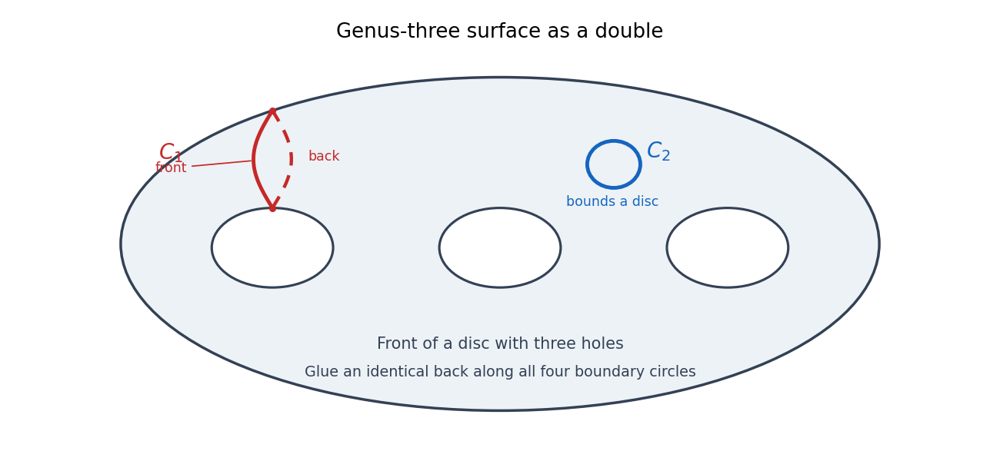

<h1 id="1/solution">Solution</h1>

↑ **Parent:** [1](../1.md)

A [chain complex](../../../../../chain-complex.md) consists of [abelian groups](../../../../../abelian-group.md) $C_q$ and [homomorphisms](../../../../../homomorphism.md) $\partial_q:C_q\to C_{q-1}$ with $\partial_{q-1}\partial_q=0$. Its groups of [chain cycles](../../../../../chain-cycle.md) and [chain boundaries](../../../../../chain-boundary.md) are $Z_q=\ker\partial_q$ and $B_q=\operatorname{im}\partial_{q+1}$; the identity ensures $B_q\subseteq Z_q$. Its [homology groups](../../../../../homology-group.md) are

$$
H_q(C_*)=Z_q/B_q.
$$

For a nonnegative complex, take $C_q=0$ for $q<0$.

The [singular chain group](../../../../../singular-chain-group.md) $C_q(X)$ is the [free abelian group](../../../../../free-abelian-group.md) on [continuous maps](../../../../../continuous-map.md) $\sigma:\Delta^q\to X$, called [singular simplices](../../../../../singular-simplex.md). With $\delta_i$ the inclusion of the face opposite vertex $i$, define

$$
\partial\sigma=\sum_{i=0}^q(-1)^i\sigma\circ\delta_i.
$$

Deleting any two vertices in the two possible orders gives the same face with opposite signs, proving $\partial^2=0$. This defines the [singular chain complex](../../../../../singular-chain-complex.md) and its [singular homology](../../../../../singular-homology.md). A [continuous map](../../../../../continuous-map.md) $f$ induces the [chain map](../../../../../chain-map.md) $f_\#(\sigma)=f\circ\sigma$; it commutes with the boundary because composition commutes with restriction to faces.

To prove [homotopy invariance of homology](../../../../../homotopy-invariance-of-homology.md), let $F:X\times I\to Y$ have endpoints $f,g$. Triangulate $\Delta^q\times I$ by the $q+1$ simplices with ordered vertices

$$
(v_0,0),\ldots,(v_i,0),(v_i,1),\ldots,(v_q,1),\qquad 0\le i\le q.
$$

Let $p_i:\Delta^{q+1}\to\Delta^q\times I$ be their affine parameterizations. The [singular prism operator](../../../../../singular-prism-operator.md) is

$$
P_q(\sigma)=\sum_{i=0}^q(-1)^iF\circ(\sigma\times1_I)\circ p_i.
$$

On taking boundaries, shared internal faces of consecutive prism simplices cancel. The top and bottom faces give $g_\#\sigma-f_\#\sigma$, and the remaining faces are $-P_{q-1}(\partial\sigma)$ with their induced signs. Thus

$$
\partial P+P\partial=g_\#-f_\#.
$$

For a [chain cycle](../../../../../chain-cycle.md) $z$, $g_\#z-f_\#z=\partial Pz$ is a [chain boundary](../../../../../chain-boundary.md), so $f_*=g_*$ on [homology](../../../../../homology-split.md). If $f$ is a [homotopy equivalence](../../../../../homotopy-equivalence.md), its [homotopy inverse](../../../../../homotopy-inverse.md) therefore induces an inverse to $f_*$, proving that [singular homology](../../../../../singular-homology.md) depends only on [homotopy type](../../../../../homotopy-type.md).

Use the standard [CW complex](../../../../../cw-complex.md) for an orientable genus-three surface: one vertex, six edges $a_1,b_1,a_2,b_2,a_3,b_3$, and a two-cell whose attaching word is $\prod_{j=1}^3[a_j,b_j]$. The [cellular homology theorem](../../../../../cellular-homology-theorem.md) identifies this cellular calculation with [singular homology](../../../../../singular-homology.md). The boundary of every edge is zero, and each edge's total exponent in the attaching word is zero, so the two-cell boundary is zero. Hence

$$
\boxed{H_q(\Sigma_3;\mathbb Z)=\begin{cases}\mathbb Z,&q=0,2,\\\mathbb Z^6,&q=1,\\0,&\text{otherwise}.\end{cases}}
$$

Choose $C_1$ to be the [nonseparating curve](../../../../../nonseparating-curve.md) represented by $a_1$, and choose $C_2$ as a small circle bounding a disc in a surface patch. Then $[C_1]$ is a nonzero [primitive homology class](../../../../../primitive-homology-class.md), whereas the inclusion of $C_2$ induces zero on $H_1$. If a [homotopy equivalence](../../../../../homotopy-equivalence.md) carried $C_1$ onto $C_2$, its restriction would factor through $C_2$ and kill $[C_1]$, contradicting injectivity on first [homology](../../../../../homology-split.md). This is the [homology obstruction to carrying surface curves onto one another](../../../../../homology-obstruction-to-carrying-surface-curves-onto-one-another.md).

There is nevertheless such a [continuous map](../../../../../continuous-map.md). Map the edge $a_1$ homeomorphically onto $S^1$ and all other edges to its base point. The two-cell attaching word then has [winding number](../../../../../winding-number.md) zero in $S^1$, hence is [null-homotopic](../../../../../null-homotopic-map.md) and the map extends to $r:\Sigma_3\to S^1$. Compose $r$ with a [homeomorphism](../../../../../homeomorphism.md) $S^1\to C_2$ and the inclusion of $C_2$ in the surface. This gives $g(C_1)=C_2$. Thus **an arbitrary map can carry the first curve onto the second, but a [homotopy equivalence](../../../../../homotopy-equivalence.md) cannot**.

For an unambiguous drawing, realize $\Sigma_3$ as the [double of a manifold](../../../../../double-of-a-manifold.md) formed from a disc with three holes. Its two copies are glued along all four boundary circles. The red curve below follows an arc from the outer boundary to the first hole on the front copy and returns along the matching arc on the back copy; it is a [nonseparating curve](../../../../../nonseparating-curve.md). The blue circle is entirely in a disc patch on the front copy and is [contractible](../../../../../contractible-space.md).

**[Figure 1](#1/image-nonseparating-and-contractible-circles-on-the-genus-three-surface-drawn-as-a-doubled-three-holed-disc). Nonseparating and contractible circles on the genus-three surface, drawn as a doubled three-holed disc**.

## ↑ Ancestors (10)

1. [1](../1.md)
2. [Paper 16](../../paper-16-split.md)
3. [Iii](../../split.md)
4. [2004](../../../split.md)
5. [Past exam of the mathematics course of the University of Cambridge](../../../../split.md)
6. [Mathematics course of the University of Cambridge](../../../../../mathematics-course-of-the-university-of-cambridge.md)
7. [Course of the University of Cambridge](../../../../../course-of-the-university-of-cambridge.md)
8. [University of Cambridge](../../../../../university-of-cambridge-split.md)
9. [List of universities](../../../../../list-of-universities.md)
10. [Codex Wiki](../../../../../split.md)
