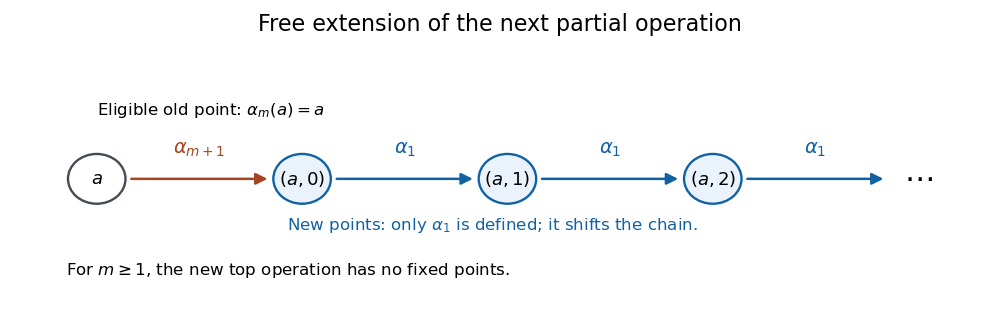

<h1 id="4/solution">Solution</h1>

↑ **Parent:** [4](../4.md)

An [adjunction](../../../../../adjoint-functors.md) $L\dashv U$ induces the [monad](../../../../../monad.md) $T=UL$ with unit $\eta$ and multiplication $U\varepsilon L$. The [Eilenberg-Moore comparison functor](../../../../../eilenberg-moore-comparison-functor.md) sends $B$ to $(UB,U\varepsilon_B)$. A [monadic adjunction](../../../../../monadic-adjunction.md) is one for which that comparison is an [equivalence of categories](../../../../../equivalence-of-categories.md). Iterating comparisons, when their [left adjoints](../../../../../adjoint-functors.md) exist, gives a tower; its [monadic length](../../../../../monadic-length.md) is the number of steps until equivalence, with length zero for an equivalence and length one for a monadic adjunction that is not already an equivalence.

The [precise monadicity theorem](../../../../../beck-s-monadicity-theorem.md) says that a [right adjoint](../../../../../adjoint-functors.md) is monadic exactly when it reflects [isomorphisms](../../../../../isomorphism.md) and creates [coequalizers](../../../../../coequalizer.md) of pairs whose images admit [split coequalizers](../../../../../split-coequalizer.md).

Write $U_r:\mathcal C_r\to\mathcal C_{r-1}$ for one-step forgetting. For $r=1$, the [free extension of nested partial unary operations](../../../../../free-extension-of-nested-partial-unary-operations.md) is the familiar set $A\times\mathbb N$, with $\alpha_1(a,j)=(a,j+1)$ and unit $a\mapsto(a,0)$. A map into a set with endomorphism $\beta_1$ extends uniquely by $(a,j)\mapsto\beta_1^j f(a)$.

For $r\geq2$, let

$$
S(A)=\{a\in A:\alpha_{r-1}(a)\text{ is defined and equals }a\}.
$$

Keep $A$ and all its old operations, and adjoin the disjoint set $S(A)\times\mathbb N$. On the new points define $\alpha_1(a,j)=(a,j+1)$; every old operation $\alpha_i$ with $i\geq2$ is undefined there. Define the new top operation only at the old eligible points, by $\alpha_r(a)=(a,0)$ for $a\in S(A)$.

These domains satisfy the defining rules of the [nested partial unary operation category](../../../../../nested-partial-unary-operation-category.md): the new points have no $\alpha_1$-[fixed points](../../../../../fixed-point.md), so none has any higher operation defined. Given $f:A\to U_rB$, extend it by

$$
\overline f(a,j)=\beta_1^j\beta_r(f(a)).
$$

The expression is defined because $f$ sends eligible points to eligible points and $\beta_1$ is total. It preserves every defined operation; preservation of $\alpha_r$ at old points determines $j=0$, and preservation of $\alpha_1$ determines the whole chain. Thus it is the unique extension, proving $L_r\dashv U_r$.

**[Figure 1](#4/image-the-free-new-operation-sends-each-eligible-point-to-a-new-value-with-a-free-chain-under-the-first-operation). The free new operation sends each eligible point to a new value with a free chain under the first operation**.

For monadicity, $U_r$ reflects [isomorphisms](../../../../../isomorphism.md): an isomorphism of the lower structures takes $S(A)$ bijectively to $S(B)$, so the inverse of a map preserving the new operation preserves it too.

Next prove the [split-coequalizer lifting for a fixed-point-domain operation](../../../../../split-coequalizer-lifting-for-a-fixed-point-domain-operation.md). Let $f,g:A\rightrightarrows B$ be $\mathcal C_r$-morphisms and suppose their lower images have a split coequalizer $q:U_rB\to Q$, with $s:Q\to U_rB$, $t:U_rB\to U_rA$ satisfying

$$
qf=qg,\qquad qs=1,\qquad ft=1,\qquad gt=sq.
$$

Equip $Q$ with $\beta_Q(z)=q\beta_B(sz)$ on its required eligible domain. The lower-structure maps $s,t$ preserve eligibility. For eligible $x\in B$,

$$
q\beta_B(x)=qf\beta_A(tx)=qg\beta_A(tx)=q\beta_B(sqx),
$$

so $q$ preserves the top operation. If $h:B\to D$ coequalizes $f,g$, its lower factor $\overline h:Q\to U_rD$ satisfies

$$
\overline h\beta_Q(z)=h\beta_B(sz)=\beta_D(hsz)=\beta_D(\overline hz).
$$

Thus it is a morphism of the full structures. Uniqueness of the lifted operation follows from the eligible section $s$ and surjectivity of $q$. This creates the specified coequalizer, so the [Beck monadicity theorem](../../../../../beck-s-monadicity-theorem.md) proves **each one-step adjunction is monadic**.

Finally, every free top operation just constructed has no fixed points: for $r=1$ it shifts the free chain, while for $r\geq2$ it sends old eligible points to new distinct points and is undefined on the new points. Freely adjoining any further operation therefore changes nothing, since its required domain is empty. For $n>m$, the monad induced on $\mathcal C_m$ by the long free-and-forgetful adjunction is consequently the same monad, including unit and multiplication, as that for $\mathcal C_{m+1}\to\mathcal C_m$.

The first comparison category is thus equivalent to $\mathcal C_{m+1}$. Its algebra action evaluates the new formal value by $\alpha_{m+1}$, so the comparison from $\mathcal C_n$ retains precisely that next operation and is the remaining forgetful functor. Iteration recovers one additional operation at each step. These remaining comparisons are not equivalences while an operation is still forgotten: take a two-element set with all retained operations equal to the identity, and choose the next operation to be the identity in one extension and the transposition in another. Higher operations can be identities in the first case and undefined in the second. The identity on the retained structure is not a morphism between these extensions, so the forgetful functor is not full. This includes $\mathcal C_1\to\mathbf{Set}$.

The [monadic tower for nested partial unary operations](../../../../../monadic-tower-for-nested-partial-unary-operations.md) therefore has exactly the claimed length:

$$
\boxed{\operatorname{length}(\mathcal C_n\rightleftarrows\mathbf{Set})=n.}
$$

## ↑ Ancestors (11)

1. [4](../4.md)
2. [Section B](../section-b.md)
3. [Paper 23](../../paper-23-split.md)
4. [Iii](../../split.md)
5. [2004](../../../split.md)
6. [Past exam of the mathematics course of the University of Cambridge](../../../../split.md)
7. [Mathematics course of the University of Cambridge](../../../../../mathematics-course-of-the-university-of-cambridge.md)
8. [Course of the University of Cambridge](../../../../../course-of-the-university-of-cambridge.md)
9. [University of Cambridge](../../../../../university-of-cambridge-split.md)
10. [List of universities](../../../../../list-of-universities.md)
11. [Codex Wiki](../../../../../split.md)
