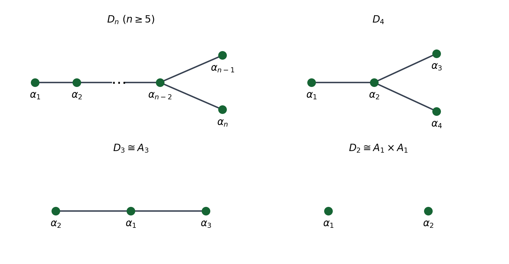
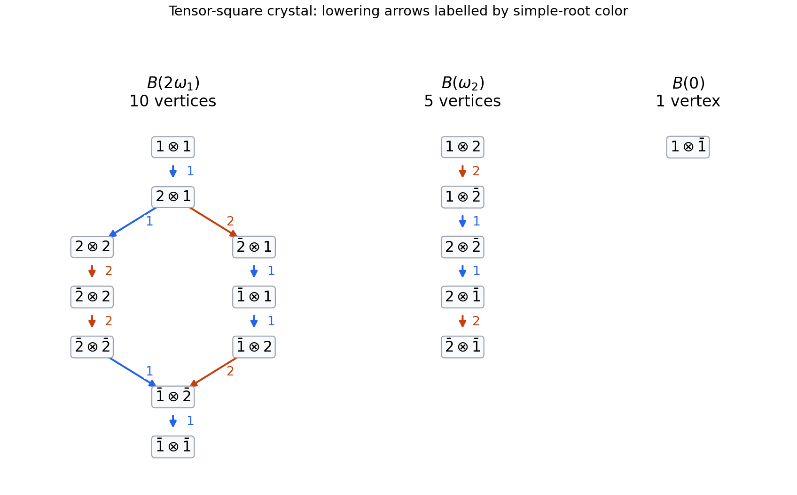

# Paper 3

↑ **Parent:** [Iii](../iii.md)

[https://www.maths.cam.ac.uk/postgrad/part-iii/files/pastpapers/2004/Paper3.pdf](https://www.maths.cam.ac.uk/postgrad/part-iii/files/pastpapers/2004/Paper3.pdf)

**Table of contents**

- [1](#1)
  - [i](#1/i)
    - [Solution](#1/i/solution)
  - [ii](#1/ii)
    - [Solution](#1/ii/solution)
  - [iii](#1/iii)
    - [a](#1/iii/a)
      - [Solution](#1/iii/a/solution)
    - [b](#1/iii/b)
      - [Solution](#1/iii/b/solution)
- [2](#2)
  - [a](#2/a)
    - [Solution](#2/a/solution)
  - [b](#2/b)
    - [Solution](#2/b/solution)
  - [c](#2/c)
    - [Solution](#2/c/solution)
  - [d](#2/d)
    - [Solution](#2/d/solution)
- [3](#3)
  - [Solution](#3/solution)
- [4](#4)
  - [Solution](#4/solution)
- [5](#5)
  - [i](#5/i)
    - [Solution](#5/i/solution)
  - [ii](#5/ii)
    - [Solution](#5/ii/solution)
  - [iii](#5/iii)
    - [Solution](#5/iii/solution)

## 1

↑ **Parent:** [Paper 3](paper-3.md)

<h3 id="1/i">i</h3>

↑ **Parent:** [1](#1)

<h4 id="1/i/solution">Solution</h4>

↑ **Parent:** [I](#1/i)

The [derived series of a Lie algebra](../../../lie-algebra.md#derived-series-of-a-lie-algebra) is defined recursively by $\mathfrak g^{(0)}=\mathfrak g$ and $\mathfrak g^{(r+1)}=[\mathfrak g^{(r)},\mathfrak g^{(r)}]$, where the bracket denotes the [linear span](../../../vector-space.md#linear-span) of all brackets of pairs of elements. A [solvable Lie algebra](../../../lie-algebra.md#solvable-lie-algebra) is one whose [derived series of a Lie algebra](../../../lie-algebra.md#derived-series-of-a-lie-algebra) terminates at zero:

$$
\boxed{\mathfrak g\text{ is solvable}\iff\mathfrak g^{(m)}=0\text{ for some }m\geq0.}
$$

The [solvable radical](../../../lie-algebra.md#radical-of-a-lie-algebra) $\operatorname{rad}\mathfrak g$ of a finite-dimensional [Lie algebra](../../../lie-algebra.md) is its largest solvable [ideal of a Lie algebra](../../../lie-algebra.md#ideal-of-a-lie-algebra). A [semisimple Lie algebra](../../../semisimple-lie-algebra.md) has no nonzero solvable [ideals of a Lie algebra](../../../lie-algebra.md#ideal-of-a-lie-algebra), equivalently

$$
\boxed{\mathfrak g\text{ is semisimple}\iff\operatorname{rad}\mathfrak g=0.}
$$

These are definitions; identifying semisimplicity with a direct sum of simple ideals additionally uses the structure theorem in [characteristic zero](../../../algebra.md#characteristic-zero). The calculations and representation theorems below are over $\mathbb C$, as in the complex representation setting of this paper.

<h3 id="1/ii">ii</h3>

↑ **Parent:** [1](#1)

<h4 id="1/ii/solution">Solution</h4>

↑ **Parent:** [Ii](#1/ii)

Let $L_A$ and $R_A$ be left and right multiplication by $A$ on the [vector space](../../../vector-space.md) $M_n(\mathbb C)$. Then $\operatorname{ad}A=L_A-R_A$. On [matrix units](../../../vector-space.md#matrix-unit), or from $M_n(\mathbb C)=\mathbb C^n\otimes(\mathbb C^n)^*$, one obtains

$$
\begin{aligned}\operatorname{Tr}(L_AL_B)&=n\operatorname{tr}(AB),&\operatorname{Tr}(R_AR_B)&=n\operatorname{tr}(BA),\\\operatorname{Tr}(L_AR_B)&=\operatorname{tr}A\operatorname{tr}B,&\operatorname{Tr}(R_AL_B)&=\operatorname{tr}A\operatorname{tr}B.\end{aligned}
$$

For example, the coefficient of $E_{ij}$ in $AE_{ij}B$ is $A_{ii}B_{jj}$; summing over $i,j$ proves the mixed-trace identity. Expanding the product of the two adjoint operators therefore gives the [Killing form of the general linear Lie algebra](../../../lie-algebra.md#killing-form-of-the-general-linear-lie-algebra):

$$
\operatorname{Tr}_{M_n}(\operatorname{ad}A\operatorname{ad}B)=2n\operatorname{tr}(AB)-2\operatorname{tr}A\operatorname{tr}B.
$$

For $A,B$ in the [special linear Lie algebra](../../../semisimple-lie-algebra.md#special-linear-lie-algebra), both individual traces vanish. Furthermore $M_n(\mathbb C)=\mathfrak{sl}_n\oplus\mathbb CI$, and every adjoint operator kills the scalar summand, so its product has the same [trace](../../../linear-algebra.md#matrix-trace) on $M_n$ and on $\mathfrak{sl}_n$. Consequently the [Killing form of the special linear Lie algebra](../../../lie-algebra.md#killing-form-of-the-special-linear-lie-algebra) is

$$
\boxed{(A,B)_{\mathrm{ad}}=2n\operatorname{tr}(AB),\qquad\lambda=\frac1{2n}\quad(n\geq2).}
$$

No uniqueness theorem for [invariant bilinear forms on a Lie algebra](../../../lie-algebra.md#invariant-bilinear-form-on-a-lie-algebra) is needed: this calculation establishes the constant directly. For the degenerate case $n=1$, the Lie algebra is zero, both forms vanish, and proportionality does not determine a unique constant.

<h3 id="1/iii">iii</h3>

↑ **Parent:** [1](#1)

<h4 id="1/iii/a">a</h4>

↑ **Parent:** [Iii](#1/iii)

<h5 id="1/iii/a/solution">Solution</h5>

↑ **Parent:** [A](#1/iii/a)

For this [diamond Lie algebra](../../../lie-algebra.md#diamond-lie-algebra), every bracket lies in $\langle c,p,q\rangle$, and each of these three vectors occurs as a bracket. Thus its [derived algebra](../../../lie-algebra.md#derived-algebra) is exactly $\mathfrak g^{(1)}=\langle c,p,q\rangle$. Inside that subalgebra the only nonzero bracket is a multiple of $[p,q]=c$, so $\mathfrak g^{(2)}=\mathbb Cc$. Centrality of $c$ then gives $\mathfrak g^{(3)}=0$. Hence

$$
\boxed{\mathfrak g\supset\langle c,p,q\rangle\supset\mathbb Cc\supset0,\qquad\mathfrak g\text{ is solvable of derived length }3.}
$$

In particular it is a [solvable Lie algebra](../../../lie-algebra.md#solvable-lie-algebra), although its [lower central series of a Lie algebra](../../../lie-algebra.md#lower-central-series-of-a-lie-algebra) does not terminate: $[\mathfrak g,\langle c,p,q\rangle]=\langle c,p,q\rangle$. Solvability does not imply nilpotence.

<h4 id="1/iii/b">b</h4>

↑ **Parent:** [Iii](#1/iii)

<h5 id="1/iii/b/solution">Solution</h5>

↑ **Parent:** [B](#1/iii/b)

Define a [symmetric bilinear form](../../../linear-algebra.md#symmetric-bilinear-form) $B$ by pairing $c$ with $d$ and $p$ with $q$, each with value one, and setting all other pairings of basis vectors to zero. Its [Gram matrix](../../../linear-algebra.md#gram-matrix) in the order $(c,d,p,q)$ is

$$
\boxed{[B]=\begin{pmatrix}0&1&0&0\\1&0&0&0\\0&0&0&1\\0&0&1&0\end{pmatrix}.}
$$

The determinant is one, so this is a [nondegenerate bilinear form](../../../linear-algebra.md#nondegenerate-bilinear-form).

For invariance, put $T(x,y,z)=B([x,y],z)$. The nonzero values on distinct basis triples are generated by

$$
T(d,p,q)=B(p,q)=1,\qquad T(p,q,d)=B(c,d)=1,\qquad T(q,d,p)=B(q,p)=1
$$

and the reversed triples have value minus one. Every value involving $c$, or a repeated basis vector, vanishes. Thus $T$ is an [alternating trilinear form](../../../linear-algebra.md#alternating-trilinear-form), explicitly $d^*\wedge p^*\wedge q^*$. In particular $T(x,y,z)=T(y,z,x)$. By symmetry of $B$, this reads $B([x,y],z)=B(x,[y,z])$, the defining identity for an [invariant bilinear form on a Lie algebra](../../../lie-algebra.md#invariant-bilinear-form-on-a-lie-algebra).

Suppose a finite-dimensional [Lie algebra representation](../../../lie-algebra.md#lie-algebra-representation) $\rho$ realized this form as $B(x,y)=\operatorname{tr}(\rho(x)\rho(y))$. The [Lie theorem](../../../lie-algebra.md#lie-s-theorem) says that every finite-dimensional representation of a complex [solvable Lie algebra](../../../lie-algebra.md#solvable-lie-algebra) admits a basis in which all representing matrices are upper triangular. A commutator of upper triangular matrices has zero diagonal, hence is strictly upper triangular. Therefore $\rho([\mathfrak g,\mathfrak g])$ is strictly upper triangular, and its product with any representing matrix still has zero diagonal. It follows that

$$
\operatorname{tr}(\rho(x)\rho(y))=0\qquad(x\in[\mathfrak g,\mathfrak g],\ y\in\mathfrak g).
$$

This is the general fact that [trace forms of solvable Lie algebras annihilate the derived algebra](../../../lie-algebra.md#trace-forms-of-solvable-lie-algebras-annihilate-the-derived-algebra). Here $c\in[\mathfrak g,\mathfrak g]$, so such a trace form would have $B(c,d)=0$, contradicting the constructed value one. Thus **the nondegenerate invariant form exists, but no finite-dimensional representation has it as its trace form**. Finite dimensionality is implicit in the ordinary representation trace; no trace on arbitrary infinite-dimensional endomorphisms is being assumed.

## 2

↑ **Parent:** [Paper 3](paper-3.md)

<h3 id="2/a">a</h3>

↑ **Parent:** [2](#2)

<h4 id="2/a/solution">Solution</h4>

↑ **Parent:** [A](#2/a)

Put $\bar i=2n+1-i$ and let $E_{ij}$ denote a [matrix unit](../../../vector-space.md#matrix-unit). The antidiagonal matrix satisfies $J^{-1}=J$, so the orthogonal condition is $A=-JA^TJ$, or entrywise $A_{ij}=-A_{\bar j\bar i}$. Consequently the diagonal [Cartan subalgebra](../../../semisimple-lie-algebra.md#cartan-subalgebra) is

$$
\mathfrak t=\{H(t)=\operatorname{diag}(t_1,\ldots,t_n,-t_n,\ldots,-t_1)\},\qquad\varepsilon_i(H(t))=t_i.
$$

We first take $n\geq2$. Since $[H,E_{ab}]=(H_{aa}-H_{bb})E_{ab}$, the [matrix root basis of the even orthogonal Lie algebra](../../../semisimple-lie-algebra.md#matrix-root-basis-of-the-even-orthogonal-lie-algebra) gives

$$
\begin{aligned}\mathfrak g_{\varepsilon_i-\varepsilon_j}&=\mathbb C(E_{ij}-E_{\bar j\bar i})&& (i\ne j),\\\mathfrak g_{\varepsilon_i+\varepsilon_j}&=\mathbb C(E_{i\bar j}-E_{j\bar i})&& (i<j),\\\mathfrak g_{-\varepsilon_i-\varepsilon_j}&=\mathbb C(E_{\bar j i}-E_{\bar i j})&& (i<j).
\end{aligned}
$$

The zero [weight space](../../../semisimple-lie-algebra.md#weight-space) is $\mathfrak t$; its [basis](../../../vector-space.md#basis) is $H_i=E_{ii}-E_{\bar i\bar i}$. No vector of weight $2\varepsilon_i$ occurs, because the corresponding matrix unit is forced to be its own negative. These spaces account for $n+2n(n-1)=n(2n-1)$ dimensions, exhausting the [Special orthogonal Lie algebra](../../../semisimple-lie-algebra.md#special-orthogonal-lie-algebra). Thus its decomposition as a $\mathfrak t$-module and its [Dn root system](../../../semisimple-lie-algebra.md#dn-root-system) are

$$
\boxed{\mathfrak g=\mathfrak t\oplus\bigoplus_{\alpha\in R}\mathfrak g_\alpha,\qquad R=\{\pm\varepsilon_i\pm\varepsilon_j:1\leq i<j\leq n\}.}
$$

Each nonzero [root space](../../../semisimple-lie-algebra.md#root-space) has [dimension](../../../vector-space.md#dimension-vector-space) one; the zero weight has multiplicity $n$.

The upper triangular [root spaces](../../../semisimple-lie-algebra.md#root-space) are precisely those of weights $\varepsilon_i-\varepsilon_j$ and $\varepsilon_i+\varepsilon_j$ with $i<j$. Therefore

$$
\boxed{R^+=\{\varepsilon_i-\varepsilon_j,\ \varepsilon_i+\varepsilon_j:i<j\},\qquad\alpha_i=\varepsilon_i-\varepsilon_{i+1}\ (1\leq i<n),\quad\alpha_n=\varepsilon_{n-1}+\varepsilon_n.}
$$

These $n$ roots form the [simple roots](../../../semisimple-lie-algebra.md#simple-root). To check that they generate the chosen positive system with nonnegative coefficients, write $\varepsilon_i-\varepsilon_j=\sum_{k=i}^{j-1}\alpha_k$. For $j<n$,

$$
\varepsilon_i+\varepsilon_j=\sum_{k=i}^{j-1}\alpha_k+2\sum_{k=j}^{n-2}\alpha_k+\alpha_{n-1}+\alpha_n,
$$

and for $j=n$ use $\varepsilon_i+\varepsilon_n=\sum_{k=i}^{n-2}\alpha_k+\alpha_n$. Empty sums are zero. Their [linear independence](../../../vector-space.md#linear-independence) and these expansions identify the base of the [root system](../../../semisimple-lie-algebra.md#root-system).

Equip the real span of the roots in $\mathfrak t^*$ with the [inner product](../../../linear-algebra.md#inner-product) making the $\varepsilon_i$ orthonormal. All roots then have squared length two. The [coroots](../../../semisimple-lie-algebra.md#coroot) of $\varepsilon_i\pm\varepsilon_j$ are $H_i\pm H_j$, so the [fundamental weights of Dn](../../../semisimple-lie-algebra.md#fundamental-weights-of-dn), characterized by $\omega_i(\alpha_j^\vee)=\delta_{ij}$, are

$$
\boxed{\begin{aligned}\omega_i&=\varepsilon_1+\cdots+\varepsilon_i&& (1\leq i\leq n-2),\\\omega_{n-1}&=\tfrac12(\varepsilon_1+\cdots+\varepsilon_{n-1}-\varepsilon_n),\\\omega_n&=\tfrac12(\varepsilon_1+\cdots+\varepsilon_{n-1}+\varepsilon_n).
\end{aligned}}
$$

Taking their pairings with $H_j-H_{j+1}$ and $H_{n-1}+H_n$ verifies the defining identities directly. For each pair $i<j$, the sum of its two positive roots is $2\varepsilon_i$. Hence the [half-sum of positive roots](../../../semisimple-lie-algebra.md#half-sum-of-positive-roots) is

$$
\boxed{\rho=\frac12\sum_{\alpha\in R^+}\alpha=\sum_{i=1}^n(n-i)\varepsilon_i=\sum_{i=1}^n\omega_i.}
$$

The [Dynkin diagram](../../../semisimple-lie-algebra.md#dynkin-diagram) has a chain ending at $\alpha_{n-2}$, which is joined to both $\alpha_{n-1}$ and $\alpha_n$. Every edge is a single bond because the root lengths agree; the nonzero off-diagonal simple-root pairings are minus one. The labelled [Dn Dynkin diagram](../../../semisimple-lie-algebra.md#dn-dynkin-diagram) and its low-rank versions are shown below.

**[Figure 1](#2/a/image-labelled-d-type-dynkin-diagrams-including-the-low-rank-cases). Labelled D-type Dynkin diagrams, including the low-rank cases**.

For $n=2$, $\alpha_1=\varepsilon_1-\varepsilon_2$ and $\alpha_2=\varepsilon_1+\varepsilon_2$ are orthogonal, giving two disconnected [A1 root systems](../../../semisimple-lie-algebra.md#rank-one-root-system). For $n=3$, the diagram is the chain $\alpha_2-\alpha_1-\alpha_3$, of type [A3 root system](../../../semisimple-lie-algebra.md#a3-root-system); the displayed weight formulas still apply. If $n=1$ is allowed, $\mathfrak{so}_2=\mathfrak t$ is one-dimensional and abelian: there are no roots or fundamental weights, and $\rho=0$.

<h3 id="2/b">b</h3>

↑ **Parent:** [2](#2)

<h4 id="2/b/solution">Solution</h4>

↑ **Parent:** [B](#2/b)

In dimension four, the two positive [roots](../../../semisimple-lie-algebra.md#root-of-a-root-system) are $\alpha=\varepsilon_1-\varepsilon_2$ and $\beta=\varepsilon_1+\varepsilon_2$. Using the [matrix root basis of the even orthogonal Lie algebra](../../../semisimple-lie-algebra.md#matrix-root-basis-of-the-even-orthogonal-lie-algebra), define

$$
\begin{aligned}e_\alpha&=E_{12}-E_{34},&f_\alpha&=E_{21}-E_{43},&h_\alpha&=\operatorname{diag}(1,-1,1,-1),\\e_\beta&=E_{13}-E_{24},&f_\beta&=E_{31}-E_{42},&h_\beta&=\operatorname{diag}(1,1,-1,-1).
\end{aligned}
$$

The [matrix unit](../../../vector-space.md#matrix-unit) identity $[E_{ij},E_{kl}]=\delta_{jk}E_{il}-\delta_{li}E_{kj}$ gives $[e_\gamma,f_\gamma]=h_\gamma$, $[h_\gamma,e_\gamma]=2e_\gamma$, and $[h_\gamma,f_\gamma]=-2f_\gamma$ for $\gamma=\alpha,\beta$. Thus each triple spans an [sl2 Lie algebra](../../../semisimple-lie-algebra.md#sl2-lie-algebra).

The two triples commute. Their Cartan actions on one another vanish because $\alpha(h_\beta)=\beta(h_\alpha)=0$; their mixed root-vector brackets vanish because none of $\pm\alpha\pm\beta$, namely $\pm2\varepsilon_1$ and $\pm2\varepsilon_2$, is a root. This can equally be checked from the displayed matrix units. The six vectors are [linearly independent](../../../vector-space.md#linear-independence), occupying the four distinct [root spaces](../../../semisimple-lie-algebra.md#root-space) and two independent Cartan directions, so they exhaust the six-dimensional [so4 Lie algebra](../../../semisimple-lie-algebra.md#so4-lie-algebra). The two commuting spans are consequently ideals, and

$$
\boxed{\mathfrak{so}_4(\mathbb C)\cong\mathfrak{sl}_2(\mathbb C)\oplus\mathfrak{sl}_2(\mathbb C).}
$$

This gives an explicit [Chiral decomposition of the complexified so4 Lie algebra](../../../semisimple-lie-algebra.md#chiral-decomposition-of-the-complexified-so4-lie-algebra), including generators for both factors.

<h3 id="2/c">c</h3>

↑ **Parent:** [2](#2)

<h4 id="2/c/solution">Solution</h4>

↑ **Parent:** [C](#2/c)

Identify $\mathfrak t$ with the coordinate vector $t=(t_1,\ldots,t_n)$ through $H(t)$. A [root reflection](../../../semisimple-lie-algebra.md#root-reflection) is $s_\alpha(H)=H-\alpha(H)\alpha^\vee$. Since $(\varepsilon_i\pm\varepsilon_j)^\vee=H_i\pm H_j$, for $i<j$ the two possibilities are

$$
\boxed{\begin{aligned}s_{\varepsilon_i-\varepsilon_j}(t)_i&=t_j,&s_{\varepsilon_i-\varepsilon_j}(t)_j&=t_i,\\s_{\varepsilon_i+\varepsilon_j}(t)_i&=-t_j,&s_{\varepsilon_i+\varepsilon_j}(t)_j&=-t_i.
\end{aligned}}
$$

Every other coordinate is unchanged, and $s_{-\alpha}=s_\alpha$, so these formulas cover every [root](../../../semisimple-lie-algebra.md#root-of-a-root-system). The complete diagonal matrix is reconstructed with its last $n$ entries the reversed negatives of the first $n$ entries.

The [Weyl group of Dn](../../../semisimple-lie-algebra.md#weyl-group-of-dn) consists of all permutations of the $n$ coordinates together with an [even number](../../../number-theory.md#even-number) of coordinate sign changes. Equivalently,

$$
\boxed{W(D_n)=\{t\mapsto(\delta_i t_{\sigma(i)})_{i=1}^n:\sigma\in S_n,\ \delta_i\in\{\pm1\},\ \prod_i\delta_i=1\}\cong(\mathbb Z/2\mathbb Z)^{n-1}\rtimes S_n.}
$$

Its order is $2^{n-1}n!$. The difference-root reflections give ordinary transpositions; composing a sum-root reflection with the corresponding difference-root reflection negates precisely the two selected coordinates. These describe the generators of all even signed permutations. For $n=2$ the group has four elements; for the toral case $n=1$ it is trivial.

<h3 id="2/d">d</h3>

↑ **Parent:** [2](#2)

<h4 id="2/d/solution">Solution</h4>

↑ **Parent:** [D](#2/d)

In the [defining representation](../../../lie-algebra.md#defining-representation-of-a-matrix-lie-algebra) $V=\mathbb C^{2n}$, the basis vectors $v_i$ and $v_{\bar i}$ have [weights](../../../semisimple-lie-algebra.md#weight-representation-theory) $\varepsilon_i$ and $-\varepsilon_i$, respectively, each with multiplicity one. Thus its [formal character](../../../semisimple-lie-algebra.md#formal-character-of-a-weight-module) is

$$
\boxed{\operatorname{ch}V=\sum_{i=1}^n(e^{\varepsilon_i}+e^{-\varepsilon_i}),\qquad\text{highest weight }\varepsilon_1.}
$$

The vector $v_1$ is killed by every positive [root space](../../../semisimple-lie-algebra.md#root-space), since all positive-root matrices are upper triangular, and is a [highest-weight vector](../../../semisimple-lie-algebra.md#highest-weight-vector). Any nonzero invariant subspace splits into weight spaces and therefore contains one of the natural weight vectors, since those weight spaces are one-dimensional. The root matrices connect that vector to all the others, so this representation is [irreducible](../../../representation-theory.md#irreducible-representation) for $n\geq2$. In terms of the [fundamental weights of Dn](../../../semisimple-lie-algebra.md#fundamental-weights-of-dn), its highest weight is $\omega_1$ for $n\geq3$ and $\omega_1+\omega_2$ for $n=2$.

The flip of the two tensor factors is equivariant, hence

$$
V\otimes V=\operatorname{Sym}^2V\oplus\Lambda^2V.
$$

Use the invariant [symmetric bilinear form](../../../linear-algebra.md#symmetric-bilinear-form) $Q(u,v)=u^TJv$. Contraction $C(u\otimes v)=Q(u,v)$ is an equivariant map to the [trivial Lie algebra representation](../../../lie-algebra.md#trivial-lie-algebra-representation). Its inverse-form tensor

$$
\tau=\sum_{i=1}^n(v_i\otimes v_{\bar i}+v_{\bar i}\otimes v_i)
$$

is invariant and satisfies $C(\tau)=2n$. Consequently

$$
\operatorname{Sym}^2V=\mathbb C\tau\oplus\operatorname{Sym}^2_0V,\qquad\operatorname{Sym}^2_0V=\ker(C|_{\operatorname{Sym}^2V}).
$$

The traceless summand contains the [highest-weight vector](../../../semisimple-lie-algebra.md#highest-weight-vector) $v_1\otimes v_1$ of [weight](../../../semisimple-lie-algebra.md#weight-representation-theory) $2\varepsilon_1$. The [Weyl complete reducibility theorem](../../../semisimple-lie-algebra.md#weyl-complete-reducibility-theorem) states that every finite-dimensional complex [semisimple Lie algebra](../../../semisimple-lie-algebra.md) representation is a direct sum of irreducible representations, so the submodule generated by this highest vector is $L(2\varepsilon_1)$. The [Weyl dimension formula](../../../semisimple-lie-algebra.md#weyl-dimension-formula) verifies that it is the entire traceless space: only positive roots involving $\varepsilon_1$ change their factors, and

$$
\dim L(2\varepsilon_1)=\prod_{j=2}^n\frac{j+1}{j-1}\frac{2n-j+1}{2n-j-1}=\frac{n(n+1)}2\frac{2(2n-1)}n=(n+1)(2n-1).
$$

This equals $\dim\operatorname{Sym}^2V-1=n(2n+1)-1$. Thus the [traceless symmetric square of the defining even orthogonal representation](../../../linear-algebra.md#traceless-symmetric-square-of-the-defining-even-orthogonal-representation) is irreducible, including $n=2$.

For the other summand, the [exterior square of the defining orthogonal representation](../../../semisimple-lie-algebra.md#exterior-square-of-the-defining-orthogonal-representation) has the equivariant identification

$$
u\wedge v\longmapsto\bigl[w\longmapsto Q(v,w)u-Q(u,w)v\bigr]\in\mathfrak{so}(V,Q).
$$

The image is skew relative to $Q$, and in a basis making $Q$ the identity the images are the independent elementary skew matrices. The map is therefore an isomorphism onto the [Adjoint representation of a Lie algebra](../../../lie-algebra.md#adjoint-representation-of-a-lie-algebra). For $n\geq3$, the connected [Dn Dynkin diagram](../../../semisimple-lie-algebra.md#dn-dynkin-diagram) gives a [simple Lie algebra](../../../semisimple-lie-algebra.md#simple-lie-algebra) (with $D_3=A_3$); its adjoint module is irreducible because its invariant subspaces are exactly its ideals. Its highest weight is $\varepsilon_1+\varepsilon_2$, and $v_1\wedge v_2$ is a highest vector. The [tensor-square decomposition of the defining even orthogonal representation](../../../linear-algebra.md#tensor-square-decomposition-of-the-defining-even-orthogonal-representation) is consequently

$$
\boxed{V\otimes V=L(2\varepsilon_1)\oplus L(\varepsilon_1+\varepsilon_2)\oplus L(0)\qquad(n\geq3).}
$$

The three dimensions are $(n+1)(2n-1)$, $n(2n-1)$ and one, adding to $4n^2$. The highest weights are $2\omega_1$, $\omega_2$ and zero for $n\geq4$; for $n=3$ the middle weight is $\omega_2+\omega_3$.

For $n=2$, the [Chiral decomposition of the complexified so4 Lie algebra](../../../semisimple-lie-algebra.md#chiral-decomposition-of-the-complexified-so4-lie-algebra) splits the adjoint module into its two three-dimensional ideals. Thus

$$
\boxed{V\otimes V=L(2\varepsilon_1)\oplus L(\varepsilon_1-\varepsilon_2)\oplus L(\varepsilon_1+\varepsilon_2)\oplus L(0),\quad\dim=9+3+3+1.}
$$

The weights are $2\omega_1+2\omega_2$, $2\omega_1$, $2\omega_2$ and zero. Equivalently, labelling highest weights by the two [sl2 Lie algebra](../../../semisimple-lie-algebra.md#sl2-lie-algebra) factors, this is $(2,2)\oplus(2,0)\oplus(0,2)\oplus(0,0)$. If $n=1$ is allowed, the abelian algebra has $V=L(\varepsilon_1)\oplus L(-\varepsilon_1)$ and $V\otimes V=L(2\varepsilon_1)\oplus2L(0)\oplus L(-2\varepsilon_1)$; there is then no single highest weight for an irreducible natural module.

## 3

↑ **Parent:** [Paper 3](paper-3.md)

<h3 id="3/solution">Solution</h3>

↑ **Parent:** [3](#3)

Let $\mathfrak g$ be a finite-dimensional complex [semisimple Lie algebra](../../../semisimple-lie-algebra.md), choose a [Cartan subalgebra](../../../semisimple-lie-algebra.md#cartan-subalgebra) $\mathfrak t$ and a set $R^+$ of [positive roots](../../../semisimple-lie-algebra.md#positive-root), and write $W$ for the [Weyl group](../../../semisimple-lie-algebra.md#weyl-group). Let $\lambda$ be a [dominant integral weight](../../../semisimple-lie-algebra.md#dominant-integral-weight) and $L(\lambda)$ the finite-dimensional irreducible [highest-weight representation](../../../semisimple-lie-algebra.md#highest-weight-representation) with that highest weight. If $L(\lambda)_\mu$ denotes its [weight space](../../../semisimple-lie-algebra.md#weight-space) of weight $\mu$, its [formal character](../../../semisimple-lie-algebra.md#formal-character-of-a-weight-module) is $\operatorname{ch}L(\lambda)=\sum_\mu\dim L(\lambda)_\mu\,e^\mu$. The symbols $e^\mu$ belong to the [group algebra](../../../associative-algebra.md#group-algebra) of the [weight lattice](../../../semisimple-lie-algebra.md#weight-lattice) and multiply by $e^\mu e^\nu=e^{\mu+\nu}$; they are formal symbols, not matrix exponentials.

Put $\rho=\frac12\sum_{\alpha\in R^+}\alpha$, the [half-sum of positive roots](../../../semisimple-lie-algebra.md#half-sum-of-positive-roots), and let $\ell(w)$ be the [Coxeter length](../../../semisimple-lie-algebra.md#coxeter-length) of $w$, the least number of simple reflections expressing it. Then $(-1)^{\ell(w)}=\det(w)$ in the real reflection representation. The [Weyl character formula](../../../semisimple-lie-algebra.md#weyl-character-formula) states

$$
\boxed{\operatorname{ch}L(\lambda)=\frac{\displaystyle\sum_{w\in W}(-1)^{\ell(w)}e^{w(\lambda+\rho)}}{\displaystyle\sum_{w\in W}(-1)^{\ell(w)}e^{w\rho}}.}
$$

By the [Weyl denominator formula](../../../semisimple-lie-algebra.md#weyl-denominator-formula), the denominator is $e^\rho\prod_{\alpha\in R^+}(1-e^{-\alpha})$, giving the equivalent expression

$$
\boxed{\operatorname{ch}L(\lambda)=\frac{\displaystyle\sum_{w\in W}\det(w)e^{w(\lambda+\rho)-\rho}}{\displaystyle\prod_{\alpha\in R^+}(1-e^{-\alpha})}.}
$$

The quotient can be interpreted in the fraction field of the formal group algebra; the theorem says it simplifies to the finite [formal character](../../../semisimple-lie-algebra.md#formal-character-of-a-weight-module) above. In particular the apparent denominator does not mean that the representation has infinitely many weights.

## 4

↑ **Parent:** [Paper 3](paper-3.md)

<h3 id="4/solution">Solution</h3>

↑ **Parent:** [4](#4)

Name the four vertices $1,2,\bar2,\bar1$ in their displayed order. This is the [crystal of the defining symplectic representation](../../../semisimple-lie-algebra.md#crystal-of-the-defining-symplectic-representation) in rank two, of [highest weight](../../../semisimple-lie-algebra.md#highest-weight-of-a-representation) $\omega_1$ for the [C2 root system](../../../semisimple-lie-algebra.md#c2-root-system). Its [weights](../../../semisimple-lie-algebra.md#weight-representation-theory) are respectively $\varepsilon_1,\varepsilon_2,-\varepsilon_2,-\varepsilon_1$, with [simple roots](../../../semisimple-lie-algebra.md#simple-root) $\alpha_1=\varepsilon_1-\varepsilon_2$ and $\alpha_2=2\varepsilon_2$. Each lowering arrow subtracts the corresponding simple root. Thus $\omega_1=\varepsilon_1$ and $\omega_2=\varepsilon_1+\varepsilon_2$.

Use the [crystal tensor-product rule](../../../semisimple-lie-algebra.md#crystal-tensor-product-rule) in which $\widetilde f_i$ acts on the first factor if $\varphi_i(a)>\varepsilon_i(b)$, and on the second factor otherwise. The raising operator $\widetilde e_i$ acts on the first factor for $\varphi_i(a)\geq\varepsilon_i(b)$, on the second otherwise. Here $\varepsilon_i(b)$ and $\varphi_i(b)$ count the raising and lowering steps available in color $i$. The data for the four vertices are

$$
\begin{array}{c|cccc}b&1&2&\bar2&\bar1\\\hline\varepsilon_1(b)&0&1&0&1\\\varphi_1(b)&1&0&1&0\\\varepsilon_2(b)&0&0&1&0\\\varphi_2(b)&0&1&0&0\end{array}.
$$

The strictness difference between raising and lowering ensures that they are inverse along each colored edge. Testing the sixteen ordered tensor vertices gives exactly three vertices killed by both raising [Kashiwara operators](../../../semisimple-lie-algebra.md#kashiwara-operator):

$$
1\otimes1,\qquad1\otimes2,\qquad1\otimes\bar1.
$$

Their [highest weights](../../../semisimple-lie-algebra.md#highest-weight-of-a-representation) are $2\varepsilon_1=2\omega_1$, $\varepsilon_1+\varepsilon_2=\omega_2$ and zero.

For completeness, successive lowering generates the following connected components of the [tensor product of crystals](../../../semisimple-lie-algebra.md#tensor-product-of-crystals):

- From $1\otimes1$: $1\otimes1$, $2\otimes1$, $2\otimes2$, $\bar2\otimes1$, $\bar2\otimes2$, $\bar2\otimes\bar2$, $\bar1\otimes1$, $\bar1\otimes2$, $\bar1\otimes\bar2$, $\bar1\otimes\bar1$.
- From $1\otimes2$: $1\otimes2$, $1\otimes\bar2$, $2\otimes\bar2$, $2\otimes\bar1$, $\bar2\otimes\bar1$. Their edge colors in order are $2,1,1,2$.
- The vertex $1\otimes\bar1$ is isolated.

They have sizes ten, five and one, are disjoint, and exhaust all sixteen vertices. This proves the [tensor square of the defining C2 crystal](../../../semisimple-lie-algebra.md#tensor-square-of-the-defining-c2-crystal) decomposition

$$
\boxed{B\otimes B\cong B(2\omega_1)\sqcup B(\omega_2)\sqcup B(0),\qquad\dim=10+5+1.}
$$

Equivalently, the representation decomposes as $L(\omega_1)^{\otimes2}=L(2\omega_1)\oplus L(\omega_2)\oplus L(0)$. The dimensions agree with the [Weyl dimension formula for C2](../../../semisimple-lie-algebra.md#weyl-dimension-formula-for-c2), $\dim L(a\omega_1+b\omega_2)=(a+1)(b+1)(a+b+2)(a+2b+3)/6$. The ordered highest vertices would change under the opposite tensor convention, but the irreducible decomposition would be the same.

**[Figure 2](#4/image-the-ten-five-and-one-vertex-components-of-the-c2-tensor-square-crystal). The ten-, five- and one-vertex components of the C2 tensor-square crystal**.

## 5

↑ **Parent:** [Paper 3](paper-3.md)

<h3 id="5/i">i</h3>

↑ **Parent:** [5](#5)

<h4 id="5/i/solution">Solution</h4>

↑ **Parent:** [I](#5/i)

Use the standard [sl2 Lie algebra](../../../semisimple-lie-algebra.md#sl2-lie-algebra) relations $[h,e]=2e$, $[h,f]=-2f$ and $[e,f]=h$. The [classification of finite-dimensional sl2 representations](../../../semisimple-lie-algebra.md#classification-of-finite-dimensional-sl2-representations) says that every finite-dimensional complex module is a direct sum of $L(m)$, $m\in\mathbb Z_{\geq0}$, where $L(m)$ has [weights](../../../semisimple-lie-algebra.md#weight-representation-theory) $m,m-2,\ldots,-m$. The raising operator $e$ and lowering operator $f$ move weights by two and minus two. On $L(m)$ each therefore has $(m+1)$st power zero. There is consequently one integer $N$ such that $e^N=f^N=0$ on all of $V$.

The [matrix exponentials](../../../linear-operator-theory.md#matrix-exponential) are thus finite [polynomials](../../../polynomial.md) in [nilpotent operators](../../../linear-operator-theory.md#nilpotent-linear-map):

$$
\exp(e)=\sum_{j=0}^{N-1}\frac{e^j}{j!},\qquad\exp(-f)=\sum_{j=0}^{N-1}\frac{(-f)^j}{j!}.
$$

Each is a well-defined endomorphism, and its inverse is obtained by negating the argument. Their product is therefore a linear automorphism,

$$
\boxed{s=\exp(e)\exp(-f)\exp(e)\in\operatorname{GL}(V).}
$$

This [Weyl reflection lift in an sl2 representation](../../../semisimple-lie-algebra.md#weyl-reflection-lift-in-an-sl2-representation) is algebraically defined by finite sums; no choice of topology or convergence of an infinite series is needed.

<h3 id="5/ii">ii</h3>

↑ **Parent:** [5](#5)

<h4 id="5/ii/solution">Solution</h4>

↑ **Parent:** [Ii](#5/ii)

Let $v_0$ be the highest vector of the [Verma module](../../../semisimple-lie-algebra.md#verma-module) $M(n)$ and set $v_k=f^kv_0$. The [Poincaré-Birkhoff-Witt theorem](../../../lie-algebra.md#poincare-birkhoff-witt-theorem) implies that $(v_k)_{k\geq0}$ is a [basis](../../../vector-space.md#basis), so none of these vectors vanishes. The actions are

$$
f v_k=v_{k+1},\qquad h v_k=(n-2k)v_k,\qquad e v_k=k(n-k+1)v_{k-1}.
$$

The raising operator is a [locally nilpotent operator](../../../vector-space.md#locally-nilpotent-operator): on every vector, repeated application of $e$ eventually removes all its finitely many basis terms. Thus its [algebraic exponential of a locally nilpotent operator](../../../vector-space.md#algebraic-exponential-of-a-locally-nilpotent-operator) is defined, and $\exp(e)v_0=v_0$. But the middle factor in the proposed product would have to send this vector to

$$
\exp(-f)v_0=\sum_{k\geq0}\frac{(-1)^k}{k!}v_k,
$$

which has infinitely many nonzero, linearly independent basis coefficients. An element of the algebraic [Verma module](../../../semisimple-lie-algebra.md#verma-module) is a finite linear combination of the $v_k$, so this expression is not in $M(n)$. In particular the lowering operator is not locally nilpotent.

Even for integral $n\geq0$, $f^{n+1}v_0$ is nonzero in the [Verma module](../../../semisimple-lie-algebra.md#verma-module); it becomes zero only in its finite-dimensional irreducible quotient $L(n)$. Hence **$s$ is not defined as the displayed composition of endomorphisms of the algebraic Verma module**. Working in a completion would be a different problem and is not part of the module specified here.

<h3 id="5/iii">iii</h3>

↑ **Parent:** [5](#5)

<h4 id="5/iii/solution">Solution</h4>

↑ **Parent:** [Iii](#5/iii)

The [classification of finite-dimensional sl2 representations](../../../semisimple-lie-algebra.md#classification-of-finite-dimensional-sl2-representations) identifies $L(n)$ with $\operatorname{Sym}^n\mathbb C^2$. In the defining two-dimensional representation,

$$
e=\begin{pmatrix}0&1\\0&0\end{pmatrix},\qquad f=\begin{pmatrix}0&0\\1&0\end{pmatrix},
$$

so $e^2=f^2=0$ and

$$
S=(I+e)(I-f)(I+e)=\begin{pmatrix}0&1\\-1&0\end{pmatrix},\qquad S^2=-I.
$$

On the $n$th [tensor power](../../../linear-algebra.md#tensor-power), the infinitesimal operator associated with $e$ is the sum of its actions on the individual factors. These actions commute, so exponentiating their sum is the tensor product of the individual exponentials; the same holds for $f$. Restricting to the [symmetric power](../../../linear-algebra.md#symmetric-power) consequently identifies the operator $s$ on $L(n)$ with $\operatorname{Sym}^nS$. It follows that

$$
\boxed{s^2=\operatorname{Sym}^n(S^2)=\operatorname{Sym}^n(-I)=(-1)^nI_{L(n)}.}
$$

Indeed $-I$ contributes one minus sign from each of the $n$ tensor factors. The [Weyl reflection lift in an sl2 representation](../../../semisimple-lie-algebra.md#weyl-reflection-lift-in-an-sl2-representation) can therefore square to minus the identity, even though its image in the [Weyl group](../../../semisimple-lie-algebra.md#weyl-group) is an involution.

## ↑ Ancestors (8)

1. [Iii](../iii.md)
2. [2004](../../2004.md)
3. [Past exam of the mathematics course of the University of Cambridge](../../../past-exam-of-the-mathematics-course-of-the-university-of-cambridge.md)
4. [Mathematics course of the University of Cambridge](../../../university-of-cambridge.md#mathematics-course-of-the-university-of-cambridge)
5. [Course of the University of Cambridge](../../../university-of-cambridge.md#course-of-the-university-of-cambridge)
6. [University of Cambridge](../../../university-of-cambridge.md)
7. [List of universities](../../../README.md#list-of-universities)
8. [Codex Wiki](../../../README.md)
