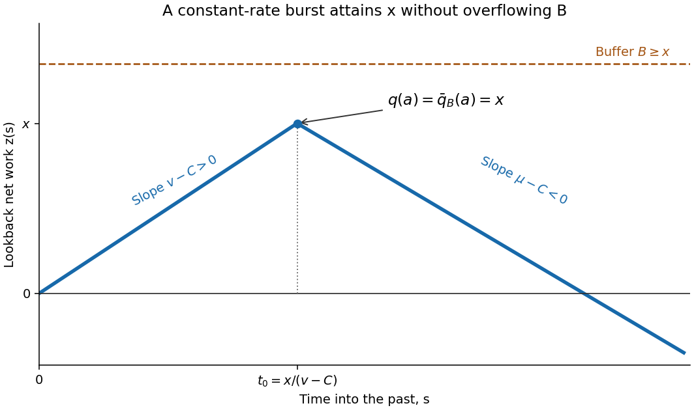

<h1 id="4/d/solution">Solution</h1>

↑ **Parent:** [D](../d.md)

Take $0<x\leq B$ and a finite-cost burst rate $v>C$. For the [constant-rate burst path](../../../../../../constant-rate-burst-path.md) just constructed, let $t_0=x/(v-C)$. On $0\leq s\leq t_0$ its net input is $z(s)=(v-C)s$, so the [supremum](../../../../../../supremum.md) is x and the [infimum](../../../../../../infimum.md) is zero. The finite-buffer formula evaluated at $t=t_0$ is therefore $\min(x,B)=x$. Since $\bar q\leq q=x$, we conclude $\bar q=x$ exactly: the burst never needs more space than the permitted capacity.

That path's action bounds the contracted finite-buffer rate, and optimizing gives

$$
\bar J(x)\leq\inf_{v>C}\frac{xg(v)}{v-C}=J(x),\qquad0<x\leq B.
$$

At zero use the typical-rate path to obtain $\bar J(0)=J(0)=0$. If the positive infinite-buffer rate is infinite, the asserted upper inequality is automatic. Approximating burst rates suffice, so the argument does not rely on an unproved existence of an optimal duration. Consequently $\boxed{\bar J(x)\leq J(x)\text{ for }0\leq x\leq B}$.

**[Figure 1](#4/d/image-a-constant-rate-burst-attaining-x-within-buffer-capacity-b). A constant-rate burst attaining x within buffer capacity B**.

## ↑ Ancestors (11)

1. [D](../d.md)
2. [4](../../4.md)
3. [Paper 31](../../../paper-31-split.md)
4. [Iii](../../../split.md)
5. [2004](../../../../split.md)
6. [Past exam of the mathematics course of the University of Cambridge](../../../../../split.md)
7. [Mathematics course of the University of Cambridge](../../../../../../mathematics-course-of-the-university-of-cambridge.md)
8. [Course of the University of Cambridge](../../../../../../course-of-the-university-of-cambridge.md)
9. [University of Cambridge](../../../../../../university-of-cambridge-split.md)
10. [List of universities](../../../../../../list-of-universities.md)
11. [Codex Wiki](../../../../../../split.md)
