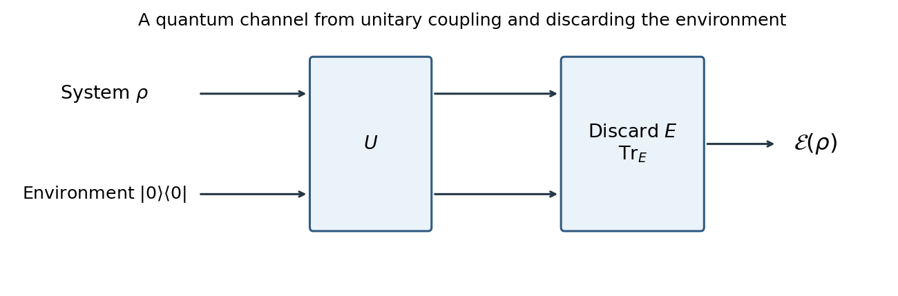

<h1 id="2/solution">Solution</h1>

↑ **Parent:** [2](../2.md)

A [quantum operation](../../../../../quantum-operation.md) is a linear, completely positive, trace-nonincreasing map on operators; its output trace records the probability of a selected outcome. A deterministic process that sends every [density matrix](../../../../../density-matrix.md) to another normalized [density matrix](../../../../../density-matrix.md) is a [quantum channel](../../../../../quantum-channel.md), satisfying **linearity, complete positivity and trace preservation**. Linearity preserves probabilistic mixtures. Complete positivity means that $\operatorname{id}_R\otimes\mathcal E$ remains positive for every finite-dimensional reference system $R$, so the process also acts consistently on entangled inputs. Trace preservation maintains total probability. Conditioning a selected branch by dividing by its output trace is generally nonlinear; it is a separate state-update step.

The [Stinespring dilation](../../../../../stinespring-dilation.md) of a deterministic operation on a system $A$ is

$$
\boxed{\mathcal E(\rho)=\operatorname{Tr}_E[U(\rho\otimes|0\rangle\langle0|_E)U^\dagger],}
$$

where $U$ is unitary on system plus environment, the initial environment is fixed and independent of the input, and the environment is discarded. A mixed environment can be purified by adding an extra environment system. For different input and output dimensions, use an isometry $V:A\to B\otimes E$ instead of this same-system unitary form.

**[Figure 1](#2/image-unitary-system-environment-realization-of-a-quantum-channel-with-the-environment-discarded). Unitary system–environment realization of a quantum channel, with the environment discarded**.

Choose an orthonormal environment basis $\{|\alpha\rangle\}$. Taking the [partial trace](../../../../../partial-trace.md) gives the [Kraus representation](../../../../../kraus-representation.md)

$$
\mathcal E(\rho)=\sum_\alpha K_\alpha\rho K_\alpha^\dagger,\qquad
K_\alpha=(I\otimes\langle\alpha|)U(I\otimes|0\rangle).
$$

Unitarity and completeness of the environment basis give

$$
\sum_\alpha K_\alpha^\dagger K_\alpha
=(I\otimes\langle0|)U^\dagger U(I\otimes|0\rangle)=I.
$$

Conversely, suppose the [Kraus operators](../../../../../kraus-operator.md) obey this completeness condition. Define $V|\psi\rangle=\sum_\alpha K_\alpha|\psi\rangle\otimes|\alpha\rangle$. Then $V^\dagger V=I$, so $V$ is an isometry. For equal input/output system dimensions, extend the orthonormal images of the subspace $A\otimes|0\rangle$ to an orthonormal basis of $A\otimes E$. Mapping a completed input basis to that output basis supplies a unitary $U$ with $U(|\psi\rangle|0\rangle)=V|\psi\rangle$. Tracing the environment recovers the given operator sum. This proves both directions of the equivalence.

It also follows directly that every [completely positive map](../../../../../completely-positive-map.md) in finite dimensions has an operator sum. Form its unnormalized [Choi matrix](../../../../../choi-matrix.md) $J=(\operatorname{id}\otimes\mathcal E)|\Omega\rangle\langle\Omega|$, with $|\Omega\rangle=\sum_i|i\rangle|i\rangle$. Complete positivity makes $J\geq0$. Resolve $J=\sum_\alpha|v_\alpha\rangle\langle v_\alpha|$ and reshape each vector as $|v_\alpha\rangle=\sum_i|i\rangle K_\alpha|i\rangle$. Comparing the coefficients of $|i\rangle\langle j|$ gives $\mathcal E(|i\rangle\langle j|)=\sum_\alpha K_\alpha|i\rangle\langle j|K_\alpha^\dagger$, hence the same formula for every operator by linearity. Trace preservation imposes the completeness condition just derived.

Finally, linearity of the operator sum is immediate from matrix multiplication. For any positive operator $B$ on reference plus system,

$$
(\operatorname{id}_R\otimes\mathcal E)(B)=\sum_\alpha(I_R\otimes K_\alpha)B(I_R\otimes K_\alpha^\dagger)\geq0,
$$

because each summand is a positive congruence. This proves [complete positivity](../../../../../completely-positive-map.md) for every reference dimension. Cyclicity of the trace gives

$$
\operatorname{Tr}\mathcal E(X)=\operatorname{Tr}\left(X\sum_\alpha K_\alpha^\dagger K_\alpha\right)=\operatorname{Tr}X.
$$

**Kraus form is trace preserving exactly when $\sum_\alpha K_\alpha^\dagger K_\alpha=I$.** Without this normalization, the final printed assertion would be false: a single operator $K=I/2$ gives output trace one quarter on every input [density matrix](../../../../../density-matrix.md). Thus the completeness condition is an essential part of the physical Kraus representation.

## ↑ Ancestors (10)

1. [2](../2.md)
2. [Paper 32](../../paper-32-split.md)
3. [Iii](../../split.md)
4. [2004](../../../split.md)
5. [Past exam of the mathematics course of the University of Cambridge](../../../../split.md)
6. [Mathematics course of the University of Cambridge](../../../../../mathematics-course-of-the-university-of-cambridge.md)
7. [Course of the University of Cambridge](../../../../../course-of-the-university-of-cambridge.md)
8. [University of Cambridge](../../../../../university-of-cambridge-split.md)
9. [List of universities](../../../../../list-of-universities.md)
10. [Codex Wiki](../../../../../split.md)
