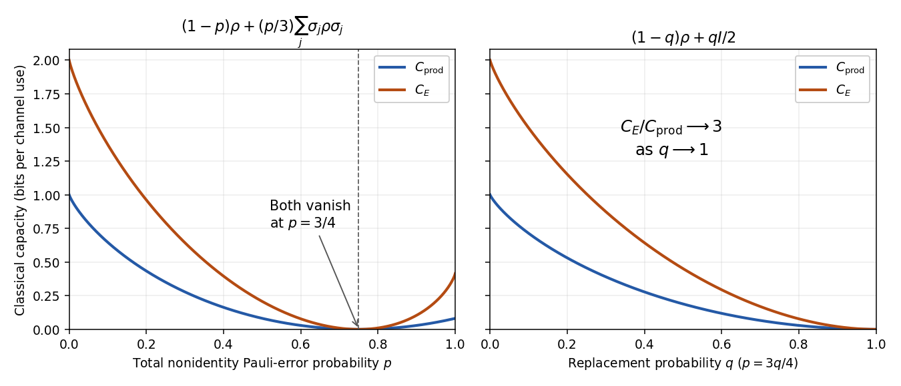

<h1 id="6/solution">Solution</h1>

↑ **Parent:** [6](../6.md)

Fix the noise convention explicitly: $p$ is the total probability of a nonidentity [Pauli error](../../../../../pauli-operator.md). The memoryless qubit [quantum depolarizing channel](../../../../../quantum-depolarizing-channel.md) is

$$
\mathcal D_p(\rho)=(1-p)\rho+\frac p3(X\rho X+Y\rho Y+Z\rho Z),\qquad0\leq p\leq1,
$$

with independent identical use on successive qubits, namely $\mathcal D_p^{\otimes n}$ on an $n$-qubit block. Its normalized Kraus operators are $\sqrt{1-p}I,\sqrt{p/3}X,\sqrt{p/3}Y,\sqrt{p/3}Z$.

Write the [Bloch sphere](../../../../../bloch-sphere.md) representation of a [density matrix](../../../../../density-matrix.md) as $\rho=(I+\boldsymbol r\cdot\boldsymbol\sigma)/2$, with $|\boldsymbol r|\leq1$. Its eigenvalues are $(1\pm|\boldsymbol r|)/2$, proving exactly this positivity condition. Conjugation by one [Pauli operator](../../../../../pauli-operator.md) preserves that coordinate of the [Bloch vector](../../../../../bloch-vector.md) and reverses the other two. Summing the three conjugations gives

$$
X\rho X+Y\rho Y+Z\rho Z=2I-\rho,
$$

so

$$
\boxed{\boldsymbol r\longmapsto\eta\boldsymbol r,\qquad\eta=1-\frac{4p}{3}.}
$$

The Bloch ball contracts isotropically, collapses to the maximally mixed state at $p=3/4$, and contracts with reversal for $p>3/4$. That last interval still represents a physical Pauli mixture. If instead $q$ is the probability of replacing the state by $I/2$, then $\mathcal D(\rho)=(1-q)\rho+qI/2$, with $p=3q/4$ and $\eta=1-q$; the usual replacement-probability range $0\leq q\leq1$ stops at complete depolarization.

Let $h_2(x)=-x\log_2x-(1-x)\log_2(1-x)$, with endpoint limits. In bits per use, the unassisted product-state classical capacity and the [entanglement-assisted capacity of a qubit depolarizing channel](../../../../../entanglement-assisted-capacity-of-a-qubit-depolarizing-channel.md) are

$$
\boxed{C_{\mathrm{prod}}(p)=1-h_2(2p/3),\qquad
C_E(p)=2-H_4(1-p,p/3,p/3,p/3),}
$$

where $H_4$ is Shannon entropy of the listed four probabilities. Equivalently $C_E=2+(1-p)\log_2(1-p)+p\log_2(p/3)$. The first quantity is a classical capacity with product quantum inputs and potentially collective output measurements, not the quantum capacity. These are the requested capacity formulae; a proof of their coding theorems is not needed here. The maximally entangled input gives a Bell-diagonal joint state with those four probabilities, explaining the entropy appearing in $C_E$. [The original entanglement-assisted capacity calculation](https://arxiv.org/abs/quant-ph/9904023) gives the depolarizing-channel expression.

**[Figure 2](#6/image-product-state-and-entanglement-assisted-classical-capacities-under-pauli-error-and-replacement-probability-conventions). Product-state and entanglement-assisted classical capacities under Pauli-error and replacement-probability conventions**.

At $p=0$ the capacities are one and two. Both vanish at $p=3/4$. On the full Pauli-error interval they increase again beyond that point, reaching $1-h_2(2/3)$ and $2-\log_23$ at $p=1$; on the replacement-probability plot both decrease to zero at $q=1$. The two panels make this convention distinction explicit.

For the [high-noise capacity ratio for qubit depolarization](../../../../../high-noise-capacity-ratio-for-qubit-depolarization.md), put $\eta=1-4p/3\to0$. Taylor expansion of binary entropy around one half gives

$$
C_{\mathrm{prod}}=1-h_2\left(\frac{1-\eta}{2}\right)=\frac{\eta^2}{2\ln2}+O(\eta^4).
$$

The four probabilities for $C_E$ are $1/4+3\eta/4$ and three copies of $1/4-\eta/4$. For a perturbation $\delta_i$ of the uniform four-outcome distribution, with $\sum_i\delta_i=0$, entropy expansion gives

$$
2-H_4(1/4+\delta_i)=\frac1{2\ln2}\sum_i\frac{\delta_i^2}{1/4}+O(\|\delta\|^3).
$$

Here $\sum_i\delta_i^2=3\eta^2/4$, hence $C_E=3\eta^2/(2\ln2)+O(\eta^3)$. Therefore

$$
\boxed{\lim_{p\to3/4}\frac{C_E(p)}{C_{\mathrm{prod}}(p)}=3.}
$$

The reciprocal ratio is $1/3$, and the same enhancement factor occurs as $q\to1$ in the replacement convention.

## ↑ Ancestors (10)

1. [6](../6.md)
2. [Paper 32](../../paper-32-split.md)
3. [Iii](../../split.md)
4. [2004](../../../split.md)
5. [Past exam of the mathematics course of the University of Cambridge](../../../../split.md)
6. [Mathematics course of the University of Cambridge](../../../../../mathematics-course-of-the-university-of-cambridge.md)
7. [Course of the University of Cambridge](../../../../../course-of-the-university-of-cambridge.md)
8. [University of Cambridge](../../../../../university-of-cambridge-split.md)
9. [List of universities](../../../../../list-of-universities.md)
10. [Codex Wiki](../../../../../split.md)
