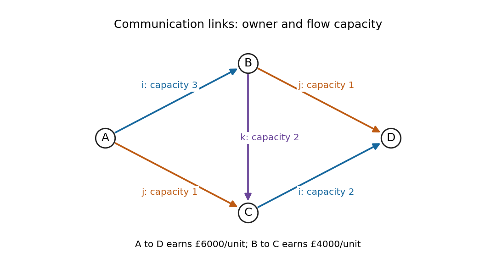

# Paper 33

↑ **Parent:** [Iii](../iii.md)

[https://www.maths.cam.ac.uk/postgrad/part-iii/files/pastpapers/2004/Paper33.pdf](https://www.maths.cam.ac.uk/postgrad/part-iii/files/pastpapers/2004/Paper33.pdf)

**Table of contents**

- [1](#1)
  - [Solution](#1/solution)
  - [a](#1/a)
    - [Solution](#1/a/solution)
  - [b](#1/b)
    - [Solution](#1/b/solution)
- [2](#2)
  - [Solution](#2/solution)
- [3](#3)
  - [Solution](#3/solution)
- [4](#4)
  - [Solution](#4/solution)
- [5](#5)
  - [Solution](#5/solution)
  - [a](#5/a)
    - [Solution](#5/a/solution)
  - [b](#5/b)
    - [Solution](#5/b/solution)
- [6](#6)
  - [Solution](#6/solution)

## 1

↑ **Parent:** [Paper 33](paper-33.md)

<h3 id="1/solution">Solution</h3>

↑ **Parent:** [1](#1)

For the [linear program](../../../mathematical-optimization.md#linear-programming) in maximization form, a nonnegative multiplier $y$ of the resource inequalities gives

$$
c^Tx\leq y^TAx\leq y^Tb
$$

whenever $A^Ty\geq c$. Equivalently, the [Lagrangian](../../../calculus-of-variations.md#lagrangian) is $b^Ty+(c-A^Ty)^Tx$; its supremum over $x\geq0$ is finite exactly when $A^Ty\geq c$. Minimizing this bound gives the [dual linear program](../../../mathematical-optimization.md#dual-linear-program)

$$
\boxed{\min b^Ty,\qquad A^Ty\geq c,\qquad y\geq0.}
$$

The displayed inequality proves [weak duality](../../../mathematical-optimization.md#weak-duality) directly.

For the final [simplex tableau](../../../mathematical-optimization.md#simplex-tableau), the basic-variable order is $(x_2,x_1)$. With $z_1,z_2$ interpreted as the ordinary unpriced [slack variables](../../../mathematical-optimization.md#slack-variable), its constraint equations give

$$
x_2=1-\frac{z_1+z_2}{10},\qquad
x_1=2-\frac{z_1+3z_2}{20}.
$$

The bottom row is read in the reduced-cost convention $r_j=c_j-c_B^TB^{-1}A_j$, with right side minus the basic objective value. It says the [reduced costs](../../../mathematical-optimization.md#reduced-cost) of $z_1,z_2$ are $0,-1/2$. Thus optimality requires $z_2=0$, while $z_1$ can increase without changing the objective until $x_2$ reaches zero. The complete primal optimum set is

$$
\boxed{x_1=2-\frac{\theta}{20},\qquad
x_2=1-\frac{\theta}{10},\qquad0\leq\theta\leq10.}
$$

[Reconstructing a linear program from a final simplex tableau](../../../mathematical-optimization.md#reconstructing-a-linear-program-from-a-final-simplex-tableau) exposes a source inconsistency. The slack columns are

$$
B^{-1}=\begin{pmatrix}1/10&1/10\\1/20&3/20\end{pmatrix},
\qquad
B=\begin{pmatrix}15&-10\\-5&10\end{pmatrix}.
$$

Because the first basic column is that of $x_2$, the original constraint data are

$$
A=\begin{pmatrix}-10&15\\10&-5\end{pmatrix},
\qquad b=B\binom12=\binom{-5}{15}.
$$

The slack [reduced costs](../../../mathematical-optimization.md#reduced-cost) give $y^T=(0,1/2)$ and

$$
(c_2,c_1)=y^TB=(-5/2,5).
$$

Consequently the recovered homogeneous [linear program](../../../mathematical-optimization.md#linear-programming) is

$$
\boxed{\max\left(5x_1-\frac52x_2\right),\qquad
-10x_1+15x_2\leq-5,\quad
10x_1-5x_2\leq15,\quad x_1,x_2\geq0.}
$$

Every point in the optimum segment has value $15/2$. Since the segment contains a point with both variables positive, [complementary slackness](../../../mathematical-optimization.md#complementary-slackness) forces both dual column inequalities to be equalities. They give the unique dual optimum

$$
\boxed{y_1=0,\qquad y_2=\frac12,\qquad b^Ty=\frac{15}{2}.}
$$

The printed bottom-right entry is $-3$, but it must be $-15/2$ for this linear objective and these constraint rows. Thus **no original problem in the stated homogeneous standard form has exactly the entire printed tableau**. Changing that one entry to $-15/2$ gives the reconstructed problem above. Alternatively, if an affine objective is permitted, $5x_1-\tfrac52x_2-\tfrac92$ has the displayed optimum value $3$ and unchanged [reduced costs](../../../mathematical-optimization.md#reduced-cost); the corresponding affine dual objective is $b^Ty-\tfrac92$. Both interpretations have exactly the same primal and dual optimizer sets. The discrepancy is in the objective constant, not in the optimal segment.

<h3 id="1/a">a</h3>

↑ **Parent:** [1](#1)

<h4 id="1/a/solution">Solution</h4>

↑ **Parent:** [A](#1/a)

**True.** Suppose a dual [feasible solution](../../../mathematical-optimization.md#feasible-point) $y$ exists. For every primal feasible $x$, [weak duality](../../../mathematical-optimization.md#weak-duality) gives $c^Tx\leq b^Ty$, a finite [upper bound](../../../set.md#upper-bound-in-a-partially-ordered-set) independent of $x$. This contradicts primal unboundedness. Therefore an unbounded primal has an infeasible dual. Here “unbounded” [arithmetic means](../../../arithmetic.md#arithmetic-mean) a nonempty feasible set with objective values unbounded above, rather than merely an unbounded feasible region.

<h3 id="1/b">b</h3>

↑ **Parent:** [1](#1)

<h4 id="1/b/solution">Solution</h4>

↑ **Parent:** [B](#1/b)

**False: both primal and dual can be infeasible.** For example, take

$$
A=\begin{pmatrix}0&0\\0&1\end{pmatrix},
\qquad b=\binom{-1}{0},\qquad c=\binom10.
$$

The primal requires $0\leq-1$, so is infeasible. Its dual requires the first coordinate of $A^Ty$ to be at least $1$, namely $0\geq1$, and is also infeasible. An infeasible primal therefore does not force an unbounded dual. If the dual is additionally assumed feasible, [strong duality](../../../mathematical-optimization.md#strong-duality) rules out a finite dual optimum; a feasible [linear program](../../../mathematical-optimization.md#linear-programming) with finite optimal value attains it, so in that qualified case the dual is unbounded below.

## 2

↑ **Parent:** [Paper 33](paper-33.md)

<h3 id="2/solution">Solution</h3>

↑ **Parent:** [2](#2)

Given a feasible [network flow](../../../graph-theory.md#flow) $f$, an original [directed edge](../../../graph-theory.md#directed-edge) $(u,v)$ has forward residual capacity $c_{uv}-f_{uv}$ and a reverse residual arc of capacity $f_{uv}$. A source–sink [graph path](../../../graph-theory.md#path-in-a-graph) in this [residual network](../../../graph-theory.md#residual-network) permits an augmentation by the minimum residual capacity along it: increase forward flows and decrease the corresponding reversed flows. Capacities and [flow conservation](../../../graph-theory.md#flow-conservation) are preserved, and the flow value increases by that amount.

If no residual source–sink [graph path](../../../graph-theory.md#path-in-a-graph) exists, let $S$ be the [vertices](../../../graph.md#vertex-graph-theory) reachable from the source. The sink is outside $S$. Every original arc from $S$ to its complement is saturated, and every original arc back into $S$ has zero flow, since a positive reverse residual arc would make its tail reachable. Conservation therefore gives

$$
|f|=\sum_{u\in S,\ v\notin S}f_{uv}
-\sum_{u\notin S,\ v\in S}f_{uv}
=\sum_{u\in S,\ v\notin S}c_{uv}.
$$

The flow equals this [cut capacity](../../../graph-theory.md#cut-capacity), so the [max-flow min-cut theorem](../../../graph-theory.md#max-flow-min-cut-theorem) proves it is [maximum](../../../set.md#maximum-of-a-subset-of-a-total-order).

Termination needs a capacity or path-selection assumption. For [integer](../../../number-theory.md#integer) capacities, starting from zero, every residual capacity and augmentation is integral; each augmentation increases the value by at least one, and the value is bounded by the total source-outgoing capacity. The algorithm therefore terminates. Rational capacities can be scaled to [integers](../../../number-theory.md#integer). With arbitrary real capacities, unrestricted [graph path](../../../graph-theory.md#path-in-a-graph) choices do not guarantee finite termination. A valid uniformly terminating implementation is the [Edmonds–Karp algorithm](../../../graph-theory.md#edmonds-karp-algorithm), choosing a shortest residual [graph path](../../../graph-theory.md#path-in-a-graph) each time.

Here is why that choice works independently of numerical capacity sizes. Residual distances from the source cannot decrease after augmenting along a shortest [graph path](../../../graph-theory.md#path-in-a-graph). Every newly created residual arc is the reverse of a [graph path](../../../graph-theory.md#path-in-a-graph) arc; if it could cause the first distance decrease, its previous distance relation would contradict that decrease. When an arc $(u,v)$ is saturated on a shortest [graph path](../../../graph-theory.md#path-in-a-graph), $d(v)=d(u)+1$. Before the same direction can be saturated again, it must have been restored by a reverse augmentation on a shortest [graph path](../../../graph-theory.md#path-in-a-graph), at which time $d'(u)=d'(v)+1\geq d(v)+1=d(u)+2$. Each arc is consequently critical only $O(|N|)$ times. There are $O(|A|)$ arcs and each augmentation saturates at least one, giving $O(|N||A|)$ augmentations, each found by [Breadth-first search](../../../combinatorics.md#breadth-first-search) in $O(|A|)$ time. Thus the shortest-path Ford–Fulkerson implementation terminates and finds a [maximum flow](../../../graph-theory.md#maximum-flow-problem) in $O(|N||A|^2)$ arithmetic operations.

For [sports elimination by maximum flow](../../../graph-theory.md#sports-elimination-by-maximum-flow), first give the target team all its remaining wins. This cannot hurt its chance to finish strictly ahead: changing a result to favour it also removes a rival's win. Let $w^*$ be its resulting win count. If any rival already has at least $w^*$ wins, strict victory is impossible. Otherwise give each unordered pair of rivals $i<j<n$ one game node. Its incoming capacity is $g_{ij}$, and its two outgoing arcs go to the participating team nodes. Their capacities may be replaced by the finite number

$$
G=\sum_{i<j<n}g_{ij},
$$

since no arc can need more than the total number of remaining rival games. Team $i$ has sink capacity $w^*-w_i-1$.

An integral flow of value $G$ saturates all game-node incoming arcs. Its two outgoing amounts allocate exactly $g_{ij}$ wins to the two teams; the team-sink caps keep each rival strictly below $w^*$. Conversely any successful completion of the league specifies such a flow. Integral capacities and augmentation give an integral [maximum flow](../../../graph-theory.md#maximum-flow-problem), so

$$
\boxed{\text{the target can win strictly }
\Longleftrightarrow\text{ the maximum flow has value }G,}
$$

after the initial negative-capacity rejection. Each actual game is counted once: making independent nodes for both ordered pairs would double-count it.

The network has $O(n^2)$ nodes and arcs. If each input [integer](../../../number-theory.md#integer) has at most $k$ bits, its derived capacities have $O(k+\log n)$ bits. The shortest-path algorithm above uses $O(n^6)$ arithmetic operations, each on [integers](../../../number-theory.md#integer) of polynomial bit length. Therefore **the [decision problem](../../../computer-science.md#decision-problem) belongs to P, even with $k$ part of the input**. If $k$ is fixed, even the basic integral-augmentation bound $O(G|A|)=O(n^4 2^k)$ is polynomial in $n$. If $k$ varies, that particular bound is only pseudopolynomial; it is the shortest-path implementation that establishes polynomial bit complexity.

## 3

↑ **Parent:** [Paper 33](paper-33.md)

<h3 id="3/solution">Solution</h3>

↑ **Parent:** [3](#3)

For a connected undirected weighted [graph](../../../graph.md), a [spanning tree](../../../combinatorics.md#spanning-tree) connects all [vertices](../../../graph.md#vertex-graph-theory) without a [graph cycle](../../../graph-theory.md#cycle-in-a-graph). A [minimum spanning tree](../../../combinatorics.md#minimum-spanning-tree) minimizes the sum of its [edge](../../../graph-theory.md#edge-of-a-graph) weights. Disconnected input has no [spanning tree](../../../combinatorics.md#spanning-tree), although the same methods produce a minimum spanning [forest](../../../combinatorics.md#forest). Negative [edge](../../../graph-theory.md#edge-of-a-graph) weights and ties cause no difficulty; a [tree](../../../combinatorics.md#tree-graph-theory) always contains exactly $|V|-1$ [edges](../../../graph-theory.md#edge-of-a-graph).

The central exchange argument is the [minimum spanning tree cut property](../../../combinatorics.md#minimum-spanning-tree-cut-property). Suppose a [forest](../../../combinatorics.md#forest) $F$ is contained in some [minimum spanning tree](../../../combinatorics.md#minimum-spanning-tree) $T$, and consider a cut with no [edge](../../../graph-theory.md#edge-of-a-graph) of $F$ crossing it. Let $e$ be a lightest crossing [edge](../../../graph-theory.md#edge-of-a-graph). If $e\notin T$, adding it creates a [graph cycle](../../../graph-theory.md#cycle-in-a-graph); the [graph path](../../../graph-theory.md#path-in-a-graph) in $T$ between its endpoints contains a crossing [edge](../../../graph-theory.md#edge-of-a-graph) $f$. That $f$ is not in $F$, and $w(e)\leq w(f)$. Thus $T-f+e$ is another [spanning tree](../../../combinatorics.md#spanning-tree) with no larger weight and still contains $F$. It is also minimum and contains $F\cup\{e\}$. This proves that the chosen [edge](../../../graph-theory.md#edge-of-a-graph) is safe, rather than merely asserting a greedy choice.

[Kruskal's algorithm](../../../combinatorics.md#kruskal-s-algorithm) sorts all [edges](../../../graph-theory.md#edge-of-a-graph) by increasing weight, starts with the empty [forest](../../../combinatorics.md#forest), and adds an [edge](../../../graph-theory.md#edge-of-a-graph) precisely when its endpoints are in different components. Each added [edge](../../../graph-theory.md#edge-of-a-graph) is lightest across a component cut respected by the current [forest](../../../combinatorics.md#forest). The exchange proof inductively keeps the [forest](../../../combinatorics.md#forest) inside a [minimum spanning tree](../../../combinatorics.md#minimum-spanning-tree); connectedness makes the final [forest](../../../combinatorics.md#forest) a [spanning tree](../../../combinatorics.md#spanning-tree), hence an optimum. Sorting takes $O(|E|\log|E|)$ comparisons, and even a simple component-merging implementation takes only polynomial additional work. Efficient component tracking improves that overhead further.

[Prim's algorithm](../../../combinatorics.md#prim-s-algorithm) instead grows a single [tree](../../../combinatorics.md#tree-graph-theory), repeatedly adding a lightest [edge](../../../graph-theory.md#edge-of-a-graph) from its [vertex](../../../graph.md#vertex-graph-theory) set to the outside. The same cut argument proves correctness. A dense implementation using an array runs in $O(|V|^2)$ comparisons. The dual [minimum spanning tree cycle property](../../../combinatorics.md#minimum-spanning-tree-cycle-property) says a uniquely heaviest [edge](../../../graph-theory.md#edge-of-a-graph) of a [graph cycle](../../../graph-theory.md#cycle-in-a-graph) belongs to no [minimum spanning tree](../../../combinatorics.md#minimum-spanning-tree): exchanging it for a lighter crossing [edge](../../../graph-theory.md#edge-of-a-graph) strictly improves any [tree](../../../combinatorics.md#tree-graph-theory) containing it. Ties must be handled carefully; a merely nonunique heaviest [edge](../../../graph-theory.md#edge-of-a-graph) can occur in an optimum.

Complexity classes are formally classes of [decision problems](../../../computer-science.md#decision-problem), so use the version asking whether a [graph](../../../graph.md) has a [spanning tree](../../../combinatorics.md#spanning-tree) of total weight at most a supplied threshold $K$. Assume [integer](../../../number-theory.md#integer) or rational weights and threshold are encoded in binary. The input length includes all these bits, not only the numbers of [vertices](../../../graph.md#vertex-graph-theory) and [edges](../../../graph-theory.md#edge-of-a-graph). [P](../../../computer-science.md#p-complexity) consists of [decision problems](../../../computer-science.md#decision-problem) decidable by a deterministic algorithm in time polynomial in that input length. [NP](../../../computer-science.md#np-complexity) consists of those with polynomial-size [complexity certificates](../../../computer-science.md#certificate-complexity) verified in deterministic [polynomial time](../../../computer-science.md#polynomial-time), equivalently decidable in [polynomial time](../../../computer-science.md#polynomial-time) by a nondeterministic machine.

Kruskal's algorithm constructs the optimum and compares its weight with $K$. Binary [integer](../../../number-theory.md#integer) comparisons and sums are polynomial-time operations. Rational comparisons can be made by cross multiplication, and their summed numerator and denominator have polynomially bounded bit length: a product of input denominators has bit length no greater than the sum of their bit lengths. The combinatorial algorithm makes polynomially many such operations. Hence **the minimum-spanning-tree [decision problem](../../../computer-science.md#decision-problem) is in P**; the optimization version likewise has a polynomial-time algorithm.

For membership in NP, the [complexity certificate](../../../computer-science.md#certificate-complexity) is a list of $|V|-1$ selected [edges](../../../graph-theory.md#edge-of-a-graph). Check that every [edge](../../../graph-theory.md#edge-of-a-graph) is present, that the [edges](../../../graph-theory.md#edge-of-a-graph) connect all [vertices](../../../graph.md#vertex-graph-theory) and contain no [graph cycle](../../../graph-theory.md#cycle-in-a-graph), and that their total weight is at most $K$. A [graph](../../../graph.md) search and binary arithmetic do this in [polynomial time](../../../computer-science.md#polynomial-time). A successful [complexity certificate](../../../computer-science.md#certificate-complexity) need not establish that its [tree](../../../combinatorics.md#tree-graph-theory) is minimum: it proves the threshold question's yes-answer. Conversely, a yes-instance has such a [tree](../../../combinatorics.md#tree-graph-theory) as a [complexity certificate](../../../computer-science.md#certificate-complexity). Therefore

$$
\boxed{\text{the minimum-spanning-tree decision problem belongs to both P and NP}.}
$$

Membership in NP does not [arithmetic mean](../../../arithmetic.md#arithmetic-mean) NP-hardness; here the explicit greedy algorithm provides the stronger tractability result.

## 4

↑ **Parent:** [Paper 33](paper-33.md)

<h3 id="4/solution">Solution</h3>

↑ **Parent:** [4](#4)

For a [transferable utility game](../../../game-theory.md#transferable-utility-game), the [characteristic function of a coalitional game](../../../game-theory.md#characteristic-function-of-a-coalitional-game) assigns a [coalition](../../../game-theory.md#coalition-game-theory) $S$ its largest total attainable revenue $v(S)$, with $v(\varnothing)=0$. The [core of a cooperative game](../../../game-theory.md#core-game-theory) consists of payoff vectors $x$ satisfying efficiency, $x(N)=v(N)$, and [coalition](../../../game-theory.md#coalition-game-theory) stability, $x(S)\geq v(S)$ for every $S$. A [coalition](../../../game-theory.md#coalition-game-theory) receiving less could operate alone and distribute its extra value to make each member better off.

Use thousands of pounds as the monetary unit. The physical directed arcs are $A\to B$ and $C\to D$, owned by $i$, with capacities $3,2$; $A\to C$ and $B\to D$, owned by $j$, with capacities $1,1$; and $B\to C$, owned by $k$, with capacity $2$.

**[Figure 1](#4/image-company-ownership-and-capacities-in-the-two-demand-communication-network). Company ownership and capacities in the two-demand communication network**.

The physical network is acyclic. There are exactly three $A$–$D$ [graph paths](../../../graph-theory.md#path-in-a-graph) and one $B$–$C$ [graph path](../../../graph-theory.md#path-in-a-graph). Let $u,v,w$ be the $A$–$D$ flows on $ABD$, $ACD$, $ABCD$, respectively, and let $z$ be the direct $B$–$C$ demand. Their capacities and revenue are

$$
u+w\leq3,\quad u\leq1,\quad v\leq1,\quad
v+w\leq2,\quad w+z\leq2,\quad u,v,w,z\geq0,
\qquad R=6(u+v+w)+4z.
$$

Every feasible traffic pattern decomposes into these [graph paths](../../../graph-theory.md#path-in-a-graph), so these inequalities are exact. The first is redundant, since $u\leq1$ and $w\leq2$ imply it.

Formulate this as a [minimum-cost flow](../../../graph-theory.md#minimum-cost-flow-problem) through the [two-resource path packing as minimum-cost circulation](../../../graph-theory.md#two-resource-path-packing-as-minimum-cost-circulation) reduction. Use auxiliary [vertices](../../../graph.md#vertex-graph-theory) $s,L,R,t$ and the following arcs, whose entries are (capacity, cost):

$$
\begin{array}{c|c}
s\to t&(1,-6)\\
s\to L&(2,0)\\
L\to t&(1,-6)\\
L\to R&(\infty,-6)\\
s\to R&(\infty,-4)\\
R\to t&(2,0)\\
t\to s&(\infty,0)
\end{array}
$$

The first forward [graph path](../../../graph-theory.md#path-in-a-graph) carries $u$, $sLt$ carries $v$, $sLRt$ carries $w$, and $sRt$ carries $z$. Conservation at $L$ imposes $v+w\leq2$, and at $R$ imposes $w+z\leq2$; the individual finite-capacity arcs give the other bounds. The return arc closes the circulation. Its cost is exactly $-R$, so this is an ordinary minimum-cost circulation with precisely the required feasible traffic set. Unlimited capacities may all be replaced by $5$, the [maximum](../../../set.md#maximum-of-a-subset-of-a-total-order) possible total [graph path](../../../graph-theory.md#path-in-a-graph) flow.

An [linear programming optimality certificate](../../../mathematical-optimization.md#linear-programming-optimality-certificate) is particularly short:

$$
R=6u+4v+2(v+w)+4(w+z)
\leq6+4+4+8=22.
$$

The feasible choice $u=v=w=z=1$ attains equality. Thus the actual traffic is three units from $A$ to $D$ and one from $B$ to $C$, and

$$
\boxed{R_{\max}=\text{£}22000.}
$$

All four positive terms in the bound must be tight at any optimum, so these [graph path](../../../graph-theory.md#path-in-a-graph) amounts are unique.

The two traffic demands must retain their identities. Merely adding fictitious return arcs $D\to A$ and $C\to B$ to the physical [graph](../../../graph.md) can create an invalid [graph cycle](../../../graph-theory.md#cycle-in-a-graph) combining both rewards: $A\to C\to B\to D\to A$ would credit the $j$-only network with revenue even though it carries neither requested demand. The resource-flow formulation above avoids that problem.

For the [characteristic function](../../../probability-theory.md#characteristic-function), only complete physical [graph paths](../../../graph-theory.md#path-in-a-graph) owned by a [coalition](../../../game-theory.md#coalition-game-theory) are available. Company $i$ or $j$ alone has no requested [graph path](../../../graph-theory.md#path-in-a-graph); company $k$ carries two units of $B$–$C$ traffic. The pair $\{i,j\}$ carries one unit on each of $ABD,ACD$; the pair $\{i,k\}$ sends two units on $ABCD$ rather than selling them at the lower $B$–$C$ rate; and $\{j,k\}$ has only the two direct $B$–$C$ units. Therefore

$$
\begin{array}{c|rrrrrrr}
S&\{i\}&\{j\}&\{k\}&\{i,j\}&\{i,k\}&\{j,k\}&N\\ \hline
v(S)&0&0&8&12&12&8&22.
\end{array}
$$

Writing payments in thousands, all stable divisions of the revenue are exactly

$$
\boxed{\begin{gathered}
x_i+x_j+x_k=22,\qquad x_i,x_j\geq0,\quad x_k\geq8,\\
x_i+x_j\geq12,\quad x_i+x_k\geq12,\quad x_j+x_k\geq8.
\end{gathered}}
$$

Equivalently, $8\leq x_k\leq10$, $0\leq x_j\leq10$ and $x_i=22-x_j-x_k$. This is the entire [core](../../../game-theory.md#core-game-theory), not just one acceptable allocation.

The [nucleolus](../../../game-theory.md#nucleolus) minimizes in [lexicographic order](../../../extremal-set-theory.md#lexicographic-order) the sorted decreasing [excesses of a coalition](../../../game-theory.md#excess-of-a-coalition) $e(S,x)=v(S)-x(S)$ over [imputations](../../../game-theory.md#imputation-in-a-coalitional-game). Empty and grand-coalition [coalition excesses](../../../game-theory.md#excess-of-a-coalition) are fixed zeros and can be omitted. For the six other [coalitions](../../../game-theory.md#coalition-game-theory), efficiency gives

$$
-x_i,\quad -x_j,\quad 8-x_k,\quad x_k-10,\quad x_j-10,\quad x_i-14.
$$

The two $k$-related [coalition excesses](../../../game-theory.md#excess-of-a-coalition) sum to $-2$, so their [maximum](../../../set.md#maximum-of-a-subset-of-a-total-order) is at least $-1$. This bound is attainable, and attaining it forces $x_k=9$. All six [coalition excesses](../../../game-theory.md#excess-of-a-coalition) are then at most $-1$ precisely when $1\leq x_j\leq9$ and $x_i=13-x_j$. The fixed pair of [coalition excesses](../../../game-theory.md#excess-of-a-coalition) equals $-1$ throughout these first-stage minimizers.

Minimize the largest of the remaining [coalition excesses](../../../game-theory.md#excess-of-a-coalition). They become $x_j-13,-x_j,x_j-10,-1-x_j$, whose [maximum](../../../set.md#maximum-of-a-subset-of-a-total-order) is $\max(-x_j,x_j-10)$. Its unique minimum is $-5$ at $x_j=5$. Hence $x_i=8$ and $x_k=9$. The sorted proper [coalition excesses](../../../game-theory.md#excess-of-a-coalition) there are $(-1,-1,-5,-5,-6,-8)$, and

$$
\boxed{\text{the nucleolus pays }(\text{£}8000,\text{£}5000,\text{£}9000)
\text{ to }(i,j,k).}
$$

## 5

↑ **Parent:** [Paper 33](paper-33.md)

<h3 id="5/solution">Solution</h3>

↑ **Parent:** [5](#5)

The total processing time $\sum_{i=1}^{40}t_i$ is constant for a single machine, so only the initial setup and changeover sum depends on the order. Use the [dummy-job reduction for sequence-dependent setup times](../../../mathematical-optimization.md#dummy-job-reduction-for-sequence-dependent-setup-times). Add [vertex](../../../graph.md#vertex-graph-theory) $0$, and set

$$
c_{0i}=s_i,\qquad c_{ij}=s_{ij}\quad(i,j\ne0,\ i\ne j),
\qquad c_{i0}=0.
$$

Let the binary variable $x_{ij}$ indicate that $j$ follows $i$ in the augmented tour. A [Hamiltonian cycle](../../../graph-theory.md#hamilton-cycle) through $0$ specifies exactly one schedule, read starting after $0$. An exact [integer programming](../../../mathematical-optimization.md#integer-programming) formulation is

$$
\boxed{\begin{aligned}
\min\quad&\sum_{i=1}^{40}t_i+
\sum_{\substack{i,j\in\{0,\ldots,40\}\\i\ne j}}c_{ij}x_{ij}\\
\text{subject to}\quad&
\sum_{j\ne i}x_{ij}=1\quad(i=0,\ldots,40),\\
&\sum_{i\ne j}x_{ij}=1\quad(j=0,\ldots,40),\\
&\sum_{\substack{i,j\in S\\i\ne j}}x_{ij}\leq |S|-1
\quad(\varnothing\ne S\subsetneq\{0,\ldots,40\}),\\
&x_{ij}\in\{0,1\}.
\end{aligned}}
$$

The degree equations alone describe a [cycle cover of a directed graph](../../../graph-theory.md#cycle-cover-of-a-directed-graph), possibly several separate [graph cycles](../../../graph-theory.md#cycle-in-a-graph). The [subtour elimination constraints](../../../mathematical-optimization.md#subtour-elimination-constraints) exclude every proper directed [graph cycle](../../../graph-theory.md#cycle-in-a-graph); the cover is therefore a single tour through all jobs. Conversely every schedule supplies a feasible tour with exactly its completion time as objective. Exponentially many written inequalities are permitted in this exact formulation; an implementation may add them only when violated.

For three parallel machines, the relevant objective is the [parallel-machine makespan with sequence-dependent setups](../../../mathematical-optimization.md#parallel-machine-makespan-with-sequence-dependent-setups), not simply total setup cost. Partition jobs into three ordered lists $\pi_r$. For a nonempty list define

$$
C_r=s_{\pi_r(1)}+\sum_{i\in\pi_r}t_i+
\sum_{h=1}^{|\pi_r|-1}s_{\pi_r(h),\pi_r(h+1)};
$$

an empty machine has $C_r=0$. Minimize $C_{\max}$ subject to $C_r\leq C_{\max}$ for each machine and each job assigned once. This can be written as a mixed-integer extension with assignment variables, one dummy tour per machine and conditional subtour cuts.

A practical strategy starts with a balanced assignment, sequences each machine using the single-machine methods, and improves by relocating or swapping jobs between machines together with within-machine [2-opt](../../../mathematical-optimization.md#2-opt) moves. Score each move by its change in $\max_r C_r$. [Branch and bound](../../../mathematical-optimization.md#branch-and-bound) can combine machine-assignment decisions with within-machine assignment bounds. For nonnegative times, the total processing time divided by three and the largest individual processing time are valid lower bounds, supplemented by setup-dependent route bounds. **Balancing processing and changeovers jointly is essential; independently minimizing the three tour costs does not by itself minimize completion time.**

<h3 id="5/a">a</h3>

↑ **Parent:** [5](#5)

<h4 id="5/a/solution">Solution</h4>

↑ **Parent:** [A](#5/a)

Drop the [subtour elimination constraints](../../../mathematical-optimization.md#subtour-elimination-constraints), retaining the one-incoming/one-outgoing equations and any branch decisions. This is an [assignment problem](../../../mathematical-optimization.md#assignment-problem), solvable in [polynomial time](../../../computer-science.md#polynomial-time). Its optimum is a [lower bound](../../../set.md#lower-bound-in-a-partially-ordered-set) on the best schedule in that branch because every admissible schedule satisfies the relaxed constraints. Add the constant processing-time sum to compare completion-time bounds.

Keep a feasible schedule as an incumbent [upper bound](../../../set.md#upper-bound-in-a-partially-ordered-set). At each [branch and bound](../../../mathematical-optimization.md#branch-and-bound) node, solve the restricted [assignment problem](../../../mathematical-optimization.md#assignment-problem). If it is infeasible or its bound is at least the incumbent, discard the node. If its optimum is a single tour, it is a feasible schedule attaining the bound, so update the incumbent and close the node. If it has a proper subtour $C$ with arcs $e_1,\ldots,e_r$, every valid Hamiltonian tour must omit at least one of those arcs.

For a disjoint exhaustive branching rule, child $h$ forces $e_1,\ldots,e_{h-1}$ and forbids $e_h$, for $h=1,\ldots,r$. Every valid tour falls into the child indexed by the first omitted arc. Re-solve the corresponding assignment relaxations, prioritize small bounds, and repeat. Finitely many binary choices give an exact terminating search; its worst-case [tree](../../../combinatorics.md#tree-graph-theory) can be exponential. **Assignment optima provide lower bounds, while complete tours provide upper bounds.** Patching subtours or local improvement can improve the incumbent without changing the exact pruning argument.

<h3 id="5/b">b</h3>

↑ **Parent:** [5](#5)

<h4 id="5/b/solution">Solution</h4>

↑ **Parent:** [B](#5/b)

Represent a schedule by a [permutation](../../../combinatorics.md#permutation) $v_1,\ldots,v_{40}$, with $v_0=v_{41}=0$. Choose $1\leq p<q\leq40$ and reverse the block $v_p,\ldots,v_q$. This is a [2-opt](../../../mathematical-optimization.md#2-opt) move on the dummy tour. Its exact setup-cost change is the [asymmetric 2-opt reversal cost](../../../mathematical-optimization.md#asymmetric-2-opt-reversal-cost)

$$
\Delta=c_{v_{p-1},v_q}+c_{v_p,v_{q+1}}
-c_{v_{p-1},v_p}-c_{v_q,v_{q+1}}
+\sum_{r=p}^{q-1}
(c_{v_{r+1},v_r}-c_{v_r,v_{r+1}}).
$$

The internal sum matters because the specified changeovers need not be symmetric. When the block begins at the first job, the boundary terms correctly update the initial setup; the dummy return costs are zero. Processing times cancel.

At temperature $T>0$, [simulated annealing](../../../mathematical-optimization.md#simulated-annealing) accepts a move with [probability](../../../probability-theory.md#probability)

$$
\boxed{\min\{1,\exp(-\Delta/T)\}.}
$$

With uniformly sampled reversal pairs the proposal is symmetric, so this is the appropriate [Metropolis–Hastings acceptance probability](../../../statistical-inference.md#metropolis-hastings-acceptance-probability). Improvements and ties are always accepted; occasional uphill moves escape local minima. Repeatedly sample moves, gradually lower $T$, and retain the best schedule seen even if the current schedule worsens. Reversing a block of length two swaps adjacent jobs, so these moves connect the whole [permutation](../../../combinatorics.md#permutation) space. A cooling schedule, iteration budget and restarts control practical performance. This is a heuristic at a finite budget; it does not certify global optimality unless paired with an exact bound or an appropriate limiting convergence argument.

## 6

↑ **Parent:** [Paper 33](paper-33.md)

<h3 id="6/solution">Solution</h3>

↑ **Parent:** [6](#6)

For [pure strategy](../../../game-theory.md#pure-strategy) sets $S_1,\ldots,S_n$ and [utility functions](../../../utility-function.md) $u_i$, a [Nash equilibrium](../../../game-theory.md#nash-equilibrium) is a strategy profile $a$ such that

$$
\boxed{u_i(a_i,a_{-i})\geq u_i(b_i,a_{-i})
\quad\text{for every player }i\text{ and every }b_i\in S_i.}
$$

For [mixed strategies](../../../game-theory.md#mixed-strategy), replace payoffs by their expectations under independent randomization and allow each player to choose any [probability distribution](../../../probability-theory.md#probability-distribution). Since [expected utility](../../../utility-function.md#expected-utility) is linear in a player's own distribution, checking all pure deviations suffices.

Pure equilibria need not exist. In [matching pennies](../../../game-theory.md#matching-pennies), player 1 receives $1$ for equal choices and $-1$ for different choices, while player 2 receives the negative. At an equal pair, player 2 improves by switching; at a different pair, player 1 improves by switching. Thus no pure profile is a [Nash equilibrium](../../../game-theory.md#nash-equilibrium).

In the [ranked university application game](../../../game-theory.md#ranked-university-application-game), every student must be admitted at a pure equilibrium. If someone were rejected, fewer than the total 50000 seats would be filled, so another university would have a vacancy. Moving there gives positive benefit instead of zero. Consequently all 50 universities have exactly 1000 applicants and admit all of them.

Choose a university with largest [arithmetic mean](../../../arithmetic.md#arithmetic-mean) admitted rank and let $r_{\min}$ be its lowest rank. If an outside student of rank $r>r_{\min}$ moved there, that student would be admitted in place of $r_{\min}$; the new [arithmetic mean](../../../arithmetic.md#arithmetic-mean) would exceed the university's previous [arithmetic mean](../../../arithmetic.md#arithmetic-mean), which was at least the student's current payoff. This is a profitable deviation. Therefore no higher rank is outside: that university consists of the highest 1000 ranks. Remove that block and repeat with the remaining university of largest [arithmetic mean](../../../arithmetic.md#arithmetic-mean). At each step the same argument excludes omitted higher ranks from the remaining set. The admitted cohorts are necessarily the consecutive blocks

$$
\{1,\ldots,1000\},\{1001,\ldots,2000\},\ldots,
\{49001,\ldots,50000\}.
$$

Conversely, assigning these blocks to labelled universities is an equilibrium. A student moving to a higher block is rejected. A student moving to a lower block displaces its lowest rank; all the other admitted ranks there are below every rank in the student's original block. Comparing the two [arithmetic means](../../../arithmetic.md#arithmetic-mean) with that student's own rank held fixed shows a strict loss. Thus every block assignment is an equilibrium, and the preceding argument excludes all other pure ones:

$$
\boxed{\text{there are exactly }50!\text{ pure Nash equilibria}.}
$$

There is **more than one further mixed equilibrium**. We give two genuinely mixed profiles, rather than count the pure equilibria as degenerate mixed ones. First, let every student apply independently and uniformly to all 50 universities. For each fixed student the other players' distribution is invariant under every [permutation](../../../combinatorics.md#permutation) of university labels. All 50 pure applications therefore give the same [expected utility](../../../utility-function.md#expected-utility). Uniform mixing is a [best response](../../../game-theory.md#best-response), so this is a [Nash equilibrium](../../../game-theory.md#nash-equilibrium).

For a distinct mixed equilibrium, assign each of the 48 highest consecutive rank blocks deterministically to a different university. Let each of the lowest 2000 students independently choose either of the two remaining universities with [probability](../../../probability-theory.md#probability) $1/2$. For a low-ranked student these two universities have identical [expected utility](../../../utility-function.md#expected-utility) by label symmetry, and that payoff is positive: there is a positive-probability event on which the student is admitted. Applying to one of the 48 full higher-ranked blocks would guarantee rejection. Hence the specified mixture is a [best response](../../../game-theory.md#best-response).

For a student in a deterministic higher block, moving to another deterministic block loses by the pure-equilibrium comparison above. It remains to rule out a move to a mixed university. Let the student's own block start at $L\geq2001$, and let their rank be $r\leq L+999$. Their present payoff is $L+499.5$. The number $M$ of low-ranked applicants at a specified mixed university has a [binomial distribution](../../../discrete-probability-distribution.md#binomial-distribution) with parameters $(2000,1/2)$, and the higher-ranked deviator is always admitted. If $M\geq1$, all other admitted ranks are at most 2000, so the new [arithmetic mean](../../../arithmetic.md#arithmetic-mean) is at most $(r+2000)/2$, and thus at most $(L+2999)/2$. If $M=0$, it is $r\leq50000$. Therefore the expected deviation payoff is at most

$$
\frac{L+2999}{2}+50000\,2^{-2000}
<L+499.5,
$$

because the gap without the last term is $(L-2000)/2\geq1/2$. No such deviation improves the payoff. This proves a second mixed equilibrium, with only the lowest 2000 students randomizing. It is visibly different from the fully uniform profile. In particular,

$$
\boxed{\text{the answer to the mixed-equilibrium alternative is “more than one”.}}
$$

## ↑ Ancestors (8)

1. [Iii](../iii.md)
2. [2004](../../2004.md)
3. [Past exam of the mathematics course of the University of Cambridge](../../../past-exam-of-the-mathematics-course-of-the-university-of-cambridge.md)
4. [Mathematics course of the University of Cambridge](../../../university-of-cambridge.md#mathematics-course-of-the-university-of-cambridge)
5. [Course of the University of Cambridge](../../../university-of-cambridge.md#course-of-the-university-of-cambridge)
6. [University of Cambridge](../../../university-of-cambridge.md)
7. [List of universities](../../../README.md#list-of-universities)
8. [Codex Wiki](../../../README.md)
