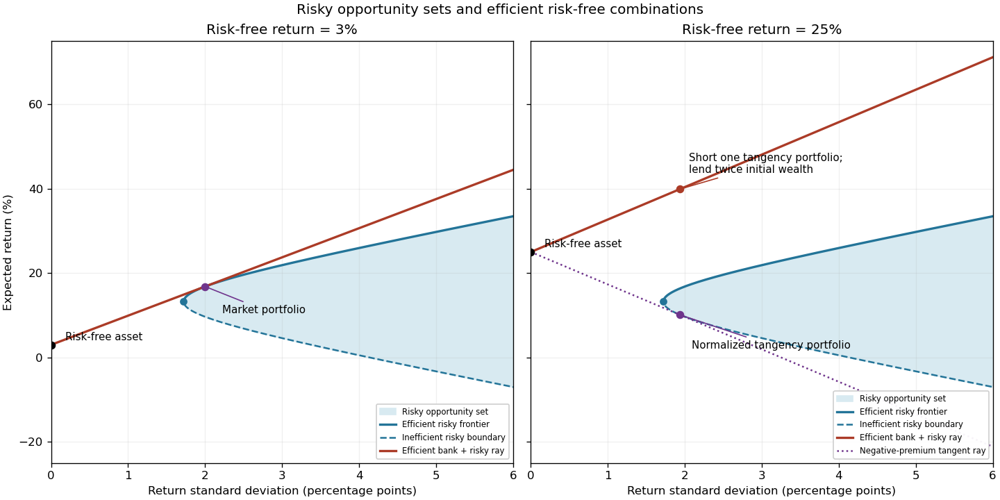

<h1 id="1/a/solution">Solution</h1>

↑ **Parent:** [A](../a.md)

Let $\mu$ be the vector of [expected returns](../../../../../../expected-return.md) and $\Sigma$ the positive definite [covariance matrix](../../../../../../covariance-matrix.md) of risky returns. For risky [investment portfolio](../../../../../../investment-portfolio.md) weights $w$ satisfying $\mathbf1^Tw=1$, the [portfolio opportunity set](../../../../../../portfolio-opportunity-set.md) consists of

$$
(\sigma,m)=\bigl(\sqrt{w^T\Sigma w},\mu^Tw\bigr).
$$

[Short selling](../../../../../../short-finance.md) permits negative weights. For a fixed [expected return](../../../../../../expected-return.md), the least possible [variance](../../../../../../variance-split.md) is attained on the left boundary of this set. Its upper branch is the [mean-variance efficient frontier](../../../../../../efficient-frontier.md): every other attainable point has either a larger [standard deviation](../../../../../../standard-deviation.md) for the same [expected return](../../../../../../expected-return.md) or a smaller [expected return](../../../../../../expected-return.md) for the same risk. The lower boundary is therefore inefficient.

For example, writing $A=\mathbf1^T\Sigma^{-1}\mathbf1$, $B=\mathbf1^T\Sigma^{-1}\mu$, $C=\mu^T\Sigma^{-1}\mu$ and $D=AC-B^2$, minimization of $w^T\Sigma w$ subject to its two linear constraints gives

$$
w=\Sigma^{-1}\left(\frac{C-Bm}{D}\mathbf1+\frac{Am-B}{D}\mu\right),\qquad
\sigma_{\min}^2(m)=\frac{Am^2-2Bm+C}{D}=\frac1A+\frac{A}{D}\left(m-\frac BA\right)^2.
$$

To obtain these weights, use [Lagrange multipliers](../../../../../../lagrange-multiplier.md): the stationary equation is $\Sigma w=\lambda\mathbf1+\nu\mu$, and the budget and mean constraints determine $\lambda,\nu$. Positive definiteness makes this the unique constrained minimum. Thus the boundary is a hyperbola in risk/mean coordinates.

Adding the risk-free asset allows borrowing and lending at $r$. In the usual positive-premium case the [market portfolio](../../../../../../market-portfolio.md) is the risky tangency portfolio, and combinations of it with the risk-free asset form the upper [capital market line](../../../../../../capital-market-line.md)

$$
\boxed{m=r+\theta\sigma,\qquad \theta=\frac{m_M-r}{\sigma_M}.}
$$

The [Sharpe ratio](../../../../../../sharpe-ratio.md) measures excess [expected return](../../../../../../expected-return.md) per unit of [standard deviation](../../../../../../standard-deviation.md); its maximum is the [market price of risk](../../../../../../market-price-of-risk.md) $\theta$. Points between the risk-free point and the tangency point lend some wealth; points beyond it borrow to leverage the [market portfolio](../../../../../../market-portfolio.md). The first panel illustrates the actual data here. The second anticipates the change in part (g), where the normalization of the tangency direction reverses its orientation.

**[Figure 1](#1/a/image-risky-opportunity-sets-and-efficient-risk-free-portfolio-combinations-at-risk-free-returns-of-3-and-25-percent). Risky opportunity sets and efficient risk-free portfolio combinations at risk-free returns of 3 and 25 percent**.

## ↑ Ancestors (11)

1. [A](../a.md)
2. [1](../../1.md)
3. [Paper 35](../../../paper-35-split.md)
4. [Iii](../../../split.md)
5. [2004](../../../../split.md)
6. [Past exam of the mathematics course of the University of Cambridge](../../../../../split.md)
7. [Mathematics course of the University of Cambridge](../../../../../../mathematics-course-of-the-university-of-cambridge.md)
8. [Course of the University of Cambridge](../../../../../../course-of-the-university-of-cambridge.md)
9. [University of Cambridge](../../../../../../university-of-cambridge-split.md)
10. [List of universities](../../../../../../list-of-universities.md)
11. [Codex Wiki](../../../../../../split.md)
