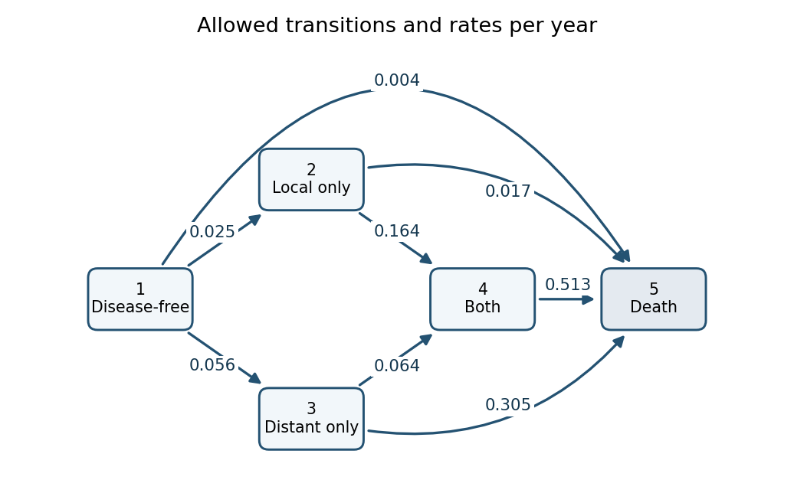

<h1 id="5/ii/a/solution">Solution</h1>

↑ **Parent:** [A](../a.md)

The permitted transitions form the following diagram. Each arrow is labelled by its fitted [transition intensity](../../../../../../../transition-intensity.md) in units of inverse years; the absence of an arrow is a structural restriction, not an estimated small effect.

**[Figure 1](#5/ii/a/image-five-state-model-permitted-transitions-and-fitted-rates-per-year). Five-state model: permitted transitions and fitted rates per year**.

State 1 can move directly to 2, 3 or 5; state 2 can move to 4 or 5; state 3 can move to 4 or 5; and state 4 can move only to 5. There are no recovery transitions, and state 5 is an [absorbing state](../../../../../../../absorbing-state.md). The rates of leaving the four living states are the sums of their outgoing arrows:

$$
\boxed{\lambda_1=0.085,\quad\lambda_2=0.181,\quad\lambda_3=0.369,\quad\lambda_4=0.513\quad\text{per year}.}
$$

The diagonal generator entries are their negatives, so every row of $Q$ sums to zero. These diagonal entries are not arrows or negative event rates. For example the direct $1\to5$ rate is $0.004$ per year, while death after reaching another state can occur at a much larger rate. The printed fit has no [covariates](../../../../../../../covariate.md) on the intensities, so it estimates one pooled rate system and contains no treatment-effect comparison, despite the trial's treatment randomization. The reported $-2\ell$ describes the fitted [likelihood](../../../../../../../likelihood-function.md) level; by itself it is not a goodness-of-fit test without a reference or competing model.

## ↑ Ancestors (12)

1. [A](../a.md)
2. [Ii](../../ii.md)
3. [5](../../../5.md)
4. [Paper 37](../../../../paper-37-split.md)
5. [Iii](../../../../split.md)
6. [2004](../../../../../split.md)
7. [Past exam of the mathematics course of the University of Cambridge](../../../../../../split.md)
8. [Mathematics course of the University of Cambridge](../../../../../../../mathematics-course-of-the-university-of-cambridge.md)
9. [Course of the University of Cambridge](../../../../../../../course-of-the-university-of-cambridge.md)
10. [University of Cambridge](../../../../../../../university-of-cambridge-split.md)
11. [List of universities](../../../../../../../list-of-universities.md)
12. [Codex Wiki](../../../../../../../split.md)
