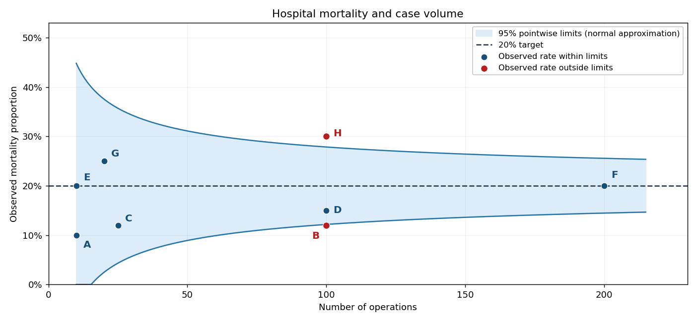

# Paper 38

↑ **Parent:** [Iii](../iii.md)

[https://www.maths.cam.ac.uk/postgrad/part-iii/files/pastpapers/2004/Paper38.pdf](https://www.maths.cam.ac.uk/postgrad/part-iii/files/pastpapers/2004/Paper38.pdf)

**Table of contents**

- [1](#1)
  - [Solution](#1/solution)
  - [a](#1/a)
    - [Solution](#1/a/solution)
  - [b](#1/b)
    - [Solution](#1/b/solution)
- [2](#2)
  - [a](#2/a)
    - [i](#2/a/i)
      - [Solution](#2/a/i/solution)
    - [ii](#2/a/ii)
      - [Solution](#2/a/ii/solution)
    - [iii](#2/a/iii)
      - [Solution](#2/a/iii/solution)
    - [iv](#2/a/iv)
      - [Solution](#2/a/iv/solution)
  - [b](#2/b)
    - [i](#2/b/i)
      - [Solution](#2/b/i/solution)
    - [ii](#2/b/ii)
      - [Solution](#2/b/ii/solution)
    - [iii](#2/b/iii)
      - [Solution](#2/b/iii/solution)
  - [c](#2/c)
    - [Solution](#2/c/solution)
- [3](#3)
  - [Solution](#3/solution)
- [4](#4)
  - [a](#4/a)
    - [Solution](#4/a/solution)
  - [b](#4/b)
    - [Solution](#4/b/solution)
  - [c](#4/c)
    - [Solution](#4/c/solution)
  - [d](#4/d)
    - [Solution](#4/d/solution)
  - [e](#4/e)
    - [Solution](#4/e/solution)
- [5](#5)
  - [a](#5/a)
    - [Solution](#5/a/solution)
  - [b](#5/b)
    - [Solution](#5/b/solution)
  - [c](#5/c)
    - [Solution](#5/c/solution)
  - [d](#5/d)
    - [Solution](#5/d/solution)
  - [e](#5/e)
    - [Solution](#5/e/solution)
  - [f](#5/f)
    - [Solution](#5/f/solution)

## 1

↑ **Parent:** [Paper 38](paper-38.md)

<h3 id="1/solution">Solution</h3>

↑ **Parent:** [1](#1)

A [censoring](../../../survival-analysis.md#censoring-statistics) observation means an event time is not observed exactly: the information supplies a bound or interval instead. Under [right censoring](../../../survival-analysis.md#right-censoring), one observes $X=\min(T,C)$ and the event indicator $\delta=\mathbf1_{\{T\le C\}}$; if $\delta=0$, one knows only $T>C$. Left [censoring](../../../survival-analysis.md#censoring-statistics) gives an upper bound, while interval [censoring](../../../survival-analysis.md#censoring-statistics) locates the event between two observations.

[Uninformative censoring](../../../survival-analysis.md#independent-censoring) means that, conditional on the covariates used in the analysis, the [censoring](../../../survival-analysis.md#censoring-statistics) mechanism supplies no additional information about the event time. [Independence](../../../random-variable.md#independent-random-variables) $T\perp C$ within those covariate strata is a sufficient formulation: subjects remaining in the observed [risk set](../../../survival-analysis.md#risk-set) have the same future [hazard](../../../survival-analysis.md#hazard-function) as the corresponding event-free population. A fixed study cutoff unrelated to prognosis is an example of [administrative censoring](../../../survival-analysis.md#administrative-censoring).

[Informative censoring](../../../survival-analysis.md#informative-censoring) occurs when that condition fails. For example, students at high risk of leaving may also become harder to contact before their departure is formally recorded; [censoring](../../../survival-analysis.md#censoring-statistics) at loss of contact selectively removes high-risk students. Ordinary [Kaplan–Meier estimator](../../../survival-analysis.md#kaplan-meier-estimator) and [Nelson–Aalen estimator](../../../survival-analysis.md#nelson-aalen-estimator) calculations then use an unrepresentative [risk set](../../../survival-analysis.md#risk-set). **The distinction determines whether ordinary survival estimates can be interpreted as population survival.** Merely knowing that an observation is censored does not establish [independence](../../../random-variable.md#independent-random-variables).

<h3 id="1/a">a</h3>

↑ **Parent:** [1](#1)

<h4 id="1/a/solution">Solution</h4>

↑ **Parent:** [A](#1/a)

The proposed hybrid recording rule updates the event times of students who leave but does not update the follow-up of those who remain. Thus the recorded end of observation depends on the subsequent outcome: this is [outcome-dependent updating of survival follow-up](../../../survival-analysis.md#outcome-dependent-updating-of-survival-follow-up).

In the four-student illustration, all four are known to be event-free at month six. Under the proposed coding, the three students without event reports are censored at month six, while the student whose event is subsequently reported remains in the [risk set](../../../survival-analysis.md#risk-set) until month seven. The recorded [risk set](../../../survival-analysis.md#risk-set) at that event therefore has size one, although the other three may still be studying. The [Kaplan–Meier estimator](../../../survival-analysis.md#kaplan-meier-estimator) factor would be $1-1/1=0$ and the [Nelson–Aalen estimator](../../../survival-analysis.md#nelson-aalen-estimator) jump would be $1/1=1$. This creates an artificial complete loss of estimated survival at that event.

If event notification is complete through the common eight-month cutoff, the absence of a notification establishes that the other three have not had the event by that cutoff. They should remain in the [risk set](../../../survival-analysis.md#risk-set) at month seven. With only these four subjects, the corresponding factors are instead $1-1/4=3/4$ and $1/4$. **Updating only failures while backdating nonfailures' [censoring](../../../survival-analysis.md#censoring-statistics) creates a severely biased [risk set](../../../survival-analysis.md#risk-set).** If notifications are incomplete, absence of a report does not establish continued study; positive follow-up confirmation is then required.

<h3 id="1/b">b</h3>

↑ **Parent:** [1](#1)

<h4 id="1/b/solution">Solution</h4>

↑ **Parent:** [B](#1/b)

Choose a common endpoint for the eight-month analysis and ascertain every student's status through that endpoint. With a complete event register, record each departure at its event time and right-censor every remaining student at the same administrative cutoff. Otherwise obtain a confirmation for all students at the cutoff, not just the most recent quarterly list, and verify intervening departure dates consistently.

A second coherent design is to analyse only up to the last common verified quarterly date, postponing a longer analysis until a further complete follow-up round is available. Extra event reports after that date cannot be combined with earlier [censoring](../../../survival-analysis.md#censoring-statistics) of all nonfailures as though the resulting [risk set](../../../survival-analysis.md#risk-set) were independently censored. Genuine losses to follow-up should be recorded separately and their possible [informative censoring](../../../survival-analysis.md#informative-censoring) assessed. **Use a common observation rule for failures and nonfailures, independent of their subsequent outcome.**

## 2

↑ **Parent:** [Paper 38](paper-38.md)

<h3 id="2/a">a</h3>

↑ **Parent:** [2](#2)

<h4 id="2/a/i">i</h4>

↑ **Parent:** [A](#2/a)

<h5 id="2/a/i/solution">Solution</h5>

↑ **Parent:** [I](#2/a/i)

Use the paper's notation $F$ for the [survivor function](../../../survival-analysis.md#survival-function), not for a cumulative distribution function. For a nonnegative continuous event time,

$$
\boxed{F(t)=\mathbb P(T>t),\qquad h(t)=\lim_{\varepsilon\downarrow0}\frac{\mathbb P(t<T\le t+\varepsilon\mid T>t)}{\varepsilon},\qquad H(t)=\int_0^t h(s)ds.}
$$

The [hazard function](../../../survival-analysis.md#hazard-function) is defined where survival is positive, and the last expression is the [integrated hazard](../../../survival-analysis.md#cumulative-hazard-function). These definitions assume the usual absolutely continuous [survival distribution](../../../survival-analysis.md#survival-distribution) so that the displayed density and [hazard](../../../survival-analysis.md#hazard-function) derivatives exist almost everywhere.

<h4 id="2/a/ii">ii</h4>

↑ **Parent:** [A](#2/a)

<h5 id="2/a/ii/solution">Solution</h5>

↑ **Parent:** [Ii](#2/a/ii)

The [probability density function](../../../continuous-probability-distribution.md#probability-density-function) is the negative derivative of the [survivor function](../../../survival-analysis.md#survival-function):

$$
\boxed{f(t)=-F'(t),\qquad F(t)=\int_t^\infty f(s)ds.}
$$

Indeed the [probability](../../../probability-theory.md#probability) in a short interval is $F(t)-F(t+\varepsilon)$, and division by its width gives the derivative relation.

<h4 id="2/a/iii">iii</h4>

↑ **Parent:** [A](#2/a)

<h5 id="2/a/iii/solution">Solution</h5>

↑ **Parent:** [Iii](#2/a/iii)

By the definition of [conditional probability](../../../probability-theory.md#conditional-probability),

$$
h(t)=\lim_{\varepsilon\downarrow0}\frac{F(t)-F(t+\varepsilon)}{\varepsilon F(t)}=\frac{f(t)}{F(t)}.
$$

Therefore

$$
\boxed{f(t)=h(t)F(t).}
$$

In particular $d\log F/dt=-h$ and $F(t)=e^{-H(t)}$ when $F(0)=1$.

<h4 id="2/a/iv">iv</h4>

↑ **Parent:** [A](#2/a)

<h5 id="2/a/iv/solution">Solution</h5>

↑ **Parent:** [Iv](#2/a/iv)

Continuity of a nonnegative event-time distribution excludes an atom at zero, so

$$
\boxed{F(0)=1,\qquad H(0)=0.}
$$

The [integrated hazard](../../../survival-analysis.md#cumulative-hazard-function) value follows directly from an integral over an empty interval. If a different model allowed an atom at zero, the first conclusion would require modification; that is not the continuous model used here.

<h3 id="2/b">b</h3>

↑ **Parent:** [2](#2)

<h4 id="2/b/i">i</h4>

↑ **Parent:** [B](#2/b)

<h5 id="2/b/i/solution">Solution</h5>

↑ **Parent:** [I](#2/b/i)

On $\{T>c\}$, $X=c$ and the [integrated hazard](../../../survival-analysis.md#cumulative-hazard-function) equals the constant $H(c)$. Thus

$$
\boxed{\mathbb E[H(X)\mathbf1_{\{T>c\}}]=H(c)\mathbb P(T>c)=F(c)H(c).}
$$

For the following finite calculations take $F(c)>0$; endpoint cases follow by a limit.

<h4 id="2/b/ii">ii</h4>

↑ **Parent:** [B](#2/b)

<h5 id="2/b/ii/solution">Solution</h5>

↑ **Parent:** [Ii](#2/b/ii)

The event contribution is an ordinary density integral. Since $f=-F'$ and $H'=h$, [integration by parts](../../../calculus.md#integration-by-parts) gives

$$
\begin{aligned}
\mathbb E[H(X)\mathbf1_{\{T\le c\}}]
&=\int_0^c H(t)f(t)dt=-\int_0^cH(t)\,dF(t)\\
&=-H(c)F(c)+H(0)F(0)+\int_0^cF(t)h(t)dt\\
&=-H(c)F(c)+\int_0^cf(t)dt.
\end{aligned}
$$

Consequently

$$
\boxed{\mathbb E[H(X)\mathbf1_{\{T\le c\}}]=1-F(c)-F(c)H(c).}
$$

<h4 id="2/b/iii">iii</h4>

↑ **Parent:** [B](#2/b)

<h5 id="2/b/iii/solution">Solution</h5>

↑ **Parent:** [Iii](#2/b/iii)

Adding the event and censored contributions cancels the boundary terms:

$$
\boxed{\mathbb EH(X)=F(c)H(c)+1-F(c)-F(c)H(c)=1-F(c)=\mathbb P(T\le c).}
$$

This is the [mean accumulated hazard before fixed censoring](../../../survival-analysis.md#mean-accumulated-hazard-before-fixed-censoring) identity. If $F(c)=0$, interpret the boundary term by its limiting value: $F H=-F\log F\to0$. The identity then gives one.

<h3 id="2/c">c</h3>

↑ **Parent:** [2](#2)

<h4 id="2/c/solution">Solution</h4>

↑ **Parent:** [C](#2/c)

Let $D=\sum_{j=1}^n\mathbf1_{\{T_j\le c_j\}}$ be the observed event count. For each subject, the fixed-censoring identity gives $\mathbb EH(X_j)=\mathbb P(T_j\le c_j)$. [Linearity of expectation](../../../probability-theory.md#linearity-of-expectation) therefore yields

$$
\boxed{\mathbb E\sum_{j=1}^nH(X_j)=\sum_{j=1}^n\mathbb P(T_j\le c_j)=\mathbb ED.}
$$

[Independence](../../../random-variable.md#independent-random-variables) between subjects is not needed for this [expectation](../../../probability-theory.md#expected-value) identity. The common $H$ presumes a common marginal [hazard](../../../survival-analysis.md#hazard-function); with heterogeneous subject-specific [hazards](../../../survival-analysis.md#hazard-function), replace it by $H_j$ for subject $j$. Random [censoring](../../../survival-analysis.md#censoring-statistics) admits the analogous conditional argument when its [independence](../../../random-variable.md#independent-random-variables) assumptions hold.

## 3

↑ **Parent:** [Paper 38](paper-38.md)

<h3 id="3/solution">Solution</h3>

↑ **Parent:** [3](#3)

For subject $i$, write $\delta_i=\mathbf1_{\{T_i\le C_i\}}$, and define the [counting process](../../../stochastic-process.md#counting-process) and pre-event [at-risk process](../../../survival-analysis.md#at-risk-process) by

$$
N(t)=\sum_i\mathbf1_{\{X_i\le t,\ \delta_i=1\}},\qquad R(t)=\sum_i\mathbf1_{\{X_i\ge t\}}.
$$

Under independent [censoring](../../../survival-analysis.md#censoring-statistics) and a common [hazard](../../../survival-analysis.md#hazard-function), each observed event-free subject has conditional event [probability](../../../probability-theory.md#probability) $h(t)dt$ in a short interval. Therefore $\mathbb E(dN(t)\mid\text{past})=R(t)dH(t)$ to first order. Equivalently the [compensator of a counting process](../../../stochastic-process.md#compensator-of-a-counting-process) is $\int_0^tR(s)dH(s)$. Dividing the observed increments by current exposure gives the estimating equation $d\widehat H=dN/R$, hence

$$
\boxed{\widehat H(t)=\int_0^t\frac{\mathbf1_{\{R(s)>0\}}}{R(s)}dN(s)=\sum_{t_j\le t}\frac{d_j}{r_j}.}
$$

Here $t_j$ are distinct event times, $d_j$ the number of events at that time, and $r_j=R(t_j)$ the number at risk immediately before it. One can also obtain the same increment by maximizing the local multiplicative-intensity likelihood $a^{d_j}e^{-r_ja}$: differentiation gives $a=d_j/r_j$. This derives the [Nelson–Aalen estimator](../../../survival-analysis.md#nelson-aalen-estimator), rather than merely naming it.

A censored observation contributes to the denominator while under observation, and then leaves the [risk set](../../../survival-analysis.md#risk-set); it contributes no event jump. For tied events, use the single increment $d_j/r_j$, not $d_j$ successive one-event increments with shrinking denominators. If [censoring](../../../survival-analysis.md#censoring-statistics) and events share a recorded time, a convention is needed; counting the event before removing same-time censored subjects uses the pre-time [risk set](../../../survival-analysis.md#risk-set) above. Rounded or interval-censored data may require a model suited to their observation mechanism.

For the distinct ordered observations in the question, let $\delta_j$ indicate whether $X_j$ is an event. The [risk set](../../../survival-analysis.md#risk-set) at $X_j$ contains precisely the $n-j+1$ subjects whose recorded time is at least $X_j$. Thus

$$
\widehat H(X_i)=\sum_{j\le i}\frac{\delta_j}{n-j+1},\qquad
\sum_{i=1}^n\widehat H(X_i)=\sum_{j=1}^n\frac{\delta_j}{n-j+1}\sum_{i=j}^n1
=\sum_{j=1}^n\delta_j.
$$

Therefore **the sum of the fitted integrated [hazards](../../../survival-analysis.md#hazard-function) at all observation times equals the observed number of events**, the [event-count identity for Nelson–Aalen cumulative hazards](../../../survival-analysis.md#event-count-identity-for-nelson-aalen-cumulative-hazards). The [grouped Nelson–Aalen event-count identity](../../../survival-analysis.md#grouped-nelson-aalen-event-count-identity) extends the same argument to tied observations with their multiplicities and the stated risk-set convention.

## 4

↑ **Parent:** [Paper 38](paper-38.md)

<h3 id="4/a">a</h3>

↑ **Parent:** [4](#4)

<h4 id="4/a/solution">Solution</h4>

↑ **Parent:** [A](#4/a)

Let $n$ be the number allocated to each arm and test equality of the two reconviction [probabilities](../../../probability-theory.md#probability), with a specified target difference as the alternative. For equal independent binomial arms, put $\bar p=(p_A+p_B)/2$, $\Delta=p_A-p_B>0$, $v_0=2\bar p(1-\bar p)$ and $v_1=p_A(1-p_A)+p_B(1-p_B)$. Under the null the rejection boundary for $\widehat p_A-\widehat p_B$ is approximately $z_*\sqrt{v_0/n}$; under the planning alternative its mean is $\Delta$ and [variance](../../../variance.md) is $v_1/n$. [statistical power](../../../probability-and-statistics.md#statistical-power) 0.8 is obtained approximately by requiring

$$
\Delta\sqrt n\ge z_*\sqrt{v_0}+z_{0.8}\sqrt{v_1}.
$$

Thus the [sample size for comparing two proportions](../../../probability-and-statistics.md#sample-size-for-comparing-two-proportions) is

$$
\boxed{n=\left\lceil\frac{[z_*\sqrt{v_0}+z_{0.8}\sqrt{v_1}]^2}{\Delta^2}\right\rceil,\qquad N=2n,}
$$

where $z_q=\Phi^{-1}(q)$, $z_*=z_{1-\alpha/2}$ for a [two-sided test](../../../statistical-modelling.md#two-sided-hypothesis-test), or $z_{1-\alpha}$ for a prespecified one-sided superiority test. With $p_A=2/3$ and $p_B=1/3$, this simplifies to

$$
\boxed{n=\left\lceil\left(\frac{3z_*}{\sqrt2}+2z_{0.8}\right)^2\right\rceil.}
$$

For illustration only, at $\alpha=0.05$ this gives 35 per arm, 70 total, for a [two-sided test](../../../statistical-modelling.md#two-sided-hypothesis-test), or 27 per arm, 54 total, for a [one-sided test](../../../statistical-modelling.md#one-sided-hypothesis-test). No unique numerical count is specified until alpha and sidedness are fixed. These are normal planning approximations; an exact requirement can be checked by summing the probabilities, from the two independent [binomial distributions](../../../discrete-probability-distribution.md#binomial-distribution), of all tables in an exact test's rejection region and increasing $n$ until [statistical power](../../../probability-and-statistics.md#statistical-power) is at least 0.8.

This calculation detects a treatment difference when the effect equals the proposed target. It does not promise 80% [statistical power](../../../probability-and-statistics.md#statistical-power) to establish that the reduction is at least that target via a confidence bound when the true effect lies exactly at the target boundary. Such a different testing objective needs a separately specified null and planning alternative. Complete follow-up and ascertainment by [intention-to-treat analysis](../../../causal-inference.md#intention-to-treat-analysis) are also required.

<h3 id="4/b">b</h3>

↑ **Parent:** [4](#4)

<h4 id="4/b/solution">Solution</h4>

↑ **Parent:** [B](#4/b)

Now $p_A=2/3$, $p_B=1/2$, so $\bar p=7/12$, $\Delta=1/6$, $v_0=35/72$ and $v_1=17/36$. The same [sample size](../../../probability-and-statistics.md#sample-size) calculation gives

$$
\boxed{n=\left\lceil\left(\sqrt{\frac{35}{2}}z_*+\sqrt{17}z_{0.8}\right)^2\right\rceil,\qquad N=2n.}
$$

At $\alpha=0.05$, the illustrative two-sided total is $2\times137=274$; the one-sided total is $2\times108=216$. The smaller difference needs roughly four times the size: its squared magnitude is a quarter of the previous one, while the [variance](../../../variance.md) factors change comparatively little.

<h3 id="4/c">c</h3>

↑ **Parent:** [4](#4)

<h4 id="4/c/solution">Solution</h4>

↑ **Parent:** [C](#4/c)

The first 12 weeks are in custody and carry no stated overdose deaths. Thus the 26-week sentence-based window includes 14 weeks after release: the first two weeks followed by the next twelve. Interpreting the later [probability](../../../probability-theory.md#probability) conditionally on surviving the earlier interval gives

$$
p_A=\frac1{200}+\left(1-\frac1{200}\right)\frac1{250}=0.00898.
$$

Hence

$$
\boxed{\mathbb ED=10{,}000(0.00898)=89.8\ \text{deaths, approximately }90.}
$$

If the two quoted frequencies instead use the same original cohort as their denominator, add the two marginal [probabilities](../../../probability-theory.md#probability) to get exactly 90 expected deaths. The conditional-survival calculation makes the denominator interpretation explicit; both conventions agree at the rounded precision of the quoted rates.

<h3 id="4/d">d</h3>

↑ **Parent:** [4](#4)

<h4 id="4/d/solution">Solution</h4>

↑ **Parent:** [D](#4/d)

There is a time-window discrepancy in the printed request: the [probabilities](../../../probability-theory.md#probability) supplied concern 26 weeks after sentence, whereas this part asks about 26 weeks after release. The prison data specify only the first 14 post-release weeks. **The literal release-based comparison is not numerically identified without further follow-up risks and a common time origin for both arms.**

For the intended common 26-week sentence-based endpoint, plan specifically for a 12% relative reduction from $p_B=0.01$. Then $p_A=0.88p_B=0.0088$, $\Delta=0.0012$ and $\bar p=0.0094$. At 50% [statistical power](../../../probability-and-statistics.md#statistical-power), $z_{0.5}=0$, so the [rare-event collaboration size at half power](../../../probability-and-statistics.md#rare-event-collaboration-size-at-half-power) is

$$
n\simeq\frac{2\bar p(1-\bar p)z_*^2}{\Delta^2}=12932.8333\,z_*^2.
$$

Each system contributes 10,000 participants per arm. Therefore

$$
\boxed{m=\left\lceil1.29328333\,z_*^2\right\rceil\quad\text{systems}.}
$$

At $\alpha=0.05$, this is **five systems** for a [two-sided test](../../../statistical-modelling.md#two-sided-hypothesis-test), or **four systems** for a prespecified [one-sided test](../../../statistical-modelling.md#one-sided-hypothesis-test). For the two-sided calculation the required size is approximately 49,681 per arm, giving a 100,000-participant collaborative design after rounding to whole systems.

The 12% planning reduction is not the reduction implied by part (c): $0.00898$ versus $0.01$ gives 10.2%. If one instead powers that calculated effect, the corresponding formula is $m=\lceil1.80698576z_*^2\rceil$, giving seven systems at two-sided 5%. Rounding the first [mortality](../../../biology.md#mortality) estimate to $0.009$ changes the latter answer to eight systems, so it should not be silently substituted into the 12% calculation. All these counts assume independent individual outcomes and the common sentence-based window; the [time-origin alignment of clinical endpoints](../../../probability-and-statistics.md#time-origin-alignment-of-clinical-endpoints) is essential.

<h3 id="4/e">e</h3>

↑ **Parent:** [4](#4)

<h4 id="4/e/solution">Solution</h4>

↑ **Parent:** [E](#4/e)

A trial can be well powered for a common reconviction outcome and poorly powered for a small difference in rare deaths. Failure to obtain a significant [mortality](../../../biology.md#mortality) comparison would not show that the treatments have equal safety. Participants' overall welfare cannot be reduced to reconviction alone: a decrease in that outcome must be weighed against possible loss of life.

Ethical [randomization](../../../causal-inference.md#randomization) depends on [clinical equipoise](../../../probability-and-statistics.md#clinical-equipoise) about the overall benefit-risk balance. Participants need voluntary [informed consent](../../../biology.md#informed-consent) that explains the uncertainty and possible [mortality](../../../biology.md#mortality) tradeoff; a criminal-justice setting demands particular care about coercion. The design should ascertain serious outcomes completely, use [independent trial safety monitoring](../../../probability-and-statistics.md#independent-trial-safety-monitoring) with prespecified stopping rules, and seek pooled safety evidence when an adequately powered [mortality](../../../biology.md#mortality) comparison needs collaboration. These principles are consistent with the research protections described in [the Declaration of Helsinki](https://www.wma.net/policies-post/wma-declaration-of-helsinki/).

**A smaller efficacy trial is not automatically unethical, but deliberately avoiding adequate safety information is not a justification for it.** A limited initial study needs a defensible scientific purpose, proportionate safeguards and an explicit plan for resolving serious-harm uncertainty; if evidence establishes an unfavorable net balance, continuing [randomization](../../../causal-inference.md#randomization) merely to improve precision would not be justified.

## 5

↑ **Parent:** [Paper 38](paper-38.md)

<h3 id="5/a">a</h3>

↑ **Parent:** [5](#5)

<h4 id="5/a/solution">Solution</h4>

↑ **Parent:** [A](#5/a)

Plot each observed [mortality](../../../biology.md#mortality) proportion vertically against its operation count horizontally, retaining the hospital labels. The required points, together with the target and approximate control bands used below, give the following [hospital mortality funnel plot](../../../statistical-inference.md#hospital-mortality-funnel-plot).

**[Figure 1](#5/a/image-hospital-mortality-proportions-against-operation-counts-with-a-20-percent-target-and-approximate-pointwise-95-percent-binomial-control-limits). Hospital mortality proportions against operation counts with a 20% target and approximate pointwise 95% binomial control limits**.

Hospitals sharing an operation count remain separate labeled points; equal observed [mortality](../../../biology.md#mortality) proportions at different volumes should not be treated as equally precise.

<h3 id="5/b">b</h3>

↑ **Parent:** [5](#5)

<h4 id="5/b/solution">Solution</h4>

↑ **Parent:** [B](#5/b)

If $D\sim\operatorname{Bin}(n,p_0)$, the observed [binomial proportion](../../../discrete-probability-distribution.md#binomial-proportion) $\widehat p=D/n$ has [variance](../../../variance.md) $p_0(1-p_0)/n$. Consequently its [standard error](../../../statistical-inference.md#standard-error) is proportional to $n^{-1/2}$. A common target therefore produces broad uncertainty at low volume and narrower uncertainty at high volume, forming the funnel-shaped envelope around the horizontal target. **The narrowing represents sampling precision, not a predicted change of [mortality](../../../biology.md#mortality) with volume.**

<h3 id="5/c">c</h3>

↑ **Parent:** [5](#5)

<h4 id="5/c/solution">Solution</h4>

↑ **Parent:** [C](#5/c)

Under the target model $p_0=0.20$, the [normal approximation](../../../convergence-of-random-variables.md#normal-approximation) gives

$$
\widehat p\approx N\left(0.20,\frac{0.20(0.80)}n\right).
$$

The pointwise 95% [binomial funnel control limits](../../../statistical-inference.md#binomial-funnel-control-limits) are therefore

$$
\boxed{L(n)=\max\left(0,0.20-1.96\frac{0.40}{\sqrt n}\right),\qquad U(n)=\min\left(1,0.20+1.96\frac{0.40}{\sqrt n}\right).}
$$

Draw these curves around the horizontal 20% target, as in the figure. At $n=100$, the approximate limits are $0.1216$ and $0.2784$, so B and H are outside the nominal bands; that is a signal for investigation, not proof of inferior or superior care. The bands use the target [variance](../../../variance.md) rather than each hospital's observed rate. They are [control limits](../../../statistical-inference.md#control-limits) for possible observations under the target model, not [confidence intervals](../../../statistical-inference.md#confidence-interval) centered on the observed points.

Normal coverage is approximate, especially for the small hospitals; clipping does not repair that approximation. Exact binomial tail limits can be used if exact calibration is needed.

<h3 id="5/d">d</h3>

↑ **Parent:** [5](#5)

<h4 id="5/d/solution">Solution</h4>

↑ **Parent:** [D](#5/d)

Four advantages of the [hospital mortality funnel plot](../../../statistical-inference.md#hospital-mortality-funnel-plot) are:

- It presents [mortality](../../../biology.md#mortality) and case volume together, making the difference in precision between small and large hospitals visible.
- Its volume-dependent [control limits](../../../statistical-inference.md#control-limits) distinguish expected sampling scatter from observations deserving investigation, avoiding an indiscriminate ranking of raw rates.
- It displays all hospitals on one interpretable scale with a common target and identifies unusually low as well as unusually high rates.
- It makes the benchmark and statistical assumptions explicit and supports direct comparison as volumes change, without estimating the benchmark from potentially anomalous observations.

It does not automatically adjust for patient severity, referral patterns or data quality, and an outlying point does not establish a causal explanation.

<h3 id="5/e">e</h3>

↑ **Parent:** [5](#5)

<h4 id="5/e/solution">Solution</h4>

↑ **Parent:** [E](#5/e)

Let $I_j$ indicate a point outside its pointwise 95% limits. Under exact 95% marginal calibration, linearity gives

$$
\boxed{\mathbb E\sum_{j=1}^8I_j=8(0.05)=0.4.}
$$

[Independence](../../../random-variable.md#independent-random-variables) is not needed for that expected count. If the eight hospital observations are independent, the [probability](../../../probability-theory.md#probability) of at least one false alarm is

$$
\boxed{1-(1-0.05)^8=1-0.95^8\approx0.3366.}
$$

Thus nominal pointwise 95% coverage is quite different from 95% simultaneous coverage of the whole display, a [familywise error rate](../../../statistical-modelling.md#familywise-error-rate) issue. Without [independence](../../../random-variable.md#independent-random-variables), the product formula need not hold; the union bound is at most $8(0.05)=0.4$.

Because the permitted [normal approximation](../../../convergence-of-random-variables.md#normal-approximation) gives only nominal 95% coverage for discrete binomial counts, these are nominal answers. With exact outside [probabilities](../../../probability-theory.md#probability) $q_j$, the exact expected count is $\sum_jq_j$ and, under [independence](../../../random-variable.md#independent-random-variables), the exact [probability](../../../probability-theory.md#probability) is $1-\prod_j(1-q_j)$.

<h3 id="5/f">f</h3>

↑ **Parent:** [5](#5)

<h4 id="5/f/solution">Solution</h4>

↑ **Parent:** [F](#5/f)

Three defensible approaches are:

- Use simultaneous calibration, for example [Bonferroni correction](../../../statistical-modelling.md#bonferroni-correction): give each of eight hospitals outside [probability](../../../probability-theory.md#probability) at most $0.05/8$. Replace 1.96 by $z_{1-0.05/16}\approx2.7344$ in the normal bands, giving familywise error at most 5% when the marginal tests are calibrated.
- Apply the [Holm step-down procedure](../../../statistical-modelling.md#holm-bonferroni-method) to valid two-sided binomial p-values. Order them and compare the jth smallest with $0.05/(9-j)$ until the first nonrejection. This controls familywise error while often being less conservative than giving every hospital the same Bonferroni threshold.
- Treat an initial signal as a screen and require prespecified confirmation in independent new data before declaring a persistent deviation, alongside checking case mix and coding. Calibration must include both stages; unrestricted repeated testing until an alarm appears would increase, rather than solve, the problem.

**A control-limit crossing prompts investigation; it is not itself a verdict on a hospital.** Wider or adjusted thresholds also reduce sensitivity, so the false-alarm objective and the cost of missed genuine problems should be made explicit.

## ↑ Ancestors (8)

1. [Iii](../iii.md)
2. [2004](../../2004.md)
3. [Past exam of the mathematics course of the University of Cambridge](../../../past-exam-of-the-mathematics-course-of-the-university-of-cambridge.md)
4. [Mathematics course of the University of Cambridge](../../../university-of-cambridge.md#mathematics-course-of-the-university-of-cambridge)
5. [Course of the University of Cambridge](../../../university-of-cambridge.md#course-of-the-university-of-cambridge)
6. [University of Cambridge](../../../university-of-cambridge.md)
7. [List of universities](../../../README.md#list-of-universities)
8. [Codex Wiki](../../../README.md)
