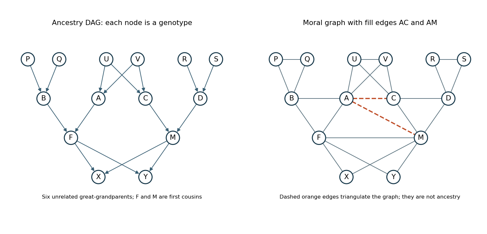

<h1 id="3/d/i/solution">Solution</h1>

↑ **Parent:** [I](../i.md)

Label the [full siblings](../../../../../../../full-sibling.md) at the bottom $X,Y$ and their cousin parents $F,M$. Let $F$ have parents $A,B$ and $M$ parents $C,D$, where $A,C$ are siblings with parents $U,V$. Include the other great-grandparents as $P,Q$, parents of $B$, and $R,S$, parents of $D$. This gives fourteen people, with six independent [founders in a pedigree](../../../../../../../founder-in-a-pedigree.md) $U,V,P,Q,R,S$.

The [pedigree graphical model](../../../../../../../pedigree-graphical-model.md) has the following [Directed acyclic graph](../../../../../../../directed-acyclic-graph.md), with both members of each parent pair pointing to every listed child:

$$
(U,V)\to A,C;\quad(P,Q)\to B;\quad(R,S)\to D;\quad(A,B)\to F;\quad(C,D)\to M;\quad(F,M)\to X,Y.
$$

Let $f(g)$ be the founder [genotype](../../../../../../../genotype.md) law under [Hardy-Weinberg equilibrium](../../../../../../../hardy-weinberg-principle.md), and let $t(g\mid h,k)$ be the [Mendelian segregation](../../../../../../../mendelian-segregation.md) kernel. The joint probability of all genotypes is

$$
\begin{aligned}
p(\boldsymbol g)={}&\prod_{Z\in\{U,V,P,Q,R,S\}}f(g_Z)\,t(g_A\mid g_U,g_V)t(g_C\mid g_U,g_V)\\
&\times t(g_B\mid g_P,g_Q)t(g_D\mid g_R,g_S)t(g_F\mid g_A,g_B)t(g_M\mid g_C,g_D)\\
&\times t(g_X\mid g_F,g_M)t(g_Y\mid g_F,g_M).
\end{aligned}
$$

For a biallelic locus with allele-1 frequency $p$, $f(11)=p^2$, $f(12)=2p(1-p)$ and $f(22)=(1-p)^2$. The kernel $t$ assigns probability $1/4$ to each labelled pair of parental transmissions and adds these probabilities when they produce the same unordered genotype. Summing this [Bayesian network](../../../../../../../bayesian-network.md) factorization over unobserved genotypes gives their [marginal distribution](../../../../../../../marginal-distribution.md) or a [pedigree likelihood](../../../../../../../pedigree-likelihood.md).

**[Figure 1](#3/d/i/image-genotype-ancestry-and-the-two-fill-edges-for-a-first-cousin-marriage-pedigree). Genotype ancestry and the two fill edges for a first-cousin marriage pedigree**.

## ↑ Ancestors (12)

1. [I](../i.md)
2. [D](../../d.md)
3. [3](../../../3.md)
4. [Paper 39](../../../../paper-39-split.md)
5. [Iii](../../../../split.md)
6. [2004](../../../../../split.md)
7. [Past exam of the mathematics course of the University of Cambridge](../../../../../../split.md)
8. [Mathematics course of the University of Cambridge](../../../../../../../mathematics-course-of-the-university-of-cambridge.md)
9. [Course of the University of Cambridge](../../../../../../../course-of-the-university-of-cambridge.md)
10. [University of Cambridge](../../../../../../../university-of-cambridge-split.md)
11. [List of universities](../../../../../../../list-of-universities.md)
12. [Codex Wiki](../../../../../../../split.md)
