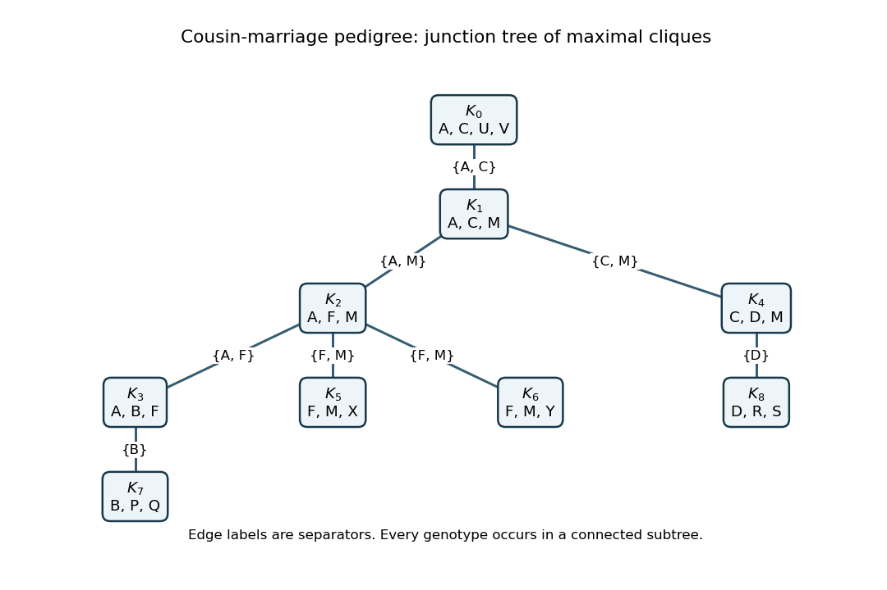

<h1 id="3/f/solution">Solution</h1>

↑ **Parent:** [F](../f.md)

The nine [maximal cliques](../../../../../../maximal-clique.md) of this triangulation are

$$
\begin{array}{c|l}
K_0&\{A,C,U,V\}\\K_1&\{A,C,M\}\\K_2&\{A,F,M\}\\K_3&\{A,B,F\}\\K_4&\{C,D,M\}\\K_5&\{F,M,X\}\\K_6&\{F,M,Y\}\\K_7&\{B,P,Q\}\\K_8&\{D,R,S\}.
\end{array}
$$

Every other nonempty [clique](../../../../../../clique-graph-theory.md) is a subset of one of these. One [junction tree](../../../../../../junction-tree.md), listing its separators after the edges, is

$$
\begin{array}{c|l}
K_0-K_1&\{A,C\}\\K_1-K_2&\{A,M\}\\K_2-K_3&\{A,F\}\\K_1-K_4&\{C,M\}\\K_2-K_5&\{F,M\}\\K_2-K_6&\{F,M\}\\K_3-K_7&\{B\}\\K_4-K_8&\{D\}.
\end{array}
$$

Each variable appears in a connected subtree, verifying the [running intersection property](../../../../../../running-intersection-property.md). For example, the cliques containing $M$ are $K_1,K_2,K_4,K_5,K_6$, and their connecting paths contain $M$ throughout.

**[Figure 2](#3/f/image-maximal-genotype-cliques-and-separators-for-exact-inference-in-the-cousin-marriage-pedigree). Maximal genotype cliques and separators for exact inference in the cousin-marriage pedigree**.

The [junction tree algorithm](../../../../../../junction-tree-algorithm.md) assigns every founder factor and every child-with-parents factor to one containing clique, and multiplies any observation or [penetrance](../../../../../../penetrance.md) factors there. The [junction-tree sum-product message](../../../../../../junction-tree-sum-product-message.md) from clique $i$ to clique $j$ sums out $C_i\setminus(C_i\cap C_j)$ after multiplying the local potential and all incoming messages except $j$'s. An inward pass sums the joint probability or [pedigree likelihood](../../../../../../pedigree-likelihood.md); a subsequent outward pass gives each person's posterior genotype probabilities. This is the same variable-elimination principle as the [Elston-Stewart algorithm](../../../../../../elston-stewart-algorithm.md), organized to handle the pedigree loop. Its largest clique has four genotype variables, much smaller than summing naively over fourteen at once.

## ↑ Ancestors (11)

1. [F](../f.md)
2. [3](../../3.md)
3. [Paper 39](../../../paper-39-split.md)
4. [Iii](../../../split.md)
5. [2004](../../../../split.md)
6. [Past exam of the mathematics course of the University of Cambridge](../../../../../split.md)
7. [Mathematics course of the University of Cambridge](../../../../../../mathematics-course-of-the-university-of-cambridge.md)
8. [Course of the University of Cambridge](../../../../../../course-of-the-university-of-cambridge.md)
9. [University of Cambridge](../../../../../../university-of-cambridge-split.md)
10. [List of universities](../../../../../../list-of-universities.md)
11. [Codex Wiki](../../../../../../split.md)
