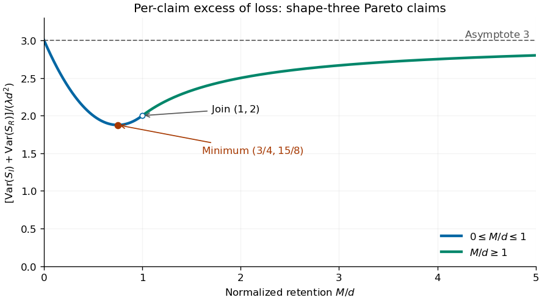

<h1 id="2/solution">Solution</h1>

↑ **Parent:** [2](../2.md)

Let $M_X(t)=\mathbb Ee^{tX}$. Conditioning on $N\sim\operatorname{Pois}(\lambda)$ gives

$$
\mathbb Ee^{tS}=\mathbb E[M_X(t)^N]
=\exp\{\lambda(M_X(t)-1)\},\qquad
\boxed{K_S(t)=\lambda(M_X(t)-1).}
$$

Where the [moment-generating function](../../../../../moment-generating-function.md) is finite around zero, differentiating the [cumulant-generating function](../../../../../cumulant-generating-function.md) gives

$$
\boxed{\kappa_j(S)=K_S^{(j)}(0)=\lambda\mathbb E[X^j].}
$$

In particular $\mathbb ES=\lambda\mathbb EX$ and $\operatorname{Var}S=\lambda\mathbb EX^2$. These [compound Poisson cumulants](../../../../../compound-poisson-cumulants.md) use raw claim [moments](../../../../../moment.md). The first two formulas also follow by conditioning: $\mathbb E[S\mid N]=N\mathbb EX$ and $\operatorname{Var}(S\mid N)=N\operatorname{Var}X$, so

$$
\operatorname{Var}S=\mathbb E[N]\operatorname{Var}X+\operatorname{Var}N(\mathbb EX)^2
=\lambda\mathbb EX^2.
$$

This is the [law of total variance](../../../../../law-of-total-variance.md). They therefore remain valid with finite first two [moments](../../../../../moment.md) even when no positive exponential [moment](../../../../../moment.md) exists.

Under per-claim [excess of loss reinsurance](../../../../../excess-of-loss-reinsurance.md), put $Y=\min(X,M)$ and let $W=(X-M)_+$ be the [positive part](../../../../../positive-part-of-a-real-valued-function.md) of the excess. The insurer and reinsurer totals are sums of these payments over the same [Poisson distribution](../../../../../poisson-distribution.md) count. Write $\overline F(x)=\mathbb P(X>x)$. Using the [tail integral formula for moments](../../../../../tail-integral-formula-for-moments.md) on the tail [probabilities](../../../../../probability.md) of $Y$ and $W$ gives

$$
\boxed{\begin{aligned}
\mathbb ES_I&=\lambda\int_0^M\overline F(x)\,dx,&
\operatorname{Var}S_I&=2\lambda\int_0^M x\overline F(x)\,dx,\\
\mathbb ES_R&=\lambda\int_M^\infty\overline F(x)\,dx,&
\operatorname{Var}S_R&=2\lambda\int_M^\infty(x-M)\overline F(x)\,dx.
\end{aligned}}
$$

For example, $\mathbb EY^2=\int_0^\infty\mathbb P(Y^2>t)dt=2\int_0^M x\overline F(x)dx$ after $t=x^2$, and shifting by $M$ gives the reinsurer formula. The [moment](../../../../../moment.md) formulas are finite whenever the corresponding claim [moments](../../../../../moment.md) are finite.

For the specified [Pareto distribution](../../../../../pareto-distribution.md), with shape three and minimum $d>0$,

$$
\overline F(x)=\begin{cases}1,&0\le x\le d,\\d^3/x^3,&x\ge d,\end{cases}
\qquad\mathbb EX=3d/2,\quad\mathbb EX^2=3d^2.
$$

If $0\le M\le d$, every claim exceeds the [reinsurance retention](../../../../../reinsurance-retention.md). Therefore

$$
\begin{aligned}
\mathbb ES_I&=\lambda M,&\operatorname{Var}S_I&=\lambda M^2,\\
\mathbb ES_R&=\lambda(3d/2-M),&\operatorname{Var}S_R&=\lambda(3d^2-3dM+M^2).
\end{aligned}
$$

If $M\ge d$, the tail integrals instead give

$$
\begin{aligned}
\mathbb ES_I&=\lambda\left(\frac{3d}{2}-\frac{d^3}{2M^2}\right),&
\operatorname{Var}S_I&=\lambda\left(3d^2-\frac{2d^3}{M}\right),\\
\mathbb ES_R&=\frac{\lambda d^3}{2M^2},&
\operatorname{Var}S_R&=\frac{\lambda d^3}{M}.
\end{aligned}
$$

Consequently the requested sum of [variances](../../../../../variance-split.md) is

$$
V(M)=\lambda\begin{cases}
3d^2-3dM+2M^2,&0\le M\le d,\\
3d^2-d^3/M,&M\ge d.
\end{cases}
$$

On the first branch, $V'(M)=\lambda(4M-3d)$; it decreases until $M=3d/4$ and then increases. On the second branch $V'(M)=\lambda d^3/M^2>0$. For $\lambda>0$ the minimum is unique; if $\lambda=0$, all [variances](../../../../../variance-split.md) are zero and every [reinsurance retention](../../../../../reinsurance-retention.md) minimizes them. Thus

$$
\boxed{M^*=\frac{3d}{4},\qquad V(M^*)=\frac{15}{8}\lambda d^2.}
$$

The curve starts at $3\lambda d^2$, reaches this minimum, passes through $V(d)=2\lambda d^2$ with matching slope $\lambda d$ on both branches, and then increases concavely toward the horizontal [asymptote](../../../../../asymptote.md) $3\lambda d^2$. The [variance-minimizing retention for shape-three Pareto claims](../../../../../variance-minimizing-retention-for-shape-three-pareto-claims.md) is shown below.

**[Figure 1](#2/image-sum-of-insurer-and-reinsurer-aggregate-variances-for-shape-three-pareto-claims-minimized-at-retention-three-quarters-of-the-minimum-claim-size). Sum of insurer and reinsurer aggregate variances for shape-three Pareto claims, minimized at retention three quarters of the minimum claim size**.

The two aggregate payouts are dependent. Conditioning on the common count gives [covariance](../../../../../covariance.md) $\lambda\operatorname{Cov}(Y,W)+\lambda\mathbb EY\mathbb EW=\lambda\mathbb E[YW]=\lambda M\mathbb EW$, so $V(M)+2\operatorname{Cov}(S_I,S_R)=3\lambda d^2$ for every [reinsurance retention](../../../../../reinsurance-retention.md), as required by $S_I+S_R=S$. The [covariance of two components of a compound Poisson sum](../../../../../covariance-of-two-components-of-a-compound-poisson-sum.md) accounts for this distinction between a sum of [variances](../../../../../variance-split.md) and the [variance](../../../../../variance-split.md) of a sum.

There is a [moment](../../../../../moment.md) domain qualification for this heavy-tailed example. For every $t>0$, $\int_d^\infty e^{tx}3d^3x^{-4}dx=\infty$, and [moments](../../../../../moment.md) of order $j\ge3$ also diverge. Thus its positive [moment-generating function](../../../../../moment-generating-function.md) is not finite and higher finite [cumulants](../../../../../cumulant.md) cannot be obtained by differentiating around zero. Its [mean](../../../../../expected-value.md) and [variance](../../../../../variance-split.md) calculations above are valid by conditioning or by the first two right derivatives at zero of the [Laplace transform of a nonnegative random variable](../../../../../laplace-transform-of-a-nonnegative-random-variable.md).

## ↑ Ancestors (10)

1. [2](../2.md)
2. [Paper 41](../../paper-41-split.md)
3. [Iii](../../split.md)
4. [2004](../../../split.md)
5. [Past exam of the mathematics course of the University of Cambridge](../../../../split.md)
6. [Mathematics course of the University of Cambridge](../../../../../mathematics-course-of-the-university-of-cambridge.md)
7. [Course of the University of Cambridge](../../../../../course-of-the-university-of-cambridge.md)
8. [University of Cambridge](../../../../../university-of-cambridge-split.md)
9. [List of universities](../../../../../list-of-universities.md)
10. [Codex Wiki](../../../../../split.md)
