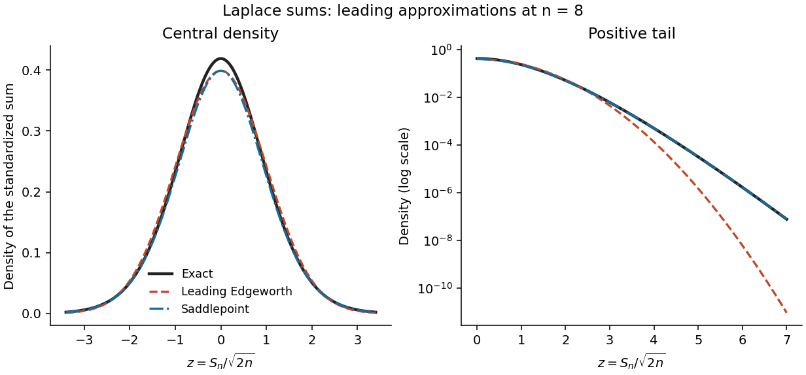

<h1 id="3/solution">Solution</h1>

↑ **Parent:** [3](../3.md)

Let the summands have [mean](../../../../../expected-value.md) mu, [variance](../../../../../variance-split.md) $\sigma^2>0$, and [cumulants](../../../../../cumulant.md) $\kappa_j$. For the standardized sum $Z_n=(S_n-n\mu)/(\sigma\sqrt n)$, expansion of its log-characteristic function gives a normal leading term and successively smaller [cumulant](../../../../../cumulant.md) terms. [Fourier inversion](../../../../../fourier-inversion-theorem.md) turns these terms into [Probabilists' Hermite polynomials](../../../../../probabilists-hermite-polynomial.md). Under sufficient moments and a smooth nonlattice condition, the [Edgeworth expansion](../../../../../edgeworth-series.md) begins

$$
p_{Z_n}(z)=\phi(z)\left[1+\frac{\kappa_3}{6\sigma^3\sqrt n}(z^3-3z)+O(n^{-1})\right]
$$

for bounded z. Higher orders include the fourth [cumulant](../../../../../cumulant.md) and products of lower [cumulants](../../../../../cumulant.md). This is a central expansion in powers of $n^{-1/2}$; it need not remain positive, normalized, or accurate in far tails after truncation.

For a [saddlepoint density approximation](../../../../../saddlepoint-density-approximation.md), require the summand [cumulant-generating function](../../../../../cumulant-generating-function.md) K to be finite on an interval about zero. At a sum value $s=ny$, find the interior saddle $\widehat t$ satisfying $K'(\widehat t)=y$. [Exponential tilting](../../../../../exponential-tilting.md) makes the tilted [mean](../../../../../expected-value.md) y, so the tilted sum is approximated locally by its [normal probability density](../../../../../normal-density.md) at its [mean](../../../../../expected-value.md). Undoing the tilt gives

$$
\widehat p_{S_n}(s)=\frac{\exp\{nK(\widehat t)-\widehat t s\}}{\sqrt{2\pi nK''(\widehat t)}}.
$$

Equivalently this follows by deforming the transform-inversion contour through its stationary point. Suitable analytic and nonlattice regularity gives relative error $O(n^{-1})$ at fixed interior y. This approximation incorporates a nonquadratic tail exponent and is positive, while an Edgeworth truncation uses a [normal probability density](../../../../../normal-density.md) times a polynomial. It uses more information from the distribution and stronger exponential-moment assumptions. Its integral may differ from one by a higher-order amount, so positivity does not imply exact normalization.

For the centered [Laplace distribution](../../../../../laplace-distribution.md), $K(t)=t^2+t^4/2+\cdots$, hence $\kappa_2=2$ and $\kappa_3=0$. Its [skewness](../../../../../skewness.md) vanishes, so the order-$n^{-1/2}$ Edgeworth correction is zero. With $z=s/\sqrt{2n}$, the requested expansion, omitting terms of order $n^{-1}$ in the standardized correction, is

$$
\boxed{p_{S_n}^{\rm E}(s)=\frac1{\sqrt{4\pi n}}e^{-s^2/(4n)}.}
$$

For bounded z the exact [probability density function](../../../../../probability-density-function.md) is this expression times $1+O(n^{-1})$. The prefactor is $n^{-1/2}$ because this is the [probability density function](../../../../../probability-density-function.md) of the unstandardized sum; that change of units should not be confused with the orders inside the [Edgeworth expansion](../../../../../edgeworth-series.md).

For the saddlepoint, $K'(t)=2t/(1-t^2)$. Write $y=s/n$ and $d=\sqrt{1+y^2}$. The root in $(-1,1)$ is

$$
\widehat t=\frac{y}{1+d},\qquad1-\widehat t^2=\frac2{1+d},\qquad y\widehat t=d-1,\qquad K''(\widehat t)=d(1+d).
$$

These formulas include $s=0$ without a division by y. Substitution yields

$$
\boxed{p_{S_n}^{\rm SP}(s)=\frac{\exp\left\{n\left[\log\frac{1+d}{2}-d+1\right]\right\}}{\sqrt{2\pi n\,d(1+d)}},\qquad d=\sqrt{1+(s/n)^2}.}
$$

This is the leading saddlepoint approximation, without its order-$n^{-1}$ relative correction. Expanding d near one recovers the same central [normal approximation](../../../../../normal-approximation.md), while retaining d captures the Laplace-sum large-deviation exponent away from the center.

**[Figure 1](#3/image-leading-edgeworth-and-saddlepoint-approximations-compared-with-the-exact-laplace-sum-density). Leading Edgeworth and saddlepoint approximations compared with the exact Laplace-sum density**.

## ↑ Ancestors (10)

1. [3](../3.md)
2. [Paper 42](../../paper-42-split.md)
3. [Iii](../../split.md)
4. [2004](../../../split.md)
5. [Past exam of the mathematics course of the University of Cambridge](../../../../split.md)
6. [Mathematics course of the University of Cambridge](../../../../../mathematics-course-of-the-university-of-cambridge.md)
7. [Course of the University of Cambridge](../../../../../course-of-the-university-of-cambridge.md)
8. [University of Cambridge](../../../../../university-of-cambridge-split.md)
9. [List of universities](../../../../../list-of-universities.md)
10. [Codex Wiki](../../../../../split.md)
