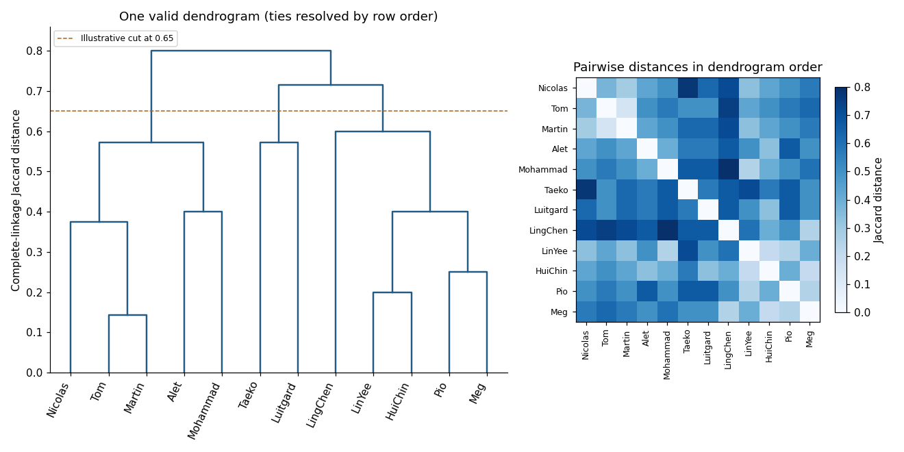

<h1 id="3/solution">Solution</h1>

↑ **Parent:** [3](../3.md)

The first command reads a rectangular data file into `a`; `header=T` treats the first line as variable names. There are twelve observations, identified by student names, and nine binary attributes. A one records presence of an attribute and a zero records absence. This is a description of the encoding, not a claim that every presence is equally important for a scientific application.

`dist(a, metric="binary")` compares rows using [Jaccard distance](../../../../../jaccard-distance.md). If $n_{11}$ counts shared presences and $n_{10},n_{01}$ count mismatched presences, then

$$
\boxed{d(x,y)=\frac{n_{10}+n_{01}}{n_{11}+n_{10}+n_{01}}.}
$$

Joint absences do not enter the denominator, unlike the [simple matching coefficient](../../../../../simple-matching-coefficient.md) or [normalized Hamming distance](../../../../../normalized-hamming-distance.md). `dist2full(d)` expands the stored pairwise distances into a symmetric [dissimilarity matrix](../../../../../dissimilarity-matrix.md); `round(...,2)` changes only its displayed precision. The clustering command still receives the original unrounded distances.

For example, Tom and Martin have six shared presences and only one mismatch, giving $d=1/7=0.142857\ldots$. Taeko and Luitgard have three shared presences and four mismatches, giving $d=4/7=0.571428\ldots$. LingChen and Mohammad share only the meat attribute and differ on four others, giving $d=4/5=0.8$. The diagonal is zero, and the entries are symmetric because exchanging the two observations exchanges $n_{10}$ and $n_{01}$.

`hclust(d, method="compact")` constructs an [agglomerative hierarchical clustering](../../../../../agglomerative-hierarchical-clustering.md) object by [complete-linkage clustering](../../../../../complete-linkage-clustering.md). Its distance between two current groups is

$$
d(A,B)=\max_{x\in A,\,y\in B}d(x,y).
$$

Start with singleton groups, merge a pair with smallest intergroup distance, update these maximum cross-pair distances, and repeat until one group remains. The object stores the merge structure, merge heights and a leaf order suitable for a [dendrogram](../../../../../dendrogram.md); assigning it to `h` does not itself display a graph. The historical [S-Plus help](https://sites.oxy.edu/lengyel/m150/Sueselbeck/helpfiles/hclust.html) identifies `compact` with complete linkage and describes the plotting object.

The first merge is Tom with Martin at $1/7$. At the next height $1/5$, either LinYee with HuiChin or HuiChin with Meg may merge: the distances are tied. The following [dendrogram](../../../../../dendrogram.md) shows one valid resolution, using original row order to resolve ties. In this tree, LinYee joins HuiChin at $1/5$, Pio joins Meg at $1/4$, and Nicolas joins Tom–Martin at $3/8$. The latter height is $\max\{d(\text{Nicolas},\text{Tom}),d(\text{Nicolas},\text{Martin})\}=\max\{3/8,2/7\}$, illustrating the complete-linkage update.

**[Figure 1](#3/image-complete-linkage-dendrogram-and-jaccard-distance-heatmap-for-the-binary-student-profiles-with-one-valid-tie-convention). Complete-linkage dendrogram and Jaccard-distance heatmap for the binary student profiles, with one valid tie convention**.

For the displayed tree, a cut at height $0.65$ gives three groups: Taeko–Luitgard; Alet–Tom–Martin–Nicolas–Mohammad; and LinYee–Pio–LingChen–HuiChin–Meg. The last two merges occur at $5/7$ and $4/5$. **The hierarchy is a description under the chosen binary distance and linkage rule; it neither supplies an intrinsically correct number of groups nor guarantees a unique tree in the presence of ties.** Changing the treatment of joint absences, or the weighting of attributes, can change that description.

## ↑ Ancestors (10)

1. [3](../3.md)
2. [Paper 43](../../paper-43-split.md)
3. [Iii](../../split.md)
4. [2004](../../../split.md)
5. [Past exam of the mathematics course of the University of Cambridge](../../../../split.md)
6. [Mathematics course of the University of Cambridge](../../../../../mathematics-course-of-the-university-of-cambridge.md)
7. [Course of the University of Cambridge](../../../../../course-of-the-university-of-cambridge.md)
8. [University of Cambridge](../../../../../university-of-cambridge-split.md)
9. [List of universities](../../../../../list-of-universities.md)
10. [Codex Wiki](../../../../../split.md)
