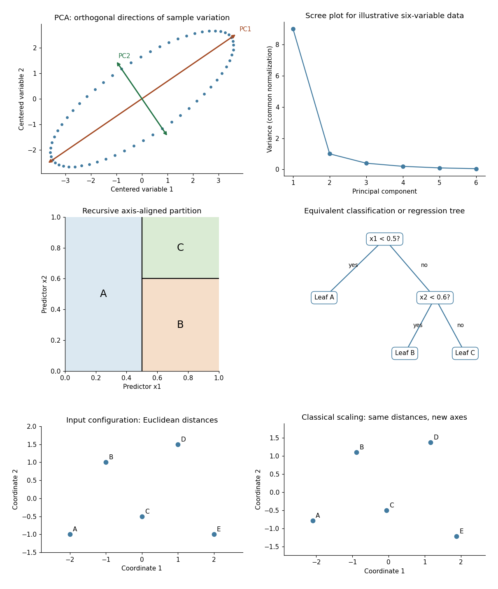

<h1 id="4/solution">Solution</h1>

↑ **Parent:** [4](../4.md)

**`princomp()`: [principal component analysis](../../../../../principal-component-analysis.md).** Supply observations in rows and numeric variables in columns. After centering, let $Z$ denote the resulting [matrix](../../../../../matrix.md) and $C=Z^TZ/n$ its [sample covariance matrix](../../../../../sample-covariance-matrix.md), with an explicitly stated normalization. Write

$$
Cq_j=\lambda_jq_j,\qquad q_i^Tq_j=\mathbf1_{\{i=j\}},\qquad \lambda_1\geq\cdots\geq\lambda_p\geq0.
$$

The first direction maximizes the [Rayleigh quotient](../../../../../rayleigh-quotient.md) $q^TCq$ over unit [vectors](../../../../../vector.md); successive directions maximize it subject to orthogonality to the earlier directions. The [principal component scores](../../../../../principal-component-score.md) are $z_{ij}=q_j^T(x_i-\bar x)$, with [variances](../../../../../variance-split.md) $\lambda_j$ and zero pairwise [sample covariance](../../../../../sample-covariance.md). Zero [covariance](../../../../../covariance.md) alone does not imply [independence](../../../../../independent-random-variables.md). Each [principal component loading](../../../../../principal-component-loading.md) describes a direction in variable space; its sign is arbitrary, and repeated [eigenvalues](../../../../../eigenvalue.md) leave the basis inside the corresponding [eigenspace](../../../../../eigenspace.md) arbitrary.

The function returns [principal component loadings](../../../../../principal-component-loading.md), component [standard deviations](../../../../../standard-deviation.md) `sdev` and, when requested, [principal component scores](../../../../../principal-component-score.md). By default it uses a [covariance matrix](../../../../../covariance-matrix.md); `cor=T` instead performs [principal component analysis on a correlation matrix](../../../../../principal-component-analysis-on-a-correlation-matrix.md), standardizing nonconstant variables to [variance](../../../../../variance-split.md) one. This choice matters when variables have different measurement units. These interface details are documented in the [S-Plus help for princomp](https://sites.oxy.edu/lengyel/M150/Sueselbeck/helpfiles/princomp.html).

A [scree plot](../../../../../scree-plot.md) shows the ordered [eigenvalues](../../../../../eigenvalue.md); a plot of the first two [principal component scores](../../../../../principal-component-score.md) can reveal groups, unusual observations or a dominant gradient. The first $k$ components explain $\sum_{j\leq k}\lambda_j/\sum_j\lambda_j$ of the total [variance](../../../../../variance-split.md). Reconstructing each centered observation by its [orthogonal projection](../../../../../orthogonal-projection.md) onto these directions minimizes average squared reconstruction error among $k$-dimensional linear subspaces. Thus **PCA gives an optimal linear compression for squared reconstruction error, with scaling and the retained dimension chosen explicitly.** It is an [unsupervised learning](../../../../../unsupervised-learning.md) method, rather than a classification rule fitted to supplied labels.

**`tree()`: [classification trees](../../../../../classification-tree.md) and [regression trees](../../../../../regression-tree.md).** A call such as `tree(response ~ predictors, data=dat)` fits a [recursive partitioning](../../../../../recursive-partitioning.md) model. At a current node, test numerical predictors against candidate thresholds, or divide the levels of a categorical predictor into two sets. Select a split that most improves the fitting criterion, then repeat within its children. Numerical splits give axis-aligned regions. A categorical response produces a [classification tree](../../../../../classification-tree.md); a numeric response produces a [regression tree](../../../../../regression-tree.md), as specified in the [S-Plus tree documentation](https://sites.oxy.edu/lengyel/m150/Sueselbeck/helpfiles/tree.html).

For a [regression tree](../../../../../regression-tree.md), the constant prediction in a terminal region is its [sample mean](../../../../../sample-mean.md), minimizing the sum of squared residuals there. For a [classification tree](../../../../../classification-tree.md), estimate class probabilities by the observed proportions in a leaf and predict a most probable class under equal misclassification costs. The [classification-tree deviance](../../../../../classification-tree-deviance.md) of a node is

$$
D(t)=-2\sum_r n_{tr}\log(n_{tr}/n_t),
$$

with $0\log0=0$; splitting maximizes the decrease from parent to children. This fitting criterion differs from the number of wrong classifications. The middle sketches show the same three-region partition as a binary tree: first split on variable one, then split the right-hand branch on variable two.

Growing to small leaves can overfit. Use [cost-complexity tree pruning](../../../../../cost-complexity-tree-pruning.md), balancing fitted loss $R(T)$ against leaf count,

$$
R_\alpha(T)=R(T)+\alpha|\mathcal L(T)|,
$$

and select complexity by [cross-validation](../../../../../cross-validation.md). Plotting the fitted tree and annotating nodes displays the rules; prediction routes each new observation through the fitted splits. **A tree gives an interpretable, piecewise-constant prediction rule; training fit alone does not measure prediction accuracy.**

**The `rpart()` alternative.** This also fits [classification and regression trees](../../../../../classification-and-regression-tree.md) by [recursive partitioning](../../../../../recursive-partitioning.md), with squared-error splitting for ordinary numeric responses and, by default for classification, [Gini impurity](../../../../../gini-impurity.md) $1-\sum_r p_r^2$. Classification settings can instead use information-based splitting and specify prior probabilities and a loss [matrix](../../../../../matrix.md). It supports [surrogate splits](../../../../../surrogate-split.md) to approximate a node's primary left/right assignment when the primary predictor is missing. Its complexity-parameter path and cross-validated errors support [cost-complexity tree pruning](../../../../../cost-complexity-tree-pruning.md); for example, select a complexity parameter and apply `prune(fit, cp=...)`. The [maintainer's rpart documentation](https://stat.ethz.ch/R-manual/R-devel/library/rpart/html/rpart.html) describes the criteria and the distinction in handling surrogate predictors. The partition and tree sketches apply to either implementation; the fitted tree need not be the same because splitting criteria and controls can differ.

**`cmdscale()`: [classical multidimensional scaling](../../../../../classical-multidimensional-scaling.md).** Its input is a [dissimilarity matrix](../../../../../dissimilarity-matrix.md) or stored distance object. It outputs coordinates for the observations in a chosen dimension, usually two for visualization. Let $D^{(2)}$ contain the squared entries of $D$, and put

$$
H=I-\frac1n\mathbf1\mathbf1^T,\qquad G=-\frac12HD^{(2)}H.
$$

For centered Euclidean coordinates $X$, the distance identity $d_{ij}^2=\|x_i\|^2+\|x_j\|^2-2x_i^Tx_j$ gives $G=XX^T$: multiplying by $H$ removes the row and column norm terms. Diagonalize this [Gram matrix](../../../../../gram-matrix.md) and retain its $k$ largest positive [eigenvalues](../../../../../eigenvalue.md). The coordinates are

$$
\boxed{X_k=U_k\operatorname{diag}(\sqrt{\lambda_1},\ldots,\sqrt{\lambda_k}).}
$$

Thus [classical scaling](../../../../../classical-multidimensional-scaling.md) exactly recovers Euclidean distances when all positive [eigenvalues](../../../../../eigenvalue.md) are retained. Reducing dimension approximates the centered [Gram matrix](../../../../../gram-matrix.md); it does not in general minimize squared discrepancies in the original distances. Negative [eigenvalues](../../../../../eigenvalue.md) identify a failure of the [Euclidean distance matrix criterion](../../../../../euclidean-distance-matrix-criterion.md), so their size matters when interpreting a display. The historical [S-Plus cmdscale help](https://sites.oxy.edu/lengyel/m150/Sueselbeck/helpfiles/cmdscale.html) describes the dimension argument, eigenvalue output and optional additive adjustment to dissimilarities.

Plot the two coordinate columns on equally scaled axes and label observations. Nearby plotted points suggest small dissimilarities only insofar as the dimension reduction fits the input well. The bottom sketches give an exact Euclidean example: a configuration and its independently recovered two-dimensional coordinates have identical pairwise distances, despite different coordinate axes. **Classical scaling converts distances into geometry; translations, rotations and reflections do not change the represented distances.** For Euclidean distances between observations, its coordinates agree with the corresponding [principal component scores](../../../../../principal-component-score.md) up to these harmless choices of axes.

**[Figure 2](#4/image-illustrative-pca-directions-and-scree-plot-equivalent-recursive-partition-and-tree-and-exact-classical-scaling-recovery-of-euclidean-distances). Illustrative PCA directions and scree plot, equivalent recursive partition and tree, and exact classical-scaling recovery of Euclidean distances**.

## ↑ Ancestors (10)

1. [4](../4.md)
2. [Paper 43](../../paper-43-split.md)
3. [Iii](../../split.md)
4. [2004](../../../split.md)
5. [Past exam of the mathematics course of the University of Cambridge](../../../../split.md)
6. [Mathematics course of the University of Cambridge](../../../../../mathematics-course-of-the-university-of-cambridge.md)
7. [Course of the University of Cambridge](../../../../../course-of-the-university-of-cambridge.md)
8. [University of Cambridge](../../../../../university-of-cambridge-split.md)
9. [List of universities](../../../../../list-of-universities.md)
10. [Codex Wiki](../../../../../split.md)
