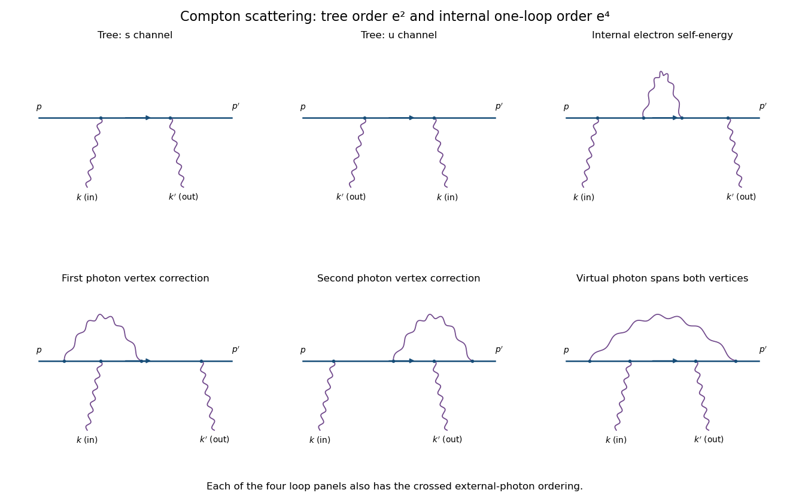
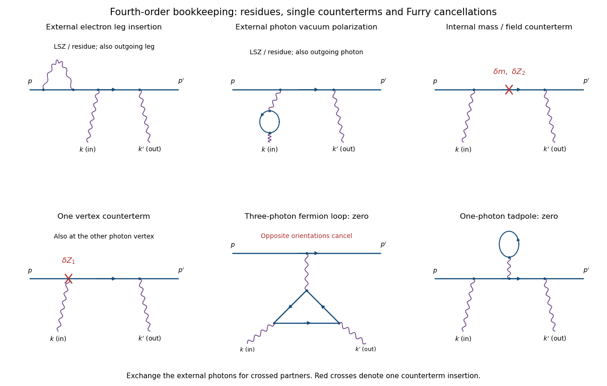

<h1 id="4/solution">Solution</h1>

↑ **Parent:** [4](../4.md)

Use signature $(+,-,-,-)$ and [Electron](../../../../../electron.md) charge $q=-e$, with $e>0$. Then $\mathcal L_{\rm int}=-q\bar\psi\gamma^\mu\psi A_\mu=+e\bar\psi\gamma^\mu\psi A_\mu$. Write the process as $e^-(p,s)+\gamma(k,\epsilon)\to e^-(p',s')+\gamma(k',\epsilon')$. Physical external states satisfy

$$
p^2=p'^2=m^2,\qquad k^2=k'^2=0,\qquad
p+k=p'+k',\qquad p^0,p'^0,k^0,k'^0>0,
$$

and the [photon polarization vectors](../../../../../photon-polarization-vector.md) obey $k\cdot\epsilon=k'\cdot\epsilon'=0$. Choose unit physical polarizations with $\epsilon^*\cdot\epsilon=\epsilon'^*\cdot\epsilon'=-1$; representatives differing by a multiple of the corresponding null [momentum](../../../../../momentum.md) describe the same physical polarization. The external spinors obey $(\not p-m)u(p)=0$, $\bar u(p')(\not p'-m)=0$, with $\bar u_su_r=2m\delta_{sr}$. Outgoing polarization appears complex conjugated, so this formula includes helicity states as well as real linear polarizations.

The needed [QED Feynman rules](../../../../../qed-feynman-rules.md) are a vertex $-iq\gamma^\mu=+ie\gamma^\mu$, an internal [Dirac propagator](../../../../../dirac-propagator.md) $i(\not q+m)/(q^2-m^2+i0)$, the external spinors, and the incoming/outgoing [photon polarization vectors](../../../../../photon-polarization-vector.md). There is no internal [photon](../../../../../photon.md) at this order and no elementary two-photon–Dirac seagull vertex. The two [photon](../../../../../photon.md) orderings along the [Electron](../../../../../electron.md) line give internal momenta $q_s=p+k$ and $q_u=p-k'$. Defining the [matrix](../../../../../matrix.md) element by $S_{fi}-\delta_{fi}=i(2\pi)^4\delta^4(p+k-p'-k')\mathcal M$, their sum is

$$
\boxed{\mathcal M^{(2)}=-e^2\bar u(p')
\left[
\not\epsilon'^*\frac{\not p+\not k+m}{(p+k)^2-m^2+i0}\not\epsilon
+\not\epsilon\frac{\not p-\not k'+m}{(p-k')^2-m^2+i0}\not\epsilon'^*
\right]u(p).}
$$

The denominators are $2p\cdot k+i0$ and $-2p\cdot k'+i0$. Both terms are essential; this is the [tree-level Compton amplitude](../../../../../tree-level-compton-amplitude.md).

**[Figure 1](#4/image-compton-tree-diagrams-and-the-four-one-loop-classes-before-exchanging-the-external-photons). Compton tree diagrams and the four one-loop classes before exchanging the external photons**.

To prove the incoming [Ward identity](../../../../../ward-identity.md), replace $\epsilon$ by $k$ and write $R(q)=(\not q+m)/(q^2-m^2)$, with the Feynman boundary prescription understood. The physical nonzero-photon kinematics keeps these tree denominators off the [Electron](../../../../../electron.md) pole. Since

$$
\not k=(\not q_s-m)-(\not p-m),
\qquad
\not k=(\not p'-m)-(\not q_u-m),
$$

the external [Dirac equations](../../../../../dirac-equation.md) imply

$$
R(q_s)\not k\,u(p)=u(p),\qquad
\bar u(p')\not k\,R(q_u)=-\bar u(p').
$$

Therefore the two contracted terms are $\bar u(p')\not\epsilon'^*u(p)$ and its negative, and cancel. By linearity,

$$
\boxed{\mathcal M(\epsilon+\alpha k)=\mathcal M(\epsilon).}
$$

This is the [two-photon fermion Ward identity](../../../../../two-photon-fermion-ward-identity.md). An analogous cancellation holds for the outgoing [photon](../../../../../photon.md). Gauge-equivalent polarization representatives have the same scattering amplitude, so a longitudinal pure-gauge component is not an extra physical [photon](../../../../../photon.md) state. Individual diagrams do not generally satisfy this identity; their sum does.

For perturbative order, each elementary [QED](../../../../../quantum-electrodynamics.md) vertex has one [photon](../../../../../photon.md) leg. If $I_\gamma$ is the number of internal [photon](../../../../../photon.md) lines and $E_\gamma=2$, the [vertex parity of a QED amplitude](../../../../../vertex-parity-of-a-qed-amplitude.md) gives

$$
V=2I_\gamma+2.
$$

Thus **there is no third-order contribution**. At fourth order, $V=4$ and, counting all three legs per vertex with four external legs, $I=(3V-4)/2=4$. A connected graph has loop number $I-V+1=1$.

The nonzero one-loop classes on the open [Electron](../../../../../electron.md) line are an internal-electron [self-energy](../../../../../self-energy.md) insertion, a vertex correction at either external-photon vertex, and a virtual [photon](../../../../../photon.md) spanning both [photon](../../../../../photon.md) vertices, giving the four-point box class. The first figure sketches each class for one [photon](../../../../../photon.md) ordering; interchange the two external [photon](../../../../../photon.md) attachments for its crossed partner. This yields two internal-self-energy graphs, four vertex graphs and two spanning-box graphs. They use the usual [photon](../../../../../photon.md) propagator, for example $-ig_{\mu\nu}/(\ell^2+i0)$ in [Feynman gauge](../../../../../feynman-gauge.md).

**[Figure 2](#4/image-external-leg-insertions-fourth-order-counterterms-and-the-odd-photon-loops-that-cancel). External-leg insertions, fourth-order counterterms and the odd-photon loops that cancel**.

For completeness, [one-loop diagram classes for Compton scattering](../../../../../one-loop-diagram-classes-for-compton-scattering.md) also depend on whether one is drawing an unamputated correlation function or a physical amplitude. [Electron](../../../../../electron.md) self-energies can be attached to either external [Electron](../../../../../electron.md) leg, and [photon vacuum polarization](../../../../../photon-vacuum-polarization.md) can be attached to either external [photon](../../../../../photon.md) leg, for both [photon](../../../../../photon.md) orders. In an on-shell renormalized [S-matrix](../../../../../s-matrix.md), these are accounted for by [LSZ reduction](../../../../../lsz-reduction-formula.md) and external-field residues rather than counted again as independent amputated graphs. Photon-leg corrections are not vacuum-polarization insertions on an internal Born [photon](../../../../../photon.md): there is no such Born line.

At the same fourth order, a renormalized calculation has one [mass](../../../../../mass.md) or electron-field [counterterm](../../../../../counterterm.md) on the internal [Electron](../../../../../electron.md) line, or one vertex [counterterm](../../../../../counterterm.md) at either Born vertex; the crossed partners are included. Each [counterterm](../../../../../counterterm.md) is a relative order-$e^2$ correction to the order-$e^2$ tree amplitude. External-field normalization must follow the same convention.

A possible closed [Electron](../../../../../electron.md) loop with three [photon](../../../../../photon.md) vertices, linked to the external [Electron](../../../../../electron.md) line by a virtual [photon](../../../../../photon.md), cancels between its two orientations by [Furry's theorem](../../../../../furry-s-theorem.md). Transposing the loop and using $C^{-1}\gamma^\mu C=-(\gamma^\mu)^T$ gives an extra sign $(-1)^3$, so its orientation-reversed partner is its negative. A one-photon tadpole likewise vanishes. Disconnected vacuum bubbles are removed by vacuum normalization. **The first genuine radiative corrections are fourth order, with the internal [self-energy](../../../../../self-energy.md), vertex and spanning-box classes and their consistently included [renormalization](../../../../../renormalization.md) terms.**

## ↑ Ancestors (10)

1. [4](../4.md)
2. [Paper 44](../../paper-44-split.md)
3. [Iii](../../split.md)
4. [2004](../../../split.md)
5. [Past exam of the mathematics course of the University of Cambridge](../../../../split.md)
6. [Mathematics course of the University of Cambridge](../../../../../mathematics-course-of-the-university-of-cambridge.md)
7. [Course of the University of Cambridge](../../../../../course-of-the-university-of-cambridge.md)
8. [University of Cambridge](../../../../../university-of-cambridge-split.md)
9. [List of universities](../../../../../list-of-universities.md)
10. [Codex Wiki](../../../../../split.md)
