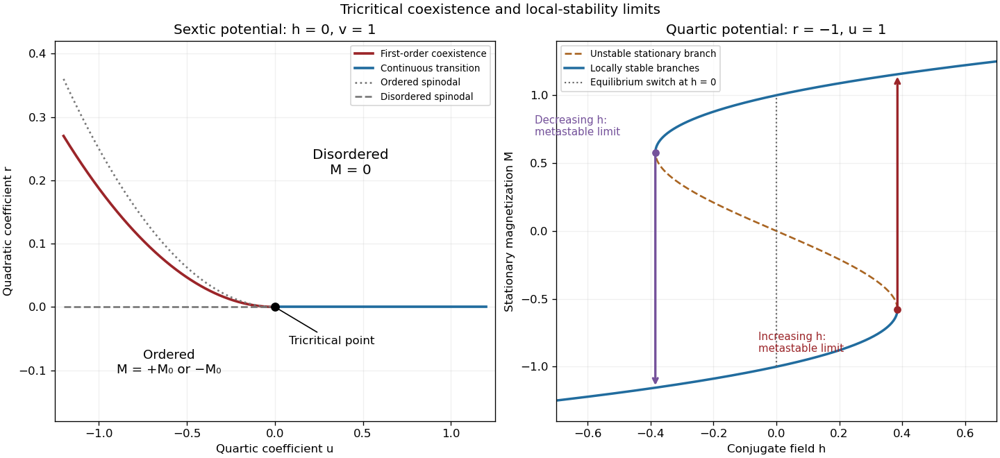

<h1 id="1/e/solution">Solution</h1>

↑ **Parent:** [E](../e.md)

A [tricritical point](../../../../../../tricritical-point.md) occurs when a first-order boundary meets a continuous-transition boundary. In the spin-inversion-symmetric sextic [Landau free energy](../../../../../../landau-free-energy.md), two independent parameters must tune $r=u=0$, while $v>0$ keeps the potential stable. In the $h=0$ plane, the continuous boundary is $r=0,u>0$, and the first-order boundary is $r=3u^2/(16v),u<0$. They meet at the tricritical point; the order-parameter jump on the first-order side tends to zero as $u\uparrow0$. The first panel shows this [phase diagram](../../../../../../phase-diagram.md), including the metastability limits derived above.

Along the tuned line $u=0,h=0$, the equation of state is $M(r+vM^4)=0$. Thus $M=(-r/v)^{1/4}$ on a selected ordered branch, rather than the ordinary square-root behavior. Differentiation gives inverse [magnetic susceptibility](../../../../../../magnetic-susceptibility.md) $r$ above and $4|r|$ below, while at criticality $h=vM^5$. Hence the [mean-field tricritical exponent calculation](../../../../../../mean-field-tricritical-exponent-calculation.md) yields $\beta=1/4$, $\gamma=1$, $\delta=5$; the minimized potential $-|r|^{3/2}/(3\sqrt v)$ also gives $\alpha=1/2$. These tricritical powers require tuning the quartic coefficient, not merely varying a generic temperature path. The ordinary scalar exponents requested separately are calculated next.

**[Figure 1](#1/e/image-scalar-sextic-landau-phase-diagram-with-a-tricritical-point-and-quartic-metastable-hysteresis-branches). Scalar sextic Landau phase diagram with a tricritical point, and quartic metastable hysteresis branches**.

## ↑ Ancestors (11)

1. [E](../e.md)
2. [1](../../1.md)
3. [Paper 46](../../../paper-46-split.md)
4. [Iii](../../../split.md)
5. [2004](../../../../split.md)
6. [Past exam of the mathematics course of the University of Cambridge](../../../../../split.md)
7. [Mathematics course of the University of Cambridge](../../../../../../mathematics-course-of-the-university-of-cambridge.md)
8. [Course of the University of Cambridge](../../../../../../course-of-the-university-of-cambridge.md)
9. [University of Cambridge](../../../../../../university-of-cambridge-split.md)
10. [List of universities](../../../../../../list-of-universities.md)
11. [Codex Wiki](../../../../../../split.md)
