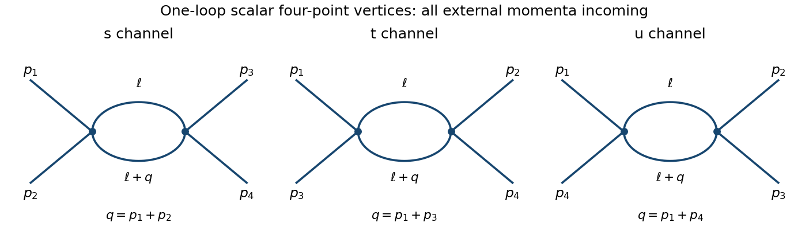

# Paper 47

↑ **Parent:** [Iii](../iii.md)

[https://www.maths.cam.ac.uk/postgrad/part-iii/files/pastpapers/2004/Paper47.pdf](https://www.maths.cam.ac.uk/postgrad/part-iii/files/pastpapers/2004/Paper47.pdf)

**Table of contents**

- [1](#1)
  - [Solution](#1/solution)
- [2](#2)
  - [a](#2/a)
    - [Solution](#2/a/solution)
  - [b](#2/b)
    - [Solution](#2/b/solution)
  - [c](#2/c)
    - [Solution](#2/c/solution)
- [3](#3)
  - [Solution](#3/solution)
- [4](#4)
  - [Solution](#4/solution)

## 1

↑ **Parent:** [Paper 47](paper-47.md)

<h3 id="1/solution">Solution</h3>

↑ **Parent:** [1](#1)

Use a Minkowski [external source](../../../perturbative-quantum-field-theory.md#source-quantum-field-theory) term $+\int J\chi$, where $\chi$ is the integration variable, and normalize the vacuum functional:

$$
Z[J]=\frac{\int\mathcal D\chi\,\exp\{iS[\chi]+i\int d^4x\,J(x)\chi(x)\}}
{\int\mathcal D\chi\,e^{iS[\chi]}},\qquad W[J]=\log Z[J].
$$

The usual vacuum boundary prescription is implicit. This is the logarithmic convention $Z=e^W$ for the [connected generating functional](../../../perturbative-quantum-field-theory.md#connected-generating-functional). It makes the given quadratic expression consistent with $\Delta_F=\langle T\chi\chi\rangle$. Another common convention is $Z=e^{iW_c}$, with $W_c=-iW$; mixing the two conventions would change the factors of $i$ below.

[Functional derivative](../../../calculus-of-variations.md#functional-derivative) generates the full and connected [correlation functions](../../../critical-phenomenon.md#correlation-function):

$$
G_n(x_1,\ldots,x_n)=\left.i^{-n}\frac{\delta^n Z}{\delta J(x_1)\cdots\delta J(x_n)}\right|_{J=0},
\qquad
G_n^c(x_1,\ldots,x_n)=\left.i^{-n}\frac{\delta^n W}{\delta J(x_1)\cdots\delta J(x_n)}\right|_{J=0}.
$$

These are [time-ordered products](../../../perturbative-quantum-field-theory.md#time-ordered-product) in the vacuum, and $G_1=G_1^c=0$ by the stated assumption. Differentiating $e^W$ four times partitions the four insertions into connected blocks. All partitions with a singleton vanish, leaving

$$
\boxed{G_4(1,2,3,4)=G_4^c(1,2,3,4)
+G_2^c(1,2)G_2^c(3,4)
+G_2^c(1,3)G_2^c(2,4)
+G_2^c(1,4)G_2^c(2,3).}
$$

The shorthand arguments stand for [spacetime](../../../special-relativity.md#spacetime) points; this is a functional cumulant identity, not an assumption of a free field.

To construct the [quantum effective action](../../../perturbative-quantum-field-theory.md#effective-action), define the source-dependent classical field

$$
\varphi(x)=\langle\chi(x)\rangle_J=-i\frac{\delta W}{\delta J(x)}.
$$

Locally invert this relation to obtain $J[\varphi]$, assuming the response [integral kernel](../../../functional-analysis.md#integral-kernel) is invertible with the chosen regulator and boundary prescription. Take its [Legendre transform](../../../convex-optimization.md#convex-conjugate)

$$
\boxed{i\Gamma[\varphi]=W[J[\varphi]]-i\int d^4x\,J[\varphi](x)\varphi(x).}
$$

The chain-rule terms proportional to $\delta J$ cancel, so $\delta\Gamma/\delta\varphi=-J$. A field-independent constant is fixed separately and is immaterial to the vertices. At zero [external source](../../../perturbative-quantum-field-theory.md#source-quantum-field-theory) the classical field is zero, and there is no linear term.

For the two-point vertex, differentiate the classical field once. If $G=G_2^c$, then

$$
\frac{\delta\varphi(x)}{\delta J(y)}=iG(x,y),\qquad
\frac{\delta J(x)}{\delta\varphi(y)}=-iG^{-1}(x,y),
\qquad
\int d^4z\,G(x,z)G^{-1}(z,y)=\delta^{(4)}(x-y).
$$

The vertex coefficients in this problem are [derivatives](../../../calculus.md#derivative) of $i\Gamma$, not of $\Gamma$ alone. Therefore

$$
\boxed{\Gamma_2(x,y)=-G^{-1}(x,y).}
$$

For the three-point vertex, the [derivative](../../../calculus.md#derivative) of the connected two-point [integral kernel](../../../functional-analysis.md#integral-kernel) at a general [external source](../../../perturbative-quantum-field-theory.md#source-quantum-field-theory) is

$$
\frac{\delta G(a,b)}{\delta J(c)}=iG_3^c(a,b,c).
$$

Combine this with $\delta J/\delta\varphi=-iG^{-1}$ and differentiate the inverse identity, $\delta G^{-1}=-G^{-1}(\delta G)G^{-1}$. This gives the [logarithmic-source inverse-kernel vertices](../../../perturbative-quantum-field-theory.md#logarithmic-source-inverse-kernel-vertices) relation

$$
\boxed{\Gamma_3(x,y,z)=\int d^4a\,d^4b\,d^4c\,
G^{-1}(x,a)G^{-1}(y,b)G^{-1}(z,c)G_3^c(a,b,c).}
$$

All kernels here are finally evaluated at zero [external source](../../../perturbative-quantum-field-theory.md#source-quantum-field-theory). The connected three-point function is amputated by its three inverse [quantum field theory propagators](../../../quantum-field-theory.md#propagator).

For the specified quadratic $W$, the [external source](../../../perturbative-quantum-field-theory.md#source-quantum-field-theory) response is $\varphi=i\Delta_FJ$, hence $J=-i\Delta_F^{-1}\varphi$. Substitution in the transform gives

$$
\boxed{\Gamma[\varphi]=\frac i2\int d^4x\,d^4y\,
\varphi(x)\Delta_F^{-1}(x-y)\varphi(y),\qquad
\Gamma_2=-\Delta_F^{-1},\qquad\Gamma_n=0\ (n\geq3).}
$$

For the standard free [quantum field theory propagator](../../../quantum-field-theory.md#propagator) $\widetilde\Delta_F(p)=i/(p^2-m^2+i0)$, this is the usual quadratic free action, up to the vacuum prescription. The [generating functional](../../../perturbative-quantum-field-theory.md#generating-functional) is Gaussian, so connected functions beyond second order vanish and there are no interaction vertices or nontrivial [scattering amplitudes](../../../quantum-mechanics.md#scattering-amplitude). Full higher even-point functions can still be nonzero: they are products of two-point functions, as the four-point formula shows.

## 2

↑ **Parent:** [Paper 47](paper-47.md)

<h3 id="2/a">a</h3>

↑ **Parent:** [2](#2)

<h4 id="2/a/solution">Solution</h4>

↑ **Parent:** [A](#2/a)

Let a connected amputated [one-particle-irreducible Feynman diagram](../../../perturbative-quantum-field-theory.md#one-particle-irreducible-feynman-diagram) have $L$ loops, $I$ internal lines, $V$ quartic vertices and $E$ external legs. Each loop integration contributes four momentum powers, each [scalar propagator](../../../scalar-field-theory.md#scalar-propagator) removes two, and the interaction adds none. Thus its [superficial degree of divergence](../../../perturbative-quantum-field-theory.md#superficial-degree-of-divergence) is $D=4L-2I$. Counting half-edges and independent loops gives

$$
4V=2I+E,\qquad L=I-V+1,
\qquad\boxed{D=4-E.}
$$

This is simultaneous large-momentum scaling of the whole [Feynman diagram](../../../perturbative-quantum-field-theory.md#feynman-diagram). It need not describe every subregion of loop-momentum space.

For a concrete counterexample, start with a six-point triangle of three quartic vertices, with two external legs at each vertex. Insert a one-loop [tadpole diagram](../../../perturbative-quantum-field-theory.md#tadpole-diagram) self-energy in one internal line. The resulting [Feynman diagram](../../../perturbative-quantum-field-theory.md#feynman-diagram) has $V=4$, $I=5$, $L=2$, $E=6$, and $D=-2$. It is still one-particle irreducible: each edge around the triangle has an alternative route, and cutting the tadpole loop does not disconnect the [Feynman diagram](../../../perturbative-quantum-field-theory.md#feynman-diagram). Nevertheless the tadpole subgraph diverges when its [loop momentum](../../../perturbative-quantum-field-theory.md#loop-momentum) tends to infinity while the triangle momentum is held fixed. In massive theory the divergent mass insertion is nonzero. This demonstrates that [a superficially convergent graph can have a divergent subgraph](../../../perturbative-quantum-field-theory.md#a-superficially-convergent-graph-can-have-a-divergent-subgraph).

Write renormalized perturbation theory with

$$
\mathcal L=\frac12(\partial\phi)^2-\frac12m^2\phi^2-\frac\lambda{4!}\phi^4
+\frac12\delta Z(\partial\phi)^2-\frac12\delta m^2\phi^2
-\frac{\delta\lambda}{4!}\phi^4+\delta\mathcal L_0.
$$

The last term is a field-independent vacuum [counterterm](../../../perturbative-quantum-field-theory.md#counterterm), needed if vacuum energies are retained. A normalized correlation functional removes that sector. The free [quantum field theory propagator](../../../quantum-field-theory.md#propagator) is $i/(p^2-m^2+i0)$; interaction and [counterterm](../../../perturbative-quantum-field-theory.md#counterterm) insertions use

$$
\boxed{\text{quartic vertex: }-i\lambda,\qquad
\text{four-point counterterm: }-i\delta\lambda,\qquad
\text{two-point counterterm: }i(\delta Zp^2-\delta m^2).}
$$

Usual momentum-conservation delta functions accompany the vertices. The coefficients depend on the regulator and [renormalization](../../../perturbative-quantum-field-theory.md#renormalization) conditions and are expanded order by order in the renormalized coupling.

The reason this list closes is locality of ultraviolet subtraction. After divergent proper subgraphs have been subtracted recursively, the remaining overall divergent part is a polynomial in external momenta of degree at most $D$. For $E=2$, $D=2$, Lorentz symmetry allows only a constant and a $p^2$ term, supplied by the mass and wavefunction [counterterms](../../../perturbative-quantum-field-theory.md#counterterm). For $E=4$, $D=0$, only the constant quartic [counterterm](../../../perturbative-quantum-field-theory.md#counterterm) is needed. Odd-point terms vanish by the field's $\phi\mapsto-\phi$ symmetry. For $E>4$, the overall degree is negative and there is no new overall [counterterm](../../../perturbative-quantum-field-theory.md#counterterm) after [subdivergences](../../../perturbative-quantum-field-theory.md#ultraviolet-subdivergence) have been removed. Vacuum graphs are handled separately.

[Counterterm](../../../perturbative-quantum-field-theory.md#counterterm) insertions subtract each subgraph's local divergence, including overlapping subgraphs, and then the overall divergence. At each perturbative order the regulated sum has a finite ultraviolet limit for renormalized [correlation functions](../../../critical-phenomenon.md#correlation-function) at suitable nonexceptional momenta. This is why superficial [power counting](../../../perturbative-quantum-field-theory.md#power-counting-in-quantum-field-theory) of every relevant subgraph determines the allowed [counterterms](../../../perturbative-quantum-field-theory.md#counterterm), even though it does not alone establish that a bare [Feynman diagram](../../../perturbative-quantum-field-theory.md#feynman-diagram) diverges or converges. Possible infrared or on-shell singularities are a separate issue; ultraviolet [renormalization](../../../perturbative-quantum-field-theory.md#renormalization) is not a promise of finiteness in every kinematic limit.

<h3 id="2/b">b</h3>

↑ **Parent:** [2](#2)

<h4 id="2/b/solution">Solution</h4>

↑ **Parent:** [B](#2/b)

The kinetic normalization fixes $[\Phi]=(d-2)/2$, since a [derivative](../../../calculus.md#derivative) has [mass dimension](../../../perturbative-quantum-field-theory.md#mass-dimension) one and the Lagrangian density has dimension $d$. Every differentiated field is still a field insertion. Hence the interaction has $n+r$ legs, not just $n$, and its vertex contains a homogeneous polynomial of degree $r$ in the attached momenta. Its coupling dimension is

$$
\boxed{[\lambda]=d-(n+r)\frac{d-2}{2}-r.}
$$

For a connected [Feynman diagram](../../../perturbative-quantum-field-theory.md#feynman-diagram) of this vertex type,

$$
2I+E=(n+r)V,\qquad L=I-V+1.
$$

The superficial momentum degree is now $D=dL-2I+rV$. Eliminating $I$ and $L$ gives

$$
\begin{aligned}
D&=d+(d-2)I+(r-d)V\\
&=d-\frac{d-2}{2}E
+V\left[\frac{d-2}{2}(n+r)+r-d\right],
\end{aligned}
$$

so [derivative-interaction scalar power counting](../../../perturbative-quantum-field-theory.md#derivative-interaction-scalar-power-counting) yields

$$
\boxed{D=d-\frac{d-2}{2}E-V[\lambda].}
$$

The same counting applies to tensor components with [quantum field theory propagators](../../../quantum-field-theory.md#propagator) scaling as $p^{-2}$; contractions, identities and cancellations can lower the actual degree. A coupling of negative [mass dimension](../../../perturbative-quantum-field-theory.md#mass-dimension) lets the superficial degree increase with the number of vertices, explaining the need for progressively higher-dimensional [counterterms](../../../perturbative-quantum-field-theory.md#counterterm) in a perturbative [effective field theory](../../../quantum-field-theory.md#effective-field-theory).

<h3 id="2/c">c</h3>

↑ **Parent:** [2](#2)

<h4 id="2/c/solution">Solution</h4>

↑ **Parent:** [C](#2/c)

Use $F_{\mu\nu}^a=\partial_\mu A_\nu^a-\partial_\nu A_\mu^a+g f^{abc}A_\mu^bA_\nu^c$ and $\mathcal L=-F_{\mu\nu}^aF^{a\mu\nu}/4$. Its [cubic and quartic Yang-Mills self-interactions](../../../relativistic-quantum-field.md#cubic-and-quartic-yang-mills-self-interactions) are

$$
\boxed{\mathcal L_3=-\frac g2f^{abc}
(\partial_\mu A_\nu^a-\partial_\nu A_\mu^a)A^{b\mu}A^{c\nu},\qquad
\mathcal L_4=-\frac{g^2}4f^{abc}f^{ade}
A_\mu^bA_\nu^cA^{d\mu}A^{e\nu}.}
$$

Antisymmetry of the [Lie algebra structure constants](../../../lie-algebra.md#structure-constant-of-a-lie-algebra) lets the cubic expression also be written as $-g f^{abc}(\partial_\mu A_\nu^a)A^{b\mu}A^{c\nu}$.

The cubic vertex has three fields and one [derivative](../../../calculus.md#derivative), corresponding to $n=2,r=1$ in part (b). The quartic vertex has four fields and no [derivatives](../../../calculus.md#derivative), corresponding to $n=4,r=0$. Their dimensions are

$$
[g]=\frac{4-d}{2},\qquad[g^2]=4-d.
$$

With both types present, the same [Feynman diagram](../../../perturbative-quantum-field-theory.md#feynman-diagram) counting gives

$$
D=d-\frac{d-2}{2}E-V_3[g]-V_4[g^2].
$$

In four dimensions both couplings are dimensionless, and the degree is bounded independently of vertex count. Gauge symmetry, implemented consistently after [gauge fixing](../../../relativistic-quantum-field.md#gauge-fixing), restricts the ultraviolet [counterterms](../../../perturbative-quantum-field-theory.md#counterterm) to the allowed renormalizable gauge-invariant and [gauge fixing](../../../relativistic-quantum-field.md#gauge-fixing)/ghost structures. Thus the counting is consistent with perturbative [renormalizability](../../../perturbative-quantum-field-theory.md#renormalizable-quantum-field-theory) of ordinary four-dimensional [Yang-Mills theory](../../../relativistic-quantum-field.md#yang-mills-theory).

In six dimensions $[g]=-1$ and $[g^2]=-2$, giving $D=6-2E+V_3+2V_4$. Increasing the vertex count permits new divergent momentum structures and higher-dimensional operators without a finite closed list of [renormalization](../../../perturbative-quantum-field-theory.md#renormalization) parameters. **Ordinary Yang-Mills theory is therefore power-counting renormalizable in four dimensions and nonrenormalizable in six dimensions.** It can still be used in six dimensions as an [effective field theory](../../../quantum-field-theory.md#effective-field-theory) with a cutoff and higher-operator expansion; this conclusion concerns the usual perturbative theory.

## 3

↑ **Parent:** [Paper 47](paper-47.md)

<h3 id="3/solution">Solution</h3>

↑ **Parent:** [3](#3)

Use the mostly-minus [Minkowski metric](../../../special-relativity.md#minkowski-metric), [quantum field theory propagator](../../../quantum-field-theory.md#propagator) $i/(p^2-m^2+i0)$ and dimensionally continued interaction $-\mu^{2\epsilon}\lambda\phi^4/4!$, with $d=4-2\epsilon$. Take all four external momenta incoming, so $\sum_jp_j=0$, and set $s=(p_1+p_2)^2$, $t=(p_1+p_3)^2$, $u=(p_1+p_4)^2$.

The three one-loop [one-particle-irreducible Feynman diagrams](../../../perturbative-quantum-field-theory.md#one-particle-irreducible-feynman-diagram) are the bubble graphs with external pairings $(12|34)$, $(13|24)$ and $(14|23)$. Their external [quantum field theory propagators](../../../quantum-field-theory.md#propagator) are omitted by [amputation](../../../perturbative-quantum-field-theory.md#amputation-of-external-propagators). Each [Feynman diagram](../../../perturbative-quantum-field-theory.md#feynman-diagram) has [symmetry factor](../../../perturbative-quantum-field-theory.md#feynman-diagram-symmetry-factor) $1/2$ from exchanging the two internal lines; the fixed external labels are already accounted for by the three distinct channels.

**[Figure 1](#3/image-the-three-labeled-one-loop-scalar-four-point-bubble-channels-with-all-external-momenta-incoming). The three labeled one-loop scalar four-point bubble channels with all external momenta incoming**.

For a channel carrying momentum $q$, its amplitude is

$$
B(q^2)=\frac{(-i\mu^{2\epsilon}\lambda)^2}{2}
\int\frac{d^d\ell}{(2\pi)^d}
\frac{i}{\ell^2-m^2+i0}\frac{i}{(\ell+q)^2-m^2+i0}
=\frac{\mu^{4\epsilon}\lambda^2}{2}
\int\frac{d^d\ell}{(2\pi)^d}\frac1{AB}.
$$

The signs in the last equality follow from the two vertices and two [quantum field theory propagators](../../../quantum-field-theory.md#propagator). Apply the [Feynman parameter](../../../perturbative-quantum-field-theory.md#feynman-parameter) identity

$$
\frac1{AB}=\int_0^1\frac{dx}{[xA+(1-x)B]^2}.
$$

After shifting the [loop momentum](../../../perturbative-quantum-field-theory.md#loop-momentum), the denominator is $(k^2-\Delta_q(x)+i0)^2$, with $\Delta_q(x)=m^2-x(1-x)q^2$. For positive Euclidean $\Delta$, [Wick rotation](../../../perturbative-quantum-field-theory.md#wick-rotation) and the Schwinger representation give

$$
\begin{aligned}
\int\frac{d^dk}{(2\pi)^d}\frac1{(k^2-\Delta+i0)^2}
&=i\int\frac{d^dk_E}{(2\pi)^d}\int_0^\infty d\alpha\,\alpha e^{-\alpha(k_E^2+\Delta)}\\
&=\frac{i}{(4\pi)^{d/2}}\int_0^\infty d\alpha\,\alpha^{1-d/2}e^{-\alpha\Delta}\\
&=\frac{i}{(4\pi)^{d/2}}\Gamma(2-d/2)\Delta^{d/2-2}.
\end{aligned}
$$

Analytic continuation to physical momenta keeps the prescription $\Delta_q-i0$. Thus [dimensional regularization](../../../perturbative-quantum-field-theory.md#dimensional-regularization) evaluates the channel as

$$
B(q^2)=\frac{i\mu^{4\epsilon}\lambda^2}{2(4\pi)^{2-\epsilon}}
\Gamma(\epsilon)\int_0^1dx\,[\Delta_q(x)-i0]^{-\epsilon}.
$$

Use $\Gamma(\epsilon)=\epsilon^{-1}-\gamma_E+O(\epsilon)$ and expand the other factors. The [minimal-subtraction scalar four-point bubble channels](../../../perturbative-quantum-field-theory.md#minimal-subtraction-scalar-four-point-bubble-channels) result through the finite part is

$$
B(q^2)=\frac{i\mu^{2\epsilon}\lambda^2}{32\pi^2}
\left[\frac1\epsilon-\gamma_E+\log(4\pi)
-\int_0^1dx\,\log\frac{m^2-x(1-x)q^2-i0}{\mu^2}\right]+O(\epsilon).
$$

The parameter [integral](../../../calculus.md#integral) is left unevaluated, as requested. The three channel contributions are $B(s)+B(t)+B(u)$. Their pole is momentum independent and is cancelled by the four-point [counterterm](../../../perturbative-quantum-field-theory.md#counterterm) $-i\mu^{2\epsilon}\delta\lambda$, with

$$
\boxed{\delta\lambda=\frac{3\lambda^2}{32\pi^2\epsilon}+O(\lambda^3).}
$$

After pure [minimal subtraction scheme](../../../perturbative-quantum-field-theory.md#minimal-subtraction-scheme) subtraction, the complete vertex through one loop is the tree vertex $-i\lambda$ plus

$$
\frac{i\lambda^2}{32\pi^2}\sum_{r\in\{s,t,u\}}
\left[\log(4\pi)-\gamma_E-\int_0^1dx\,
\log\frac{m^2-x(1-x)r-i0}{\mu^2}\right].
$$

Here the $\epsilon\to0$ limit has been taken. The [modified minimal subtraction scheme](../../../perturbative-quantum-field-theory.md#modified-minimal-subtraction-scheme) would also absorb $\log(4\pi)-\gamma_E$; it is not identical to the specified pure MS finite part.

The bare coupling is scale independent and satisfies

$$
\lambda_B=\mu^{2\epsilon}\left(\lambda+\frac{a\lambda^2}{\epsilon}+O(\lambda^3)\right),
\qquad a=\frac3{32\pi^2}.
$$

Writing $\beta_d=-2\epsilon\lambda+b\lambda^2+O(\lambda^3)$ and differentiating at fixed $\lambda_B$ gives

$$
0=2\epsilon\left(\lambda+\frac{a\lambda^2}{\epsilon}\right)
+\beta_d\left(1+\frac{2a\lambda}{\epsilon}\right).
$$

At order $\lambda^2$, the finite coefficient is $b-2a$, so the [one-loop quartic scalar beta function](../../../scalar-field-theory.md#one-loop-quartic-scalar-beta-function) is

$$
\boxed{\beta(\lambda)=\mu\frac{d\lambda}{d\mu}\bigg|_{\lambda_B}
=\frac{3\lambda^2}{16\pi^2}+O(\lambda^3).}
$$

The factor two relative to the pole residue follows from using $d=4-2\epsilon$. With $d=4-\epsilon$ the residue doubles, but the four-dimensional beta function is unchanged.

For pure nonabelian gauge theory, the corresponding [pure Yang-Mills one-loop beta function](../../../perturbative-quantum-field-theory.md#pure-yang-mills-one-loop-beta-function) has the opposite sign:

$$
\beta(g)=-\frac{11C_A}{3(16\pi^2)}g^3+O(g^5),
\qquad f^{acd}f^{bcd}=C_A\delta^{ab}.
$$

Gauge-boson self-interactions and the gauge-consistency ghost contributions give antiscreening. For a compact nonabelian simple factor $C_A>0$, the coupling decreases at high energy: [asymptotic freedom](../../../perturbative-quantum-field-theory.md#asymptotic-freedom). In contrast, positive scalar $\lambda$ increases toward the ultraviolet. Its one-loop extrapolation has a [Landau pole](../../../perturbative-quantum-field-theory.md#landau-pole), indicating breakdown of weak-coupling perturbation theory, not a proof by itself of nonperturbative triviality. Ultraviolet poles should be extracted at infrared-safe mass or nonexceptional kinematics; a scaleless massless zero-momentum [integral](../../../calculus.md#integral) cannot be used to read off this ultraviolet [counterterm](../../../perturbative-quantum-field-theory.md#counterterm) without separating its infrared behavior.

## 4

↑ **Parent:** [Paper 47](paper-47.md)

<h3 id="4/solution">Solution</h3>

↑ **Parent:** [4](#4)

Choose a definite matrix convention: $A_\mu=A_\mu^aT_a$, $\omega=\omega^aT_a$, and $D_\mu=\partial_\mu+eA_\mu$. Matter transforms as $\psi'=U\psi$, so gauge covariance requires $D_\mu'=UD_\mu U^{-1}$. Applying both sides to a test field yields the [Yang-Mills gauge transformation](../../../relativistic-quantum-field.md#yang-mills-gauge-transformation)

$$
\boxed{A_\mu'=UA_\mu U^{-1}-\frac1e(\partial_\mu U)U^{-1}.}
$$

Define the [Yang-Mills field strength](../../../relativistic-quantum-field.md#gauge-field-strength) by $[D_\mu,D_\nu]=eF_{\mu\nu}$:

$$
\boxed{F_{\mu\nu}=\partial_\mu A_\nu-\partial_\nu A_\mu+e[A_\mu,A_\nu],\qquad
F_{\mu\nu}^a=\partial_\mu A_\nu^a-\partial_\nu A_\mu^a
+e f^{bca}A_\mu^bA_\nu^c.}
$$

Conjugating the [gauge covariant derivative](../../../relativistic-quantum-field.md#gauge-covariant-derivative) [commutator](../../../lie-algebra.md#commutator) proves $F_{\mu\nu}'=UF_{\mu\nu}U^{-1}$: unlike the connection, the [gauge field strength](../../../relativistic-quantum-field.md#gauge-field-strength) has no inhomogeneous [derivative](../../../calculus.md#derivative) term. The trace normalization supplies an invariant color metric; its [Lie algebra structure constants](../../../lie-algebra.md#structure-constant-of-a-lie-algebra) with all indices lowered are antisymmetric.

For $U=1+e\omega+O(\omega^2)$ and $U^{-1}=1-e\omega+O(\omega^2)$, expand the finite transformations:

$$
\delta A_\mu=e[\omega,A_\mu]-\partial_\mu\omega
=-D_\mu^{\mathrm{ad}}\omega,
\qquad
\delta F_{\mu\nu}=e[\omega,F_{\mu\nu}],
\qquad D_\mu^{\mathrm{ad}}\omega=\partial_\mu\omega+e[A_\mu,\omega].
$$

In components this is

$$
\boxed{\delta A_\mu^a=-\partial_\mu\omega^a-e f^{abc}A_\mu^b\omega^c,
\qquad\delta F_{\mu\nu}^a=-e f^{abc}F_{\mu\nu}^b\omega^c.}
$$

A convention using the opposite matter transformation or [gauge covariant derivative](../../../relativistic-quantum-field.md#gauge-covariant-derivative) sign changes these signs consistently. The formulas above all follow from the explicitly chosen $D_\mu$.

**Gauge reduction and the determinant.** A direct [integral](../../../calculus.md#integral) $\int\mathcal DA\,e^{iS[A]}$ integrates repeatedly over gauge-equivalent configurations. The [gauge group](../../../relativistic-quantum-field.md#gauge-group) volume is infinite, and the ungauge-fixed quadratic operator has longitudinal zero directions, so it has no ordinary inverse [quantum field theory propagator](../../../quantum-field-theory.md#propagator). Gauge-invariant observables require dividing out this redundancy rather than treating it as an ordinary physical fluctuation.

The finite-dimensional change-of-variables identity underlying [gauge fixing](../../../relativistic-quantum-field.md#gauge-fixing) is precise. Suppose a condition $\chi(x^\alpha)=f$ has one solution in the group-coordinate patch and its [derivative](../../../calculus.md#derivative) matrix at the solution is nonsingular. Then

$$
\int d\alpha\,\delta^{(r)}(\chi(x^\alpha)-f)
\left|\det\frac{\partial\chi(x^\alpha)}{\partial\alpha}\right|=1.
$$

For several isolated solutions it instead counts those solutions. On the slice, the [Jacobian determinant](../../../calculus.md#jacobian-determinant) can be factored into the reciprocal of the orbit [integral](../../../calculus.md#integral) of the delta function. An invariant measure and invariant integrand then allow the group volume to factor out. In the functional version, group coordinates carry [Haar measure](../../../measure-theory.md#haar-measure) and the corresponding operator determinant replaces the matrix determinant.

For example, choose the [Lorenz gauge](../../../electromagnetism.md#lorenz-gauge-condition) $\chi^a(A)=\partial^\mu A_\mu^a=f^a$. Its variation is $\delta\chi^a=-\partial^\mu(D_\mu^{\mathrm{ad}}\omega)^a$. Hence on the gauge slice the [Faddeev-Popov operator](../../../relativistic-quantum-field.md#faddeev-popov-operator) and [Faddeev-Popov determinant](../../../relativistic-quantum-field.md#faddeev-popov-determinant) are

$$
M^{ab}[A]=-\partial^\mu D_\mu^{ab}[A],\qquad
\Delta_{\mathrm{FP}}[A]=\det M[A].
$$

Its extension along each local [gauge orbit](../../../relativistic-quantum-field.md#gauge-orbit) yields the [Faddeev-Popov gauge-orbit identity](../../../relativistic-quantum-field.md#faddeev-popov-gauge-orbit-identity)

$$
1=\Delta_{\mathrm{FP}}[A]\int\mathcal DU\,
\delta[\partial^\mu A_\mu^U-f].
$$

For an unoriented finite-dimensional real [integral](../../../calculus.md#integral) the absolute determinant is required. In a perturbative gauge patch, its sign or phase is fixed and the constant convention is absorbed in normalization. Residual zero modes must be removed by boundary conditions or separate treatment. Multiple intersections, the [Gribov ambiguity](../../../relativistic-quantum-field.md#gribov-ambiguity), prevent interpreting this as a globally unique gauge slice without additional work.

Insert the identity, change variables along the orbit using invariance of the action and measure, and divide out the common [gauge group](../../../relativistic-quantum-field.md#gauge-group) volume. Averaging $f$ with Gaussian weight $\exp[-i\int f^af^a/(2\xi)]$ produces the covariant gauge-fixed functional

$$
Z_{\mathrm{gf}}\propto\int\mathcal DA\,\det M[A]\,
\exp\left\{iS[A]-\frac{i}{2\xi}\int d^4x\,(\partial^\mu A_\mu^a)^2\right\}.
$$

The added term makes the quadratic gauge-field operator invertible after the stated residual-mode treatment.

**Ghost representation.** For a finite matrix $M$, the [Grassmann Gaussian integral](../../../quantum-field-theory.md#grassmann-gaussian-integral) over independent anticommuting variables is proportional to its determinant:

$$
\int\prod_a d\overline c_a\,dc_a\,
\exp(i\overline c_aM_{ab}c_b)=\mathrm{constant}\times\det M.
$$

The constant is independent of $M$ and depends on ordering and factors of $i$. The functional counterpart introduces [Faddeev-Popov ghost fields](../../../relativistic-quantum-field.md#faddeev-popov-ghost) $c^a$ and [antighost fields](../../../relativistic-quantum-field.md#faddeev-popov-antighost-field) $\overline c^a$, with

$$
S_{\mathrm{gh}}=\int d^4x\,\overline c^aM^{ab}[A]c^b
=-\int d^4x\,\overline c^a\partial^\mu(D_\mu c)^a.
$$

Integration by parts writes its density as $(\partial^\mu\overline c^a)(D_\mu c)^a$, displaying a [kinetic term](../../../quantum-field-theory.md#kinetic-term) and a gauge-field/ghost interaction. These are [Grassmann-valued fields](../../../quantum-field-theory.md#grassmann-field) with scalar Lorentz transformation law. They represent the orbit [Jacobian determinant](../../../calculus.md#jacobian-determinant); their closed loops carry the fermionic minus sign, and they are not physical asymptotic particles. In the abelian case $D^{\mathrm{ad}}=\partial$, the determinant is gauge-field independent and the ghosts decouple. Nonabelian ghosts interact and are necessary for the consistent cancellation of unphysical gauge contributions.

**Physical-state reduction.** Let $Q$ be the [Hermitian](../../../hilbert-space.md#hermitian-operator) [BRST charge](../../../relativistic-quantum-field.md#brst-charge). Its key algebraic property is [BRST nilpotence](../../../relativistic-quantum-field.md#brst-nilpotence), $Q^2=0$, and the gauge-fixed dynamics preserves it. Physical states are its [BRST cohomology](../../../relativistic-quantum-field.md#brst-cohomology) at [ghost number](../../../relativistic-quantum-field.md#ghost-number) zero:

$$
\boxed{\mathcal H_{\mathrm{phys}}=
\frac{\ker Q\,\big|_{\mathrm{gh}=0}}{\operatorname{im}Q\,\big|_{\mathrm{gh}=0}},
\qquad Q|\psi\rangle=0,
\qquad |\psi\rangle\sim|\psi\rangle+Q|\chi\rangle.}
$$

Here $|\chi\rangle$ has [ghost number](../../../relativistic-quantum-field.md#ghost-number) $-1$. [BRST nilpotence](../../../relativistic-quantum-field.md#brst-nilpotence) ensures that exact vectors lie in the [kernel](../../../linear-algebra.md#kernel-of-a-linear-map), so the quotient is defined. Because $Q$ is [Hermitian](../../../hilbert-space.md#hermitian-operator), an exact vector is orthogonal to every closed vector, $\langle\psi|Q\chi\rangle=\langle Q\psi|\chi\rangle=0$, and exact vectors are null, $\langle Q\chi|Q\chi\rangle=\langle\chi|Q^2\chi\rangle=0$. They therefore represent no independent physical state. Commutation of $Q$ with the [Hamiltonian](../../../classical-mechanics.md#hamiltonian) preserves these classes under time evolution.

The [covariant gauge](../../../relativistic-quantum-field.md#covariant-gauge)/ghost space before reduction has an [indefinite inner product](../../../linear-algebra.md#indefinite-hermitian-form). This is essential: [a Hermitian nilpotent BRST charge requires an indefinite auxiliary space](../../../relativistic-quantum-field.md#a-hermitian-nilpotent-brst-charge-requires-an-indefinite-auxiliary-space) if it is nonzero. On an ordinary positive-definite [Hilbert space](../../../hilbert-space.md) the same norm identity would force $Q=0$. Positivity of the resulting physical space uses the gauge-theory structure in addition to the abstract [BRST nilpotence](../../../relativistic-quantum-field.md#brst-nilpotence) identities.

For a nonzero on-shell photon momentum, the one-particle conclusion is

$$
\boxed{k^\mu\varepsilon_\mu=0,\qquad
\varepsilon_\mu\sim\varepsilon_\mu+\alpha k_\mu.}
$$

The second relation preserves the first because $k^2=0$. In four dimensions the transverse [kernel](../../../linear-algebra.md#kernel-of-a-linear-map) has dimension three, and quotienting by its null longitudinal direction leaves two physical photon polarizations. This is the [positive one-particle BRST cohomology](../../../relativistic-quantum-field.md#positive-one-particle-brst-cohomology) of the photon sector.

## ↑ Ancestors (8)

1. [Iii](../iii.md)
2. [2004](../../2004.md)
3. [Past exam of the mathematics course of the University of Cambridge](../../../past-exam-of-the-mathematics-course-of-the-university-of-cambridge.md)
4. [Mathematics course of the University of Cambridge](../../../university-of-cambridge.md#mathematics-course-of-the-university-of-cambridge)
5. [Course of the University of Cambridge](../../../university-of-cambridge.md#course-of-the-university-of-cambridge)
6. [University of Cambridge](../../../university-of-cambridge.md)
7. [List of universities](../../../README.md#list-of-universities)
8. [Codex Wiki](../../../README.md)
