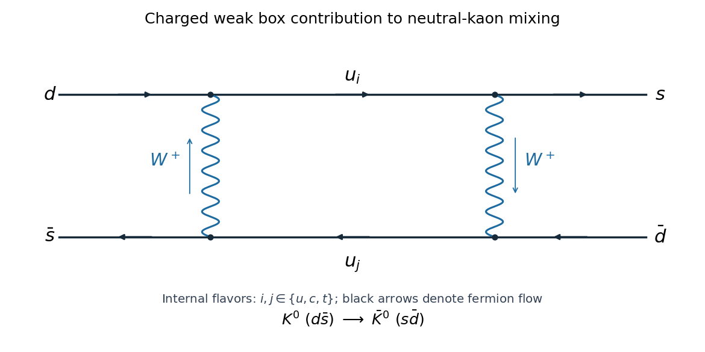

<h1 id="3/solution">Solution</h1>

↑ **Parent:** [3](../3.md)

Start with the [Dirac equation](../../../../../dirac-equation.md) $(i\gamma^\mu\partial_\mu-m)\psi=0$. The equation for the [Dirac adjoint](../../../../../dirac-adjoint.md) is $i(\partial_\mu\bar\psi)\gamma^\mu+m\bar\psi=0$. Transpose it and multiply by the [charge-conjugation matrix](../../../../../charge-conjugation-matrix.md) C to obtain

$$
iC(\gamma^\mu)^TC^{-1}\partial_\mu\psi^C+m\psi^C=0,\qquad\psi^C=C\bar\psi^T.
$$

For this to be the original [Dirac equation](../../../../../dirac-equation.md) multiplied by minus one, the necessary matrix identity is

$$
\boxed{C(\gamma^\mu)^TC^{-1}=-\gamma^\mu.}
$$

Using $C^\dagger=C^{-1}$, the [charge conjugation of the Dirac adjoint](../../../../../charge-conjugation-of-the-dirac-adjoint.md) follows directly:

$$
\overline{\psi^C}=(C\bar\psi^T)^\dagger\gamma^0=\psi^T(\gamma^0)^TC^{-1}\gamma^0=-\psi^TC^{-1}.
$$

The final step uses $(\gamma^0)^TC^{-1}=-C^{-1}\gamma^0$ and $(\gamma^0)^2=1$.

Let $j_V^\mu=\bar\psi\gamma^\mu\psi$, $j_A^\mu=\bar\psi\gamma^\mu\gamma^5\psi$, and $j_L=j_V-j_A$. For anticommuting fields, or normal-ordered operator bilinears, the minus sign in the transformed [Dirac adjoint](../../../../../dirac-adjoint.md) cancels the minus sign from interchanging the two fields. The [charge conjugation of fermion bilinears](../../../../../charge-conjugation-of-fermion-bilinears.md) is therefore

$$
\bar\psi\Gamma\psi\longmapsto\bar\psi(C^{-1}\Gamma C)^T\psi.
$$

The matrix identity just proved gives $j_V\mapsto-j_V$. Also $C(\gamma^5)^TC^{-1}=\gamma^5$, obtained by transposing its four [gamma matrices](../../../../../gamma-matrices.md) and reversing their order. Hence

$$
(C^{-1}\gamma^\mu\gamma^5 C)^T=\gamma^5(-\gamma^\mu)=\gamma^\mu\gamma^5,
$$

so $j_A\mapsto j_A$ and $j_L\mapsto-j_R$, where $j_R=j_V+j_A$. Since the external vector V is odd under [charge conjugation](../../../../../charge-conjugation.md), $j_L\cdot V$ becomes $j_R\cdot V$ and is generally not invariant.

For [parity symmetry in quantum field theory](../../../../../parity-symmetry-in-quantum-field-theory.md), write $P^\mu{}_{\nu}=\operatorname{diag}(1,-1,-1,-1)$. The given spinor transformation gives $j_V\mapsto Pj_V$, $j_A\mapsto-Pj_A$, and $V\mapsto PV$, with arguments evaluated at the reflected point. The contracted interaction again becomes $j_R\cdot V$. Each of [parity](../../../../../parity.md) and [charge conjugation](../../../../../charge-conjugation.md) interchanges the two chiral contractions; applying both restores $j_L\cdot V$. **This particular neutral current interaction is CP invariant, although neither P nor C is separately a symmetry.** This conclusion uses the stipulated C-odd vector transformation; it is not a claim that all interactions of the [Standard Model](../../../../../standard-model-split.md) preserve [CP symmetry](../../../../../cp-symmetry.md).

For [time reversal of a Dirac field](../../../../../time-reversal-of-a-dirac-field.md), the [gamma matrix adjoint and transpose identities](../../../../../gamma-matrix-adjoint-and-transpose-identities.md) give

$$
(\gamma^\mu)^*=(\gamma^0\gamma^\mu\gamma^0)^T,\qquad C(\gamma^\mu)^*C^{-1}=-\gamma^0\gamma^\mu\gamma^0.
$$

With $B=\gamma^5C$, anticommutation of $\gamma^5$ with every [gamma matrix](../../../../../gamma-matrices.md) yields

$$
B(\gamma^\mu)^*B^{-1}=\gamma^0\gamma^\mu\gamma^0=t_\mu\gamma^\mu,\qquad t_0=1,\quad t_i=-1.
$$

Equivalently, **$\boxed{B(\gamma^{0*},-\boldsymbol\gamma^*)B^{-1}=(\gamma^0,\boldsymbol\gamma)}$**. Since [time reversal](../../../../../t-symmetry.md) is an [antiunitary operator](../../../../../antiunitary-operator.md), the factor i in $\gamma^5=i\gamma^0\gamma^1\gamma^2\gamma^3$ must also be conjugated. Thus

$$
B\gamma^{5*}B^{-1}=-i(t_0t_1t_2t_3)\gamma^0\gamma^1\gamma^2\gamma^3=\gamma^5.
$$

Using the stated transformations of the field and its [Dirac adjoint](../../../../../dirac-adjoint.md), the transformed bilinear consequently is

$$
\bar\psi(x_T)B[\gamma^\mu(1-\gamma^5)]^*B^{-1}\psi(x_T)=t_\mu j_L^\mu(x_T).
$$

The external vector has the same component signs. Their contraction is unchanged, proving [time reversal of a real neutral chiral vector interaction](../../../../../time-reversal-of-a-real-neutral-chiral-vector-interaction.md). A real coupling is understood; an [antiunitary operator](../../../../../antiunitary-operator.md) also conjugates coefficients, and relative complex weak phases need not satisfy this invariance.

A [charged weak box contribution to kaon mixing](../../../../../charged-weak-box-contribution-to-kaon-mixing.md) is shown below. The incoming $d\bar s$ and outgoing $s\bar d$ connect through two charged [W bosons](../../../../../w-boson.md) and two internal up-type [quarks](../../../../../quark.md). The black arrows are fermion flow, so the lower line's arrows oppose the momentum of the corresponding antiquark. The blue arrows specify the direction of positive charge carried by the charged propagators. Each vertex is a [charged weak current](../../../../../charged-current.md) vertex, with the appropriate [CKM matrix](../../../../../cabibbo-kobayashi-maskawa-matrix.md) element; the internal flavors are summed over $u,c,t$.

**[Figure 1](#3/image-charged-weak-box-diagram-converting-a-neutral-kaon-into-its-antiparticle). Charged weak box diagram converting a neutral kaon into its antiparticle**.

Use precisely the printed [exchange-positive CP convention for neutral kaon mixing](../../../../../exchange-positive-cp-convention-for-neutral-kaon-mixing.md). In the flavor basis, [CP symmetry](../../../../../cp-symmetry.md) acts by $S=\left(\begin{smallmatrix}0&1\\1&0\end{smallmatrix}\right)$. Write the restricted effective matrix as

$$
M=\begin{pmatrix}a&b\\c&a\end{pmatrix},\qquad b=M_{12},\quad c=M_{21}.
$$

Then $SMS=\left(\begin{smallmatrix}a&c\\b&a\end{smallmatrix}\right)$, so CP invariance of this mixing operator is exactly $b=c$. Therefore **CP noninvariance in this neutral-kaon mixing block means $M_{12}\ne M_{21}$**. Violation elsewhere in a larger Hamiltonian would not, by itself, prove an inequality for this particular block.

For [neutral-kaon mass matrix diagonalization](../../../../../neutral-kaon-mass-matrix-diagonalization.md), choose correlated roots $r^2=b$, $s^2=c$, and eigenvalues $\lambda_\pm=a\pm rs$. The vectors $(r,s)^T$ and $(r,-s)^T$ are the corresponding eigenvectors, as direct multiplication verifies. Taking orthonormal flavor states and writing the printed [CP eigenstates](../../../../../cp-eigenstate.md) as $K_1=(K^0+\bar K^0)/\sqrt2$ and $K_2=(K^0-\bar K^0)/\sqrt2$, one finds

$$
rK^0+s\bar K^0=\frac{r+s}{\sqrt2}(K_1+\epsilon K_2),\qquad rK^0-s\bar K^0=\frac{r+s}{\sqrt2}(K_2+\epsilon K_1),
$$

where the [kaon CP mixing parameter](../../../../../kaon-cp-mixing-parameter.md) is

$$
\boxed{\epsilon=\frac{\sqrt{M_{12}}-\sqrt{M_{21}}}{\sqrt{M_{12}}+\sqrt{M_{21}}},\qquad K_+=\frac{K_1+\epsilon K_2}{\sqrt{1+|\epsilon|^2}},\qquad K_-=\frac{K_2+\epsilon K_1}{\sqrt{1+|\epsilon|^2}}.}
$$

Overall phases have been absorbed. The [kaon mixing square-root branch convention](../../../../../kaon-mixing-square-root-branch-convention.md) must be chosen continuously so that $r=s$ in the CP-conserving limit for the eigenstate labeled plus. These formulas are exact in the nondegenerate case with $r+s\ne0$; the requested small admixtures follow if $|\epsilon|\ll1$. Smallness is an additional weak-CP-violation assumption, not a consequence of $b\ne c$ alone. A Hermitian mass operator has $c=b^*$; the same algebra also applies to the effective non-Hermitian operator that includes decays, where the two eigenstates need not be orthogonal. At a fully degenerate $b=c=0$, a CP eigenbasis can simply be chosen.

## ↑ Ancestors (10)

1. [3](../3.md)
2. [Paper 48](../../paper-48-split.md)
3. [Iii](../../split.md)
4. [2004](../../../split.md)
5. [Past exam of the mathematics course of the University of Cambridge](../../../../split.md)
6. [Mathematics course of the University of Cambridge](../../../../../mathematics-course-of-the-university-of-cambridge.md)
7. [Course of the University of Cambridge](../../../../../course-of-the-university-of-cambridge.md)
8. [University of Cambridge](../../../../../university-of-cambridge-split.md)
9. [List of universities](../../../../../list-of-universities.md)
10. [Codex Wiki](../../../../../split.md)
