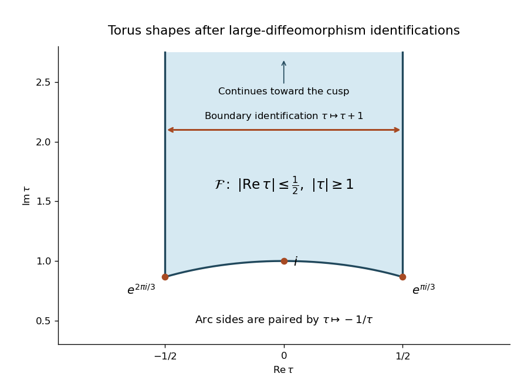

<h1 id="3/solution">Solution</h1>

↑ **Parent:** [3](../3.md)

Use Euclidean [worldsheet](../../../../../worldsheet.md) conventions with $\epsilon^{12}=1$. Including a target metric, a [Kalb–Ramond field](../../../../../kalb-ramond-field.md) $B_{\mu\nu}$ and the [dilaton](../../../../../dilaton.md) $\Phi$ gives

$$
\begin{aligned}
S_E={}&\frac1{4\pi\alpha'}\int_\Sigma d^2\sigma\,\sqrt h\,h^{ab}g_{\mu\nu}(X)\partial_aX^\mu\partial_bX^\nu\\
&+\frac{i}{4\pi\alpha'}\int_\Sigma d^2\sigma\,\epsilon^{ab}B_{\mu\nu}(X)\partial_aX^\mu\partial_bX^\nu+\frac1{4\pi}\int_\Sigma d^2\sigma\,\sqrt h\,\Phi(X)R^{(2)}.
\end{aligned}
$$

The imaginary coefficient of the antisymmetric term comes from Euclidean continuation; the Lorentzian action has the corresponding real coupling. For constant $\Phi_0$, the [Gauss-Bonnet theorem](../../../../../gauss-bonnet-theorem.md) gives $S_\Phi=\Phi_0\chi(\Sigma)$, with [Euler characteristic](../../../../../euler-characteristic.md) $\chi=2-2g$ on a connected closed oriented surface. Thus [dilaton Euler-characteristic weighting](../../../../../dilaton-euler-characteristic-weighting.md) gives

$$
e^{-S_\Phi}=(e^{\Phi_0})^{2g-2}=g_s^{2g-2},\qquad\boxed{g_s=e^{\Phi_0}.}
$$

Adding one handle multiplies a contribution by $g_s^2$, identifying $g_s$ as the [string coupling](../../../../../string-coupling.md). With canonically normalized external closed-string states, $n$ vertices add $g_s^n$, giving the [string genus expansion](../../../../../string-genus-expansion.md) $g_s^{2g-2+n}$.

Before gauge fixing, the [Polyakov path integral](../../../../../polyakov-path-integral.md) for inserted [string vertex operators](../../../../../string-vertex-operator.md) is schematically

$$
\mathcal A_n=\sum_g\int\frac{\mathcal Dh\,\mathcal DX}{\operatorname{Vol}(\mathrm{Diff}\times\mathrm{Weyl})}\,e^{-S_E[X,h]}\prod_{r=1}^n\int_\Sigma d^2z_r\,V_r(z_r).
$$

The quotient removes descriptions related by [worldsheet diffeomorphisms](../../../../../worldsheet-diffeomorphism.md) and [Weyl transformations](../../../../../weyl-transformation.md). Gauge fixing has a nontrivial Jacobian, the [Faddeev-Popov determinant](../../../../../faddeev-popov-determinant.md). Anticommuting vector ghosts $c^a$ and symmetric trace-free antighosts $b_{ab}$ exponentiate this determinant as a local [worldsheet ghost action](../../../../../worldsheet-ghost-action.md). These [worldsheet ghost fields](../../../../../worldsheet-ghost-field.md) implement the gauge quotient; they are not additional spacetime particles. Their zero modes must be treated separately rather than included in an invertible determinant.

Three kinds of geometry enter the scattering calculation. The [worldsheet moduli](../../../../../worldsheet-moduli.md) describe genuinely different conformal shapes that remain after local gauge fixing. Each such shape must be integrated over. The [mapping class group](../../../../../mapping-class-group.md) consists of orientation-preserving diffeomorphisms modulo those continuously deformable to the identity; it identifies different markings of the same conformal surface, so only one representative of each class is counted. The [worldsheet conformal Killing group](../../../../../worldsheet-conformal-killing-group.md) is the continuous residual conformal symmetry of a chosen surface. It moves insertion positions without changing the geometry and must be divided out, usually by fixing enough vertex positions.

For a torus, write $z\sim z+1\sim z+\tau$, with $\operatorname{Im}\tau>0$. Its shape modulus is $\tau$, its [mapping class group](../../../../../mapping-class-group.md) acts through the [modular group](../../../../../modular-group.md), and its connected [worldsheet conformal Killing group](../../../../../worldsheet-conformal-killing-group.md) acts by translations. Thus the shape integral runs over the [standard fundamental domain of the modular group](../../../../../standard-fundamental-domain-of-the-modular-group.md), while one insertion position can be fixed by translation. On the sphere, three positions can instead be fixed by [Möbius transformations](../../../../../mobius-transformation.md); for [genus](../../../../../genus-of-a-surface.md) at least two the continuous conformal Killing group is trivial.

**[Figure 1](#3/image-one-representative-of-each-torus-conformal-shape-in-the-modular-fundamental-domain). One representative of each torus conformal shape in the modular fundamental domain**.

Now use the half-normalized [worldsheet diffeomorphism ghost operator](../../../../../worldsheet-diffeomorphism-ghost-operator.md) in the question. A vector field $v^a$ can preserve the representative metric after a compensating [Weyl transformation](../../../../../weyl-transformation.md) precisely when $P_1v=0$. The trace of the metric variation sets $\delta\omega=\tfrac12\nabla_av^a$, leaving the [Conformal Killing equation](../../../../../conformal-killing-equation.md)

$$
\boxed{\nabla_av_b+\nabla_bv_a-h_{ab}\nabla_cv^c=0.}
$$

The kernel of this operator gives the infinitesimal [worldsheet conformal Killing group](../../../../../worldsheet-conformal-killing-group.md).

For a surviving [infinitesimal worldsheet modulus](../../../../../infinitesimal-worldsheet-modulus.md), choose its metric variation $t_{ab}$ orthogonal to all gauge variations. Orthogonality to [Weyl transformations](../../../../../weyl-transformation.md) requires $h^{ab}t_{ab}=0$. On the closed surface, the [formal adjoint of the worldsheet conformal Killing operator](../../../../../formal-adjoint-of-the-worldsheet-conformal-killing-operator.md) follows by [integration by parts](../../../../../integration-by-parts.md):

$$
\int\sqrt h\,t^{ab}(P_1v)_{ab}=-\int\sqrt h\,(\nabla_at^{ab})v_b.
$$

Orthogonality to every diffeomorphism variation is therefore the adjoint-kernel condition, giving

$$
\boxed{h^{ab}t_{ab}=0,\qquad\nabla^at_{ab}=0.}
$$

In a local conformal coordinate these imply $\partial_{\bar z}t_{zz}=0$ and its conjugate: the moduli variations are represented by [holomorphic quadratic differentials](../../../../../holomorphic-quadratic-differential.md). Multiplying the definition of $P_1$ by two changes its adjoint by two but changes neither kernel.

For four [tachyon vertex operators](../../../../../tachyon-vertex-operator.md) on the torus, there is one complex shape modulus, four complex insertion positions and one complex translation to remove. The [worldsheet integration count after conformal gauge fixing](../../../../../worldsheet-integration-count-after-conformal-gauge-fixing.md) is therefore

$$
\boxed{1+4-1=4\text{ complex integrations}=8\text{ real integrations}.}
$$

Fix the fourth insertion at $z_4=0$. A schematic gauge-fixed expression is

$$
\mathcal A_{1,4}=g_s^4\int_{\mathcal F}d\mu(\tau)\int_{T_\tau^3}\prod_{r=1}^3d^2z_r\,\left\langle(b,\mu_\tau)(\bar b,\bar\mu_\tau)c\bar cV_4(0)\prod_{r=1}^3V_r(z_r)\right\rangle.
$$

Here the antighost pair supplies the modulus measure, and the ghost pair at the fixed vertex absorbs the translation zero modes. The three unfixed positions and $\tau$ are the four complex integrations. The [punctured Riemann surface moduli dimension](../../../../../punctured-riemann-surface-moduli-dimension.md) gives the same result, $3g-3+n=4$. Target-spacetime zero-mode integrals producing [momentum conservation](../../../../../momentum-conservation.md) are separate from this requested count of worldsheet integrations.

## ↑ Ancestors (10)

1. [3](../3.md)
2. [Paper 49](../../paper-49-split.md)
3. [Iii](../../split.md)
4. [2004](../../../split.md)
5. [Past exam of the mathematics course of the University of Cambridge](../../../../split.md)
6. [Mathematics course of the University of Cambridge](../../../../../mathematics-course-of-the-university-of-cambridge.md)
7. [Course of the University of Cambridge](../../../../../course-of-the-university-of-cambridge.md)
8. [University of Cambridge](../../../../../university-of-cambridge-split.md)
9. [List of universities](../../../../../list-of-universities.md)
10. [Codex Wiki](../../../../../split.md)
