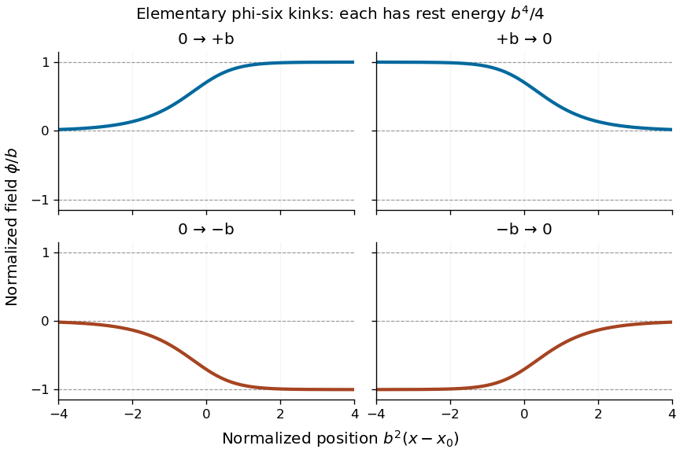

# Paper 51

↑ **Parent:** [Iii](../iii.md)

[https://www.maths.cam.ac.uk/postgrad/part-iii/files/pastpapers/2004/Paper51.pdf](https://www.maths.cam.ac.uk/postgrad/part-iii/files/pastpapers/2004/Paper51.pdf)

**Table of contents**

- [1](#1)
  - [Solution](#1/solution)
- [2](#2)
  - [Solution](#2/solution)
- [3](#3)
  - [Solution](#3/solution)
- [4](#4)
  - [Solution](#4/solution)

## 1

↑ **Parent:** [Paper 51](paper-51.md)

<h3 id="1/solution">Solution</h3>

↑ **Parent:** [1](#1)

The [canonical momentum](../../../classical-mechanics.md#canonical-momentum) is $\pi=\phi_t$, so the [Hamiltonian density](../../../quantum-field-theory.md#hamiltonian-density) and total [energy](../../../classical-mechanics.md#energy) are

$$
\mathcal H=\pi\phi_t-\mathcal L=\frac12\phi_t^2+\frac12\phi_x^2+U(\phi),\qquad
\boxed{E=\int_{\mathbb R}\left(\frac12\phi_t^2+\frac12\phi_x^2+U\right)dx.}
$$

The [Euler-Lagrange field equation](../../../quantum-field-theory.md#euler-lagrange-field-equation) is $\phi_{tt}-\phi_{xx}+U'(\phi)=0$. Multiplication by $\phi_t$ gives the local [conservation of energy](../../../physics.md#conservation-of-energy) identity

$$
\partial_t\mathcal H=\partial_x(\phi_t\phi_x).
$$

Thus $E$ is conserved when the [energy](../../../classical-mechanics.md#energy) flux vanishes at spatial infinity. For finite [energy](../../../classical-mechanics.md#energy) with asymptotically constant fields, the endpoints $\phi_\pm$ must be [scalar-field vacua](../../../quantum-field-theory.md#scalar-field-vacuum), where $U=0$.

Choose an [antiderivative](../../../calculus.md#antiderivative) $G'(\phi)=\sqrt{2U(\phi)}$. For either sign $s=\pm1$, [completing the square](../../../polynomial.md#completing-the-square) gives

$$
E=\frac12\int\phi_t^2dx+\frac12\int(\phi_x-s\sqrt{2U})^2dx+s[G(\phi_+)-G(\phi_-)].
$$

Choosing $s$ to make the boundary term nonnegative proves the [Bogomolny bound](../../../quantum-field-theory.md#bogomolny-bound)

$$
\boxed{E\geq\left|\int_{\phi_-}^{\phi_+}\sqrt{2U(a)}\,da\right|,\qquad
\phi_t=0,\quad\phi_x=s\sqrt{2U(\phi)}\ \text{at saturation}.}
$$

These [Bogomolny equations](../../../quantum-field-theory.md#bogomolny-equations) obtained by [square completion for a one-dimensional kink](../../../quantum-field-theory.md#square-completion-for-a-one-dimensional-kink) describe minima within a fixed endpoint sector when a saturating configuration exists. Differentiating the spatial equation gives $\phi_{xx}=U'(\phi)$ wherever $U>0$, with smooth extension to its limiting [scalar-field vacua](../../../quantum-field-theory.md#scalar-field-vacuum). The absolute minimum across all sectors is a constant zero-potential [scalar-field vacuum](../../../quantum-field-theory.md#scalar-field-vacuum) when one exists; the nontrivial minima are sector-specific [kinks](../../../classical-field-theory-soliton.md#scalar-field-kink).

For $\beta\ne0$, write $b=|\beta|$. The [scalar-field vacua](../../../quantum-field-theory.md#scalar-field-vacuum) are $-b,0,b$. A static finite-energy solution has the first integral

$$
\frac12\phi_x^2-U(\phi)=0,
$$

because differentiating its left side gives $\phi_x(\phi_{xx}-U')=0$, and its value is zero at infinity. In either adjacent interval, $\sqrt{2U}=|\phi|(b^2-\phi^2)$. Set $y=\phi^2/b^2$. The first-order equation becomes $y_x=\eta\,2b^2y(1-y)$, with $\eta=\pm1$, and separation gives $\log[y/(1-y)]=2\eta b^2(x-x_0)$. Hence

$$
\boxed{\phi_{\sigma,\eta}(x)=\frac{\sigma b}{\sqrt{1+e^{-2\eta b^2(x-x_0)}}},\qquad \sigma,\eta\in\{1,-1\}.}
$$

For $\eta=1$ the endpoints are $0\to\sigma b$; for $\eta=-1$ they are $\sigma b\to0$. Thus there are **four oriented static [kink](../../../classical-field-theory-soliton.md#scalar-field-kink) families, up to translation**, namely two increasing [kinks](../../../classical-field-theory-soliton.md#scalar-field-kink) and two decreasing [antikinks](../../../classical-field-theory-soliton.md#antikink). Each has rest [energy](../../../classical-mechanics.md#energy)

$$
\int_0^b a(b^2-a^2)\,da=\frac{b^4}{4}.
$$

A static field joining $-b$ directly to $b$ would have to pass through $\phi=0$ at finite $x$. The first integral then gives $\phi_x=0$, and the [Picard-Lindelöf theorem](../../../differential-equation.md#picard-lindelof-theorem) applied to the smooth second-order equation with those [initial conditions](../../../differential-equation.md#initial-condition) forces $\phi\equiv0$. Therefore there is no such additional [kink](../../../classical-field-theory-soliton.md#scalar-field-kink); this is the [intermediate-vacuum obstruction to a kink](../../../classical-field-theory-soliton.md#intermediate-vacuum-obstruction-to-a-kink). The [Bogomolny classification of a rescaled phi-six kink](../../../classical-field-theory-soliton.md#bogomolny-classification-of-a-rescaled-phi-six-kink) also shows that if $\beta=0$, only the [scalar-field vacuum](../../../quantum-field-theory.md#scalar-field-vacuum) $0$ remains and there is **no nontrivial finite-energy static [kink](../../../classical-field-theory-soliton.md#scalar-field-kink)**. Indeed the first integral gives a monotone field wherever it is nonzero, precluding a return to the same [scalar-field vacuum](../../../quantum-field-theory.md#scalar-field-vacuum).

**[Figure 1](#1/image-four-oriented-elementary-phi-six-kink-profiles-connecting-adjacent-vacua-with-equal-rest-energy). Four oriented elementary phi-six kink profiles connecting adjacent vacua, with equal rest energy**.

A [Lorentz boost](../../../special-relativity.md#lorentz-boost) of the $0\to b$ profile gives a moving solution with arbitrary $|v|<1$:

$$
\boxed{\phi(x,t)=\frac{b}{\sqrt{1+\exp[-2b^2\gamma(x-vt-x_0)]}},\qquad\gamma=(1-v^2)^{-1/2}.}
$$

If $K$ denotes the static profile and $\xi=\gamma(x-vt-x_0)$, then $\phi_{tt}-\phi_{xx}=\gamma^2(v^2-1)K''=-K''$, proving the [Euler-Lagrange field equation](../../../quantum-field-theory.md#euler-lagrange-field-equation) directly. Its [energy](../../../classical-mechanics.md#energy) is $\gamma b^4/4$: since $K'^2=2U(K)$, changing variable to $\xi$ in the [energy](../../../classical-mechanics.md#energy) integral gives the factor $\gamma$. Reversing $\sigma$ or $\eta$ yields the other moving elementary profiles.

## 2

↑ **Parent:** [Paper 51](paper-51.md)

<h3 id="2/solution">Solution</h3>

↑ **Parent:** [2](#2)

Use the [Minkowski metric](../../../special-relativity.md#minkowski-metric) convention $\eta=\operatorname{diag}(1,-1,-1,-1)$. On the [Adjoint representation](../../../lie-algebra.md#adjoint-representation-of-a-lie-algebra), the [adjoint covariant derivative](../../../relativistic-quantum-field.md#adjoint-covariant-derivative) is $D_\mu X=\partial_\mu X+[A_\mu,X]$. Set $a_\mu=\delta A_\mu$ and $\chi=\delta\Phi$. Then

$$
\delta F_{\mu\nu}=D_\mu a_\nu-D_\nu a_\mu,\qquad
\delta(D_\mu\Phi)=D_\mu\chi+[a_\mu,\Phi].
$$

The [trace](../../../linear-algebra.md#matrix-trace) obeys $\operatorname{Tr}(X[Y,Z])=\operatorname{Tr}([Z,X]Y)$, and covariant [integration by parts](../../../calculus.md#integration-by-parts) has the ordinary boundary term because the [trace](../../../linear-algebra.md#matrix-trace) of a [commutator](../../../lie-algebra.md#commutator) is zero. Thus compactly supported variations give

$$
\begin{aligned}
\delta S=\int d^4x\,\operatorname{Tr}\bigl(&F^{\mu\nu}D_\mu a_\nu
-D^\mu\Phi\,D_\mu\chi-D^\mu\Phi[a_\mu,\Phi]+m^2\Phi\chi\bigr)\\
=\int d^4x\,\operatorname{Tr}\bigl(&[-D_\mu F^{\mu\nu}+[D^\nu\Phi,\Phi]]a_\nu
+[D_\mu D^\mu\Phi+m^2\Phi]\chi\bigr).
\end{aligned}
$$

The [trace](../../../linear-algebra.md#matrix-trace) pairing on $\mathfrak{su}(2)$ is nondegenerate, so the [Euler-Lagrange field equations](../../../quantum-field-theory.md#euler-lagrange-field-equation) are

$$
\boxed{D_\mu F^{\mu\nu}=[D^\nu\Phi,\Phi],\qquad D_\mu D^\mu\Phi+m^2\Phi=0.}
$$

In particular the sign of the scalar mass term follows from the plus sign in the supplied [trace](../../../linear-algebra.md#matrix-trace) [Lagrangian density](../../../quantum-field-theory.md#lagrangian-density); it should not be guessed from a different metric convention. This is the [adjoint Yang-Mills-Higgs trace variation](../../../relativistic-quantum-field.md#adjoint-yang-mills-higgs-trace-variation).

For the static [Bogomolny-Prasad-Sommerfield monopole](../../../classical-field-theory-soliton.md#bogomolny-prasad-sommerfield-monopole), take the usual purely magnetic extension $\partial_0A_i=\partial_0\Phi=0$ and [temporal gauge](../../../relativistic-quantum-field.md#temporal-gauge) $A_0=0$. At $m=0$, the equations reduce to

$$
D_jF_{ji}=[\Phi,D_i\Phi],\qquad D_iD_i\Phi=0,
$$

with the $\nu=0$ equation identically zero. We now verify both spatial equations from $B_i=D_i\Phi$ without assuming them. The [gauge-theory Bianchi identity](../../../relativistic-quantum-field.md#gauge-theory-bianchi-identity) gives $D_iB_i=0$, hence immediately $D_iD_i\Phi=0$. Also $F_{ji}=\varepsilon_{jik}B_k$, so

$$
\begin{aligned}
D_jF_{ji}&=\varepsilon_{jik}D_jD_k\Phi
=\frac12\varepsilon_{jik}[D_j,D_k]\Phi\\
&=\frac12\varepsilon_{jik}[F_{jk},\Phi]
=-[B_i,\Phi]=[\Phi,D_i\Phi].
\end{aligned}
$$

Here $\varepsilon_{jik}\varepsilon_{jk\ell}=-2\delta_{i\ell}$. This proves that the [Bogomolny equations](../../../quantum-field-theory.md#bogomolny-equations) imply all static zero-mass [Yang-Mills equations](../../../relativistic-quantum-field.md#yang-mills-equations) and the scalar equation. The specification of $A_0$ matters: the spatial [Bogomolny equations](../../../quantum-field-theory.md#bogomolny-equations) by themselves do not constrain an arbitrary extra electric potential, so the implication is for their standard purely magnetic static extension.

## 3

↑ **Parent:** [Paper 51](paper-51.md)

<h3 id="3/solution">Solution</h3>

↑ **Parent:** [3](#3)

Let $F_+=(F+*F)/2$ and $F_-=(F-*F)/2$, using the oriented [Euclidean metric](../../../differential-geometry.md#euclidean-metric). For a [self-dual two-form](../../../differential-form.md#self-dual-differential-form) $\omega$,

$$
\omega\wedge F=\langle\omega,*F\rangle\,\mathrm{vol}
=\langle\omega,F_+\rangle\,\mathrm{vol}.
$$

Apply this componentwise in the [Lie algebra](../../../lie-algebra.md). Since the three $\omega_i$ span the self-dual subspace, their vanishing wedges force $F_+=0$. Thus **$*F=-F$**. The [gauge-theory Bianchi identity](../../../relativistic-quantum-field.md#gauge-theory-bianchi-identity) is $D_AF=0$, so $D_A*F=-D_AF=0$, the Euclidean [Yang-Mills equations](../../../relativistic-quantum-field.md#yang-mills-equations). This proves the implication locally; finite action would additionally be needed to call the solution an [instanton](../../../quantum-field-theory.md#instanton).

Use the complex orientation for $w=x^1+ix^2$ and $z=x^3+ix^4$. The real and imaginary parts of $dw\wedge dz$, and $i(dw\wedge d\bar w+dz\wedge d\bar z)$, span the [self-dual two-forms](../../../differential-form.md#self-dual-differential-form). Accordingly the three [gauge curvature](../../../relativistic-quantum-field.md#gauge-field-strength) equations are

$$
F_{wz}=0,\qquad F_{\bar w\bar z}=0,\qquad F_{w\bar w}+F_{z\bar z}=0.
$$

For a [spectral parameter](../../../integrable-systems.md#spectral-parameter) $\lambda\in\mathbb{CP}^1$, consider the [Lax pair](../../../integrable-systems.md#lax-pair)

$$
\boxed{(D_w-\lambda D_{\bar z})\Psi=0,\qquad(D_z+\lambda D_{\bar w})\Psi=0.}
$$

Their [commutator](../../../lie-algebra.md#commutator) is

$$
[D_w-\lambda D_{\bar z},D_z+\lambda D_{\bar w}]
=F_{wz}+\lambda(F_{w\bar w}+F_{z\bar z})+\lambda^2F_{\bar w\bar z}.
$$

It vanishes for every $\lambda$ exactly when all three coefficients vanish. The derivative directions $\partial_w-\lambda\partial_{\bar z}$ and $\partial_z+\lambda\partial_{\bar w}$ are mutually orthogonal [null vectors](../../../special-relativity.md#null-vector) for the complexified metric. Flatness on the corresponding two-planes makes the linear parallel-transport equations locally compatible. Conversely compatibility for an invertible fundamental [matrix](../../../vector-space.md#matrix) $\Psi$ forces the [commutator](../../../lie-algebra.md#commutator) to vanish; a single zero solution would not establish it. This is the [Euclidean complex-coordinate anti-self-dual Lax pair](../../../integrable-systems.md#euclidean-complex-coordinate-anti-self-dual-lax-pair).

For an [Abelian](../../../group.md#abelian-group) [U(1) connection](../../../fiber-bundle.md#u-1-connection), all [commutators](../../../lie-algebra.md#commutator) of the connection components vanish, and the [gauge curvature](../../../relativistic-quantum-field.md#gauge-field-strength) equations therefore read

$$
\boxed{\begin{aligned}
\partial_w A_z-\partial_z A_w&=0,\\
\partial_{\bar w}A_{\bar z}-\partial_{\bar z}A_{\bar w}&=0,\\
\partial_zA_{\bar z}-\partial_{\bar z}A_z
+\partial_wA_{\bar w}-\partial_{\bar w}A_w&=0.
\end{aligned}}
$$

Locally the first two equations say that $A^{1,0}$ is $\partial$-closed and $A^{0,1}$ is $\bar\partial$-closed. The [Dolbeault-Poincaré lemma](../../../complex-geometry.md#dolbeault-poincare-lemma), and its [complex conjugate](../../../complex-analysis.md#complex-conjugate), give scalar functions $u,v$ with

$$
A=\partial u+\bar\partial v.
$$

Substituting in the third equation gives

$$
(v-u)_{z\bar z}+(v-u)_{w\bar w}=0.
$$

In a complex [gauge transformation](../../../electromagnetism.md#gauge-transformation), use $g=e^{-u}$ and the derivative-plus-connection convention $A\mapsto A+g^{-1}dg$. Then

$$
\boxed{A'=\bar\partial f,\qquad f=v-u,\qquad f_{z\bar z}+f_{w\bar w}=0.}
$$

This is the scalar [Laplace equation](../../../partial-differential-equation.md#laplace-equation), since for the stated metric $\Delta=2(\partial_z\partial_{\bar z}+\partial_w\partial_{\bar w})$. The complex [gauge transformation](../../../electromagnetism.md#gauge-transformation) need not remain in $U(1)$.

A reduction using only a [unitary](../../../fiber-bundle.md#unitary-connection) [gauge transformation](../../../electromagnetism.md#gauge-transformation) is also available. Since $A$ is [anti-Hermitian](../../../linear-operator-theory.md#skew-hermitian-matrix), $A_{\bar w}=-\overline{A_w}$ and $A_{\bar z}=-\overline{A_z}$, so the potential for the barred components can be chosen as $v=-\bar u$. Write $u=p+iq$ with real $p,q$. Then $A=\partial p-\bar\partial p+i\,dq$, and $g=e^{-iq}$ removes the last term. With $f=-2p$ this gives

$$
\boxed{A'=\frac12(\bar\partial f-\partial f),\qquad f\text{ real},\qquad f_{z\bar z}+f_{w\bar w}=0.}
$$

Its [gauge curvature](../../../relativistic-quantum-field.md#gauge-field-strength) is $\partial\bar\partial f$. Thus the [Abelian anti-self-dual connections from harmonic scalar potentials](../../../fiber-bundle.md#abelian-anti-self-dual-connections-from-harmonic-scalar-potentials) reduction is local and does not require silently enlarging the real gauge group.

## 4

↑ **Parent:** [Paper 51](paper-51.md)

<h3 id="4/solution">Solution</h3>

↑ **Parent:** [4](#4)

Interpret triviality as [holomorphic](../../../complex-analysis.md#complex-differentiability-at-a-point) triviality. Choose a global [holomorphic](../../../complex-analysis.md#complex-differentiability-at-a-point) [bundle frame](../../../fiber-bundle.md#frame-of-a-vector-bundle) $s_1,\ldots,s_k$ for $E$. Let $H_\alpha$ have as its columns the coordinates of these sections in the prescribed local frame over $U_\alpha$, with the convention that a fiber coordinate vector transforms as $s_\beta=F_{\alpha\beta}s_\alpha$. Then

$$
H_\beta=F_{\alpha\beta}H_\alpha,\qquad
\boxed{F_{\alpha\beta}=H_\beta H_\alpha^{-1}.}
$$

Each $H_\alpha$ is [holomorphic](../../../complex-analysis.md#complex-differentiability-at-a-point) and invertible because its columns form a basis in every fiber. This proves the requested [holomorphic splitting of transition functions on a trivial bundle](../../../complex-geometry.md#holomorphic-splitting-of-transition-functions-on-a-trivial-bundle). Smooth or topological triviality alone would not justify [holomorphic](../../../complex-analysis.md#complex-differentiability-at-a-point) splitting.

For the [line bundle](../../../ringed-space.md#line-bundle) on [projective twistor space](../../../general-relativity.md#projective-twistor-space), pull its patching function back to the [twistor line](../../../general-relativity.md#twistor-line) $L_x$ using the incidence convention of this problem, $\omega^A=x^{AA'}\pi_{A'}$, without an extra factor of $i$. Triviality on each line gives nonvanishing linewise [holomorphic](../../../complex-analysis.md#complex-differentiability-at-a-point) functions $H_0,H_1$ with $F_{01}=H_1H_0^{-1}$. The factors can be chosen as [holomorphic](../../../complex-analysis.md#complex-differentiability-at-a-point) functions of $x$ locally: a degree-zero scalar transition function has zero winding on the overlap annulus, hence admits a logarithm there; splitting its positive and negative [Laurent series](../../../analysis.md#laurent-series) parts gives factors whose coefficients are [Cauchy integrals](../../../complex-analysis.md#cauchy-transform) that are [holomorphic](../../../complex-analysis.md#complex-differentiability-at-a-point) functions of $x$. The explicit splitting is worked out below. Their only common linewise ambiguity is multiplication by a nonzero function $g(x)$: the ratio is a global [holomorphic](../../../complex-analysis.md#complex-differentiability-at-a-point) function on the compact [complex projective line](../../../algebraic-topology.md#complex-projective-line), hence constant on that line.

Take $\epsilon_{0'1'}=1$, $\epsilon^{0'1'}=-1$ and raise a [two-component spinor](../../../connection-1-form.md#two-component-spinor) by left multiplication with $\epsilon^{A'B'}$. The derivative along an [alpha-plane](../../../general-relativity.md#alpha-plane) is $\ell_A=\pi^{A'}\partial_{AA'}$. It annihilates the unsplit twistor function, because

$$
\ell_A\omega^B=\delta_A^B\pi^{A'}\pi_{A'}=0,\qquad\ell_A F_{01}=0.
$$

Thus

$$
G_A=H_0^{-1}\ell_AH_0=H_1^{-1}\ell_AH_1
$$

is [holomorphic](../../../complex-analysis.md#complex-differentiability-at-a-point) on the whole line and has projective weight one. A section of $\mathcal O(1)$ is linear in the homogeneous coordinates: in an affine coordinate, [holomorphic](../../../complex-analysis.md#complex-differentiability-at-a-point) regularity at infinity bounds its growth to at most first order, so the [Cauchy integral formula](../../../analysis.md#cauchy-integral-formula) excludes all higher powers. Therefore

$$
G_A=\pi^{A'}A_{AA'}(x).
$$

The inverse splitting functions obey $(\ell_A+G_A)H_\alpha^{-1}=0$. Commuting these two equations proves

$$
\pi^{A'}\pi^{B'}F_{AA'BB'}=0.
$$

The [spinor decomposition of gauge curvature](../../../relativistic-quantum-field.md#spinor-decomposition-of-gauge-curvature) is

$$
F_{AA'BB'}=\epsilon_{AB}\varphi_{A'B'}+\epsilon_{A'B'}\varphi_{AB},
$$

where both $\varphi$ [two-component spinors](../../../connection-1-form.md#two-component-spinor) are symmetric. Vanishing of the contraction for every $\pi$ forces $\varphi_{A'B'}=0$. This is exactly the [anti-self-dual Maxwell equations](../../../electromagnetism.md#anti-self-dual-maxwell-equations). Since the [Abelian](../../../group.md#abelian-group) [gauge curvature](../../../relativistic-quantum-field.md#gauge-field-strength) is $dA$, it is closed; its duality condition also makes it co-closed, giving the source-free [Maxwell equations](../../../electromagnetism.md#maxwell-equations). Changing both splitting factors by $g(x)$ changes $A$ by $d\log g$, the expected [Abelian](../../../group.md#abelian-group) [gauge transformation](../../../electromagnetism.md#gauge-transformation). This derives the rank-one [Penrose-Ward correspondence](../../../general-relativity.md#penrose-ward-correspondence) in the needed local form.

For the exponential patching function, choose a representative $f$ of the [Čech cohomology](../../../ringed-space.md#cech-cohomology) class, of homogeneous degree zero. On the overlap of the two line patches write $f_x(\zeta)=f(x\pi,\pi)=\sum_{n\in\mathbb Z}f_n(x)\zeta^n$. To compute the [gauge potential](../../../relativistic-quantum-field.md#gauge-field) explicitly, use a constant [two-component spinor](../../../connection-1-form.md#two-component-spinor) basis in which $\iota_{A'}=(1,0)$ and the finite patch $\pi_{0'}=\zeta,\pi_{1'}=1$. Then $\pi^{0'}=-1$, $\pi^{1'}=\zeta$ and

$$
\iota_{C'}\pi^{C'}=-1,\qquad \pi_{D'}d\pi^{D'}=d\zeta,\qquad
\omega^B=x^{B0'}\zeta+x^{B1'}.
$$

For a positively oriented contour in the overlap annulus, split its [Laurent series](../../../analysis.md#laurent-series) as

$$
h_0=-\sum_{n\ge0}f_n\zeta^n,\qquad
h_1=\sum_{n<0}f_n\zeta^n,\qquad f_x=h_1-h_0.
$$

The first is [holomorphic](../../../complex-analysis.md#complex-differentiability-at-a-point) inside the contour, the second outside including infinity; $H_\alpha=e^{h_\alpha}$ split $e^f$. Since $(-\partial_{B0'}+\zeta\partial_{B1'})f_x=0$, coefficient comparison gives $\partial_{B0'}f_n=\partial_{B1'}f_{n-1}$. Applying that operator separately to $h_0,h_1$ cancels all nonconstant terms and leaves

$$
G_B=\partial_{B1'}f_{-1}.
$$

Thus $-A_{B0'}+\zeta A_{B1'}=G_B$ yields $A_{B1'}=0$ and $A_{B0'}=-\partial_{B1'}f_{-1}$. Moreover

$$
f_{-1}=\frac1{2\pi i}\oint_\Gamma f_x\,d\zeta,\qquad
\partial_{B1'}f_x=f_{,B}:=\frac{\partial f}{\partial\omega^B}.
$$

Substitution gives $A_{B0'}=-(2\pi i)^{-1}\oint f_{,B}\,d\zeta$, which in homogeneous form is precisely

$$
\boxed{A_{BB'}=\frac1{2\pi i}\oint_\Gamma
\frac{\iota_{B'}}{\iota_{C'}\pi^{C'}}\,f_{,B}(x\pi,\pi)\,\pi_{D'}d\pi^{D'}.}
$$

This is the [Abelian Ward splitting by Laurent series](../../../general-relativity.md#abelian-ward-splitting-by-laurent-series). The factors have weights $-1,-1,2$, respectively, so the integrand is invariant under a change of homogeneous representative. The contour avoids $\iota_{C'}\pi^{C'}=0$; the basis chosen above places that point at infinity. One can keep the contour fixed for $x$ in a sufficiently small domain, allowing differentiation under the integral.

Finally differentiate the [contour potential for an anti-self-dual Maxwell field](../../../general-relativity.md#contour-potential-for-an-anti-self-dual-maxwell-field). By the [twistor incidence relation](../../../general-relativity.md#twistor-incidence-relation), $\partial_{AA'} f_{,B}=\pi_{A'}f_{,AB}$. Consequently

$$
\begin{aligned}
F_{AA'BB'}&=\frac1{2\pi i}\oint_\Gamma
\frac{\pi_{A'}\iota_{B'}-\pi_{B'}\iota_{A'}}{\iota_{C'}\pi^{C'}}\,
 f_{,AB}\,\pi_{D'}d\pi^{D'}\\
&=\epsilon_{A'B'}\,\frac1{2\pi i}\oint_\Gamma f_{,AB}\,\pi_{D'}d\pi^{D'}.
\end{aligned}
$$

The second equality uses the elementary two-spinor identity $\pi_{A'}\iota_{B'}-\pi_{B'}\iota_{A'}=\epsilon_{A'B'}(\iota_{C'}\pi^{C'})$ in the declared convention. The remaining [two-component spinor](../../../connection-1-form.md#two-component-spinor) is symmetric in $A,B$, and no primed symmetric [gauge curvature](../../../relativistic-quantum-field.md#gauge-field-strength) part survives. This directly verifies **$dA$ is anti-self-dual**. In complexified Lorentzian signature duality has [Hodge star](../../../differential-form.md#hodge-star-operator) [eigenvalues](../../../linear-operator-theory.md#eigenvalue) $\pm i$; here the vanishing primed [two-component spinor](../../../connection-1-form.md#two-component-spinor) fixes the stated ASD convention rather than incorrectly imposing the Euclidean equation $*F=-F$ on that signature.

## ↑ Ancestors (8)

1. [Iii](../iii.md)
2. [2004](../../2004.md)
3. [Past exam of the mathematics course of the University of Cambridge](../../../past-exam-of-the-mathematics-course-of-the-university-of-cambridge.md)
4. [Mathematics course of the University of Cambridge](../../../university-of-cambridge.md#mathematics-course-of-the-university-of-cambridge)
5. [Course of the University of Cambridge](../../../university-of-cambridge.md#course-of-the-university-of-cambridge)
6. [University of Cambridge](../../../university-of-cambridge.md)
7. [List of universities](../../../README.md#list-of-universities)
8. [Codex Wiki](../../../README.md)
